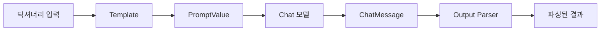

# Chapter 3: Model I/O & LCEL 완벽 가이드

## 목차
1. [LLM과 Chat 모델 기초](#llm과-chat-모델-기초)
2. [메시지 예측과 타입 시스템](#메시지-예측과-타입-시스템)
3. [프롬프트 템플릿 마스터하기](#프롬프트-템플릿-마스터하기)
4. [Output Parser와 LCEL 소개](#output-parser와-lcel-소개)
5. [체인 연결하기](#체인-연결하기)
6. [스트리밍과 콜백](#스트리밍과-콜백)
7. [실습 코드 예제](#실습-코드-예제)
8. [핵심 포인트 정리](#핵심-포인트-정리)

## LLM과 Chat 모델 기초

### 기본 사용법

**가장 간단한 LangChain 사용법**부터 시작합니다.

```python
from langchain.chat_models import ChatOpenAI

# Chat 모델 초기화
chat = ChatOpenAI()

# 가장 간단한 예측
response = chat.predict("How many planets are there?")
print(response)
# 출력: "There are eight planets in our solar system: Mercury, Venus, Earth, Mars, Jupiter, Saturn, Uranus, and Neptune."
```

### Temperature 설정

```python
# 더 일관된 응답을 위한 낮은 temperature 설정
chat = ChatOpenAI(temperature=0.1)

response = chat.predict("How many planets are there?")
```

**Temperature 이해**:
- `0.0`: 매우 결정적, 항상 같은 답변
- `1.0`: 매우 창의적, 다양한 답변
- `0.1`: 일관성과 창의성의 균형점

## 메시지 예측과 타입 시스템

### LangChain 메시지 타입

LangChain은 **3가지 핵심 메시지 타입**을 제공합니다:

```python
from langchain.schema import HumanMessage, AIMessage, SystemMessage

messages = [
    SystemMessage(content="You are a geography expert. And you only reply in {language}."),
    AIMessage(content="Ciao, mi chiamo {name}!"),
    HumanMessage(content="What is the distance between {country_a} and {country_b}. Also, what is your name?")
]

# 메시지 리스트로 예측
response = chat.predict_messages(messages)
print(response)
```

### 메시지 타입의 역할

1. **SystemMessage**: AI의 역할과 행동 지침 설정
2. **HumanMessage**: 사용자의 입력
3. **AIMessage**: AI의 이전 응답 (대화 컨텍스트)

### predict() vs predict_messages()

| 메서드 | 입력 타입 | 사용 사례 |
|--------|-----------|-----------|
| `predict()` | 문자열 | 간단한 일회성 질문 |
| `predict_messages()` | 메시지 리스트 | 복잡한 대화, 시스템 지침 포함 |

## 프롬프트 템플릿 마스터하기

### 기본 프롬프트 템플릿

**왜 프롬프트 템플릿을 사용하는가?**
- 변수 검증 (필수 변수 누락 시 에러)
- 재사용성 (동일한 패턴 반복 사용)
- 유지보수성 (중앙화된 프롬프트 관리)

```python
from langchain.prompts import PromptTemplate

# 기본 프롬프트 템플릿
template = PromptTemplate.from_template(
    "What is the distance between {country_a} and {country_b}"
)

# 템플릿 포맷팅
prompt = template.format(country_a="Mexico", country_b="Thailand")
print(prompt)
# 출력: "What is the distance between Mexico and Thailand"

# LLM에 전달
response = chat.predict(prompt)
```

### Chat 프롬프트 템플릿

**Chat 모델용 고급 템플릿**으로 시스템 메시지와 대화 흐름을 쉽게 관리할 수 있습니다.

```python
from langchain.prompts import ChatPromptTemplate

template = ChatPromptTemplate.from_messages([
    ("system", "You are a geography expert. And you only reply in {language}."),
    ("ai", "Ciao, mi chiamo {name}!"),
    ("human", "What is the distance between {country_a} and {country_b}. Also, what is your name?")
])

# 메시지 포맷팅
messages = template.format_messages(
    language="Korean",
    name="Socrates", 
    country_a="Mexico",
    country_b="Thailand"
)

# Chat 모델에 전달
response = chat.predict_messages(messages)
print(response.content)
# 출력: "안녕하세요! 멕시코와 태국 사이의 거리는 대략 16,000km입니다. 제 이름은 지리 전문가입니다."
```

### 템플릿의 장점

1. **변수 검증**: 필수 변수 누락 시 즉시 에러 발생
2. **타입 안정성**: 올바른 메시지 타입 자동 생성
3. **재사용성**: 동일한 패턴을 다른 입력으로 반복 사용
4. **가독성**: 프롬프트 구조가 명확히 보임

## Output Parser와 LCEL 소개

### Output Parser의 필요성

**LLM의 출력은 항상 텍스트**입니다. 하지만 실제 애플리케이션에서는 구조화된 데이터가 필요합니다.

```python
# LLM 출력: "pikachu, charmander, bulbasaur, squirtle, jigglypuff"
# 원하는 형태: ["pikachu", "charmander", "bulbasaur", "squirtle", "jigglypuff"]
```

### 커스텀 Output Parser 구현

```python
from langchain.schema import BaseOutputParser

class CommaOutputParser(BaseOutputParser):
    def parse(self, text):
        # 공백 제거 후 쉼표로 분할
        items = text.strip().split(",")
        # 각 항목의 앞뒤 공백 제거
        return list(map(str.strip, items))

# 파서 테스트
parser = CommaOutputParser()
result = parser.parse("hello, how are you, today")
print(result)  
# 출력: ["hello", "how are you", "today"]
```

### LCEL (LangChain Expression Language)

**LCEL의 혁명적 기능**: 파이프 연산자(`|`)로 체인을 간단하게 구성할 수 있습니다.

#### 전통적인 방법 (LCEL 이전)

```python
# 긴 코드, 수동 처리
template = ChatPromptTemplate.from_messages([
    ("system", "You are a list generating machine. Everything you are asked will be answered with a comma separated list of max {max_items} in lowercase. Do NOT reply with anything else."),
    ("human", "{question}")
])

# 1단계: 프롬프트 포맷팅
messages = template.format_messages(max_items=10, question="What are the colors?")

# 2단계: LLM 호출  
result = chat.predict_messages(messages)

# 3단계: 파싱
parser = CommaOutputParser()
final_result = parser.parse(result.content)
```

#### LCEL 방법 (혁명적!)

```python
# 간단하고 우아한 체인
chain = template | chat | CommaOutputParser()

# 한 줄로 실행
result = chain.invoke({"max_items": 5, "question": "What are the pokemons?"})
print(result)
# 출력: ["pikachu", "charmander", "bulbasaur", "squirtle", "jigglypuff"]
```

### LCEL의 마법

**파이프 연산자(`|`)의 동작 원리**:

1. `template`: 딕셔너리 입력 → PromptValue 출력
2. `chat`: PromptValue 입력 → ChatMessage 출력  
3. `CommaOutputParser`: ChatMessage 입력 → 리스트 출력



### LCEL 구성 요소 호환성

| 구성 요소 | 입력 타입 | 출력 타입 |
|-----------|----------|----------|
| **Prompt** | Dict | PromptValue |
| **Chat Model** | String, List[Message], PromptValue | ChatMessage |
| **Output Parser** | String, ChatMessage | Parsed Output |

## 체인 연결하기

### 복합 체인의 필요성

**실제 애플리케이션**에서는 여러 단계의 처리가 필요합니다:
1. 첫 번째 LLM: 레시피 생성
2. 두 번째 LLM: 베지테리안 버전으로 변환

### 체인 연결 구현

```python
from langchain.callbacks import StreamingStdOutCallbackHandler

# 스트리밍 활성화
chat = ChatOpenAI(
    temperature=0.1,
    streaming=True,
    callbacks=[StreamingStdOutCallbackHandler()]
)

# 1단계: 셰프 체인
chef_prompt = ChatPromptTemplate.from_messages([
    ("system", "You are a world-class international chef. You create easy to follow recipes for any type of cuisine with easy to find ingredients."),
    ("human", "I want to cook {cuisine} food.")
])

chef_chain = chef_prompt | chat
```

```python  
# 2단계: 베지테리안 셰프 체인
veg_chef_prompt = ChatPromptTemplate.from_messages([
    ("system", "You are a vegetarian chef specialized on making traditional recipes vegetarian. You find alternative ingredients and explain their preparation. You don't radically modify the recipe. If there is no alternative for a food just say you don't know how to replace it."),
    ("human", "{recipe}")
])

veg_chain = veg_chef_prompt | chat
```

### RunnableMap을 이용한 체인 연결

**핵심 개념**: 첫 번째 체인의 출력을 두 번째 체인의 입력으로 연결

```python
# 최종 체인: 셰프 체인의 결과를 베지테리안 체인의 recipe 입력으로 매핑
final_chain = {"recipe": chef_chain} | veg_chain

# 실행
result = final_chain.invoke({"cuisine": "indian"})
```

### 체인 연결 동작 원리

1. `{"cuisine": "indian"}` → `chef_chain` 입력
2. `chef_chain` 실행 → 인도 요리 레시피 출력
3. 레시피를 `"recipe"` 키로 매핑
4. `{"recipe": "인도 요리 레시피..."}` → `veg_chain` 입력  
5. `veg_chain` 실행 → 베지테리안 버전 레시피 출력

**중요**: 변수명이 템플릿의 플레이스홀더와 정확히 일치해야 합니다!

## 스트리밍과 콜백

### 스트리밍의 이점

**기본 동작**: LLM 응답을 완전히 생성한 후 반환
**스트리밍**: 토큰이 생성되는 즉시 실시간으로 반환

```python
# 스트리밍 활성화
chat = ChatOpenAI(
    temperature=0.1,
    streaming=True,  # 핵심 설정
    callbacks=[StreamingStdOutCallbackHandler()]
)
```

### 콜백의 역할

**콜백**은 LLM 처리 과정의 다양한 이벤트에 반응할 수 있게 해줍니다:

- `on_llm_start`: LLM 처리 시작 시
- `on_llm_end`: LLM 처리 완료 시  
- `on_llm_new_token`: 새 토큰 생성 시
- `on_llm_error`: 오류 발생 시

### StreamingStdOutCallbackHandler

**기본 제공 콜백**으로 콘솔에 실시간으로 출력을 표시합니다.

```python
from langchain.callbacks import StreamingStdOutCallbackHandler

# 콜백과 함께 체인 실행
final_chain.invoke({"cuisine": "indian"})
# 콘솔에 실시간으로 응답이 표시됨
```

## 실습 코드 예제

### 완전한 예제: 다국어 지리 전문가

```python
from langchain.chat_models import ChatOpenAI
from langchain.prompts import ChatPromptTemplate
from langchain.schema import BaseOutputParser
from langchain.callbacks import StreamingStdOutCallbackHandler

# 1. Chat 모델 설정 (스트리밍 포함)
chat = ChatOpenAI(
    temperature=0.1,
    streaming=True,
    callbacks=[StreamingStdOutCallbackHandler()]
)

# 2. 커스텀 Output Parser
class ListOutputParser(BaseOutputParser):
    def parse(self, text):
        # 줄바꿈으로 분할하여 리스트 생성
        items = text.strip().split('\n')
        # 번호나 불릿 포인트 제거
        cleaned_items = []
        for item in items:
            # "1. ", "- ", "• " 등의 접두사 제거
            cleaned = item.strip()
            for prefix in ['1. ', '2. ', '3. ', '4. ', '5. ', '- ', '• ', '* ']:
                if cleaned.startswith(prefix):
                    cleaned = cleaned[len(prefix):].strip()
                    break
            if cleaned:
                cleaned_items.append(cleaned)
        return cleaned_items

# 3. 프롬프트 템플릿
geography_template = ChatPromptTemplate.from_messages([
    ("system", """You are a world-class geography expert who speaks multiple languages.
    You provide accurate geographical information and respond in the requested language.
    When asked for lists, provide them in a clean numbered format."""),
    ("human", "Please provide {count} {category} in {language}. Answer in {language}.")
])

# 4. 체인 구성
geography_chain = geography_template | chat | ListOutputParser()

# 5. 다양한 테스트
test_cases = [
    {"count": 5, "category": "European capitals", "language": "English"},
    {"count": 3, "category": "Asian rivers", "language": "Korean"},
    {"count": 4, "category": "African countries", "language": "Spanish"}
]

for test_case in test_cases:
    print(f"\n{'='*50}")
    print(f"테스트: {test_case}")
    print('='*50)
    
    result = geography_chain.invoke(test_case)
    print(f"결과: {result}")
```

### 고급 예제: 단계별 요리 가이드

```python
# 단계별 요리 체인 시스템
class RecipeStep:
    def __init__(self, step_number, description, time_estimate):
        self.step_number = step_number
        self.description = description
        self.time_estimate = time_estimate
    
    def __str__(self):
        return f"Step {self.step_number}: {self.description} (약 {self.time_estimate}분)"

class RecipeOutputParser(BaseOutputParser):
    def parse(self, text):
        # 레시피를 단계별로 분석
        steps = []
        lines = text.strip().split('\n')
        
        current_step = 1
        for line in lines:
            line = line.strip()
            if line and any(keyword in line.lower() for keyword in ['step', '단계', 'first', 'then', 'next', 'finally']):
                # 시간 추정 (간단한 휴리스틱)
                time_estimate = 5  # 기본 5분
                if any(word in line.lower() for word in ['boil', 'cook', 'bake', '끓이', '조리']):
                    time_estimate = 15
                elif any(word in line.lower() for word in ['prep', 'chop', '준비', '자르']):
                    time_estimate = 10
                
                steps.append(RecipeStep(current_step, line, time_estimate))
                current_step += 1
        
        return steps

# 레시피 생성 체인
recipe_template = ChatPromptTemplate.from_messages([
    ("system", """You are a professional chef instructor. 
    Create detailed, step-by-step cooking instructions that are easy to follow.
    Start each step with clear action words and include timing when relevant."""),
    ("human", "Create a detailed recipe for {dish} that serves {servings} people.")
])

# 영양 분석 체인  
nutrition_template = ChatPromptTemplate.from_messages([
    ("system", """You are a nutritionist. Analyze the given recipe and provide:
    1. Estimated calories per serving
    2. Main nutritional benefits
    3. Dietary considerations (vegetarian, vegan, gluten-free, etc.)
    4. Healthiness rating (1-10)"""),
    ("human", "Analyze this recipe: {recipe}")
])

# 체인 구성
recipe_chain = recipe_template | chat | RecipeOutputParser()
nutrition_chain = nutrition_template | chat

# 최종 요리 가이드 체인
cooking_guide_chain = {
    "recipe_steps": recipe_chain,
    "dish": lambda x: x["dish"],  # 원본 dish 이름 전달
    "servings": lambda x: x["servings"]
} | RunnableLambda(
    lambda inputs: {
        "recipe": f"Recipe for {inputs['dish']} (serves {inputs['servings']}): " + 
                 "\n".join(str(step) for step in inputs["recipe_steps"])
    }
) | nutrition_chain

# 실행 예제
result = cooking_guide_chain.invoke({
    "dish": "Korean Bibimbap",
    "servings": 4
})
```

## 핵심 포인트 정리

### LCEL의 혁명적 특징

1. **간결성**: 복잡한 체인을 한 줄로 표현
2. **가독성**: 파이프 연산자로 데이터 흐름이 명확
3. **타입 안전성**: 각 구성 요소 간 타입 호환성 자동 검증
4. **재사용성**: 체인을 구성 요소로 다른 체인에서 재사용

### 체인 설계 원칙

1. **단일 책임**: 각 체인은 하나의 명확한 목적
2. **명확한 인터페이스**: 입력/출력 타입 명시
3. **에러 처리**: 각 단계에서 실패 가능성 고려
4. **테스트 가능성**: 각 구성 요소를 독립적으로 테스트

### 성능 최적화 팁

1. **스트리밍 활용**: 사용자 경험 향상을 위한 실시간 피드백
2. **Temperature 조정**: 일관성 vs 창의성 균형
3. **프롬프트 최적화**: 명확하고 구체적인 지시사항
4. **콜백 활용**: 디버깅과 모니터링을 위한 이벤트 추적

### 실무 적용 가이드

1. **프로토타이핑**: 간단한 체인부터 시작
2. **점진적 복잡성**: 단계별로 기능 추가
3. **문서화**: 각 체인의 목적과 사용법 기록
4. **모니터링**: 성능과 품질 지표 추적

### LangChain vs OpenAI API 직접 사용

| 비교 항목 | LangChain | OpenAI API 직접 |
|-----------|-----------|-----------------|
| **코드 복잡성** | 간단 (LCEL) | 복잡 (수동 처리) |
| **재사용성** | 높음 (체인 조합) | 낮음 (반복 코드) |
| **확장성** | 우수 (다양한 모델) | 제한적 (OpenAI만) |
| **디버깅** | 구조화된 추적 | 수동 로깅 |
| **학습 곡선** | 중간 | 낮음 |

### 다음 단계 학습 방향

1. **Few-Shot Learning**: 예제 기반 프롬프트 개선
2. **Memory 시스템**: 대화 컨텍스트 유지
3. **RAG (Retrieval)**: 외부 지식 통합
4. **Agents**: 자율적 도구 선택 시스템
5. **Production 배포**: 실제 서비스 환경 구성

LangChain의 **LCEL**은 정말 혁명적입니다. 마법같이 보이지만 실제로는 **명확한 타입 시스템과 파이프라인 패턴**을 기반으로 동작합니다. 이 기초를 탄탄히 하면 더 복잡한 AI 애플리케이션도 쉽게 구축할 수 있습니다!

이것으로 Chapter 3: Model I/O & LCEL 완벽 가이드를 마칩니다. 다음 장에서는 Few-Shot Prompt Engineering에 대해 학습하겠습니다.