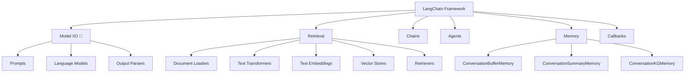

# 📖 Section 4.0: Model I/O 모듈 소개

## 🎯 학습 목표
- ✅ LangChain 모듈 구조 전체 이해
- ✅ Model I/O 모듈의 역할과 구성 요소 파악
- ✅ 학습 로드맵과 우선순위 이해
- ✅ 다음 단계 학습 계획 수립

## 🧠 핵심 개념

### LangChain 모듈 구조 전체
LangChain은 6개의 주요 모듈로 구성되어 있습니다:



## 📋 주요 모듈 레퍼런스

### 1. Model I/O (현재 학습 중)
```python
# Input: 프롬프트 템플릿
from langchain.prompts import PromptTemplate, ChatPromptTemplate

# Model: 언어 모델
from langchain.chat_models import ChatOpenAI
from langchain.llms import OpenAI

# Output: 출력 파서
from langchain.schema import BaseOutputParser
```

**📌 구성 요소**:
- `Prompts`: 입력 템플릿 관리 (PromptTemplate, FewShotPromptTemplate)
- `Language Models`: AI 모델 인터페이스 (ChatOpenAI, GPT-4)
- `Output Parsers`: 출력 변환 (커스텀 파서, JSON 파서)

### 2. Retrieval (Document GPT에서 학습)
```python
# 외부 데이터 작업을 위한 모듈
from langchain.document_loaders import TextLoader
from langchain.text_splitter import RecursiveCharacterTextSplitter
from langchain.embeddings import OpenAIEmbeddings
from langchain.vectorstores import Chroma
```

### 3. Chains (이미 학습 완료)
```python
# LCEL로 체인 구성
chain = prompt_template | chat_model | output_parser
```

### 4. Agents (고급 주제 - 마지막에 학습)
```python
# AI가 도구를 자율적으로 선택하여 작업 수행
from langchain.agents import initialize_agent
```

### 5. Memory (다음 학습 주제)
```python
# 대화 기억 기능
from langchain.memory import ConversationBufferMemory
```

### 6. Callbacks (중간 과정 모니터링)
```python
# LLM 동작 과정 추적
from langchain.callbacks import StreamingStdOutCallbackHandler
```

## 🔧 학습 우선순위와 로드맵

### Phase 1: 기초 모듈 (현재 단계)
1. **Model I/O** ✅ (현재 학습 중)
   - Prompts: 다양한 프롬프트 템플릿
   - Language Models: OpenAI 모델 사용법
   - Output Parsers: 응답 변환 기법

2. **Memory** (다음 단계)
   - 대화 기억 기능
   - 다양한 메모리 타입

### Phase 2: 실전 구현
3. **Retrieval** (Document GPT 프로젝트)
   - 외부 데이터 처리
   - 벡터 저장소 활용

4. **Streamlit** 
   - 웹 UI 구현
   - 사용자 인터랙션

### Phase 3: 고급 기능
5. **Agents** (최종 단계)
   - 자율적 AI 에이전트
   - 도구 사용법

## 💻 실전 예제

### 현재까지 학습한 내용 종합
```python
from langchain.chat_models import ChatOpenAI
from langchain.prompts import ChatPromptTemplate
from langchain.schema import BaseOutputParser

# 📌 언어 모델 초기화
chat = ChatOpenAI(temperature=0.1)  # 📌 용도: AI 모델, 타입: ChatOpenAI

# 📌 프롬프트 템플릿
template = ChatPromptTemplate.from_messages([  # 📌 용도: 메시지 템플릿 생성
    ("system", "You are a helpful assistant"),  # 📌 시스템 역할 정의
    ("human", "{question}")  # 📌 사용자 입력 변수
])

# 📌 출력 파서 (예시)
class ListOutputParser(BaseOutputParser):
    def parse(self, text):  # 📌 기능: 텍스트를 리스트로 변환
        """
        📋 기능: 쉼표로 구분된 텍스트를 파이썬 리스트로 변환
        📥 입력: 문자열 (예: "apple, banana, orange")
        📤 출력: 리스트 (예: ["apple", "banana", "orange"])
        💡 사용 시나리오: LLM 응답을 구조화된 데이터로 변환할 때
        """
        return [item.strip() for item in text.split(",")]

# 📌 LCEL로 체인 구성
chain = template | chat | ListOutputParser()  # 📌 파이프라인 구성

# 📌 실행
result = chain.invoke({"question": "List 3 programming languages"})
# 예상 결과: ["Python", "JavaScript", "Java"]
```

## 🧪 실습 과제

### 🔨 기본 과제
1. 각 모듈의 역할을 자신의 말로 설명해보기
2. Model I/O의 3가지 구성 요소 예제 작성
3. 학습 로드맵에 따라 개인 학습 계획 수립

### 🚀 심화 과제
4. 현재까지 학습한 내용으로 간단한 챗봇 프로토타입 만들기
5. 다른 모듈들의 공식 문서 미리 살펴보기

## ⚠️ 주의사항

### 학습 순서 중요성
- **순차 학습 필요**: 각 모듈은 이전 모듈의 지식을 기반으로 함
- **실습 중심**: 개념만 이해하지 말고 반드시 코드로 실습
- **점진적 복잡도**: 간단한 예제부터 복잡한 프로젝트로 진행

### 실무 관점
- **비용 고려**: API 호출 비용을 항상 염두에 두기
- **성능 최적화**: 캐싱, 프롬프트 최적화 등 고려
- **확장성**: 실제 서비스에 적용 가능한 구조로 설계

## 🔗 관련 자료
- **다음 학습**: [4.1 FewShotPromptTemplate](./4.1_FewShotPromptTemplate.md)
- **병행 학습**: [3.3 Output Parser와 LCEL](../Chapter_3_LCEL/3.3_OutputParser_LCEL.md)
- **공식 문서**: [LangChain Modules](https://python.langchain.com/docs/modules/)
- **API 레퍼런스**: [Templates API](../API_Reference/Templates_API.md)

---

💡 **핵심 정리**: Model I/O는 LangChain의 핵심 모듈로, 입력(Prompts) → 처리(Language Models) → 출력(Output Parsers)의 완전한 파이프라인을 제공합니다. 이 모듈을 완전히 이해하면 LangChain의 다른 모든 기능을 효과적으로 활용할 수 있습니다.