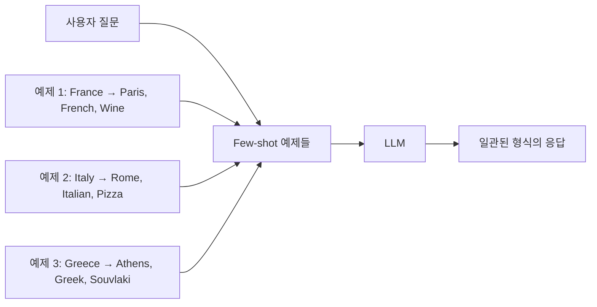

# 📖 Section 4.1: FewShotPromptTemplate

## 🎯 학습 목표
- ✅ Few-shot learning의 개념과 중요성 이해
- ✅ FewShotPromptTemplate 클래스 완전 활용
- ✅ 예제 기반 프롬프트 엔지니어링 마스터
- ✅ 동적 예제 선택 기초 이해

## 🧠 핵심 개념

### Few-shot Learning이란?
**Few-shot learning**은 AI 모델에게 소수의 예제를 제공하여 원하는 형식이나 스타일로 응답하도록 유도하는 기법입니다.



### 왜 Few-shot Learning인가?
```python
# ❌ 명시적 지시 (효과 제한적)
"답변을 다음 형식으로 작성하세요: Capital:, Language:, Food:, Currency:"

# ✅ 예제 제공 (매우 효과적)
examples = [
    {"country": "France", "answer": "Capital: Paris\nLanguage: French\nFood: Wine and Cheese\nCurrency: Euro"},
    {"country": "Italy", "answer": "Capital: Rome\nLanguage: Italian\nFood: Pizza and Pasta\nCurrency: Euro"}
]
```

## 📋 주요 클래스/함수 레퍼런스

### FewShotPromptTemplate
```python
from langchain.prompts.few_shot import FewShotPromptTemplate
from langchain.prompts import PromptTemplate

class FewShotPromptTemplate:
    def __init__(
        self,
        examples: List[Dict[str, str]],           # 필수: 예제 리스트
        example_prompt: PromptTemplate,           # 필수: 예제 포맷터
        suffix: str,                             # 필수: 사용자 입력 템플릿
        input_variables: List[str],              # 필수: 입력 변수 명
        prefix: str = "",                        # 선택: 예제 앞 텍스트
        example_separator: str = "\n\n",         # 선택: 예제 구분자
        template_format: str = "f-string"        # 선택: 템플릿 형식
    ):
        """
        Few-shot 학습을 위한 프롬프트 템플릿
        
        Args:
            examples: 학습용 예제 딕셔너리 리스트
            example_prompt: 각 예제를 포맷팅할 템플릿
            suffix: 실제 사용자 질문 템플릿
            input_variables: 템플릿에서 사용할 변수명 리스트
        """
```

**📌 매개변수 상세**:
- `examples` (required): 예제 데이터, 각 예제는 딕셔너리 형태
- `example_prompt` (required): PromptTemplate 객체, 예제 포맷팅 담당
- `suffix` (required): 사용자 실제 질문 부분, 변수 포함 가능
- `input_variables` (required): 유효성 검증을 위한 변수명 리스트

**📌 주요 메서드**:
- `format(**kwargs)`: 프롬프트 생성 및 포맷팅
- `format_prompt(**kwargs)`: PromptValue 객체 반환
- `save(file_path)`: 템플릿을 파일로 저장

## 🔧 동작 과정 상세

### Step-by-Step 프로세스
```python
# Step 1: 의존성 임포트
from langchain.chat_models import ChatOpenAI
from langchain.prompts.few_shot import FewShotPromptTemplate
from langchain.prompts import PromptTemplate
from langchain.callbacks import StreamingStdOutCallbackHandler

# Step 2: 모델 초기화
chat = ChatOpenAI(  # 📌 용도: ChatGPT 모델 인터페이스, 타입: ChatOpenAI
    temperature=0.1,  # 📌 용도: 응답 일관성 제어, 타입: float, 범위: 0.0-2.0
    streaming=True,   # 📌 용도: 실시간 응답 스트리밍, 타입: bool
    callbacks=[StreamingStdOutCallbackHandler()]  # 📌 용도: 콘솔 출력 콜백
)

# Step 3: 예제 데이터 준비
examples = [  # 📌 용도: Few-shot 학습 예제, 타입: List[Dict[str, str]]
    {
        "question": "What do you know about France?",  # 📌 키: 질문 템플릿 변수와 일치
        "answer": """
        Here is what I know:
        Capital: Paris
        Language: French
        Food: Wine and Cheese
        Currency: Euro
        """  # 📌 키: 원하는 응답 형식 정의
    },
    {
        "question": "What do you know about Italy?",
        "answer": """
        I know this:
        Capital: Rome
        Language: Italian
        Food: Pizza and Pasta
        Currency: Euro
        """
    },
    {
        "question": "What do you know about Greece?",
        "answer": """
        I know this:
        Capital: Athens
        Language: Greek
        Food: Souvlaki and Feta Cheese
        Currency: Euro
        """
    }
]

# Step 4: 예제 포맷터 생성
example_prompt = PromptTemplate.from_template("Human: {question}\nAI:{answer}")
# 📌 기능: 개별 예제를 Human/AI 대화 형식으로 변환
# 📥 입력: question, answer 키를 가진 딕셔너리
# 📤 출력: "Human: 질문\nAI: 답변" 형식의 문자열

# Step 5: Few-shot 프롬프트 생성
prompt = FewShotPromptTemplate(
    example_prompt=example_prompt,                    # 📌 예제 포맷터
    examples=examples,                               # 📌 예제 데이터 리스트
    suffix="Human: What do you know about {country}?",  # 📌 사용자 입력 템플릿
    input_variables=["country"]                      # 📌 변수 검증용
)

# Step 6: 체인 구성 및 실행
chain = prompt | chat  # 📌 LCEL 파이프라인 구성
result = chain.invoke({"country": "Korea"})  # 📌 실행 및 결과 반환
```

## 💻 실전 예제

### 완전한 구현 예제
```python
from langchain.chat_models import ChatOpenAI
from langchain.prompts.few_shot import FewShotPromptTemplate
from langchain.prompts import PromptTemplate

# 🎯 실습 목표: 국가 정보를 일관된 형식으로 응답받는 AI 만들기

# 1. 모델 설정
chat = ChatOpenAI(temperature=0.1)

# 2. 예제 데이터 - 일관된 형식으로 구성
examples = [
    {
        "question": "What do you know about France?",
        "answer": """
        Here is what I know:
        Capital: Paris
        Language: French
        Food: Wine and Cheese
        Currency: Euro
        """
    },
    {
        "question": "What do you know about Italy?", 
        "answer": """
        I know this:
        Capital: Rome
        Language: Italian
        Food: Pizza and Pasta
        Currency: Euro
        """
    },
    {
        "question": "What do you know about Greece?",
        "answer": """
        I know this:
        Capital: Athens
        Language: Greek
        Food: Souvlaki and Feta Cheese
        Currency: Euro
        """
    }
]

# 3. 예제 포맷팅 템플릿
example_prompt = PromptTemplate.from_template("Human: {question}\nAI:{answer}")

# 4. Few-shot 프롬프트 구성
prompt = FewShotPromptTemplate(
    example_prompt=example_prompt,
    examples=examples,
    suffix="Human: What do you know about {country}?",
    input_variables=["country"]
)

# 5. 프롬프트 확인하기 (디버깅용)
formatted_prompt = prompt.format(country="Korea")
print("=== 생성된 프롬프트 ===")
print(formatted_prompt)
print("=" * 50)

# 6. 체인 실행
chain = prompt | chat
result = chain.invoke({"country": "Korea"})
print(result.content)
```

### 예상 출력
```
=== 생성된 프롬프트 ===
Human: What do you know about France?
AI:
        Here is what I know:
        Capital: Paris
        Language: French
        Food: Wine and Cheese
        Currency: Euro
        
Human: What do you know about Italy?
AI:
        I know this:
        Capital: Rome
        Language: Italian
        Food: Pizza and Pasta
        Currency: Euro
        
Human: What do you know about Greece?
AI:
        I know this:
        Capital: Athens
        Language: Greek
        Food: Souvlaki and Feta Cheese
        Currency: Euro
        
Human: What do you know about Korea?
==================================================

I know this:
Capital: Seoul
Language: Korean
Food: Kimchi and Bulgogi
Currency: Won
```

## 🔍 변수/함수 상세 설명

### 핵심 변수들
```python
# 예제 데이터 구조
examples = [
    {"question": "질문", "answer": "답변"}  # 📌 용도: 학습 패턴 정의, 타입: Dict[str, str]
]

# 포맷팅 변수
country = "Korea"  # 📌 용도: 사용자 입력값, 타입: str, 예시: "France", "Italy"
temperature = 0.1  # 📌 용도: 응답 창의성 제어, 타입: float, 낮을수록 일관성 증가
```

### 핵심 함수들
```python
def from_template(template: str) -> PromptTemplate:
    """
    📋 기능: 문자열 템플릿으로부터 PromptTemplate 객체 생성
    📥 입력: 변수가 포함된 템플릿 문자열 (예: "Hello {name}")
    📤 출력: PromptTemplate 객체
    💡 사용 시나리오: 간단한 템플릿을 빠르게 생성할 때
    """
    
def format(**kwargs) -> str:
    """
    📋 기능: 템플릿에 변수값을 대입하여 최종 프롬프트 생성
    📥 입력: 템플릿 변수에 해당하는 키워드 인자들
    📤 출력: 완성된 프롬프트 문자열
    💡 사용 시나리오: 템플릿을 실제 프롬프트로 변환할 때
    """

def invoke(input_dict: Dict[str, Any]) -> AIMessage:
    """
    📋 기능: LCEL 체인을 실행하여 LLM 응답 생성
    📥 입력: 템플릿 변수들을 담은 딕셔너리
    📤 출력: AI 응답 메시지 객체
    💡 사용 시나리오: 체인을 실행하여 최종 결과를 얻을 때
    """
```

## 🧪 실습 과제

### 🔨 기본 과제
1. **다른 도메인 적용**: 음식 레시피 형식으로 Few-shot 예제 만들기
```python
# TODO: 음식 레시피 Few-shot 템플릿 구현
recipe_examples = [
    {
        "dish": "Pasta Carbonara",
        "recipe": "Ingredients: pasta, eggs, cheese, bacon\nTime: 20 min\nDifficulty: Easy"
    }
    # 더 많은 예제 추가
]
```

2. **예제 수 실험**: 1개, 3개, 5개 예제로 성능 비교

### 🚀 심화 과제
3. **프로그래밍 언어 설명기**
```python
# 과제: 프로그래밍 언어 특징을 일관된 형식으로 설명하는 AI
programming_examples = [
    {
        "language": "Python",
        "description": """
        Type: High-level, Interpreted
        Use Cases: Web Development, Data Science, AI
        Syntax: Simple and Readable
        Popular Frameworks: Django, Flask, FastAPI
        """
    }
    # TODO: JavaScript, Java 예제 추가
]
```

4. **동적 예제 개수**: 사용자 입력에 따라 예제 개수 조절

### 💡 창의 과제
5. **실무 시나리오**: 고객 상담 응답 템플릿 시스템 구현
6. **다국어 지원**: 같은 형식으로 여러 언어 응답 생성

## ⚠️ 주의사항

### 흔한 실수와 해결법
1. **키 이름 불일치**
```python
# ❌ 잘못된 예
examples = [{"question": "질문", "response": "답변"}]  # response 키 사용
example_prompt = PromptTemplate.from_template("Q: {question}\nA: {answer}")  # answer 키 사용

# ✅ 올바른 예
examples = [{"question": "질문", "answer": "답변"}]  # answer 키 사용
example_prompt = PromptTemplate.from_template("Q: {question}\nA: {answer}")  # answer 키 사용
```

2. **예제 형식 불일치**
```python
# ❌ 형식이 다른 예제들
examples = [
    {"country": "France", "answer": "Capital: Paris, Language: French"},
    {"country": "Italy", "answer": "Rome is capital, Italian language"}  # 다른 형식
]

# ✅ 일관된 형식
examples = [
    {"country": "France", "answer": "Capital: Paris, Language: French"},
    {"country": "Italy", "answer": "Capital: Rome, Language: Italian"}
]
```

### 성능 고려사항
- **토큰 제한**: 예제가 너무 많으면 토큰 한도 초과 가능
- **비용 최적화**: 예제 3-5개면 대부분 충분
- **응답 품질**: 예제 품질이 응답 품질을 좌우

### 보안 주의점
- **민감 정보**: 예제에 개인정보나 민감한 데이터 포함 금지
- **편향 방지**: 다양한 관점의 예제 포함으로 편향 최소화

## 🔗 관련 자료
- **이전 학습**: [4.0 Introduction](./4.0_Introduction.md)
- **다음 학습**: [4.2 FewShotChatMessagePromptTemplate](./4.2_FewShotChatMessagePromptTemplate.md)
- **관련 주제**: [4.3 LengthBasedExampleSelector](./4.3_LengthBasedExampleSelector.md)
- **API 레퍼런스**: [Templates API](../API_Reference/Templates_API.md)
- **공식 문서**: [Few-shot Examples](https://python.langchain.com/docs/modules/model_io/prompts/few_shot)

---

💡 **핵심 정리**: FewShotPromptTemplate는 예제를 통해 LLM의 출력을 제어하는 강력한 도구입니다. 일관된 형식의 예제를 제공하면 매우 예측 가능하고 품질 높은 응답을 얻을 수 있습니다. 핵심은 **예제의 품질과 일관성**입니다.