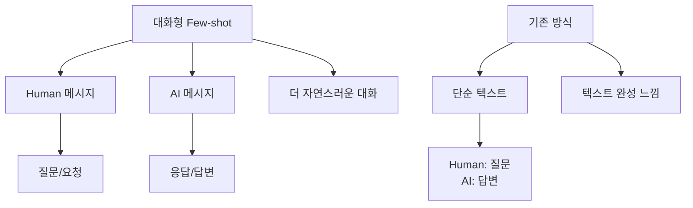

# 📖 Section 4.2: FewShotChatMessagePromptTemplate

## 🎯 학습 목표
- ✅ 대화형 Few-shot 학습의 특징 이해
- ✅ FewShotChatMessagePromptTemplate 완전 활용
- ✅ Human/AI 역할 구분을 통한 자연스러운 대화 구현
- ✅ ChatPromptTemplate과의 통합 방법 마스터

## 🧠 핵심 개념

### 대화형 Few-shot Learning이란?
일반 텍스트 기반 Few-shot과 달리, **대화형 Few-shot**은 Human과 AI의 역할을 명확히 구분하여 더 자연스러운 대화 형태의 예제를 제공합니다.



### 왜 대화형 템플릿인가?
| 특징 | FewShotPromptTemplate | FewShotChatMessagePromptTemplate |
|-----|----------------------|----------------------------------|
| **형식** | 텍스트 기반 | 메시지 기반 |
| **구조** | 단순 문자열 템플릿 | Human/AI 역할 구분 |
| **사용 목적** | 텍스트 완성 | 대화형 응답 |
| **자연스러움** | 보통 | 매우 높음 |
| **채팅 최적화** | 제한적 | 완벽 지원 |

## 📋 주요 클래스/함수 레퍼런스

### FewShotChatMessagePromptTemplate
```python
from langchain.prompts.few_shot import FewShotChatMessagePromptTemplate
from langchain.prompts import ChatPromptTemplate

class FewShotChatMessagePromptTemplate:
    def __init__(
        self,
        examples: List[Dict[str, str]],          # 필수: 예제 리스트
        example_prompt: ChatPromptTemplate,      # 필수: 대화형 예제 템플릿
        input_variables: List[str] = None,       # 선택: 입력 변수 명
        example_separator: str = "\n\n"          # 선택: 예제 구분자
    ):
        """
        대화형 Few-shot 학습을 위한 프롬프트 템플릿
        
        Args:
            examples: 대화 예제 딕셔너리 리스트
            example_prompt: Human/AI 메시지를 포함한 ChatPromptTemplate
            input_variables: 템플릿 변수 검증용 (자동 추론 가능)
        """
```

**📌 매개변수 상세**:
- `examples` (required): 대화 예제 데이터, Human/AI 역할 구분
- `example_prompt` (required): ChatPromptTemplate 객체, 대화 형식 정의
- `input_variables` (optional): 자동 추론되므로 보통 생략
- `example_separator` (optional): 예제 간 구분자

### ChatPromptTemplate
```python
from langchain.prompts import ChatPromptTemplate

def from_messages(messages: List[Tuple[str, str]]) -> ChatPromptTemplate:
    """
    📋 기능: 메시지 리스트로부터 대화형 템플릿 생성
    📥 입력: (역할, 메시지) 튜플 리스트
    📤 출력: ChatPromptTemplate 객체
    💡 사용 시나리오: Human/AI 대화 형식 정의할 때
    """
```

**📌 지원되는 역할**:
- `"human"`: 사용자 메시지
- `"ai"`: AI 응답 메시지  
- `"system"`: 시스템 지시 메시지

## 🔧 동작 과정 상세

### Step-by-Step 구현
```python
# Step 1: 필요한 모듈 임포트
from langchain.chat_models import ChatOpenAI
from langchain.prompts.few_shot import FewShotChatMessagePromptTemplate
from langchain.prompts import ChatPromptTemplate
from langchain.callbacks import StreamingStdOutCallbackHandler

# Step 2: 모델 초기화
chat = ChatOpenAI(  # 📌 용도: 대화형 AI 모델, 타입: ChatOpenAI
    temperature=0.1,  # 📌 용도: 응답 일관성 제어 (낮을수록 일관됨)
    streaming=True,   # 📌 용도: 실시간 응답 출력
    callbacks=[StreamingStdOutCallbackHandler()]
)

# Step 3: 대화 예제 데이터 준비
examples = [  # 📌 용도: 대화형 Few-shot 예제, 타입: List[Dict[str, str]]
    {
        "country": "France",  # 📌 키: Human 메시지 템플릿 변수와 일치
        "answer": """
        Here is what I know:
        Capital: Paris
        Language: French
        Food: Wine and Cheese
        Currency: Euro
        """  # 📌 키: AI 응답 메시지 변수와 일치
    },
    {
        "country": "Italy",
        "answer": """
        I know this:
        Capital: Rome
        Language: Italian
        Food: Pizza and Pasta
        Currency: Euro
        """
    },
    {
        "country": "Greece", 
        "answer": """
        I know this:
        Capital: Athens
        Language: Greek
        Food: Souvlaki and Feta Cheese
        Currency: Euro
        """
    }
]

# Step 4: 대화형 예제 템플릿 생성
example_prompt = ChatPromptTemplate.from_messages([
    ("human", "What do you know about {country}?"),  # 📌 Human 역할 메시지
    ("ai", "{answer}")  # 📌 AI 역할 메시지
])
# 📌 기능: 각 예제를 Human/AI 대화 형식으로 변환
# 📥 입력: country, answer 키를 가진 딕셔너리
# 📤 출력: 구조화된 대화 메시지

# Step 5: Few-shot 대화 템플릿 생성
example_template = FewShotChatMessagePromptTemplate(
    example_prompt=example_prompt,  # 📌 대화 형식 정의
    examples=examples  # 📌 예제 데이터
)

# Step 6: 최종 프롬프트 구성
final_prompt = ChatPromptTemplate.from_messages([
    ("system", "You are a geography expert, you give short answers."),  # 📌 시스템 역할 설정
    example_template,  # 📌 Few-shot 예제들이 여기 삽입
    ("human", "What do you know about {country}?")  # 📌 실제 사용자 질문
])

# Step 7: 체인 실행
chain = final_prompt | chat  # 📌 LCEL 파이프라인 구성
result = chain.invoke({"country": "Thailand"})  # 📌 실행
```

## 💻 실전 예제

### 완전한 구현 예제
```python
from langchain.chat_models import ChatOpenAI
from langchain.prompts.few_shot import FewShotChatMessagePromptTemplate
from langchain.prompts import ChatPromptTemplate

# 🎯 실습 목표: 지리 전문가 AI 만들기 (간결한 답변 스타일)

# 1. 모델 설정
chat = ChatOpenAI(temperature=0.1)

# 2. 대화 예제 - 국가 정보 형식 통일
examples = [
    {
        "country": "France",
        "answer": """
        Here is what I know:
        Capital: Paris
        Language: French
        Food: Wine and Cheese
        Currency: Euro
        """
    },
    {
        "country": "Italy",
        "answer": """
        I know this:
        Capital: Rome
        Language: Italian
        Food: Pizza and Pasta
        Currency: Euro
        """
    },
    {
        "country": "Greece",
        "answer": """
        I know this:
        Capital: Athens
        Language: Greek
        Food: Souvlaki and Feta Cheese
        Currency: Euro
        """
    }
]

# 3. 대화형 예제 템플릿 정의
example_prompt = ChatPromptTemplate.from_messages([
    ("human", "What do you know about {country}?"),
    ("ai", "{answer}")
])

# 4. Few-shot 대화 템플릿 생성
few_shot_template = FewShotChatMessagePromptTemplate(
    example_prompt=example_prompt,
    examples=examples
)

# 5. 최종 프롬프트 구성 (시스템 메시지 + 예제 + 사용자 질문)
final_prompt = ChatPromptTemplate.from_messages([
    ("system", "You are a geography expert, you give short answers."),
    few_shot_template,
    ("human", "What do you know about {country}?")
])

# 6. 프롬프트 구조 확인 (디버깅용)
messages = final_prompt.format_messages(country="Thailand")
print("=== 생성된 메시지 구조 ===")
for i, message in enumerate(messages):
    print(f"{i+1}. {message.type}: {message.content[:100]}...")
print("=" * 50)

# 7. 체인 실행
chain = final_prompt | chat
result = chain.invoke({"country": "Thailand"})
print(f"AI 응답: {result.content}")
```

### 예상 출력
```
=== 생성된 메시지 구조 ===
1. system: You are a geography expert, you give short answers.
2. human: What do you know about France?
3. ai: Here is what I know:
Capital: Paris
Language: French
Food: Wine and Cheese
Currency: Euro
4. human: What do you know about Italy?
5. ai: I know this:
Capital: Rome
Language: Italian
Food: Pizza and Pasta
Currency: Euro
6. human: What do you know about Greece?
7. ai: I know this:
Capital: Athens
Language: Greek
Food: Souvlaki and Feta Cheese
Currency: Euro
8. human: What do you know about Thailand?
==================================================

AI 응답: I know this:
Capital: Bangkok
Language: Thai
Food: Pad Thai and Tom Yum
Currency: Baht
```

## 🔍 변수/함수 상세 설명

### 핵심 변수들
```python
# 대화 예제 구조
examples = [
    {
        "country": "France",  # 📌 용도: Human 메시지 변수, 타입: str
        "answer": "응답 내용"    # 📌 용도: AI 메시지 변수, 타입: str
    }
]

# 메시지 역할 정의
roles = ["system", "human", "ai"]  # 📌 용도: 메시지 역할 구분, 타입: List[str]

# 시스템 메시지 예시
system_messages = {
    "간결한 답변": "You are a geography expert, you give short answers.",
    "상세한 답변": "You are a comprehensive geography expert who provides detailed information.",
    "친근한 답변": "You are a friendly geography guide who loves sharing interesting facts."
}
```

### 핵심 함수들
```python
def from_messages(messages: List[Tuple[str, str]]) -> ChatPromptTemplate:
    """
    📋 기능: 메시지 튜플 리스트로부터 ChatPromptTemplate 생성
    📥 입력: (역할, 메시지내용) 튜플들의 리스트
    📤 출력: ChatPromptTemplate 객체
    💡 사용 시나리오: 다양한 역할의 메시지를 포함한 대화 템플릿 생성
    """

def format_messages(**kwargs) -> List[BaseMessage]:
    """
    📋 기능: 템플릿을 메시지 객체 리스트로 변환
    📥 입력: 템플릿 변수들의 키워드 인자
    📤 출력: BaseMessage 객체들의 리스트
    💡 사용 시나리오: 실제 대화 메시지 생성 및 구조 확인
    """

def invoke(input_variables: Dict[str, Any]) -> AIMessage:
    """
    📋 기능: 대화형 체인 실행하여 AI 응답 생성
    📥 입력: 템플릿 변수들을 담은 딕셔너리
    📤 출력: AI 응답 메시지 객체
    💡 사용 시나리오: 완전한 대화형 AI 시스템 실행
    """
```

## 🧪 실습 과제

### 🔨 기본 과제
1. **시스템 메시지 실험**: 다양한 시스템 메시지로 응답 스타일 비교
```python
# TODO: 다양한 시스템 메시지 테스트
system_variations = [
    "You give detailed, comprehensive answers with examples.",
    "You are casual and friendly, like talking to a friend.", 
    "You provide only facts in bullet point format."
]
```

2. **예제 형식 변경**: 다른 응답 형식으로 예제 재구성

### 🚀 심화 과제
3. **다중 턴 대화**: 여러 번의 질문-답변이 포함된 예제 구성
```python
# 과제: 연속된 대화 예제로 Few-shot 구성
multi_turn_examples = [
    {
        "first_question": "Tell me about Python",
        "first_answer": "Python is a programming language...",
        "follow_up": "What can I build with it?",
        "final_answer": "You can build web apps, AI models..."
    }
]
```

4. **전문 도메인**: 의료, 법률, 기술 등 전문 분야 Few-shot 시스템 구축

### 💡 창의 과제
5. **감정 인식**: 사용자 감정에 따라 다른 스타일로 응답하는 시스템
6. **다국어 지원**: 같은 Few-shot 패턴으로 여러 언어 동시 지원

## ⚠️ 주의사항

### 흔한 실수와 해결법
1. **메시지 역할 혼동**
```python
# ❌ 잘못된 역할 지정
ChatPromptTemplate.from_messages([
    ("person", "Hello"),  # person은 유효하지 않은 역할
    ("bot", "Hi there")   # bot도 유효하지 않은 역할
])

# ✅ 올바른 역할 사용
ChatPromptTemplate.from_messages([
    ("human", "Hello"),   # human 사용
    ("ai", "Hi there")    # ai 사용
])
```

2. **시스템 메시지 위치 실수**
```python
# ❌ 시스템 메시지가 중간에 위치
final_prompt = ChatPromptTemplate.from_messages([
    ("human", "First question"),
    ("system", "You are helpful"),  # 중간 위치는 부적절
    few_shot_template
])

# ✅ 시스템 메시지는 맨 앞에
final_prompt = ChatPromptTemplate.from_messages([
    ("system", "You are helpful"),  # 맨 앞에 위치
    few_shot_template,
    ("human", "Actual question")
])
```

### 성능 고려사항
- **메시지 수 제한**: 너무 많은 예제는 토큰 한도 초과 가능
- **역할 일관성**: Human/AI 역할을 명확히 구분하여 혼동 방지
- **시스템 메시지 최적화**: 간결하고 명확한 지시사항 제공

### 보안 주의점
- **시스템 프롬프트 보호**: 사용자가 시스템 역할을 덮어쓰지 못하도록 주의
- **예제 검증**: 부적절한 내용이 포함된 예제 사전 필터링

## 🔗 관련 자료
- **이전 학습**: [4.1 FewShotPromptTemplate](./4.1_FewShotPromptTemplate.md)
- **다음 학습**: [4.3 LengthBasedExampleSelector](./4.3_LengthBasedExampleSelector.md)
- **관련 주제**: [3.3 OutputParser와 LCEL](../Chapter_3_LCEL/3.3_OutputParser_LCEL.md)
- **API 레퍼런스**: [Templates API](../API_Reference/Templates_API.md)

---

💡 **핵심 정리**: FewShotChatMessagePromptTemplate는 대화형 AI에 최적화된 Few-shot 학습 도구입니다. Human/AI 역할을 명확히 구분하여 더 자연스럽고 일관된 대화형 응답을 만들 수 있습니다. 특히 **시스템 메시지와 예제의 조합**이 응답 품질을 크게 좌우합니다.