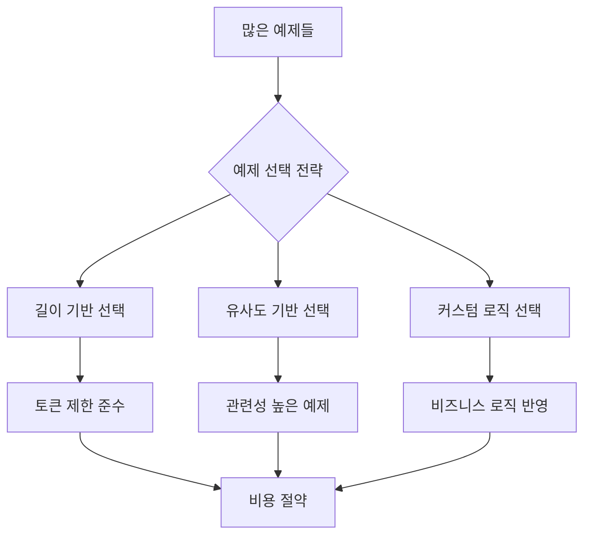

# 📖 Section 4.3: LengthBasedExampleSelector

## 🎯 학습 목표
- ✅ 동적 예제 선택의 필요성과 장점 이해
- ✅ LengthBasedExampleSelector 완전 활용
- ✅ 커스텀 Example Selector 구현 능력
- ✅ 토큰 제한과 비용 최적화 전략 수립

## 🧠 핵심 개념

### 동적 예제 선택이란?
**정적 방식**에서는 모든 예제를 항상 포함하지만, **동적 선택**은 상황에 따라 적절한 예제만 선택하여 포함합니다.



### 왜 동적 선택이 필요한가?

| 문제점 | 정적 방식 | 동적 선택 방식 |
|--------|-----------|----------------|
| **토큰 제한** | 예제 많으면 한도 초과 | 제한 내에서 최적 선택 |
| **비용** | 모든 예제 = 높은 비용 | 필요한 만큼만 = 비용 절약 |
| **관련성** | 무관한 예제도 포함 | 관련성 높은 예제만 선택 |
| **성능** | 긴 프롬프트 = 느린 응답 | 최적화된 길이 = 빠른 응답 |

## 📋 주요 클래스/함수 레퍼런스

### LengthBasedExampleSelector
```python
from langchain.prompts.example_selector import LengthBasedExampleSelector
from langchain.prompts import PromptTemplate

class LengthBasedExampleSelector:
    def __init__(
        self,
        examples: List[Dict[str, str]],          # 필수: 예제 리스트
        example_prompt: PromptTemplate,          # 필수: 예제 포맷터
        max_length: int = 2048,                  # 선택: 최대 길이 (문자 수)
        get_text_length: Callable = len          # 선택: 길이 계산 함수
    ):
        """
        길이 기반 예제 선택기
        
        Args:
            examples: 선택 대상 예제들
            example_prompt: 예제 포맷팅 템플릿
            max_length: 허용할 최대 문자 수
            get_text_length: 길이 계산 방법 (기본: 문자 수)
        """
```

**📌 매개변수 상세**:
- `examples` (required): 선택 대상이 되는 예제 리스트
- `example_prompt` (required): 예제를 포맷팅할 PromptTemplate
- `max_length` (optional): 최대 허용 길이, 기본값 2048자
- `get_text_length` (optional): 길이 계산 함수, 토큰 기반 계산도 가능

**📌 주요 메서드**:
- `select_examples(input_variables)`: 입력에 따른 예제 선택
- `add_example(example)`: 새로운 예제 추가

### BaseExampleSelector (커스텀 선택기용)
```python
from langchain.prompts.example_selector.base import BaseExampleSelector

class BaseExampleSelector:
    def select_examples(self, input_variables: Dict[str, str]) -> List[Dict[str, str]]:
        """
        📋 기능: 입력 변수에 따라 적절한 예제들 선택
        📥 입력: 템플릿 변수들을 담은 딕셔너리
        📤 출력: 선택된 예제들의 리스트
        💡 사용 시나리오: 커스텀 선택 로직 구현 시 필수 구현
        """
        
    def add_example(self, example: Dict[str, str]) -> None:
        """
        📋 기능: 선택기에 새로운 예제 추가
        📥 입력: 추가할 예제 딕셔너리
        📤 출력: 없음 (void)
        💡 사용 시나리오: 동적으로 예제 풀 확장할 때
        """
```

## 🔧 동작 과정 상세

### LengthBasedExampleSelector 사용법
```python
# Step 1: 필요한 모듈 임포트
from langchain.chat_models import ChatOpenAI
from langchain.prompts.few_shot import FewShotPromptTemplate
from langchain.prompts.example_selector import LengthBasedExampleSelector
from langchain.prompts import PromptTemplate

# Step 2: 모델 및 예제 준비
chat = ChatOpenAI(temperature=0.1)

examples = [  # 📌 용도: 선택 대상 예제 풀, 타입: List[Dict[str, str]]
    {
        "question": "What do you know about France?",
        "answer": """
        Here is what I know:
        Capital: Paris
        Language: French
        Food: Wine and Cheese
        Currency: Euro
        """
    },
    {
        "question": "What do you know about Italy?",
        "answer": """
        I know this:
        Capital: Rome
        Language: Italian
        Food: Pizza and Pasta
        Currency: Euro
        """
    },
    {
        "question": "What do you know about Greece?",
        "answer": """
        I know this:
        Capital: Athens
        Language: Greek
        Food: Souvlaki and Feta Cheese
        Currency: Euro
        """
    }
]

# Step 3: 예제 포맷터 생성
example_prompt = PromptTemplate.from_template("Human: {question}\nAI:{answer}")

# Step 4: 길이 기반 선택기 생성
example_selector = LengthBasedExampleSelector(
    examples=examples,              # 📌 선택 대상 예제들
    example_prompt=example_prompt,  # 📌 포맷팅 템플릿
    max_length=100                  # 📌 최대 길이 (짧게 설정하여 테스트)
)
# 📌 기능: 지정된 길이 제한 내에서 최적의 예제 조합 선택
# 📥 입력: 예제 풀, 포맷터, 길이 제한
# 📤 출력: 길이 제한을 만족하는 선택기 객체

# Step 5: FewShotPromptTemplate에 적용
prompt = FewShotPromptTemplate(
    example_selector=example_selector,  # 📌 examples 대신 example_selector 사용
    example_prompt=example_prompt,
    suffix="Human: What do you know about {country}?",
    input_variables=["country"]
)

# Step 6: 길이별 테스트
test_lengths = [50, 100, 200, 400]  # 📌 용도: 다양한 길이 제한 테스트
for length in test_lengths:
    example_selector.max_length = length  # 📌 길이 제한 동적 변경
    formatted = prompt.format(country="Brazil")
    selected_count = len(example_selector.select_examples({"country": "Brazil"}))
    print(f"길이 제한 {length}: {selected_count}개 예제 선택")
```

## 💻 실전 예제

### 1. 기본 사용법
```python
from langchain.chat_models import ChatOpenAI
from langchain.prompts.few_shot import FewShotPromptTemplate
from langchain.prompts.example_selector import LengthBasedExampleSelector
from langchain.prompts import PromptTemplate

# 🎯 실습 목표: 토큰 제한에 따른 동적 예제 선택 구현

# 1. 설정
chat = ChatOpenAI(temperature=0.1)

# 2. 다양한 길이의 예제 준비
examples = [
    {
        "question": "What do you know about France?",
        "answer": "Capital: Paris, Language: French, Food: Wine, Currency: Euro"  # 짧은 답변
    },
    {
        "question": "What do you know about Italy?", 
        "answer": """
        I know this:
        Capital: Rome
        Language: Italian
        Food: Pizza and Pasta
        Currency: Euro
        Famous for: Art, History, Fashion
        """  # 중간 길이 답변
    },
    {
        "question": "What do you know about Greece?",
        "answer": """
        I know this:
        Capital: Athens
        Language: Greek
        Food: Souvlaki and Feta Cheese
        Currency: Euro
        Famous landmarks: Parthenon, Santorini, Delphi
        Ancient history: Birthplace of democracy, philosophy
        Modern culture: Traditional music, dance, hospitality
        """  # 긴 답변
    }
]

# 3. 예제 선택기 설정
example_prompt = PromptTemplate.from_template("Human: {question}\nAI: {answer}")

# 4. 다양한 길이 제한으로 테스트
length_limits = {
    "매우 제한적": 80,   # 1개 예제만 선택
    "보통": 200,         # 2개 예제 선택  
    "여유로움": 500       # 3개 예제 모두 선택
}

for scenario, max_len in length_limits.items():
    print(f"\n=== {scenario} 시나리오 (최대 {max_len}자) ===")
    
    example_selector = LengthBasedExampleSelector(
        examples=examples,
        example_prompt=example_prompt,
        max_length=max_len
    )
    
    prompt = FewShotPromptTemplate(
        example_selector=example_selector,
        example_prompt=example_prompt,
        suffix="Human: What do you know about {country}?",
        input_variables=["country"]
    )
    
    # 선택된 예제 수 확인
    selected = example_selector.select_examples({"country": "Spain"})
    print(f"선택된 예제 수: {len(selected)}")
    
    # 실제 프롬프트 길이 확인
    formatted = prompt.format(country="Spain")
    print(f"생성된 프롬프트 길이: {len(formatted)}자")
```

### 2. 커스텀 Example Selector 구현
```python
from langchain.prompts.example_selector.base import BaseExampleSelector
from random import choice

class RandomExampleSelector(BaseExampleSelector):
    """랜덤하게 예제를 선택하는 커스텀 선택기"""
    
    def __init__(self, examples: list):
        """
        📋 기능: 커스텀 예제 선택기 초기화
        📥 입력: 선택 대상 예제 리스트
        💡 사용 시나리오: 특별한 선택 로직이 필요할 때
        """
        self.examples = examples  # 📌 용도: 예제 저장소, 타입: List[Dict]
    
    def select_examples(self, input_variables: dict) -> list:
        """
        📋 기능: 랜덤하게 하나의 예제 선택
        📥 입력: 입력 변수 딕셔너리 (사용하지 않음)
        📤 출력: 선택된 예제 리스트
        💡 사용 시나리오: 매번 다른 예제로 학습시키고 싶을 때
        """
        return [choice(self.examples)]  # 📌 기능: 랜덤 선택하여 리스트로 반환
    
    def add_example(self, example: dict) -> None:
        """
        📋 기능: 새로운 예제를 예제 풀에 추가
        📥 입력: 추가할 예제 딕셔너리
        💡 사용 시나리오: 동적으로 예제를 확장할 때
        """
        self.examples.append(example)  # 📌 기능: 예제 풀에 추가

# 사용 예시
random_selector = RandomExampleSelector(examples=examples)

prompt_with_random = FewShotPromptTemplate(
    example_selector=random_selector,
    example_prompt=example_prompt,
    suffix="Human: What do you know about {country}?",
    input_variables=["country"]
)

# 매번 다른 예제가 선택됨
for i in range(3):
    formatted = prompt_with_random.format(country="Japan")
    print(f"\n실행 {i+1}:")
    print("선택된 예제:", random_selector.select_examples({})[0]["question"])
```

### 3. 고급 선택 전략
```python
class SmartExampleSelector(BaseExampleSelector):
    """사용자 컨텍스트 기반 지능형 예제 선택기"""
    
    def __init__(self, examples: list, max_examples: int = 2):
        self.examples = examples
        self.max_examples = max_examples  # 📌 용도: 최대 선택 개수 제한
        self.usage_count = {}  # 📌 용도: 예제 사용 빈도 추적
    
    def select_examples(self, input_variables: dict) -> list:
        """
        📋 기능: 사용 빈도와 관련성을 고려한 지능형 선택
        📥 입력: 사용자 입력 변수
        📤 출력: 최적화된 예제 리스트
        💡 사용 시나리오: 학습 효과를 최대화하고 싶을 때
        """
        country = input_variables.get("country", "").lower()
        
        # 지역별 관련성 맵핑
        region_examples = {
            "europe": ["france", "italy", "greece"],
            "asia": ["japan", "korea", "china"],
            "america": ["usa", "brazil", "canada"]
        }
        
        # 관련 지역 예제 우선 선택
        relevant_examples = []
        for region, countries in region_examples.items():
            if country in countries:
                relevant_examples = [ex for ex in self.examples 
                                   if any(c in ex["question"].lower() for c in countries)]
                break
        
        # 관련 예제가 없으면 사용 빈도가 낮은 것 선택
        if not relevant_examples:
            relevant_examples = sorted(self.examples, 
                                     key=lambda x: self.usage_count.get(x["question"], 0))
        
        # 선택된 예제 사용 빈도 업데이트
        selected = relevant_examples[:self.max_examples]
        for example in selected:
            self.usage_count[example["question"]] = self.usage_count.get(example["question"], 0) + 1
        
        return selected
    
    def add_example(self, example: dict) -> None:
        self.examples.append(example)

# 사용 예시
smart_selector = SmartExampleSelector(examples, max_examples=2)

# 다양한 지역으로 테스트
test_countries = ["spain", "japan", "egypt"]
for country in test_countries:
    selected = smart_selector.select_examples({"country": country})
    print(f"\n{country.title()}에 대한 선택된 예제:")
    for ex in selected:
        print(f"- {ex['question']}")
```

## 🔍 변수/함수 상세 설명

### 핵심 변수들
```python
# 길이 제한 설정
max_length = 200  # 📌 용도: 최대 허용 문자 수, 타입: int, 추천: 100-500
max_examples = 3  # 📌 용도: 최대 예제 개수 제한, 타입: int, 추천: 1-5

# 선택 전략 플래그
selection_strategy = "length"  # 📌 용도: 선택 전략 구분, 타입: str, 옵션: length|random|smart

# 사용 빈도 추적
usage_count = {}  # 📌 용도: 예제별 사용 횟수 저장, 타입: Dict[str, int]
```

### 핵심 함수들
```python
def select_examples(input_variables: Dict[str, str]) -> List[Dict[str, str]]:
    """
    📋 기능: 입력 조건에 따라 최적의 예제 선택
    📥 입력: 템플릿 변수 딕셔너리
    📤 출력: 선택된 예제 리스트
    💡 사용 시나리오: 동적 예제 선택 로직의 핵심
    """

def get_text_length(text: str) -> int:
    """
    📋 기능: 텍스트 길이 계산 (문자 수 또는 토큰 수)
    📥 입력: 측정할 텍스트 문자열
    📤 출력: 길이 값 (정수)
    💡 사용 시나리오: 길이 기반 선택에서 기준 계산
    """

def add_example(example: Dict[str, str]) -> None:
    """
    📋 기능: 예제 풀에 새로운 예제 추가
    📥 입력: 추가할 예제 딕셔너리
    📤 출력: 없음
    💡 사용 시나리오: 시스템 운영 중 예제 동적 확장
    """
```

## 🧪 실습 과제

### 🔨 기본 과제
1. **길이 제한 실험**: 50, 100, 200, 500자 제한으로 선택 결과 비교
2. **예제 개수 최적화**: 1-5개 예제로 응답 품질 테스트

### 🚀 심화 과제
3. **토큰 기반 선택기**: 문자 수 대신 토큰 수 기반 선택 구현
```python
# TODO: tiktoken을 사용한 토큰 기반 길이 계산
import tiktoken

def token_length(text: str) -> int:
    encoding = tiktoken.encoding_for_model("gpt-3.5-turbo")
    return len(encoding.encode(text))
```

4. **유사도 기반 선택기**: 사용자 질문과 유사한 예제 우선 선택
5. **사용자별 개인화**: 사용자 프로필에 따른 맞춤형 예제 선택

### 💡 창의 과제
6. **A/B 테스트 선택기**: 다양한 예제 조합으로 성능 비교
7. **학습 기반 선택기**: 사용자 피드백으로 선택 전략 개선

## ⚠️ 주의사항

### 성능 고려사항
- **토큰 vs 문자**: 토큰 기반 계산이 더 정확하지만 계산 비용 증가
- **선택 알고리즘**: 복잡한 선택 로직은 응답 시간 지연 가능
- **캐싱 전략**: 자주 사용되는 선택 결과 캐싱으로 성능 향상

### 비용 최적화
```python
# 비용 효율적인 설정 예시
optimal_selector = LengthBasedExampleSelector(
    examples=examples,
    example_prompt=example_prompt,
    max_length=150,  # 너무 길지 않게
)
```

### 품질 관리
- **예제 품질**: 선택된 예제의 품질이 전체 성능 좌우
- **다양성 확보**: 편중되지 않은 다양한 예제 선택 필요
- **지속적 모니터링**: 선택 패턴과 결과 품질 정기 검토

## 🔗 관련 자료
- **이전 학습**: [4.2 FewShotChatMessagePromptTemplate](./4.2_FewShotChatMessagePromptTemplate.md)
- **다음 학습**: [4.4 Serialization and Composition](./4.4_Serialization_Composition.md)
- **관련 주제**: [4.5 Caching](./4.5_Caching.md) - 성능 최적화
- **API 레퍼런스**: [Selectors API](../API_Reference/Selectors_API.md)

---

💡 **핵심 정리**: LengthBasedExampleSelector는 토큰 제한과 비용을 고려한 스마트한 예제 선택을 가능하게 합니다. 커스텀 선택기 구현으로 비즈니스 로직에 맞는 최적화된 선택 전략을 만들 수 있습니다. **적절한 선택 전략**이 성능과 비용 효율성의 핵심입니다.