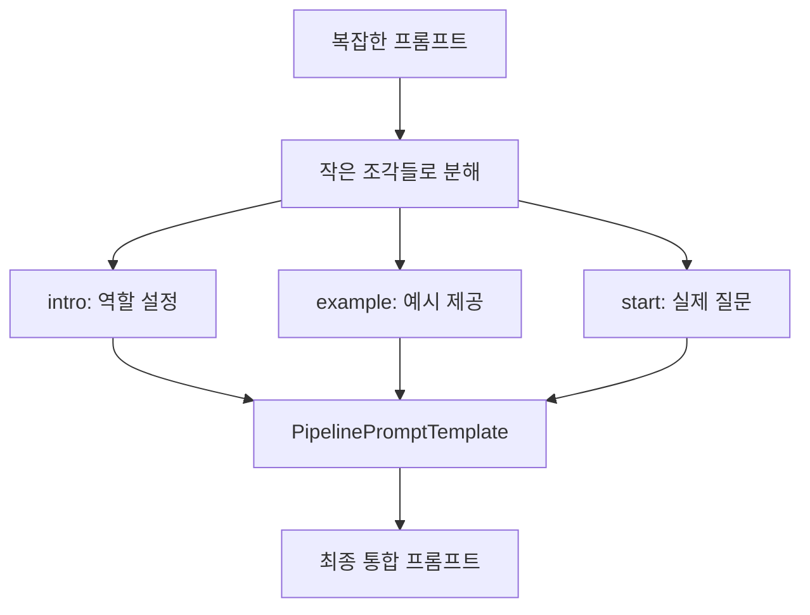

# 📖 Section 4.4: Serialization and Composition

## 🎯 학습 목표
- ✅ 프롬프트 템플릿의 직렬화(저장/로드) 마스터
- ✅ PipelinePromptTemplate을 통한 프롬프트 구성 기법
- ✅ 모듈화된 프롬프트 시스템 설계 능력
- ✅ 복잡한 프롬프트를 작은 단위로 분해하는 전략 수립

## 🧠 핵심 개념

### Serialization (직렬화)이란?
**Serialization**은 프롬프트 템플릿을 파일로 저장하고 다시 불러오는 기능입니다. 팀 협업과 버전 관리에 필수적입니다.

### Composition (구성)이란?
**Composition**은 작은 프롬프트 조각들을 조합하여 복잡한 프롬프트를 만드는 기법입니다.



### 왜 필요한가?

| 기능 | 장점 | 사용 시나리오 |
|------|------|---------------|
| **직렬화** | 버전 관리, 팀 협업, 재사용성 | 프롬프트 라이브러리 구축 |
| **구성** | 모듈화, 유지보수성, 가독성 | 복잡한 AI 시스템 개발 |

## 📋 주요 클래스/함수 레퍼런스

### PipelinePromptTemplate
```python
from langchain.prompts.pipeline import PipelinePromptTemplate
from langchain.prompts import PromptTemplate

class PipelinePromptTemplate:
    def __init__(
        self,
        final_prompt: PromptTemplate,                    # 필수: 최종 템플릿
        pipeline_prompts: List[Tuple[str, PromptTemplate]], # 필수: 구성 요소들
        input_variables: List[str] = None                # 선택: 입력 변수
    ):
        """
        파이프라인 형태의 프롬프트 템플릿
        
        Args:
            final_prompt: 모든 조각을 통합하는 최종 템플릿
            pipeline_prompts: (이름, 템플릿) 튜플들의 리스트
            input_variables: 전체 시스템의 입력 변수들
        """
```

**📌 매개변수 상세**:
- `final_prompt` (required): 모든 부분을 조합하는 메인 템플릿
- `pipeline_prompts` (required): 구성 요소 템플릿들, (이름, 템플릿) 형태
- `input_variables` (optional): 자동 추론되므로 보통 생략

### 직렬화 관련 메서드
```python
# 저장
template.save("template.json")      # JSON 형태로 저장
template.save("template.yaml")      # YAML 형태로 저장

# 로드
from langchain.prompts import load_prompt
template = load_prompt("template.json")  # 파일에서 불러오기
```

## 🔧 동작 과정 상세

### PipelinePromptTemplate 구현 과정
```python
# Step 1: 필요한 모듈 임포트
from langchain.chat_models import ChatOpenAI
from langchain.prompts import PromptTemplate
from langchain.prompts.pipeline import PipelinePromptTemplate
from langchain.callbacks import StreamingStdOutCallbackHandler

# Step 2: 모델 초기화
chat = ChatOpenAI(
    temperature=0.1,
    streaming=True,
    callbacks=[StreamingStdOutCallbackHandler()]
)

# Step 3: 개별 프롬프트 조각들 생성
intro = PromptTemplate.from_template(
    """
    You are a role playing assistant.
    And you are impersonating a {character}
    """
)  # 📌 용도: 캐릭터 역할 설정, 타입: PromptTemplate

example = PromptTemplate.from_template(
    """
    This is an example of how you talk:

    Human: {example_question}
    You: {example_answer}
    """
)  # 📌 용도: 대화 스타일 예시, 타입: PromptTemplate

start = PromptTemplate.from_template(
    """
    Start now!

    Human: {question}
    You:
    """
)  # 📌 용도: 실제 대화 시작, 타입: PromptTemplate

# Step 4: 최종 통합 템플릿 생성
final = PromptTemplate.from_template(
    """
    {intro}
                                     
    {example}
                              
    {start}
    """
)  # 📌 용도: 모든 조각을 통합, 타입: PromptTemplate

# Step 5: 파이프라인 프롬프트 구성
pipeline_prompts = [  # 📌 용도: 템플릿 구성 요소 정의, 타입: List[Tuple[str, PromptTemplate]]
    ("intro", intro),      # 📌 (이름, 템플릿) 형태로 구성
    ("example", example),  # 📌 이름은 final 템플릿의 변수명과 일치
    ("start", start),
]

full_prompt = PipelinePromptTemplate(
    final_prompt=final,         # 📌 최종 통합 템플릿
    pipeline_prompts=pipeline_prompts  # 📌 구성 요소들
)

# Step 6: 체인 실행
chain = full_prompt | chat

result = chain.invoke({
    "character": "Pirate",                           # 📌 intro 템플릿용 변수
    "example_question": "What is your location?",    # 📌 example 템플릿용 변수
    "example_answer": "Arrrrg! That is a secret!! Arg arg!!",  # 📌 example 템플릿용 변수
    "question": "What is your fav food?"            # 📌 start 템플릿용 변수
})
```

## 💻 실전 예제

### 1. 기본 구성 예제
```python
from langchain.chat_models import ChatOpenAI
from langchain.prompts import PromptTemplate
from langchain.prompts.pipeline import PipelinePromptTemplate

# 🎯 실습 목표: 해적 캐릭터 롤플레이 AI 만들기

# 1. 모델 설정
chat = ChatOpenAI(temperature=0.1)

# 2. 프롬프트 구성 요소들 생성
# 역할 정의 부분
intro_template = PromptTemplate.from_template(
    """
    You are a role playing assistant.
    And you are impersonating a {character}.
    Stay in character at all times and use appropriate language and mannerisms.
    """
)

# 대화 스타일 예시 부분
example_template = PromptTemplate.from_template(
    """
    This is an example of how you talk:

    Human: {example_question}
    You: {example_answer}
    
    Remember to maintain this tone and style.
    """
)

# 실제 대화 시작 부분
start_template = PromptTemplate.from_template(
    """
    Start now!

    Human: {question}
    You:
    """
)

# 3. 최종 통합 템플릿
final_template = PromptTemplate.from_template(
    """
    {intro}
                                     
    {example}
                              
    {start}
    """
)

# 4. 파이프라인 구성
prompts = [
    ("intro", intro_template),
    ("example", example_template), 
    ("start", start_template),
]

full_prompt = PipelinePromptTemplate(
    final_prompt=final_template,
    pipeline_prompts=prompts,
)

# 5. 생성된 프롬프트 확인
test_input = {
    "character": "Pirate",
    "example_question": "What is your location?",
    "example_answer": "Arrrrg! That is a secret!! Arg arg!!",
    "question": "What is your favorite food?"
}

formatted_prompt = full_prompt.format(**test_input)
print("=== 생성된 프롬프트 ===")
print(formatted_prompt)
print("=" * 50)

# 6. 실행
chain = full_prompt | chat
result = chain.invoke(test_input)
print(f"AI 응답: {result.content}")
```

### 2. 복잡한 프롬프트 구성 예제
```python
# 🎯 실습 목표: 전문가 상담 시스템 만들기

# 전문 분야별 설정
expertise_template = PromptTemplate.from_template(
    """
    You are a professional {field} expert with {years} years of experience.
    Your expertise includes: {specializations}
    You provide accurate, helpful, and professional advice.
    """
)

# 상담 가이드라인
guidelines_template = PromptTemplate.from_template(
    """
    Guidelines for consultation:
    1. Listen carefully to the client's needs
    2. Ask clarifying questions when necessary
    3. Provide evidence-based recommendations
    4. Maintain professional boundaries
    5. {additional_guidelines}
    """
)

# 응답 형식
format_template = PromptTemplate.from_template(
    """
    Please structure your response as follows:
    - Understanding: Summarize the client's question
    - Analysis: Your professional assessment
    - Recommendations: Specific actionable advice
    - Next Steps: What the client should do next
    """
)

# 실제 상담 시작
consultation_template = PromptTemplate.from_template(
    """
    Client Question: {client_question}
    
    Please provide your professional consultation:
    """
)

# 최종 통합
expert_final = PromptTemplate.from_template(
    """
    {expertise}
    
    {guidelines}
    
    {format}
    
    {consultation}
    """
)

# 파이프라인 구성
expert_prompts = [
    ("expertise", expertise_template),
    ("guidelines", guidelines_template),
    ("format", format_template),
    ("consultation", consultation_template),
]

expert_prompt = PipelinePromptTemplate(
    final_prompt=expert_final,
    pipeline_prompts=expert_prompts,
)

# 사용 예시
consultation_input = {
    "field": "Software Engineering",
    "years": "10",
    "specializations": "Web Development, System Architecture, Performance Optimization",
    "additional_guidelines": "Consider scalability and maintainability in all recommendations",
    "client_question": "How should I structure a microservices architecture for an e-commerce platform?"
}

chain = expert_prompt | chat
result = chain.invoke(consultation_input)
```

### 3. 직렬화 예제
```python
# 프롬프트 저장하기
expert_prompt.save("expert_consultation_prompt.json")
expert_prompt.save("expert_consultation_prompt.yaml")

# 프롬프트 불러오기
from langchain.prompts import load_prompt

# JSON에서 불러오기
loaded_prompt = load_prompt("expert_consultation_prompt.json")

# YAML에서 불러오기  
loaded_prompt_yaml = load_prompt("expert_consultation_prompt.yaml")

# 불러온 프롬프트 사용
chain_loaded = loaded_prompt | chat
result_loaded = chain_loaded.invoke(consultation_input)
```

## 🔍 변수/함수 상세 설명

### 핵심 변수들
```python
# 파이프라인 구성 요소
pipeline_prompts = [
    ("이름", 템플릿_객체)  # 📌 용도: 구성 요소 정의, 타입: List[Tuple[str, PromptTemplate]]
]

# 템플릿 파일 경로
template_path = "prompts/expert.json"  # 📌 용도: 저장/로드 경로, 타입: str

# 입력 변수 매핑
input_mapping = {
    "character": "Pirate",         # 📌 용도: 역할 설정, 타입: str
    "question": "user input"       # 📌 용도: 사용자 질문, 타입: str
}
```

### 핵심 함수들
```python
def format(**kwargs) -> str:
    """
    📋 기능: 파이프라인 프롬프트를 최종 문자열로 변환
    📥 입력: 모든 구성 요소에 필요한 변수들
    📤 출력: 완성된 프롬프트 문자열
    💡 사용 시나리오: 프롬프트 미리보기나 디버깅 시
    """

def save(file_path: str) -> None:
    """
    📋 기능: 프롬프트 템플릿을 파일로 저장
    📥 입력: 저장할 파일 경로 (확장자로 형식 결정)
    📤 출력: 없음
    💡 사용 시나리오: 프롬프트 버전 관리, 팀 공유
    """

def load_prompt(file_path: str) -> PromptTemplate:
    """
    📋 기능: 파일에서 프롬프트 템플릿 불러오기
    📥 입력: 프롬프트 파일 경로
    📤 출력: 불러온 PromptTemplate 객체
    💡 사용 시나리오: 저장된 프롬프트 재사용, 배포
    """
```

## 🧪 실습 과제

### 🔨 기본 과제
1. **3단계 프롬프트**: 인사 → 안내 → 질문 구조로 구성
2. **저장/로드 테스트**: JSON과 YAML 형식으로 저장 후 불러오기 테스트

### 🚀 심화 과제
3. **다국어 프롬프트 시스템**: 언어별로 다른 구성 요소 사용
```python
# TODO: 언어별 프롬프트 조각 구현
language_intros = {
    "ko": PromptTemplate.from_template("안녕하세요, 저는 {character}입니다."),
    "en": PromptTemplate.from_template("Hello, I am a {character}."),
    "ja": PromptTemplate.from_template("こんにちは、私は{character}です。")
}
```

4. **조건부 구성**: 사용자 유형에 따라 다른 프롬프트 조각 선택
5. **버전 관리**: 프롬프트 변경 사항 추적 시스템

### 💡 창의 과제
6. **프롬프트 라이브러리**: 재사용 가능한 프롬프트 조각 모음 구축
7. **A/B 테스트**: 다양한 구성으로 성능 비교 시스템

## ⚠️ 주의사항

### 설계 원칙
- **단일 책임**: 각 구성 요소는 하나의 역할만 수행
- **재사용성**: 다양한 상황에서 재사용 가능하게 설계
- **가독성**: 구성 요소 이름과 역할을 명확히 표현

### 파일 관리
```python
# 권장 디렉토리 구조
prompts/
├── components/          # 재사용 가능한 조각들
│   ├── intros/
│   ├── examples/
│   └── endings/
├── templates/           # 완성된 템플릿들
│   ├── customer_service.json
│   ├── expert_consultation.yaml
│   └── creative_writing.json
└── versions/           # 버전 관리
    ├── v1.0/
    └── v2.0/
```

### 성능 고려사항
- **메모리 사용**: 큰 프롬프트는 메모리 사용량 주의
- **로딩 시간**: 파일 I/O 시간 고려하여 캐싱 전략 수립
- **변수 검증**: 모든 필수 변수가 제공되는지 확인

## 🔗 관련 자료
- **이전 학습**: [4.3 LengthBasedExampleSelector](./4.3_LengthBasedExampleSelector.md)
- **다음 학습**: [4.5 Caching](./4.5_Caching.md)
- **관련 주제**: [4.6 Serialization](./4.6_Serialization.md) - 모델 직렬화
- **API 레퍼런스**: [Templates API](../API_Reference/Templates_API.md)

---

💡 **핵심 정리**: PipelinePromptTemplate은 복잡한 프롬프트를 모듈화하여 관리할 수 있게 해주는 강력한 도구입니다. 직렬화 기능과 함께 사용하면 팀 협업과 버전 관리가 쉬워집니다. **모듈화와 재사용성**이 성공적인 프롬프트 시스템의 핵심입니다.