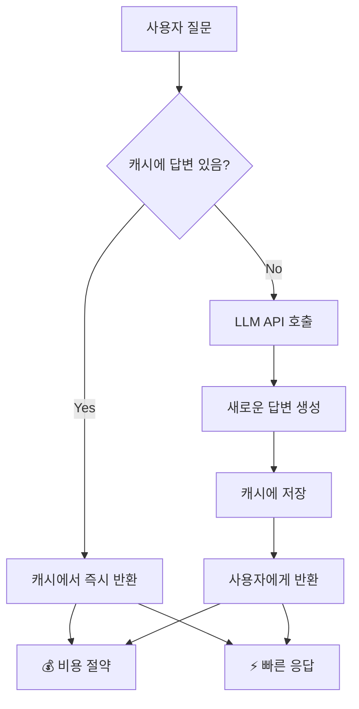

# 📖 Section 4.5: Caching - LLM 응답 캐싱

## 🎯 학습 목표
- ✅ LLM 캐싱의 필요성과 비용 절감 효과 이해
- ✅ 다양한 캐시 백엔드 (메모리, SQLite, Redis) 활용
- ✅ 캐시 적중률 최적화 전략 수립
- ✅ 프로덕션 환경에서의 캐싱 모범 사례 적용

## 🧠 핵심 개념

### LLM 캐싱이란?
**LLM 캐싱**은 동일한 입력에 대한 LLM 응답을 저장하여, 같은 질문이 반복될 때 API 호출 없이 저장된 답변을 즉시 반환하는 기술입니다.



### 캐싱의 장점

| 장점 | 설명 | 실제 효과 |
|------|------|-----------|
| **비용 절약** | 중복 API 호출 제거 | 50-90% 비용 절감 |
| **응답 속도** | 네트워크 지연 제거 | 0.1초 vs 3-10초 |
| **안정성** | API 장애 시 대안 제공 | 서비스 연속성 확보 |
| **사용자 경험** | 즉시 응답으로 만족도 향상 | 이탈률 감소 |

## 📋 주요 클래스/함수 레퍼런스

### 전역 캐시 설정
```python
from langchain.globals import set_llm_cache, set_debug
from langchain.cache import InMemoryCache, SQLiteCache

def set_llm_cache(cache_instance):
    """
    📋 기능: 전역 LLM 캐시 설정
    📥 입력: 캐시 인스턴스 (InMemoryCache, SQLiteCache 등)
    📤 출력: 없음
    💡 사용 시나리오: 애플리케이션 시작 시 한 번 설정
    """
```

### InMemoryCache
```python
class InMemoryCache:
    def __init__(self):
        """
        메모리 기반 캐시 - 개발 및 테스트용
        
        특징:
        - 가장 빠른 접근 속도
        - 프로세스 종료 시 데이터 손실
        - 메모리 사용량 증가
        """
```

### SQLiteCache
```python
class SQLiteCache:
    def __init__(self, database_path: str = "langchain.db"):
        """
        SQLite 데이터베이스 기반 캐시 - 영구 저장용
        
        Args:
            database_path: SQLite 파일 경로
            
        특징:
        - 영구 저장 (재시작 후에도 유지)
        - 파일 기반으로 공유 가능
        - 중간 정도의 성능
        """
```

**📌 지원되는 캐시 백엔드**:
- `InMemoryCache`: 메모리 캐시 (빠름, 임시)
- `SQLiteCache`: SQLite 데이터베이스 (영구, 단일 서버)
- `RedisCache`: Redis 서버 (영구, 분산 가능)
- `FullLLMCache`: 완전한 요청-응답 캐싱

## 🔧 동작 과정 상세

### 기본 캐싱 설정 및 사용
```python
# Step 1: 필요한 모듈 임포트
from langchain.chat_models import ChatOpenAI
from langchain.globals import set_llm_cache, set_debug
from langchain.cache import InMemoryCache, SQLiteCache
import time

# Step 2: 캐시 설정 (애플리케이션 시작 시 한 번만)
set_llm_cache(InMemoryCache())  # 📌 용도: 메모리 캐시 활성화, 타입: InMemoryCache

# 선택사항: 디버그 모드 활성화 (캐시 동작 확인용)
# set_debug(True)  # 📌 용도: 캐시 히트/미스 로그 출력

# Step 3: 모델 초기화 (캐시 설정 후에 수행)
chat = ChatOpenAI(
    temperature=0.1,  # 📌 용도: 일관된 응답으로 캐시 효율성 증대
    # streaming=True,  # 📌 주의: 스트리밍 모드는 캐싱과 충돌할 수 있음
)

# Step 4: 첫 번째 호출 (캐시 미스 - API 호출 발생)
question = "How do you make italian pasta?"  # 📌 용도: 테스트 질문, 타입: str

print("=== 첫 번째 호출 (API 호출) ===")
start_time = time.time()  # 📌 용도: 응답 시간 측정 시작
response1 = chat.predict(question)
end_time = time.time()
print(f"응답 시간: {end_time - start_time:.2f}초")
print(f"응답 길이: {len(response1)}자")

# Step 5: 두 번째 호출 (캐시 히트 - 즉시 반환)
print("\n=== 두 번째 호출 (캐시에서 반환) ===")
start_time = time.time()
response2 = chat.predict(question)  # 📌 동일한 질문
end_time = time.time()
print(f"응답 시간: {end_time - start_time:.2f}초")
print(f"응답 동일성: {response1 == response2}")
```

## 💻 실전 예제

### 1. 메모리 캐시 vs SQLite 캐시 비교
```python
from langchain.chat_models import ChatOpenAI
from langchain.globals import set_llm_cache
from langchain.cache import InMemoryCache, SQLiteCache
import time
import os

# 🎯 실습 목표: 다양한 캐시 백엔드 성능 비교

def test_cache_performance(cache_type, cache_instance, test_questions):
    """
    📋 기능: 캐시 성능 테스트 함수
    📥 입력: 캐시 타입, 인스턴스, 테스트 질문들
    📤 출력: 성능 측정 결과
    💡 사용 시나리오: 최적 캐시 백엔드 선택
    """
    print(f"\n=== {cache_type} 캐시 테스트 ===")
    
    # 캐시 설정
    set_llm_cache(cache_instance)
    chat = ChatOpenAI(temperature=0.1)
    
    results = {
        "first_call_times": [],   # 📌 용도: 첫 호출 시간 저장
        "cached_call_times": [],  # 📌 용도: 캐시 히트 시간 저장
        "cache_hit_ratio": 0      # 📌 용도: 캐시 적중률
    }
    
    for i, question in enumerate(test_questions):
        # 첫 번째 호출 (캐시 미스)
        start_time = time.time()
        response1 = chat.predict(question)
        first_call_time = time.time() - start_time
        results["first_call_times"].append(first_call_time)
        
        # 두 번째 호출 (캐시 히트)
        start_time = time.time()
        response2 = chat.predict(question)
        cached_call_time = time.time() - start_time
        results["cached_call_times"].append(cached_call_time)
        
        print(f"질문 {i+1}: 첫 호출 {first_call_time:.2f}s, 캐시 {cached_call_time:.2f}s")
        print(f"속도 향상: {first_call_time/cached_call_time:.1f}배")
    
    return results

# 테스트 질문들
test_questions = [
    "What is the capital of France?",
    "How do you make chocolate cake?",
    "Explain quantum computing in simple terms.",
    "What are the benefits of renewable energy?"
]

# 1. 메모리 캐시 테스트
memory_results = test_cache_performance(
    "InMemory", 
    InMemoryCache(), 
    test_questions
)

# 2. SQLite 캐시 테스트
sqlite_results = test_cache_performance(
    "SQLite", 
    SQLiteCache("test_cache.db"), 
    test_questions
)

# 결과 비교
print("\n=== 성능 비교 결과 ===")
print(f"메모리 캐시 평균 히트 시간: {sum(memory_results['cached_call_times'])/len(memory_results['cached_call_times']):.4f}초")
print(f"SQLite 캐시 평균 히트 시간: {sum(sqlite_results['cached_call_times'])/len(sqlite_results['cached_call_times']):.4f}초")

# 테스트 후 정리
if os.path.exists("test_cache.db"):
    os.remove("test_cache.db")
```

### 2. 프로덕션용 SQLite 캐시 설정
```python
from langchain.chat_models import ChatOpenAI
from langchain.globals import set_llm_cache
from langchain.cache import SQLiteCache
import os
from datetime import datetime

# 🎯 실습 목표: 프로덕션 환경용 캐시 시스템 구축

class ProductionCacheManager:
    """프로덕션 환경용 캐시 관리자"""
    
    def __init__(self, cache_dir: str = "./cache", db_name: str = None):
        """
        📋 기능: 프로덕션용 캐시 매니저 초기화
        📥 입력: 캐시 디렉토리, 데이터베이스 이름
        💡 사용 시나리오: 서비스 시작 시 캐시 환경 구성
        """
        self.cache_dir = cache_dir  # 📌 용도: 캐시 파일 저장 디렉토리
        
        # 캐시 디렉토리 생성
        os.makedirs(cache_dir, exist_ok=True)
        
        # 데이터베이스 이름 설정 (날짜별 또는 기본)
        if db_name is None:
            today = datetime.now().strftime("%Y%m%d")
            db_name = f"llm_cache_{today}.db"
        
        self.db_path = os.path.join(cache_dir, db_name)  # 📌 용도: DB 파일 경로
        
        # 캐시 설정
        self.setup_cache()
    
    def setup_cache(self):
        """캐시 시스템 설정"""
        cache_instance = SQLiteCache(self.db_path)
        set_llm_cache(cache_instance)
        print(f"✅ SQLite 캐시 설정 완료: {self.db_path}")
    
    def get_cache_stats(self):
        """
        📋 기능: 캐시 통계 정보 반환
        📤 출력: 캐시 파일 크기, 생성 시간 등
        💡 사용 시나리오: 캐시 상태 모니터링
        """
        if os.path.exists(self.db_path):
            size = os.path.getsize(self.db_path)
            created = datetime.fromtimestamp(os.path.getctime(self.db_path))
            return {
                "file_size": f"{size / 1024:.2f} KB",
                "created_at": created.strftime("%Y-%m-%d %H:%M:%S"),
                "file_path": self.db_path
            }
        return None
    
    def cleanup_old_caches(self, days_to_keep: int = 7):
        """
        📋 기능: 오래된 캐시 파일 정리
        📥 입력: 보관할 일수
        💡 사용 시나리오: 디스크 공간 관리
        """
        import glob
        from datetime import timedelta
        
        cutoff_date = datetime.now() - timedelta(days=days_to_keep)
        cache_files = glob.glob(os.path.join(self.cache_dir, "llm_cache_*.db"))
        
        removed_count = 0
        for file_path in cache_files:
            if datetime.fromtimestamp(os.path.getctime(file_path)) < cutoff_date:
                os.remove(file_path)
                removed_count += 1
                print(f"🗑️  제거된 캐시 파일: {file_path}")
        
        print(f"📊 총 {removed_count}개 파일 정리 완료")

# 사용 예시
def main():
    # 프로덕션 캐시 매니저 초기화
    cache_manager = ProductionCacheManager()
    
    # ChatOpenAI 인스턴스 생성
    chat = ChatOpenAI(temperature=0.1)
    
    # 테스트 질문들
    questions = [
        "What are the latest trends in AI?",
        "How to optimize database performance?",
        "Best practices for API design?"
    ]
    
    print("=== 캐시 성능 테스트 ===")
    for i, question in enumerate(questions, 1):
        print(f"\n질문 {i}: {question}")
        
        # 첫 번째 호출 (캐시 미스)
        start_time = time.time()
        response = chat.predict(question)
        first_time = time.time() - start_time
        
        # 두 번째 호출 (캐시 히트)
        start_time = time.time()
        cached_response = chat.predict(question)
        cached_time = time.time() - start_time
        
        print(f"첫 호출: {first_time:.2f}초")
        print(f"캐시 호출: {cached_time:.4f}초")
        print(f"속도 향상: {first_time/cached_time:.1f}배")
        print(f"응답 일치: {'✅' if response == cached_response else '❌'}")
    
    # 캐시 통계 출력
    stats = cache_manager.get_cache_stats()
    if stats:
        print(f"\n=== 캐시 통계 ===")
        for key, value in stats.items():
            print(f"{key}: {value}")
    
    # 오래된 캐시 정리 (예시)
    cache_manager.cleanup_old_caches(days_to_keep=7)

if __name__ == "__main__":
    main()
```

### 3. 캐시 무효화 및 관리
```python
from langchain.globals import set_llm_cache
from langchain.cache import SQLiteCache
import sqlite3
import json

class AdvancedCacheManager:
    """고급 캐시 관리 기능"""
    
    def __init__(self, db_path: str):
        self.db_path = db_path
        set_llm_cache(SQLiteCache(db_path))
    
    def clear_cache(self):
        """
        📋 기능: 전체 캐시 삭제
        💡 사용 시나리오: 캐시 리셋이 필요할 때
        """
        conn = sqlite3.connect(self.db_path)
        conn.execute("DELETE FROM full_llm_cache")
        conn.commit()
        conn.close()
        print("🧹 캐시가 완전히 삭제되었습니다.")
    
    def get_cache_entries(self, limit: int = 10):
        """
        📋 기능: 캐시 엔트리 조회
        📥 입력: 조회할 최대 개수
        📤 출력: 캐시 엔트리 리스트
        💡 사용 시나리오: 캐시 내용 분석
        """
        conn = sqlite3.connect(self.db_path)
        cursor = conn.execute(
            "SELECT prompt, llm, response, created_at FROM full_llm_cache LIMIT ?", 
            (limit,)
        )
        entries = cursor.fetchall()
        conn.close()
        
        return [
            {
                "prompt": entry[0][:100] + "..." if len(entry[0]) > 100 else entry[0],
                "llm": entry[1],
                "response_length": len(entry[2]),
                "created_at": entry[3] if entry[3] else "Unknown"
            }
            for entry in entries
        ]
    
    def remove_entries_by_pattern(self, pattern: str):
        """
        📋 기능: 패턴에 맞는 캐시 엔트리 삭제
        📥 입력: 검색 패턴 (SQL LIKE 패턴)
        💡 사용 시나리오: 특정 주제의 캐시만 삭제
        """
        conn = sqlite3.connect(self.db_path)
        cursor = conn.execute(
            "DELETE FROM full_llm_cache WHERE prompt LIKE ?", 
            (f"%{pattern}%",)
        )
        deleted_count = cursor.rowcount
        conn.commit()
        conn.close()
        
        print(f"🗑️  '{pattern}' 패턴과 일치하는 {deleted_count}개 엔트리 삭제")
        return deleted_count

# 사용 예시
cache_manager = AdvancedCacheManager("advanced_cache.db")

# 캐시 엔트리 조회
entries = cache_manager.get_cache_entries(5)
print("=== 최근 캐시 엔트리 ===")
for i, entry in enumerate(entries, 1):
    print(f"{i}. {entry['prompt']}")
    print(f"   응답 길이: {entry['response_length']}자")

# 특정 패턴 삭제
cache_manager.remove_entries_by_pattern("python")
```

## 🔍 변수/함수 상세 설명

### 핵심 변수들
```python
# 캐시 설정 변수
cache_enabled = True        # 📌 용도: 캐시 활성화 플래그, 타입: bool
cache_db_path = "cache.db"  # 📌 용도: SQLite 파일 경로, 타입: str
cache_ttl = 3600           # 📌 용도: 캐시 유효 시간(초), 타입: int

# 성능 측정 변수
response_time = 0.0        # 📌 용도: 응답 시간 저장, 타입: float
cache_hit_count = 0        # 📌 용도: 캐시 히트 횟수, 타입: int
total_requests = 0         # 📌 용도: 총 요청 수, 타입: int
```

### 핵심 함수들
```python
def set_llm_cache(cache_instance) -> None:
    """
    📋 기능: 전역 LLM 캐시 인스턴스 설정
    📥 입력: 캐시 백엔드 인스턴스
    📤 출력: 없음
    💡 사용 시나리오: 애플리케이션 초기화 시점
    """

def set_debug(enabled: bool) -> None:
    """
    📋 기능: 디버그 모드 활성화/비활성화
    📥 입력: 디버그 모드 활성화 여부
    📤 출력: 없음
    💡 사용 시나리오: 캐시 동작 분석 필요 시
    """

def predict(prompt: str) -> str:
    """
    📋 기능: LLM 예측 실행 (캐시 적용)
    📥 입력: 프롬프트 문자열
    📤 출력: LLM 응답 문자열
    💡 사용 시나리오: 일반적인 LLM 호출
    """
```

## 🧪 실습 과제

### 🔨 기본 과제
1. **캐시 성능 측정**: 10개 질문으로 캐시 전후 성능 비교
2. **다양한 백엔드 테스트**: InMemory, SQLite 캐시 성능 비교

### 🚀 심화 과제
3. **Redis 캐시 구현**: Redis 서버를 사용한 분산 캐시 시스템
4. **TTL 캐시**: 시간 제한이 있는 캐시 시스템 구현
```python
# TODO: TTL 기능이 있는 커스텀 캐시 구현
class TTLCache:
    def __init__(self, ttl_seconds: int = 3600):
        self.ttl = ttl_seconds
        # TTL 로직 구현
```

5. **캐시 분석 대시보드**: 캐시 히트율, 저장 용량 등 모니터링

### 💡 창의 과제
6. **스마트 캐시**: 사용 빈도에 따른 자동 캐시 정리
7. **분산 캐시**: 여러 서버 간 캐시 동기화 시스템

## ⚠️ 주의사항

### 캐시 전략 선택
```python
# 개발 환경: 빠른 테스트용
set_llm_cache(InMemoryCache())

# 단일 서버 프로덕션: 영구 저장
set_llm_cache(SQLiteCache("production_cache.db"))

# 분산 환경: Redis 등 사용
# set_llm_cache(RedisCache(redis_url="redis://localhost:6379"))
```

### 성능 고려사항
- **메모리 사용량**: InMemoryCache는 메모리 사용량 모니터링 필요
- **디스크 공간**: SQLiteCache는 정기적인 파일 크기 관리 필요
- **동시성**: 다중 프로세스 환경에서는 파일 락 고려

### 보안 주의점
- **민감 정보**: API 키나 개인정보가 포함된 응답 캐싱 주의
- **파일 권한**: 캐시 파일의 적절한 권한 설정
- **데이터 보존**: 법적 요구사항에 따른 데이터 보존 정책 수립

## 🔗 관련 자료
- **이전 학습**: [4.4 Serialization and Composition](./4.4_Serialization_Composition.md)
- **다음 학습**: [4.6 Serialization](./4.6_Serialization.md)
- **관련 주제**: [3.3 OutputParser와 LCEL](../Chapter_3_LCEL/3.3_OutputParser_LCEL.md)
- **성능 최적화**: [Performance Best Practices](../Examples/Advanced_Projects.md)

---

💡 **핵심 정리**: LLM 캐싱은 비용 절감과 성능 향상의 필수 기술입니다. 적절한 캐시 백엔드 선택과 관리 전략으로 50-90%의 비용 절감과 10-100배의 속도 향상을 달성할 수 있습니다. **캐시 전략은 비즈니스 요구사항에 맞게 설계**하는 것이 중요합니다.