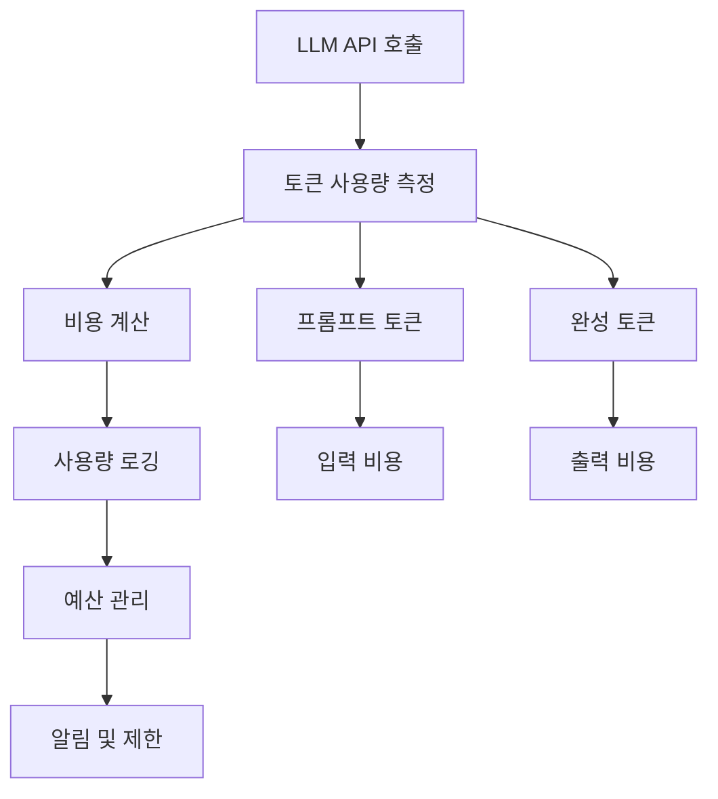

# 📖 Section 4.6: Serialization - 모델 저장과 비용 추적

## 🎯 학습 목표
- ✅ OpenAI API 사용량 추적과 비용 계산 마스터
- ✅ LLM 모델 설정의 직렬화(저장/로드) 활용
- ✅ 프로덕션 환경에서의 비용 모니터링 구현
- ✅ 모델 설정 버전 관리와 배포 전략 수립

## 🧠 핵심 개념

### API 사용량 추적의 중요성
**비용 추적**은 LLM 기반 애플리케이션에서 가장 중요한 운영 요소 중 하나입니다. 적절한 모니터링 없이는 예상치 못한 높은 비용이 발생할 수 있습니다.



### 모델 직렬화란?
**모델 직렬화**는 LLM 설정(온도, 최대 토큰 등)을 파일로 저장하고 불러오는 기능입니다. 환경별 설정 관리와 배포에 유용합니다.

| 기능 | 사용 사례 | 장점 |
|------|-----------|------|
| **비용 추적** | 운영 모니터링 | 예산 관리, 최적화 |
| **설정 저장** | 환경별 배포 | 일관성, 버전 관리 |
| **사용량 분석** | 성능 개선 | 효율성 향상 |

## 📋 주요 클래스/함수 레퍼런스

### get_openai_callback
```python
from langchain.callbacks import get_openai_callback

def get_openai_callback():
    """
    📋 기능: OpenAI API 사용량 추적 컨텍스트 매니저
    📤 출력: OpenAICallbackHandler 인스턴스
    💡 사용 시나리오: API 호출 비용과 토큰 사용량 모니터링
    
    반환되는 콜백 객체의 주요 속성:
    - total_tokens: 총 사용 토큰 수
    - prompt_tokens: 프롬프트 토큰 수
    - completion_tokens: 응답 토큰 수
    - total_cost: 총 비용 (USD)
    """
```

### 모델 저장/로드 메서드
```python
# LLM 모델 저장
model.save("model_config.json")

# 저장된 모델 불러오기
from langchain.llms.loading import load_llm
model = load_llm("model_config.json")
```

**📌 지원되는 저장 형식**:
- `JSON`: 구조화된 설정 저장
- `YAML`: 사람이 읽기 쉬운 형태
- `Pickle`: 파이썬 객체 직렬화 (보안 주의)

## 🔧 동작 과정 상세

### 1. 기본 사용량 추적
```python
# Step 1: 필요한 모듈 임포트
from langchain.chat_models import ChatOpenAI
from langchain.callbacks import get_openai_callback

# Step 2: 모델 초기화
chat = ChatOpenAI(temperature=0.1)

# Step 3: 사용량 추적 컨텍스트 내에서 실행
with get_openai_callback() as usage:  # 📌 용도: 사용량 추적 시작, 타입: OpenAICallbackHandler
    # LLM 호출들
    response1 = chat.predict("What is the recipe for soju?")
    response2 = chat.predict("What is the recipe for bread?")
    
    # 사용량 정보 출력
    print(f"총 토큰: {usage.total_tokens}")           # 📌 프롬프트 + 완성 토큰
    print(f"프롬프트 토큰: {usage.prompt_tokens}")     # 📌 입력 토큰 수
    print(f"완성 토큰: {usage.completion_tokens}")     # 📌 출력 토큰 수
    print(f"총 비용: ${usage.total_cost:.4f}")        # 📌 USD 기준 비용
```

### 2. 모델 설정 저장 및 로드
```python
# Step 1: LLM 모델 생성 및 설정
from langchain.llms import OpenAI

llm = OpenAI(
    model_name="gpt-3.5-turbo-16k",  # 📌 용도: 모델 지정, 타입: str
    temperature=0.7,                  # 📌 용도: 창의성 제어, 타입: float
    max_tokens=1000,                  # 📌 용도: 응답 길이 제한, 타입: int
    top_p=0.9,                       # 📌 용도: 응답 다양성 제어, 타입: float
    frequency_penalty=0.1,           # 📌 용도: 반복 방지, 타입: float
    presence_penalty=0.1             # 📌 용도: 새로운 토픽 장려, 타입: float
)

# Step 2: 모델 설정 저장
llm.save("production_model.json")  # 📌 기능: JSON 형태로 설정 저장

# Step 3: 저장된 모델 불러오기
from langchain.llms.loading import load_llm
loaded_model = load_llm("production_model.json")  # 📌 기능: 저장된 설정으로 모델 생성

# Step 4: 설정 비교 (검증)
print("=== 원본 vs 로드된 모델 설정 비교 ===")
print(f"원본 온도: {llm.temperature}")
print(f"로드 온도: {loaded_model.temperature}")
print(f"설정 일치: {llm.temperature == loaded_model.temperature}")
```

## 💻 실전 예제

### 1. 상세 비용 추적 시스템
```python
from langchain.chat_models import ChatOpenAI
from langchain.callbacks import get_openai_callback
from datetime import datetime
import json

class CostTracker:
    """OpenAI API 비용 추적 클래스"""
    
    def __init__(self, log_file: str = "api_usage.json"):
        """
        📋 기능: 비용 추적기 초기화
        📥 입력: 로그 파일 경로
        💡 사용 시나리오: 애플리케이션별 비용 추적
        """
        self.log_file = log_file  # 📌 용도: 사용량 로그 저장 파일
        self.session_costs = []   # 📌 용도: 현재 세션 비용 기록
        
    def track_usage(self, operation_name: str, llm_calls_func):
        """
        📋 기능: 특정 작업의 API 사용량 추적
        📥 입력: 작업명, LLM 호출 함수
        📤 출력: 사용량 통계 딕셔너리
        💡 사용 시나리오: 기능별 비용 분석
        """
        with get_openai_callback() as usage:
            start_time = datetime.now()
            
            # LLM 호출 실행
            result = llm_calls_func()
            
            end_time = datetime.now()
            duration = (end_time - start_time).total_seconds()
            
            # 사용량 기록
            usage_record = {
                "operation": operation_name,
                "timestamp": start_time.isoformat(),
                "duration_seconds": duration,
                "total_tokens": usage.total_tokens,
                "prompt_tokens": usage.prompt_tokens,
                "completion_tokens": usage.completion_tokens,
                "total_cost": usage.total_cost,
                "cost_per_token": usage.total_cost / usage.total_tokens if usage.total_tokens > 0 else 0
            }
            
            self.session_costs.append(usage_record)
            self._save_to_log(usage_record)
            
            return result, usage_record
    
    def _save_to_log(self, record: dict):
        """로그 파일에 기록 저장"""
        try:
            # 기존 로그 읽기
            try:
                with open(self.log_file, 'r') as f:
                    logs = json.load(f)
            except (FileNotFoundError, json.JSONDecodeError):
                logs = []
            
            # 새 기록 추가
            logs.append(record)
            
            # 파일에 저장
            with open(self.log_file, 'w') as f:
                json.dump(logs, f, indent=2)
                
        except Exception as e:
            print(f"⚠️  로그 저장 실패: {e}")
    
    def get_session_summary(self):
        """
        📋 기능: 현재 세션의 비용 요약
        📤 출력: 세션 통계 딕셔너리
        💡 사용 시나리오: 세션 종료 시 비용 확인
        """
        if not self.session_costs:
            return {"message": "추적된 사용량이 없습니다."}
        
        total_cost = sum(record["total_cost"] for record in self.session_costs)
        total_tokens = sum(record["total_tokens"] for record in self.session_costs)
        total_operations = len(self.session_costs)
        
        return {
            "total_operations": total_operations,
            "total_cost": round(total_cost, 4),
            "total_tokens": total_tokens,
            "average_cost_per_operation": round(total_cost / total_operations, 4),
            "average_tokens_per_operation": round(total_tokens / total_operations, 1)
        }
    
    def analyze_usage_patterns(self, days: int = 7):
        """
        📋 기능: 사용 패턴 분석
        📥 입력: 분석할 일수
        📤 출력: 사용 패턴 통계
        💡 사용 시나리오: 비용 최적화 전략 수립
        """
        try:
            with open(self.log_file, 'r') as f:
                all_logs = json.load(f)
        except (FileNotFoundError, json.JSONDecodeError):
            return {"message": "분석할 로그 데이터가 없습니다."}
        
        # 최근 N일 데이터 필터링
        cutoff_date = datetime.now().timestamp() - (days * 24 * 3600)
        recent_logs = [
            log for log in all_logs
            if datetime.fromisoformat(log["timestamp"]).timestamp() > cutoff_date
        ]
        
        if not recent_logs:
            return {"message": f"최근 {days}일 데이터가 없습니다."}
        
        # 패턴 분석
        operations = {}
        for log in recent_logs:
            op_name = log["operation"]
            if op_name not in operations:
                operations[op_name] = {
                    "count": 0,
                    "total_cost": 0,
                    "total_tokens": 0
                }
            
            operations[op_name]["count"] += 1
            operations[op_name]["total_cost"] += log["total_cost"]
            operations[op_name]["total_tokens"] += log["total_tokens"]
        
        # 결과 정리
        analysis = {
            "period_days": days,
            "total_operations": len(recent_logs),
            "total_cost": sum(log["total_cost"] for log in recent_logs),
            "operations_breakdown": operations
        }
        
        return analysis

# 사용 예시
def main():
    # 비용 추적기 초기화
    tracker = CostTracker("production_usage.json")
    
    # ChatOpenAI 모델 초기화
    chat = ChatOpenAI(temperature=0.1)
    
    # 다양한 작업 테스트
    def customer_support():
        """고객 지원 시뮬레이션"""
        questions = [
            "How can I reset my password?",
            "What are your business hours?",
            "How do I cancel my subscription?"
        ]
        responses = []
        for q in questions:
            response = chat.predict(f"Customer support question: {q}")
            responses.append(response)
        return responses
    
    def content_generation():
        """콘텐츠 생성 시뮬레이션"""
        prompts = [
            "Write a blog post introduction about AI trends",
            "Create a product description for a smart watch"
        ]
        content = []
        for prompt in prompts:
            response = chat.predict(prompt)
            content.append(response)
        return content
    
    # 작업별 비용 추적
    print("=== 고객 지원 작업 추적 ===")
    support_result, support_usage = tracker.track_usage("customer_support", customer_support)
    print(f"비용: ${support_usage['total_cost']:.4f}")
    print(f"토큰: {support_usage['total_tokens']}")
    
    print("\n=== 콘텐츠 생성 작업 추적 ===")
    content_result, content_usage = tracker.track_usage("content_generation", content_generation)
    print(f"비용: ${content_usage['total_cost']:.4f}")
    print(f"토큰: {content_usage['total_tokens']}")
    
    # 세션 요약
    print("\n=== 세션 요약 ===")
    summary = tracker.get_session_summary()
    for key, value in summary.items():
        print(f"{key}: {value}")
    
    # 사용 패턴 분석
    print("\n=== 사용 패턴 분석 ===")
    analysis = tracker.analyze_usage_patterns(days=1)  # 최근 1일
    print(f"총 비용: ${analysis.get('total_cost', 0):.4f}")
    print(f"총 작업: {analysis.get('total_operations', 0)}")

if __name__ == "__main__":
    main()
```

### 2. 환경별 모델 설정 관리
```python
from langchain.llms import OpenAI
from langchain.llms.loading import load_llm
import json
import os

class ModelConfigManager:
    """모델 설정 관리 클래스"""
    
    def __init__(self, config_dir: str = "./model_configs"):
        """
        📋 기능: 모델 설정 관리자 초기화
        📥 입력: 설정 파일 디렉토리
        💡 사용 시나리오: 환경별 모델 설정 관리
        """
        self.config_dir = config_dir
        os.makedirs(config_dir, exist_ok=True)
        
        # 환경별 기본 설정
        self.env_configs = {
            "development": {
                "model_name": "gpt-3.5-turbo",
                "temperature": 0.8,  # 📌 개발: 높은 창의성
                "max_tokens": 500,   # 📌 개발: 적은 토큰으로 비용 절약
                "top_p": 0.9
            },
            "staging": {
                "model_name": "gpt-3.5-turbo",
                "temperature": 0.5,  # 📌 스테이징: 중간 창의성
                "max_tokens": 1000,
                "top_p": 0.8
            },
            "production": {
                "model_name": "gpt-3.5-turbo-16k",
                "temperature": 0.1,  # 📌 프로덕션: 일관성 중시
                "max_tokens": 2000,
                "top_p": 0.7,
                "frequency_penalty": 0.1,
                "presence_penalty": 0.1
            }
        }
    
    def create_model_for_env(self, environment: str) -> OpenAI:
        """
        📋 기능: 환경별 모델 생성
        📥 입력: 환경명 (development, staging, production)
        📤 출력: 설정된 OpenAI 모델
        💡 사용 시나리오: 환경에 맞는 모델 인스턴스 생성
        """
        if environment not in self.env_configs:
            raise ValueError(f"지원하지 않는 환경: {environment}")
        
        config = self.env_configs[environment]
        model = OpenAI(**config)
        
        # 설정 파일로 저장
        config_file = os.path.join(self.config_dir, f"{environment}_model.json")
        model.save(config_file)
        
        print(f"✅ {environment} 환경용 모델 생성 및 저장: {config_file}")
        return model
    
    def load_model_for_env(self, environment: str) -> OpenAI:
        """
        📋 기능: 환경별 저장된 모델 로드
        📥 입력: 환경명
        📤 출력: 로드된 OpenAI 모델
        💡 사용 시나리오: 저장된 설정으로 모델 복원
        """
        config_file = os.path.join(self.config_dir, f"{environment}_model.json")
        
        if not os.path.exists(config_file):
            print(f"⚠️  설정 파일이 없습니다. 새로 생성합니다: {config_file}")
            return self.create_model_for_env(environment)
        
        model = load_llm(config_file)
        print(f"✅ {environment} 환경 모델 로드 완료")
        return model
    
    def compare_configs(self, env1: str, env2: str):
        """
        📋 기능: 환경별 설정 비교
        📥 입력: 비교할 두 환경명
        📤 출력: 설정 차이점 출력
        💡 사용 시나리오: 환경 간 설정 차이 확인
        """
        config1 = self.env_configs.get(env1, {})
        config2 = self.env_configs.get(env2, {})
        
        print(f"=== {env1} vs {env2} 설정 비교 ===")
        
        all_keys = set(config1.keys()) | set(config2.keys())
        for key in sorted(all_keys):
            val1 = config1.get(key, "없음")
            val2 = config2.get(key, "없음")
            
            if val1 != val2:
                print(f"🔄 {key}: {val1} → {val2}")
            else:
                print(f"✅ {key}: {val1}")
    
    def export_all_configs(self, export_file: str = "model_configs_export.json"):
        """
        📋 기능: 모든 환경 설정을 하나의 파일로 내보내기
        📥 입력: 내보낼 파일명
        💡 사용 시나리오: 설정 백업, 다른 프로젝트로 이전
        """
        export_path = os.path.join(self.config_dir, export_file)
        
        with open(export_path, 'w') as f:
            json.dump(self.env_configs, f, indent=2)
        
        print(f"📦 모든 환경 설정 내보내기 완료: {export_path}")

# 사용 예시
def main():
    # 설정 관리자 초기화
    config_manager = ModelConfigManager()
    
    # 환경별 모델 생성
    environments = ["development", "staging", "production"]
    
    for env in environments:
        print(f"\n=== {env.upper()} 환경 ===")
        model = config_manager.create_model_for_env(env)
        
        # 간단한 테스트
        with get_openai_callback() as usage:
            response = model("Hello, this is a test for " + env)
            print(f"응답 길이: {len(response)}자")
            print(f"사용 토큰: {usage.total_tokens}")
            print(f"비용: ${usage.total_cost:.6f}")
    
    # 환경별 설정 비교
    print("\n" + "="*50)
    config_manager.compare_configs("development", "production")
    
    # 설정 내보내기
    config_manager.export_all_configs()
    
    print("\n=== 저장된 모델 로드 테스트 ===")
    prod_model = config_manager.load_model_for_env("production")
    print(f"프로덕션 모델 온도: {prod_model.temperature}")

if __name__ == "__main__":
    main()
```

## 🔍 변수/함수 상세 설명

### 핵심 변수들
```python
# 비용 추적 변수
total_cost = 0.0           # 📌 용도: 총 비용 (USD), 타입: float
total_tokens = 0           # 📌 용도: 총 토큰 수, 타입: int
prompt_tokens = 0          # 📌 용도: 입력 토큰 수, 타입: int
completion_tokens = 0      # 📌 용도: 출력 토큰 수, 타입: int

# 모델 설정 변수
model_name = "gpt-3.5-turbo"    # 📌 용도: 사용할 모델명, 타입: str
temperature = 0.1               # 📌 용도: 응답 일관성 제어, 타입: float
max_tokens = 1000              # 📌 용도: 최대 출력 토큰, 타입: int
```

### 핵심 함수들
```python
def get_openai_callback():
    """
    📋 기능: OpenAI API 사용량 추적 컨텍스트 매니저 생성
    📤 출력: 사용량 추적 핸들러
    💡 사용 시나리오: API 호출 비용 모니터링
    """

def save(file_path: str) -> None:
    """
    📋 기능: 모델 설정을 파일로 저장
    📥 입력: 저장할 파일 경로 (JSON 형태)
    💡 사용 시나리오: 모델 설정 백업, 환경별 배포
    """

def load_llm(file_path: str):
    """
    📋 기능: 저장된 모델 설정 파일에서 LLM 인스턴스 생성
    📥 입력: 모델 설정 파일 경로
    📤 출력: 설정이 적용된 LLM 인스턴스
    💡 사용 시나리오: 저장된 설정으로 모델 복원
    """
```

## 🧪 실습 과제

### 🔨 기본 과제
1. **비용 계산기**: 다양한 모델의 토큰당 비용 비교
2. **사용량 모니터링**: 1시간 동안의 API 사용량 추적

### 🚀 심화 과제
3. **예산 관리 시스템**: 일/월 예산 초과 시 알림 기능
```python
# TODO: 예산 관리 클래스 구현
class BudgetManager:
    def __init__(self, daily_budget: float, monthly_budget: float):
        self.daily_budget = daily_budget
        self.monthly_budget = monthly_budget
        # 예산 추적 로직 구현
```

4. **A/B 테스트**: 다른 모델 설정의 비용 대비 성능 비교
5. **실시간 대시보드**: 웹 기반 비용 모니터링 시스템

### 💡 창의 과제
6. **비용 최적화 AI**: 사용 패턴 분석으로 최적 설정 추천
7. **팀별 비용 할당**: 부서별 API 사용량 추적 시스템

## ⚠️ 주의사항

### 비용 관리 모범 사례
- **실시간 모니터링**: 예상치 못한 비용 급증 방지
- **예산 설정**: 일일/월간 예산 한도 설정
- **알림 시스템**: 임계값 도달 시 자동 알림

### 보안 고려사항
```python
# API 키 보안
import os
openai_api_key = os.getenv("OPENAI_API_KEY")  # 환경변수 사용

# 설정 파일 보안
config_file = "model_config.json"
os.chmod(config_file, 0o600)  # 소유자만 읽기/쓰기 권한
```

### 성능 최적화
- **캐싱과 병행**: 중복 호출 방지로 비용 절감
- **토큰 효율성**: 프롬프트 최적화로 토큰 사용량 감소
- **모델 선택**: 용도에 맞는 적절한 모델 선택

## 🔗 관련 자료
- **이전 학습**: [4.5 Caching](./4.5_Caching.md)
- **관련 주제**: [4.1 FewShotPromptTemplate](./4.1_FewShotPromptTemplate.md)
- **다음 단계**: [Chapter 5: Memory Management](../Chapter_5_Memory/5.0_Introduction.md)
- **API 레퍼런스**: [OpenAI Pricing](https://openai.com/pricing)

---

💡 **핵심 정리**: API 사용량 추적과 모델 설정 관리는 LLM 애플리케이션 운영의 핵심입니다. 적절한 모니터링과 설정 관리로 **비용을 최적화하고 일관된 서비스 품질**을 유지할 수 있습니다. 특히 프로덕션 환경에서는 실시간 비용 추적이 필수입니다.