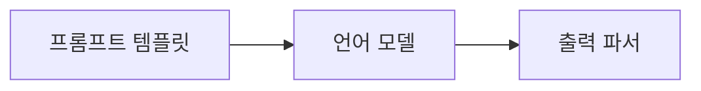

# Chapter 4: Prompt Engineering 완벽 가이드

## 목차
1. [LangChain 모듈 소개](#langchain-모듈-소개)
2. [Few-Shot Prompt Template](#few-shot-prompt-template)
3. [Few-Shot Chat Message Prompt Template](#few-shot-chat-message-prompt-template)
4. [Length-Based Example Selector](#length-based-example-selector)
5. [직렬화와 구성](#직렬화와-구성)
6. [캐싱](#캐싱)
7. [실습 코드 예제](#실습-코드-예제)

## LangChain 모듈 소개

### LangChain의 6가지 핵심 모듈

LangChain은 다음과 같은 모듈로 구성됩니다:

1. **Model I/O**: 프롬프트 템플릿, 언어 모델, 출력 파서
2. **Retrieval**: 외부 데이터 작업 (문서 로더, 변환기, 임베딩, 벡터 스토어)
3. **Chains**: 체인 구성 및 연결
4. **Agents**: AI를 자율적으로 만드는 도구 선택 시스템
5. **Memory**: 챗봇에 메모리 추가
6. **Callbacks**: 모델의 중간 단계 모니터링

### Model I/O 모듈의 핵심 구성요소



- **프롬프트 템플릿**: 입력 데이터
- **언어 모델**: LLM 또는 Chat 모델
- **출력 파서**: 구조화된 출력 생성

## Few-Shot Prompt Template

### 개념 이해

**Few-Shot Learning**은 모델에게 몇 가지 예제를 제공하여 원하는 응답 형식을 학습시키는 기법입니다.

**핵심 원리**:
- 모델에게 "어떻게" 답하라고 명령하는 것보다 "예제"를 보여주는 것이 더 효과적
- 모델은 텍스트 완성을 수행하므로 예제 패턴을 따라 응답 생성

### 기본 Prompt Template 복습

```python
from langchain.prompts import PromptTemplate

# 방법 1: from_template (권장)
template = PromptTemplate.from_template("What is the capital of {country}?")

# 방법 2: 직접 생성
template = PromptTemplate(
    template="What is the capital of {country}?",
    input_variables=["country"]
)
```

### Few-Shot Prompt Template 구현

#### 1. 예제 데이터 준비

```python
examples = [
    {
        "question": "What do you know about France?",
        "answer": """
        Here is what I know:
        Capital: Paris
        Language: French
        Food: Wine and Cheese
        Currency: Euro
        """,
    },
    {
        "question": "What do you know about Italy?",
        "answer": """
        I know this:
        Capital: Rome
        Language: Italian
        Food: Pizza and Pasta
        Currency: Euro
        """,
    },
    {
        "question": "What do you know about Greece?",
        "answer": """
        I know this:
        Capital: Athens
        Language: Greek
        Food: Souvlaki and Feta Cheese
        Currency: Euro
        """,
    },
]
```

#### 2. 예제 포맷터 생성

```python
from langchain.prompts.prompt import PromptTemplate

example_prompt = PromptTemplate.from_template(
    "Human: {question}\nAI: {answer}"
)
```

#### 3. Few-Shot Prompt Template 생성

```python
from langchain.prompts.few_shot import FewShotPromptTemplate

prompt = FewShotPromptTemplate(
    example_prompt=example_prompt,    # 예제 포맷팅 방법
    examples=examples,               # 예제 데이터
    suffix="Human: What do you know about {country}?",  # 실제 질문
    input_variables=["country"],     # 입력 변수
)
```

#### 4. 체인과 연결

```python
from langchain.chat_models import ChatOpenAI

chat = ChatOpenAI(temperature=0.1)
chain = prompt | chat

result = chain.invoke({"country": "Germany"})
```

### 실행 결과

```
Human: What do you know about France?
AI: Here is what I know:
Capital: Paris
Language: French
Food: Wine and Cheese
Currency: Euro
```

**독일에 대한 예제 실행 결과**:
```
AI: Here is what I know:
Capital: Berlin
Language: German
Food: Sausage and Beer
Currency: Euro
```

### Few-Shot의 장점

1. **일관된 형식**: 모든 응답이 동일한 구조를 따름
2. **높은 정확도**: 예제를 통한 학습으로 더 정확한 결과
3. **유연성**: 다양한 도메인에 적용 가능

## Few-Shot Chat Message Prompt Template

### Chat 모델을 위한 Few-Shot

Chat 모델은 `HumanMessage`와 `AIMessage`로 구성된 대화 형식을 사용합니다.

```python
from langchain.prompts.few_shot import FewShotChatMessagePromptTemplate
from langchain.prompts import ChatPromptTemplate

# 예제 데이터
examples = [
    {"input": "2+2", "output": "4"},
    {"input": "2+3", "output": "5"},
]

# 예제 프롬프트 (Chat 형식)
example_prompt = ChatPromptTemplate.from_messages([
    ("human", "{input}"),
    ("ai", "{output}"),
])

# Few-Shot Chat 프롬프트
few_shot_prompt = FewShotChatMessagePromptTemplate(
    example_prompt=example_prompt,
    examples=examples,
)

# 최종 프롬프트 구성
final_prompt = ChatPromptTemplate.from_messages([
    ("system", "You are a math assistant."),
    few_shot_prompt,
    ("human", "{input}"),
])
```

## Length-Based Example Selector

### 동적 예제 선택

프롬프트가 너무 길어지는 것을 방지하기 위해 입력 길이에 따라 예제 수를 조정합니다.

```python
from langchain.prompts.example_selector import LengthBasedExampleSelector

example_selector = LengthBasedExampleSelector(
    examples=examples,          # 전체 예제 리스트
    example_prompt=example_prompt,  # 예제 포맷터
    max_length=1000,           # 최대 프롬프트 길이
)

dynamic_prompt = FewShotPromptTemplate(
    example_selector=example_selector,  # examples 대신 selector 사용
    example_prompt=example_prompt,
    suffix="Human: What do you know about {country}?",
    input_variables=["country"],
)
```

### 작동 원리

- **짧은 입력**: 더 많은 예제 포함
- **긴 입력**: 예제 수 자동 감소
- **토큰 제한**: 모델의 컨텍스트 윈도우 초과 방지

## 직렬화와 구성

### 프롬프트 저장과 로드

```python
# 프롬프트를 파일로 저장
prompt.save("my_prompt.json")

# 파일에서 프롬프트 로드
from langchain.prompts import load_prompt
loaded_prompt = load_prompt("my_prompt.json")
```

### 프롬프트 구성 (Composition)

```python
from langchain.prompts.pipeline import PipelinePromptTemplate

# 여러 프롬프트 조합
full_template = """{introduction}

{example}

{start}"""

full_prompt = PromptTemplate.from_template(full_template)

introduction_template = """You are impersonating {person}."""
introduction_prompt = PromptTemplate.from_template(introduction_template)

example_template = """Here's an example of an interaction:
Q: {example_q}
A: {example_a}"""
example_prompt = PromptTemplate.from_template(example_template)

start_template = """Now, do this for real!
Q: {input}
A:"""
start_prompt = PromptTemplate.from_template(start_template)

# 파이프라인 구성
input_prompts = [
    ("introduction", introduction_prompt),
    ("example", example_prompt),
    ("start", start_prompt),
]

pipeline_prompt = PipelinePromptTemplate(
    final_prompt=full_prompt,
    pipeline_prompts=input_prompts,
)
```

## 캐싱

### LLM 응답 캐싱

동일한 요청에 대해 API 호출을 줄이고 비용을 절약합니다.

```python
from langchain.cache import InMemoryCache
from langchain.globals import set_llm_cache

# 메모리 캐싱 설정
set_llm_cache(InMemoryCache())

# 첫 번째 호출: API 요청 발생
result1 = chat.predict("Tell me a joke")

# 두 번째 호출: 캐시에서 결과 반환 (빠름)
result2 = chat.predict("Tell me a joke")
```

### 캐시 유형

1. **InMemoryCache**: 메모리에 임시 저장
2. **SQLiteCache**: 로컬 SQLite 데이터베이스 사용
3. **RedisCache**: Redis 서버 사용 (분산 환경)

```python
from langchain.cache import SQLiteCache
set_llm_cache(SQLiteCache(database_path=".langchain.db"))
```

## 실습 코드 예제

### 완전한 Few-Shot 예제

```python
from langchain.chat_models import ChatOpenAI
from langchain.prompts.few_shot import FewShotPromptTemplate
from langchain.prompts.prompt import PromptTemplate
from langchain.callbacks import StreamingStdOutCallbackHandler

# 모델 설정
chat = ChatOpenAI(
    temperature=0.1,
    streaming=True,
    callbacks=[StreamingStdOutCallbackHandler()],
)

# 예제 데이터: 국가 정보 형식
examples = [
    {
        "question": "What do you know about France?",
        "answer": """Here is what I know:
        Capital: Paris
        Language: French
        Food: Wine and Cheese
        Currency: Euro""",
    },
    {
        "question": "What do you know about Italy?",
        "answer": """I know this:
        Capital: Rome
        Language: Italian
        Food: Pizza and Pasta
        Currency: Euro""",
    },
    {
        "question": "What do you know about Greece?",
        "answer": """I know this:
        Capital: Athens
        Language: Greek
        Food: Souvlaki and Feta Cheese
        Currency: Euro""",
    },
]

# 예제 포맷터
example_prompt = PromptTemplate.from_template("Human: {question}\nAI:{answer}")

# Few-Shot 프롬프트 생성
prompt = FewShotPromptTemplate(
    example_prompt=example_prompt,
    examples=examples,
    suffix="Human: What do you know about {country}?",
    input_variables=["country"],
)

# 체인 구성 및 실행
chain = prompt | chat
result = chain.invoke({"country": "Japan"})
```

### 동적 예제 선택 예제

```python
from langchain.prompts.example_selector import LengthBasedExampleSelector

# 많은 예제 준비
large_examples = [
    {"question": f"What about country {i}?", "answer": f"Country {i} info"}
    for i in range(20)
]

# 길이 기반 셀렉터
example_selector = LengthBasedExampleSelector(
    examples=large_examples,
    example_prompt=example_prompt,
    max_length=1000,
)

# 동적 프롬프트
dynamic_prompt = FewShotPromptTemplate(
    example_selector=example_selector,
    example_prompt=example_prompt,
    suffix="Human: What do you know about {country}?",
    input_variables=["country"],
)

# 짧은 입력 vs 긴 입력 테스트
short_input = {"country": "USA"}
long_input = {"country": "A very long country name with lots of details..."}
```

## 핵심 포인트 정리

### 프롬프트 엔지니어링 원칙

1. **예제가 지시사항보다 강력하다**: Few-shot 학습의 핵심
2. **일관성 유지**: 모든 예제가 동일한 형식을 따라야 함
3. **적절한 예제 수**: 3-5개가 보통 최적
4. **도메인별 특화**: 각 사용 사례에 맞는 예제 선택

### 성능 최적화

1. **캐싱 활용**: 반복적인 요청 최적화
2. **동적 선택**: 프롬프트 길이 관리
3. **구성 가능한 설계**: 재사용 가능한 프롬프트 구조
4. **검증**: 입력 변수 유효성 검사

### 실무 적용 팁

1. **점진적 개선**: 기본 프롬프트에서 시작하여 예제 추가
2. **A/B 테스팅**: 다른 예제 세트의 성능 비교
3. **도메인 지식 활용**: 해당 분야의 전문 지식을 예제에 반영
4. **사용자 피드백**: 실제 사용에서 얻은 좋은 응답을 예제로 활용

이것으로 LangChain의 Prompt Engineering 완벽 가이드를 마칩니다. 다음 장에서는 Memory에 대해 학습하겠습니다.