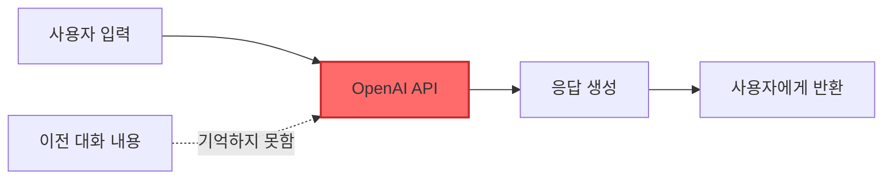
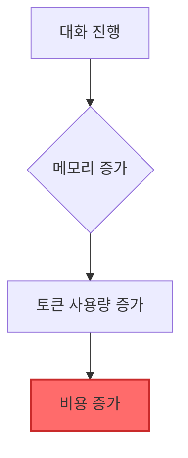
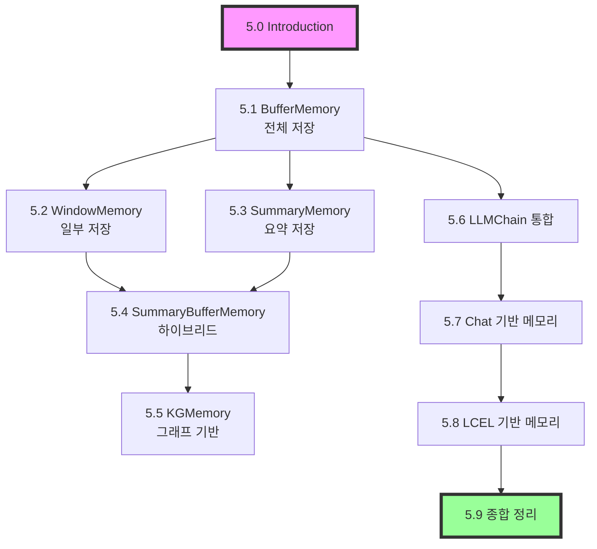
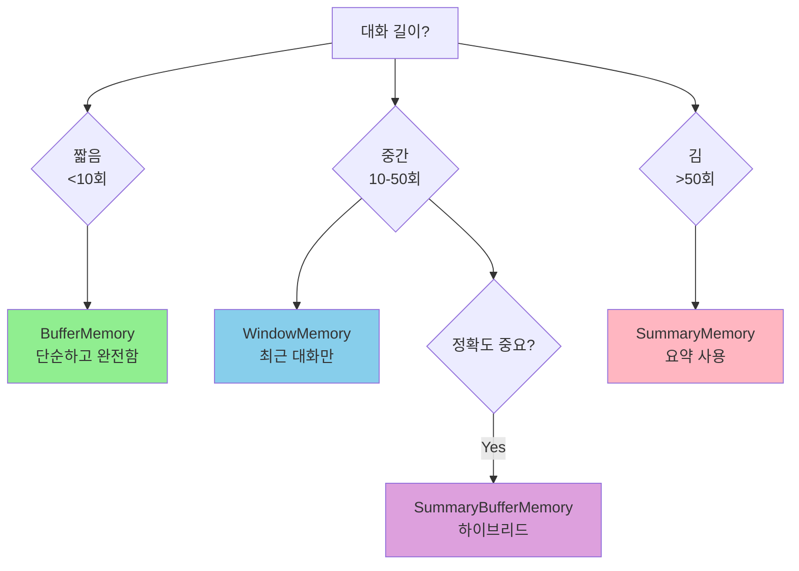

# 📖 Chapter 5: Memory - 대화형 AI의 핵심

## 🎯 이 장에서 배울 내용
- ✅ LangChain의 5가지 이상 메모리 클래스 이해
- ✅ 각 메모리 타입의 장단점과 사용 시나리오 파악
- ✅ 메모리를 체인에 통합하는 다양한 방법 학습
- ✅ 상황에 맞는 최적의 메모리 선택 능력 개발

## 🧠 왜 메모리가 필요한가?

### 메모리가 없는 챗봇의 한계
메모리가 없는 챗봇은 모든 질문을 **새로운 대화의 시작**으로 인식합니다. 다음과 같은 문제가 발생합니다:

```python
# 메모리 없는 대화 예시
User: "제 이름은 김철수입니다"
AI: "안녕하세요 김철수님!"

User: "제 이름이 뭐라고 했죠?"
AI: "죄송하지만, 당신의 이름을 모릅니다."  # ❌ 이전 대화 기억 못함
```

### OpenAI API의 Stateless 특성


**핵심 포인트**:
- OpenAI API는 **stateless** - 각 요청을 독립적으로 처리
- 이전 대화 내용을 기억하지 못함
- 매번 전체 컨텍스트를 함께 보내야 함

### ChatGPT vs 순수 API의 차이

| 특성 | ChatGPT | OpenAI API (기본) |
|------|---------|------------------|
| **메모리** | ✅ 대화 기록 유지 | ❌ 메모리 없음 |
| **컨텍스트** | 자동 관리 | 수동 관리 필요 |
| **후속 질문** | 가능 | 불가능 |
| **사용자 경험** | 자연스러운 대화 | 단발성 응답 |

## 📊 메모리 작동 원리

### 기본 메커니즘
```python
# 🧠 개념: 메모리를 사용한 대화 흐름
# 1단계: 사용자 입력
user_input = "안녕하세요, 저는 김철수입니다"

# 2단계: 이전 대화 기록 로드
previous_messages = memory.load()  # 📌 이전 대화 내용

# 3단계: 전체 컨텍스트 구성
full_context = previous_messages + user_input

# 4단계: LLM에 전송
response = llm(full_context)

# 5단계: 새로운 대화 저장
memory.save(user_input, response)  # 📌 현재 대화 저장
```

### 비용 고려사항


**💡 중요**: 대화가 길어질수록 더 많은 토큰을 사용하게 되어 비용이 증가합니다.

## 🗺️ Chapter 5 학습 로드맵

### 메모리 타입별 학습 경로



### 학습 우선순위
1. **필수**: 5.1, 5.2, 5.8 (기본 메모리와 LCEL 통합)
2. **권장**: 5.3, 5.4 (효율적인 메모리 관리)
3. **선택**: 5.5 (고급 기능)

## 💡 메모리 선택 가이드

### 빠른 의사결정 플로우


## 🔍 핵심 용어 정리

| 용어 | 설명 | 중요도 |
|------|------|--------|
| **Stateless** | 상태를 저장하지 않는 특성 | ⭐⭐⭐ |
| **Context** | 대화의 전체 맥락 | ⭐⭐⭐ |
| **Token** | LLM이 처리하는 텍스트 단위 | ⭐⭐⭐ |
| **Memory Buffer** | 대화 내용을 저장하는 공간 | ⭐⭐ |
| **Message History** | 이전 대화 기록 | ⭐⭐ |

## 🚀 시작하기 전에

### 필요한 설치
```bash
pip install langchain openai
```

### 환경 설정
```python
import os
os.environ["OPENAI_API_KEY"] = "your-api-key"
```

### 기본 임포트
```python
from langchain.memory import (
    ConversationBufferMemory,
    ConversationBufferWindowMemory,
    ConversationSummaryMemory,
    ConversationSummaryBufferMemory,
    ConversationKGMemory
)
from langchain.chat_models import ChatOpenAI
from langchain.prompts import ChatPromptTemplate, MessagesPlaceholder
```

## ⚠️ 주의사항

### 초보자가 자주 하는 실수
1. **메모리 초기화 위치**: 대화마다 새로 생성하면 메모리가 초기화됨
2. **토큰 한계 무시**: 무한정 메모리를 쌓으면 토큰 한계 초과
3. **메모리 타입 혼용**: 각 메모리는 독립적으로 사용해야 함

### 보안 고려사항
- 민감한 정보가 메모리에 저장될 수 있음
- 사용자별 메모리 분리 필수
- 메모리 영구 저장 시 암호화 고려

## 🔗 다음 단계
- **다음 학습**: [5.1 ConversationBufferMemory](./5.1_ConversationBufferMemory.md)
- **관련 주제**: [Chapter 4: Prompt Engineering](../Chapter_4_Prompt_Engineering/4.0_Introduction.md)
- **실습 프로젝트**: Document GPT 구축 (Chapter 6)

---

💡 **핵심 요약**: 메모리는 대화형 AI를 만드는 데 필수적인 요소입니다. LangChain은 다양한 메모리 옵션을 제공하여 각 사용 사례에 맞는 최적의 선택을 할 수 있게 합니다. 이번 장에서는 각 메모리 타입의 특성을 이해하고, 실제로 구현하는 방법을 배웁니다.