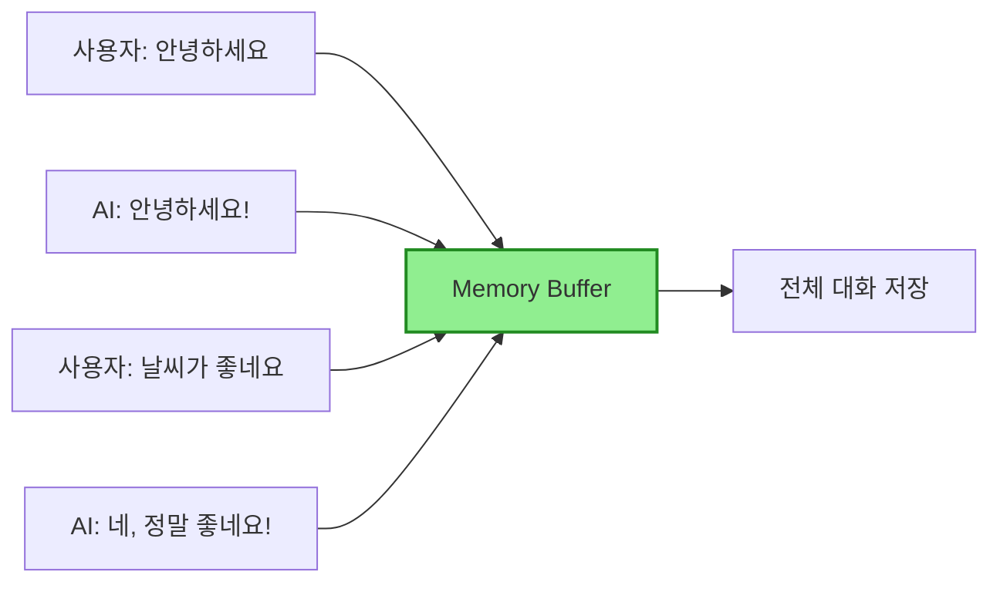

# 📖 Section 5.1: ConversationBufferMemory - 전체 대화 저장

## 🎯 학습 목표
- ✅ ConversationBufferMemory의 작동 원리 이해
- ✅ 메모리 API (save_context, load_memory_variables) 활용
- ✅ return_messages 옵션의 차이점 파악
- ✅ 장단점을 고려한 적절한 사용 시나리오 판단

## 🧠 핵심 개념

### ConversationBufferMemory란?
**ConversationBufferMemory**는 가장 단순하고 직관적인 메모리 클래스입니다. 전체 대화 내용을 **그대로** 저장합니다.



### 특징과 작동 방식

| 특징 | 설명 | 영향 |
|------|------|------|
| **완전성** | 모든 대화 내용 보존 | 컨텍스트 손실 없음 |
| **단순성** | 복잡한 처리 없이 저장 | 구현 용이 |
| **선형 증가** | 대화 길이에 비례하여 증가 | 비용 증가 |
| **투명성** | 저장된 내용 그대로 확인 가능 | 디버깅 용이 |

## 📋 주요 클래스/함수 레퍼런스

### ConversationBufferMemory 클래스
```python
from langchain.memory import ConversationBufferMemory

class ConversationBufferMemory:
    def __init__(
        self,
        return_messages: bool = False,  # 📌 용도: 메시지 객체 반환 여부
        memory_key: str = "history",    # 📌 용도: 메모리 키 이름
        input_key: str = "input",       # 📌 용도: 입력 키 이름
        output_key: str = "output"      # 📌 용도: 출력 키 이름
    ):
        """
        📋 기능: 전체 대화를 저장하는 메모리 버퍼 생성
        📥 입력: 메모리 설정 옵션들
        📤 출력: ConversationBufferMemory 인스턴스
        💡 사용 시나리오: 짧은 대화, 전체 컨텍스트가 중요한 경우
        """
```

### 핵심 메서드

#### save_context()
```python
def save_context(self, inputs: Dict[str, Any], outputs: Dict[str, str]) -> None:
    """
    📋 기능: 대화 내용을 메모리에 저장
    📥 입력: 
        - inputs: 사용자 입력 딕셔너리 {"input": "사용자 메시지"}
        - outputs: AI 출력 딕셔너리 {"output": "AI 응답"}
    📤 출력: None (메모리에 저장)
    💡 사용 시나리오: 각 대화 턴 후 호출
    """
```

#### load_memory_variables()
```python
def load_memory_variables(self, inputs: Dict[str, Any]) -> Dict[str, Any]:
    """
    📋 기능: 저장된 메모리 내용 불러오기
    📥 입력: 빈 딕셔너리 {} (API 일관성을 위해 필요)
    📤 출력: {"history": 대화_내용} 형태의 딕셔너리
    💡 사용 시나리오: 프롬프트에 대화 기록 추가 시
    """
```

## 🔧 동작 과정 상세

### 1. 기본 사용법 (텍스트 형태)
```python
# === Step 1: 메모리 초기화 ===
# 🧠 개념: return_messages=False (기본값)일 때 문자열 형태로 저장
from langchain.memory import ConversationBufferMemory

memory = ConversationBufferMemory()  # 📌 텍스트 형태 메모리

# === Step 2: 대화 저장 ===
# 🔧 구현: save_context로 한 쌍의 대화 저장
memory.save_context(
    {"input": "안녕하세요!"},  # 📌 사용자 입력
    {"output": "안녕하세요! 무엇을 도와드릴까요?"}  # 📌 AI 응답
)

# === Step 3: 메모리 확인 ===
# 📊 결과: 저장된 대화 내용 확인
history = memory.load_memory_variables({})
print(history)
# 출력: {'history': 'Human: 안녕하세요!\nAI: 안녕하세요! 무엇을 도와드릴까요?'}

# === Step 4: 추가 대화 저장 ===
memory.save_context(
    {"input": "날씨가 어때요?"},
    {"output": "오늘은 맑고 화창한 날씨입니다!"}
)

# === Step 5: 전체 대화 확인 ===
history = memory.load_memory_variables({})
print(history["history"])
```

### 2. 채팅 모델용 사용법 (메시지 객체)
```python
# === Step 1: 채팅용 메모리 초기화 ===
# 🧠 개념: return_messages=True로 메시지 객체 반환
memory_chat = ConversationBufferMemory(
    return_messages=True  # 📌 중요: ChatModel과 함께 사용 시 필수
)

# === Step 2: 대화 저장 (동일한 방식) ===
memory_chat.save_context(
    {"input": "Python에 대해 설명해주세요"},
    {"output": "Python은 간결하고 읽기 쉬운 프로그래밍 언어입니다."}
)

# === Step 3: 메시지 객체로 확인 ===
# 📊 결과: HumanMessage와 AIMessage 객체 리스트
messages = memory_chat.load_memory_variables({})
print(messages)
# 출력: {'history': [HumanMessage(content='Python에 대해 설명해주세요'), 
#                  AIMessage(content='Python은 간결하고 읽기 쉬운 프로그래밍 언어입니다.')]}

# 💡 실무 팁: ChatOpenAI와 함께 사용 시
from langchain.chat_models import ChatOpenAI
from langchain.prompts import ChatPromptTemplate, MessagesPlaceholder

prompt = ChatPromptTemplate.from_messages([
    ("system", "You are a helpful assistant"),
    MessagesPlaceholder(variable_name="history"),  # 📌 메모리 내용이 여기 삽입
    ("human", "{input}")
])
```

## 💻 실전 예제

### 완전한 대화형 챗봇 구현
```python
from langchain.memory import ConversationBufferMemory
from langchain.chat_models import ChatOpenAI
from langchain.prompts import ChatPromptTemplate, MessagesPlaceholder
from langchain.schema.runnable import RunnablePassthrough

# === 1단계: 컴포넌트 초기화 ===
# 🧠 개념: 메모리, 모델, 프롬프트를 각각 설정
memory = ConversationBufferMemory(return_messages=True)
model = ChatOpenAI(temperature=0.7)

# 프롬프트 템플릿 (메모리 플레이스홀더 포함)
prompt = ChatPromptTemplate.from_messages([
    ("system", "당신은 친절한 AI 어시스턴트입니다. 이전 대화 내용을 기억하고 있습니다."),
    MessagesPlaceholder(variable_name="history"),  # 📌 메모리가 여기 삽입됨
    ("human", "{input}")
])

# === 2단계: 메모리 로드 함수 ===
def load_memory(_):
    """메모리에서 대화 기록 로드"""
    return memory.load_memory_variables({})

# === 3단계: 체인 구성 (LCEL) ===
# 🔧 구현: 메모리를 자동으로 로드하는 체인
chain = (
    RunnablePassthrough.assign(history=load_memory)  # 📌 메모리 자동 로드
    | prompt 
    | model
)

# === 4단계: 대화 함수 구현 ===
def chat(user_input: str) -> str:
    """
    📋 기능: 사용자 입력을 받아 응답 생성 및 메모리 저장
    📥 입력: 사용자 메시지
    📤 출력: AI 응답
    💡 사용 시나리오: 대화형 인터페이스 구현
    """
    # 체인 실행
    response = chain.invoke({"input": user_input})
    
    # 메모리에 저장
    memory.save_context(
        {"input": user_input},
        {"output": response.content}
    )
    
    return response.content

# === 5단계: 실제 대화 테스트 ===
print("🤖 AI: " + chat("안녕하세요! 제 이름은 김철수입니다."))
# 출력: 안녕하세요 김철수님! 만나서 반갑습니다.

print("🤖 AI: " + chat("제 이름이 뭐라고 했죠?"))
# 출력: 김철수님이라고 말씀하셨습니다.

print("🤖 AI: " + chat("제가 방금 뭘 물어봤죠?"))
# 출력: 방금 본인의 이름이 뭐라고 했는지 물어보셨습니다.

# === 6단계: 메모리 상태 확인 ===
print("\n📊 전체 대화 기록:")
for msg in memory.load_memory_variables({})["history"]:
    role = "Human" if msg.__class__.__name__ == "HumanMessage" else "AI"
    print(f"{role}: {msg.content}")
```

## 🔍 변수/함수 상세 설명

### 핵심 변수들
```python
# 메모리 설정 변수
return_messages = True    # 📌 용도: 메시지 객체 반환 여부, 타입: bool
memory_key = "history"    # 📌 용도: 메모리 접근 키, 타입: str
max_token_limit = None    # 📌 용도: 토큰 제한 (BufferMemory는 제한 없음), 타입: int

# 대화 저장 형식
human_prefix = "Human"    # 📌 용도: 사람 메시지 접두사, 타입: str
ai_prefix = "AI"         # 📌 용도: AI 메시지 접두사, 타입: str
```

### 유용한 속성과 메서드
```python
# 메모리 초기화
memory.clear()           # 📌 기능: 전체 대화 기록 삭제

# 메모리 상태 확인
len(memory.buffer)       # 📌 기능: 저장된 메시지 수 확인
memory.moving_summary    # 📌 기능: 대화 요약 (BufferMemory는 None)
```

## 🧪 실습 과제

### 🔨 기본 과제
1. **대화 저장 시스템**: 5턴의 대화를 저장하고 출력하기
```python
# TODO: ConversationBufferMemory를 사용하여 구현
# 힌트: save_context를 5번 호출
```

2. **메시지 타입 변환**: return_messages를 True/False로 변경하며 차이 확인
```python
# TODO: 두 가지 모드로 메모리 생성 후 비교
```

### 🚀 심화 과제
3. **토큰 카운터**: 대화가 진행될수록 토큰 사용량 추적
```python
# TODO: tiktoken 라이브러리 활용
import tiktoken

def count_tokens(text: str) -> int:
    """텍스트의 토큰 수 계산"""
    encoder = tiktoken.encoding_for_model("gpt-3.5-turbo")
    return len(encoder.encode(text))
```

4. **메모리 영속성**: 대화 내용을 파일로 저장/로드
```python
# TODO: JSON 형태로 저장하는 기능 구현
import json

def save_memory_to_file(memory, filename):
    """메모리를 파일로 저장"""
    pass

def load_memory_from_file(filename):
    """파일에서 메모리 로드"""
    pass
```

### 💡 창의 과제
5. **비용 계산기**: 대화 진행에 따른 API 비용 실시간 계산
6. **메모리 시각화**: 대화 흐름을 그래프로 표현

## ⚠️ 주의사항

### 비용 관련 주의점
```python
# ❌ 나쁜 예: 무한정 대화 저장
memory = ConversationBufferMemory()
for i in range(1000):  # 1000턴의 대화
    memory.save_context({"input": f"질문 {i}"}, {"output": f"답변 {i}"})
# 결과: 토큰 한계 초과, 높은 비용 발생

# ✅ 좋은 예: 대화 길이 모니터링
MAX_CONVERSATION_LENGTH = 20
if len(memory.buffer) > MAX_CONVERSATION_LENGTH:
    print("⚠️ 대화가 너무 길어졌습니다. WindowMemory 사용을 고려하세요.")
```

### 메모리 관리 모범 사례
1. **세션별 분리**: 각 사용자/세션마다 별도의 메모리 인스턴스
2. **정기적 정리**: 오래된 대화는 삭제 또는 아카이빙
3. **크기 모니터링**: 메모리 크기를 주기적으로 확인

### 성능 고려사항
- **응답 시간**: 메모리가 클수록 처리 시간 증가
- **메모리 사용량**: 서버 메모리 한계 고려
- **네트워크 대역폭**: API 호출 시 전송 데이터량 증가

## 🔗 관련 자료
- **이전 학습**: [5.0 Introduction](./5.0_Introduction.md)
- **다음 학습**: [5.2 ConversationBufferWindowMemory](./5.2_ConversationBufferWindowMemory.md)
- **관련 개념**: [MessagesPlaceholder 사용법](../Chapter_4_Prompt_Engineering/4.2_FewShotChatMessagePromptTemplate.md)
- **실전 응용**: [Chapter 6: Document GPT](../Chapter_6_DocumentGPT/6.0_Introduction.md)

---

💡 **핵심 정리**: ConversationBufferMemory는 가장 단순하지만 완전한 메모리입니다. **짧은 대화**나 **전체 컨텍스트가 중요한 경우**에 적합하지만, 긴 대화에서는 비용과 성능 문제를 고려해야 합니다. 실무에서는 대화 길이를 모니터링하고 필요시 다른 메모리 타입으로 전환하는 것이 좋습니다.