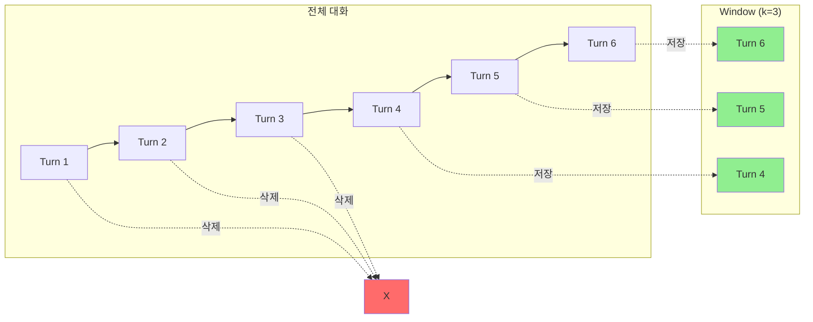

# 📖 Section 5.2: ConversationBufferWindowMemory - 슬라이딩 윈도우 메모리

## 🎯 학습 목표
- ✅ ConversationBufferWindowMemory의 슬라이딩 윈도우 개념 이해
- ✅ k 파라미터를 통한 메모리 크기 제어 방법 학습
- ✅ BufferMemory 대비 장단점 분석
- ✅ 실무에서의 최적 윈도우 크기 설정 전략 수립

## 🧠 핵심 개념

### ConversationBufferWindowMemory란?
**ConversationBufferWindowMemory**는 최근 k개의 대화만 저장하는 **슬라이딩 윈도우** 방식의 메모리입니다.



### BufferMemory vs WindowMemory 비교

| 특성 | BufferMemory | WindowMemory |
|------|--------------|--------------|
| **저장 방식** | 전체 대화 | 최근 k개 대화 |
| **메모리 사용** | 계속 증가 | 일정하게 유지 |
| **컨텍스트** | 완전한 기록 | 최근 컨텍스트만 |
| **비용** | 높음 (증가) | 낮음 (일정) |
| **사용 시나리오** | 짧은 대화 | 긴 대화 |

## 📋 주요 클래스/함수 레퍼런스

### ConversationBufferWindowMemory 클래스
```python
from langchain.memory import ConversationBufferWindowMemory

class ConversationBufferWindowMemory:
    def __init__(
        self,
        k: int = 5,                     # 📌 용도: 저장할 대화 수, 타입: int
        return_messages: bool = False,   # 📌 용도: 메시지 객체 반환 여부
        memory_key: str = "history",     # 📌 용도: 메모리 키 이름
        input_key: str = "input",        # 📌 용도: 입력 키 이름
        output_key: str = "output"       # 📌 용도: 출력 키 이름
    ):
        """
        📋 기능: 최근 k개의 대화만 저장하는 윈도우 메모리 생성
        📥 입력: 윈도우 크기와 메모리 설정
        📤 출력: ConversationBufferWindowMemory 인스턴스
        💡 사용 시나리오: 긴 대화, 메모리 제한이 있는 환경
        🔗 관련 개념: 슬라이딩 윈도우, FIFO (First In First Out)
        """
```

### k 파라미터의 의미
```python
# 🧠 개념: k는 "윈도우 크기"를 의미
# k=1: 가장 최근 1개 대화쌍만 저장
# k=5: 최근 5개 대화쌍 저장 (기본값)
# k=10: 최근 10개 대화쌍 저장

# 💡 실무 팁: k 값 선택 가이드
# - 일반 대화: k=5~10
# - 기술 지원: k=10~20 (이전 문제 참조 필요)
# - 간단한 Q&A: k=3~5
# - 비용 민감: k=3 이하
```

## 🔧 동작 과정 상세

### 1. 기본 윈도우 메모리 동작
```python
# === Step 1: 윈도우 메모리 초기화 ===
# 🧠 개념: k=3으로 최근 3개 대화만 유지
from langchain.memory import ConversationBufferWindowMemory

memory = ConversationBufferWindowMemory(
    k=3,  # 📌 핵심: 윈도우 크기 설정
    return_messages=True
)

# === Step 2: 대화 추가 (윈도우 내) ===
# 🔧 구현: 처음 3개 대화는 모두 저장
conversations = [
    ("안녕하세요!", "안녕하세요! 무엇을 도와드릴까요?"),
    ("날씨가 어때요?", "오늘은 맑고 화창한 날씨입니다."),
    ("감사합니다", "천만에요! 더 필요한 게 있으신가요?")
]

for human, ai in conversations:
    memory.save_context({"input": human}, {"output": ai})

# 현재 메모리 상태 확인
print("=== 3개 대화 후 메모리 ===")
for msg in memory.load_memory_variables({})["history"]:
    print(f"{msg.__class__.__name__}: {msg.content}")

# === Step 3: 윈도우 초과 시 동작 ===
# 📊 결과: 가장 오래된 대화가 삭제됨
print("\n=== 4번째 대화 추가 ===")
memory.save_context(
    {"input": "내일 날씨는 어떨까요?"},
    {"output": "내일도 맑은 날씨가 계속될 예정입니다."}
)

# 첫 번째 대화("안녕하세요!")가 삭제됨
print("현재 메모리 (첫 대화 삭제됨):")
for msg in memory.load_memory_variables({})["history"]:
    print(f"- {msg.content[:30]}...")
```

### 2. 윈도우 크기별 비교 실험
```python
# === 실험: 다양한 윈도우 크기 비교 ===
def test_window_sizes(conversations_list, window_sizes=[1, 3, 5, 10]):
    """
    📋 기능: 다양한 윈도우 크기의 메모리 동작 비교
    📥 입력: 대화 리스트, 테스트할 윈도우 크기들
    📤 출력: 각 크기별 메모리 상태
    💡 사용 시나리오: 최적 윈도우 크기 결정
    """
    results = {}
    
    for k in window_sizes:
        memory = ConversationBufferWindowMemory(k=k, return_messages=True)
        
        # 모든 대화 추가
        for human, ai in conversations_list:
            memory.save_context({"input": human}, {"output": ai})
        
        # 저장된 대화 수 계산
        saved_messages = memory.load_memory_variables({})["history"]
        results[k] = {
            "saved_count": len(saved_messages) // 2,  # Human + AI = 2 messages
            "memory_size": sum(len(msg.content) for msg in saved_messages)
        }
    
    return results

# 테스트 대화 생성
test_conversations = [
    (f"질문 {i}", f"답변 {i}") for i in range(1, 11)
]

# 결과 출력
results = test_window_sizes(test_conversations)
print("📊 윈도우 크기별 메모리 상태:")
for k, info in results.items():
    print(f"k={k}: {info['saved_count']}개 대화, {info['memory_size']}자")
```

## 💻 실전 예제

### 고객 지원 챗봇 with 윈도우 메모리
```python
from langchain.memory import ConversationBufferWindowMemory
from langchain.chat_models import ChatOpenAI
from langchain.prompts import ChatPromptTemplate, MessagesPlaceholder
from langchain.schema.runnable import RunnablePassthrough
import tiktoken

class CustomerSupportBot:
    """
    🎯 목적: 효율적인 메모리 관리를 가진 고객 지원 챗봇
    💡 특징: 윈도우 메모리로 비용 절감 + 적절한 컨텍스트 유지
    """
    
    def __init__(self, window_size: int = 5):
        # === 컴포넌트 초기화 ===
        self.memory = ConversationBufferWindowMemory(
            k=window_size,  # 📌 최근 5개 대화만 유지
            return_messages=True
        )
        
        self.model = ChatOpenAI(
            temperature=0.3,  # 📌 일관된 응답을 위해 낮은 온도
            model="gpt-3.5-turbo"
        )
        
        self.prompt = ChatPromptTemplate.from_messages([
            ("system", """당신은 친절한 고객 지원 상담원입니다.
            고객의 문제를 해결하는 데 집중하며, 이전 대화 내용을 참고하여 답변합니다.
            단, 오래된 대화 내용은 기억하지 못할 수 있습니다."""),
            MessagesPlaceholder(variable_name="history"),
            ("human", "{input}")
        ])
        
        # 체인 구성
        self.chain = (
            RunnablePassthrough.assign(history=self._load_memory)
            | self.prompt
            | self.model
        )
        
        # 통계 추적
        self.stats = {
            "total_conversations": 0,
            "total_tokens": 0,
            "estimated_cost": 0.0
        }
    
    def _load_memory(self, _):
        """메모리 로드 헬퍼 함수"""
        return self.memory.load_memory_variables({})
    
    def _count_tokens(self, text: str) -> int:
        """토큰 수 계산"""
        encoding = tiktoken.encoding_for_model("gpt-3.5-turbo")
        return len(encoding.encode(text))
    
    def chat(self, user_input: str) -> str:
        """
        📋 기능: 사용자 입력 처리 및 응답 생성
        📥 입력: 사용자 메시지
        📤 출력: AI 응답
        💡 사용 시나리오: 고객 문의 처리
        """
        # 응답 생성
        response = self.chain.invoke({"input": user_input})
        
        # 메모리에 저장
        self.memory.save_context(
            {"input": user_input},
            {"output": response.content}
        )
        
        # 통계 업데이트
        self.stats["total_conversations"] += 1
        tokens_used = self._count_tokens(user_input + response.content)
        self.stats["total_tokens"] += tokens_used
        self.stats["estimated_cost"] += tokens_used * 0.000002  # 대략적인 비용
        
        return response.content
    
    def get_memory_status(self) -> dict:
        """
        📋 기능: 현재 메모리 상태 조회
        📤 출력: 메모리 사용 현황
        💡 사용 시나리오: 메모리 모니터링
        """
        messages = self.memory.load_memory_variables({})["history"]
        return {
            "conversations_in_memory": len(messages) // 2,
            "window_size": self.memory.k,
            "memory_full": len(messages) // 2 >= self.memory.k,
            "oldest_message": messages[0].content if messages else None,
            "newest_message": messages[-1].content if messages else None
        }
    
    def get_stats(self) -> dict:
        """대화 통계 반환"""
        return self.stats

# === 실제 사용 예시 ===
# 🚀 실행: 고객 지원 시나리오
bot = CustomerSupportBot(window_size=3)

# 고객 지원 대화 시뮬레이션
support_conversations = [
    "안녕하세요, 주문한 상품이 아직 안 왔어요.",
    "주문번호는 12345입니다.",
    "언제쯤 받을 수 있을까요?",
    "빠른 배송 가능한가요?",  # 여기서 첫 대화가 삭제됨
    "배송비는 얼마인가요?",   # 두 번째 대화 삭제
]

print("🤖 고객 지원 봇 시작\n")
for i, message in enumerate(support_conversations, 1):
    print(f"👤 고객: {message}")
    response = bot.chat(message)
    print(f"🤖 봇: {response}\n")
    
    # 메모리 상태 확인
    if i % 3 == 0:
        status = bot.get_memory_status()
        print(f"📊 메모리 상태: {status['conversations_in_memory']}/{status['window_size']} 대화")
        print(f"   메모리 가득참: {status['memory_full']}\n")

# 최종 통계
print("\n📈 세션 통계:")
stats = bot.get_stats()
for key, value in stats.items():
    print(f"   {key}: {value}")
```

### 적응형 윈도우 크기 관리
```python
class AdaptiveWindowMemory:
    """
    🎯 목적: 대화 패턴에 따라 윈도우 크기를 자동 조정
    💡 특징: 복잡한 대화는 큰 윈도우, 단순한 대화는 작은 윈도우
    """
    
    def __init__(self, min_k: int = 3, max_k: int = 10):
        self.min_k = min_k
        self.max_k = max_k
        self.current_k = min_k
        self.memory = ConversationBufferWindowMemory(k=self.current_k)
        self.conversation_complexity = []
    
    def analyze_complexity(self, text: str) -> float:
        """
        📋 기능: 대화 복잡도 분석
        📥 입력: 텍스트
        📤 출력: 복잡도 점수 (0-1)
        💡 사용 시나리오: 윈도우 크기 조정 결정
        """
        # 간단한 복잡도 계산 (실제로는 더 정교한 방법 사용)
        complexity_factors = {
            "question_marks": text.count("?") * 0.2,
            "length": min(len(text) / 200, 0.3),
            "technical_terms": sum(1 for word in ["API", "에러", "설정", "문제"] if word in text) * 0.1
        }
        return min(sum(complexity_factors.values()), 1.0)
    
    def adjust_window_size(self):
        """윈도우 크기 자동 조정"""
        if len(self.conversation_complexity) >= 3:
            avg_complexity = sum(self.conversation_complexity[-3:]) / 3
            
            if avg_complexity > 0.7 and self.current_k < self.max_k:
                self.current_k += 1
                print(f"📈 윈도우 크기 증가: {self.current_k}")
            elif avg_complexity < 0.3 and self.current_k > self.min_k:
                self.current_k -= 1
                print(f"📉 윈도우 크기 감소: {self.current_k}")
            
            # 새로운 크기로 메모리 재생성
            old_messages = self.memory.load_memory_variables({})["history"]
            self.memory = ConversationBufferWindowMemory(k=self.current_k)
            
            # 기존 메시지 복원 (새 크기에 맞게)
            for i in range(0, len(old_messages), 2):
                if i+1 < len(old_messages):
                    self.memory.save_context(
                        {"input": old_messages[i].content},
                        {"output": old_messages[i+1].content}
                    )
```

## 🔍 변수/함수 상세 설명

### 핵심 파라미터
```python
# 윈도우 크기 관련
k = 5                    # 📌 용도: 저장할 대화 수, 타입: int, 기본값: 5
window_size = k          # 📌 용도: k의 별칭, 타입: int

# 메모리 동작 관련
return_messages = True   # 📌 용도: 메시지 객체 반환, 타입: bool
memory_key = "history"   # 📌 용도: 메모리 접근 키, 타입: str

# 내부 버퍼
buffer = []             # 📌 용도: 실제 메시지 저장소, 타입: List[BaseMessage]
```

### 유용한 메서드
```python
def save_context(inputs: Dict, outputs: Dict) -> None:
    """대화 저장 (윈도우 크기 초과 시 자동 삭제)"""
    
def load_memory_variables(inputs: Dict) -> Dict:
    """현재 윈도우 내 메모리 반환"""
    
def clear() -> None:
    """전체 메모리 초기화"""
    
@property
def buffer_as_messages(self) -> List[BaseMessage]:
    """버퍼를 메시지 리스트로 반환"""
```

## 🧪 실습 과제

### 🔨 기본 과제
1. **윈도우 크기 실험**: k=1, 3, 5, 10으로 같은 대화 테스트
```python
# TODO: 각 크기별로 어떤 대화가 유지되는지 확인
def test_different_k_values():
    k_values = [1, 3, 5, 10]
    # 구현하기
```

2. **메모리 효율성 측정**: BufferMemory vs WindowMemory 비교
```python
# TODO: 100개 대화에서 메모리 사용량 비교
def compare_memory_usage():
    # BufferMemory와 WindowMemory 비교
    pass
```

### 🚀 심화 과제
3. **스마트 윈도우**: 중요도에 따라 선택적으로 저장
```python
# TODO: 중요한 대화는 더 오래 유지하는 메모리
class SmartWindowMemory(ConversationBufferWindowMemory):
    def __init__(self, k: int = 5):
        super().__init__(k=k)
        self.importance_scores = []
    
    def save_context_with_importance(self, inputs, outputs, importance: float):
        """중요도를 고려한 저장"""
        pass
```

4. **하이브리드 메모리**: 최근 대화 + 중요 대화 조합
```python
# TODO: WindowMemory + 중요 대화 영구 저장
class HybridMemory:
    def __init__(self, window_size: int = 5):
        self.window_memory = ConversationBufferWindowMemory(k=window_size)
        self.important_memory = ConversationBufferMemory()
```

### 💡 창의 과제
5. **컨텍스트 압축**: 삭제 전 이전 대화 요약
6. **패턴 기반 윈도우**: 대화 패턴에 따라 동적 크기 조정

## ⚠️ 주의사항

### 윈도우 크기 선택 가이드
```python
# 🎯 사용 사례별 권장 k 값
recommendations = {
    "간단한_FAQ": 3,          # 단순 질답
    "일반_대화": 5,           # 기본값
    "기술_지원": 10,          # 이전 문제 참조 필요
    "교육_튜터": 20,          # 학습 진도 추적
    "치료_상담": 50,          # 장기 대화 패턴
}

# ⚠️ 너무 작은 k의 문제
if k < 3:
    print("경고: 대화 연속성 부족 가능성")
    
# ⚠️ 너무 큰 k의 문제  
if k > 20:
    print("경고: WindowMemory의 장점 상실")
```

### 정보 손실 관리
1. **중요 정보 식별**: 사용자 이름, 주문번호 등은 별도 저장
2. **요약 병행**: 삭제되는 대화의 핵심 정보 요약
3. **사용자 알림**: 오래된 정보는 기억하지 못함을 명시

### 성능 최적화
- **적절한 k 선택**: 너무 크면 BufferMemory와 차이 없음
- **토큰 계산**: 윈도우 크기 × 평균 대화 길이로 예측
- **동적 조정**: 대화 패턴에 따라 k 값 조정

## 🔗 관련 자료
- **이전 학습**: [5.1 ConversationBufferMemory](./5.1_ConversationBufferMemory.md)
- **다음 학습**: [5.3 ConversationSummaryMemory](./5.3_ConversationSummaryMemory.md)
- **비교 분석**: [Memory Types Comparison](./5.9_Recap.md#memory-comparison)
- **실전 응용**: [Chatbot Best Practices](../Examples/Chatbot_Patterns.md)

---

💡 **핵심 정리**: ConversationBufferWindowMemory는 **메모리 효율성**과 **컨텍스트 유지**의 균형을 제공합니다. 적절한 윈도우 크기(k) 선택이 성공의 열쇠이며, 대부분의 실무 시나리오에서 k=5~10이 적합합니다. 긴 대화가 예상되는 서비스에서는 필수적인 선택입니다.