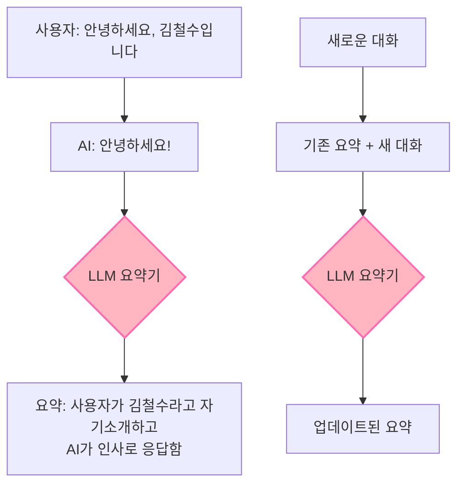
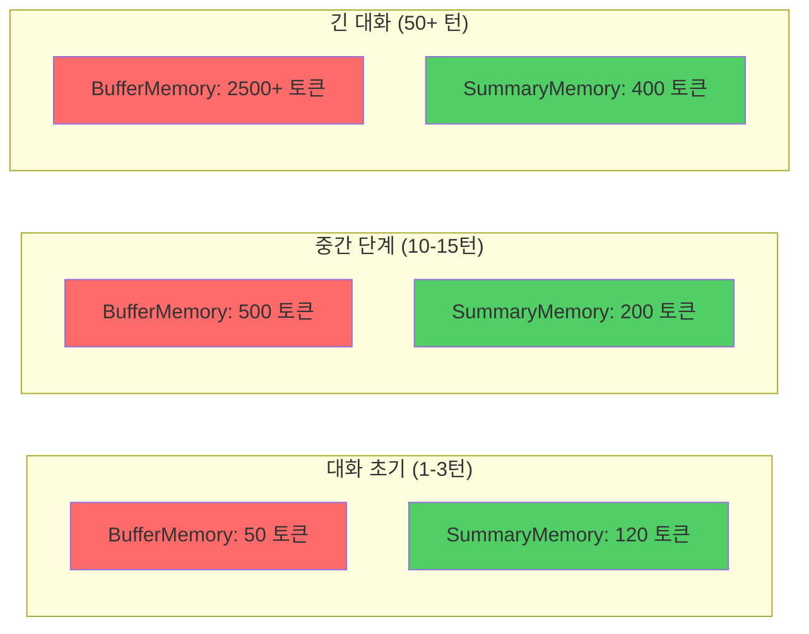

# 📖 Section 5.3: ConversationSummaryMemory - 대화 요약 메모리

## 🎯 학습 목표
- ✅ ConversationSummaryMemory의 LLM 기반 요약 시스템 이해
- ✅ 토큰 효율성과 비용 트레이드오프 분석
- ✅ 긴 대화에서의 성능 최적화 전략 수립
- ✅ 커스텀 요약 프롬프트 작성 및 적용

## 🧠 핵심 개념

### ConversationSummaryMemory란?
**ConversationSummaryMemory**는 LLM을 사용하여 대화 내용을 **지능적으로 요약**하는 메모리입니다. 원본 메시지 대신 요약된 내용을 저장합니다.



### 토큰 사용 패턴 분석



**💡 핵심 통찰**: 
- **초기**: SummaryMemory가 더 많은 토큰 사용 (요약 오버헤드)
- **중기**: SummaryMemory가 효율적으로 전환
- **장기**: SummaryMemory가 압도적 우위

## 📋 주요 클래스/함수 레퍼런스

### ConversationSummaryMemory 클래스
```python
from langchain.memory import ConversationSummaryMemory
from langchain.chat_models import ChatOpenAI

class ConversationSummaryMemory:
    def __init__(
        self,
        llm: BaseLanguageModel,              # 📌 용도: 요약용 LLM 모델, 타입: Required
        memory_key: str = "history",         # 📌 용도: 메모리 키 이름
        return_messages: bool = False,       # 📌 용도: 메시지 객체 반환 여부
        summarize_step: int = 2,             # 📌 용도: N번째 대화마다 요약
        max_token_limit: int = None,         # 📌 용도: 요약 트리거 토큰 수
        prompt: PromptTemplate = None        # 📌 용도: 커스텀 요약 프롬프트
    ):
        """
        📋 기능: LLM을 사용하여 대화를 지능적으로 요약하는 메모리 생성
        📥 입력: LLM 모델과 요약 설정
        📤 출력: ConversationSummaryMemory 인스턴스
        💡 사용 시나리오: 긴 대화, 토큰 효율성이 중요한 경우
        🔗 관련 개념: Text Summarization, Token Optimization
        """
```

### 핵심 메서드

#### predict_new_summary()
```python
def predict_new_summary(
    self, 
    messages: List[BaseMessage], 
    existing_summary: str
) -> str:
    """
    📋 기능: 기존 요약과 새 메시지들로 업데이트된 요약 생성
    📥 입력: 
        - messages: 새로운 대화 메시지들
        - existing_summary: 기존 요약 내용
    📤 출력: 업데이트된 요약 텍스트
    💡 사용 시나리오: 대화 진행 시 자동 요약 업데이트
    """
```

## 🔧 동작 과정 상세

### 1. 기본 요약 메모리 설정
```python
# === Step 1: LLM과 메모리 초기화 ===
# 🧠 개념: SummaryMemory는 반드시 LLM이 필요 (요약 생성용)
from langchain.memory import ConversationSummaryMemory
from langchain.chat_models import ChatOpenAI

# LLM 설정 (요약용)
summarizer_llm = ChatOpenAI(
    temperature=0.1,  # 📌 중요: 낮은 온도로 일관된 요약 생성
    model="gpt-3.5-turbo"  # 📌 비용 효율성을 위해 저렴한 모델 사용
)

# 요약 메모리 초기화
memory = ConversationSummaryMemory(
    llm=summarizer_llm,  # 📌 필수: 요약 생성용 LLM
    return_messages=False  # 📌 기본: 문자열 형태로 요약 반환
)

# === Step 2: 대화 추가 및 자동 요약 ===
# 🔧 구현: 각 대화가 추가될 때마다 자동으로 요약 생성
def add_message(human_input: str, ai_output: str):
    """대화 추가 및 요약 업데이트 헬퍼 함수"""
    memory.save_context(
        {"input": human_input}, 
        {"output": ai_output}
    )

def get_summary():
    """현재 요약 상태 조회"""
    return memory.load_memory_variables({})

# 첫 번째 대화
add_message(
    "안녕하세요, 저는 김철수이고 서울에 살고 있습니다.", 
    "안녕하세요 김철수님! 서울은 정말 멋진 도시네요."
)

print("=== 첫 번째 대화 후 요약 ===")
summary1 = get_summary()
print(summary1["history"])
# 출력 예시: "사용자가 김철수라고 자기소개하며 서울 거주를 언급했고, AI가 서울을 칭찬하며 인사를 했습니다."

# === Step 3: 요약의 점진적 확장 ===
add_message(
    "서울의 날씨는 요즘 정말 좋아요!", 
    "정말 그렇네요! 봄 날씨가 완벽한 것 같아요."
)

print("\n=== 두 번째 대화 후 업데이트된 요약 ===")
summary2 = get_summary()
print(summary2["history"])
# 출력 예시: "사용자 김철수가 서울 거주를 소개했고, AI가 호응했습니다. 이어서 서울의 좋은 봄 날씨에 대해 긍정적으로 대화했습니다."
```

### 2. 커스텀 요약 프롬프트 설정
```python
# === 고급 설정: 커스텀 요약 스타일 ===
from langchain.prompts import PromptTemplate

# 커스텀 요약 프롬프트 정의
custom_summary_prompt = PromptTemplate(
    input_variables=["summary", "new_lines"],
    template="""
다음은 기존 대화 요약입니다:
{summary}

새로운 대화 내용:
{new_lines}

위 내용을 바탕으로 다음 기준에 따라 요약을 업데이트해주세요:
1. 주요 인물과 그들의 정보 (이름, 거주지, 직업 등)
2. 대화의 핵심 주제와 의견
3. 중요한 결정사항이나 약속
4. 감정적 톤이나 관계의 변화

업데이트된 요약:"""
)

# 커스텀 프롬프트를 사용한 메모리
advanced_memory = ConversationSummaryMemory(
    llm=summarizer_llm,
    prompt=custom_summary_prompt,  # 📌 커스텀 요약 스타일 적용
    return_messages=False
)
```

## 💻 실전 예제

### 고급 고객 상담 시스템
```python
from langchain.memory import ConversationSummaryMemory
from langchain.chat_models import ChatOpenAI
from langchain.prompts import ChatPromptTemplate, MessagesPlaceholder
from langchain.schema.runnable import RunnablePassthrough
from datetime import datetime
import tiktoken

class AdvancedCustomerServiceBot:
    """
    🎯 목적: 요약 기반 메모리로 긴 상담 세션 지원
    💡 특징: 토큰 효율성 + 주요 정보 보존
    """
    
    def __init__(self):
        # LLM 설정 (메인 대화용)
        self.main_llm = ChatOpenAI(
            temperature=0.3,
            model="gpt-3.5-turbo"
        )
        
        # LLM 설정 (요약용 - 비용 절약)
        self.summary_llm = ChatOpenAI(
            temperature=0.1,  # 📌 일관된 요약을 위한 낮은 온도
            model="gpt-3.5-turbo"
        )
        
        # 고객 상담용 커스텀 요약 프롬프트
        from langchain.prompts import PromptTemplate
        
        self.summary_prompt = PromptTemplate(
            input_variables=["summary", "new_lines"],
            template="""
이전 상담 요약:
{summary}

새로운 대화:
{new_lines}

고객 상담 관점에서 다음 정보를 포함하여 요약해주세요:
- 고객 정보 (이름, 연락처, 계정 정보 등)
- 문의/불만 내용과 원인
- 제공한 해결책과 고객 반응
- 후속 조치가 필요한 사항
- 상담사가 알아야 할 특별한 상황

업데이트된 상담 요약:"""
        )
        
        # 요약 메모리 초기화
        self.memory = ConversationSummaryMemory(
            llm=self.summary_llm,
            prompt=self.summary_prompt,
            return_messages=False,
            memory_key="conversation_summary"
        )
        
        # 메인 상담 프롬프트
        self.chat_prompt = ChatPromptTemplate.from_messages([
            ("system", """당신은 전문적이고 친절한 고객 상담사입니다.
            
이전 상담 요약을 참고하여 고객의 문제를 해결해주세요:
{conversation_summary}

고객과의 대화에서는:
1. 이전 상담 내용을 적절히 참조하세요
2. 고객의 감정 상태를 고려하여 응답하세요  
3. 구체적이고 실행 가능한 해결책을 제시하세요
4. 필요시 전문 부서로의 연결을 안내하세요"""),
            ("human", "{input}")
        ])
        
        # 체인 구성
        self.chain = (
            RunnablePassthrough.assign(
                conversation_summary=lambda _: self.memory.load_memory_variables({}).get("conversation_summary", "")
            )
            | self.chat_prompt
            | self.main_llm
        )
        
        # 상담 세션 정보
        self.session_info = {
            "start_time": datetime.now(),
            "total_interactions": 0,
            "estimated_tokens_saved": 0
        }
    
    def chat(self, customer_input: str) -> str:
        """
        📋 기능: 고객 입력 처리 및 요약 기반 응답
        📥 입력: 고객 메시지
        📤 출력: 상담사 응답
        💡 사용 시나리오: 장시간 고객 상담
        """
        # 응답 생성
        response = self.chain.invoke({"input": customer_input})
        
        # 메모리에 저장 (자동 요약)
        self.memory.save_context(
            {"input": customer_input},
            {"output": response.content}
        )
        
        # 세션 정보 업데이트
        self.session_info["total_interactions"] += 1
        
        return response.content
    
    def get_conversation_summary(self) -> dict:
        """현재 대화 요약 상태 반환"""
        summary_data = self.memory.load_memory_variables({})
        return {
            "summary": summary_data.get("conversation_summary", "대화 없음"),
            "session_duration": datetime.now() - self.session_info["start_time"],
            "total_interactions": self.session_info["total_interactions"]
        }
    
    def estimate_token_savings(self) -> dict:
        """토큰 절약 효과 추정"""
        summary = self.memory.load_memory_variables({}).get("conversation_summary", "")
        
        # 대략적인 토큰 계산
        encoding = tiktoken.encoding_for_model("gpt-3.5-turbo")
        summary_tokens = len(encoding.encode(summary))
        
        # 만약 BufferMemory를 사용했다면 예상 토큰 수
        estimated_buffer_tokens = self.session_info["total_interactions"] * 150  # 평균 추정
        
        return {
            "summary_tokens": summary_tokens,
            "estimated_buffer_tokens": estimated_buffer_tokens,
            "tokens_saved": max(0, estimated_buffer_tokens - summary_tokens),
            "cost_saved_usd": max(0, estimated_buffer_tokens - summary_tokens) * 0.000002
        }

# === 실제 고객 상담 시뮬레이션 ===
print("🎧 고급 고객 상담 시스템 시작\n")

bot = AdvancedCustomerServiceBot()

# 복잡한 고객 상담 시나리오
consultation_scenario = [
    "안녕하세요, 김영희입니다. 어제 주문한 노트북이 배송이 안 되고 있어요.",
    "주문번호는 ORDER-12345이고, 결제는 카드로 했습니다.",
    "사실 이게 두 번째 주문이에요. 첫 번째는 취소했거든요.",
    "급하게 필요한데 언제쯤 받을 수 있을까요?",
    "혹시 배송비를 추가로 내면 더 빨리 받을 수 있나요?",
    "아, 그리고 노트북 케이스도 같이 주문했는데 이것도 같이 오나요?",
    "만약 문제가 있으면 환불 받을 수 있나요?",
    "친구가 이 사이트에서 문제가 있었다고 하던데..."
]

for i, customer_msg in enumerate(consultation_scenario, 1):
    print(f"👤 고객 (김영희): {customer_msg}")
    
    response = bot.chat(customer_msg)
    print(f"🎧 상담사: {response}\n")
    
    # 중간 요약 확인 (3번째, 6번째 대화 후)
    if i in [3, 6]:
        summary_info = bot.get_conversation_summary()
        print(f"📊 현재 상담 요약 ({i}번째 대화 후):")
        print(f"   상담 시간: {summary_info['session_duration']}")
        print(f"   상호작용 수: {summary_info['total_interactions']}")
        print(f"   요약: {summary_info['summary'][:200]}...\n")

# 최종 상담 분석
print("=" * 60)
print("📈 최종 상담 분석")
print("=" * 60)

final_summary = bot.get_conversation_summary()
token_analysis = bot.estimate_token_savings()

print(f"📊 상담 세션 정보:")
print(f"   총 상담 시간: {final_summary['session_duration']}")
print(f"   총 상호작용: {final_summary['total_interactions']}회")
print(f"\n💰 토큰 효율성 분석:")
print(f"   요약 메모리 토큰: {token_analysis['summary_tokens']}")
print(f"   예상 버퍼 토큰: {token_analysis['estimated_buffer_tokens']}")
print(f"   절약된 토큰: {token_analysis['tokens_saved']}")
print(f"   절약된 비용: ${token_analysis['cost_saved_usd']:.4f}")

print(f"\n📝 최종 상담 요약:")
print(final_summary['summary'])
```

### 요약 품질 최적화 시스템
```python
class IntelligentSummaryMemory:
    """
    🎯 목적: 요약 품질을 지능적으로 관리하는 고급 메모리
    💡 특징: 중요도 기반 요약, 품질 검증, 적응형 요약 길이
    """
    
    def __init__(self, llm):
        self.llm = llm
        self.memory = ConversationSummaryMemory(llm=llm)
        self.importance_scores = []
        self.summary_history = []
    
    def analyze_importance(self, text: str) -> float:
        """
        📋 기능: 대화 내용의 중요도 분석
        📥 입력: 대화 텍스트
        📤 출력: 중요도 점수 (0.0-1.0)
        💡 사용 시나리오: 중요한 정보 우선 보존
        """
        importance_keywords = {
            "이름": 0.8, "전화번호": 0.9, "이메일": 0.9,
            "주문": 0.7, "결제": 0.8, "환불": 0.8,
            "문제": 0.6, "불만": 0.7, "해결": 0.6,
            "약속": 0.8, "일정": 0.7, "미팅": 0.7
        }
        
        score = 0.0
        for keyword, weight in importance_keywords.items():
            if keyword in text:
                score += weight
        
        # 정규화
        return min(score / len(importance_keywords), 1.0)
    
    def save_context_with_importance(self, inputs: dict, outputs: dict):
        """중요도를 고려한 컨텍스트 저장"""
        human_text = inputs.get("input", "")
        ai_text = outputs.get("output", "")
        
        # 중요도 계산
        importance = max(
            self.analyze_importance(human_text),
            self.analyze_importance(ai_text)
        )
        
        self.importance_scores.append(importance)
        
        # 요약 저장
        old_summary = self.memory.load_memory_variables({}).get("history", "")
        self.memory.save_context(inputs, outputs)
        new_summary = self.memory.load_memory_variables({}).get("history", "")
        
        # 요약 품질 검증
        if self.validate_summary_quality(old_summary, new_summary, importance):
            self.summary_history.append({
                "summary": new_summary,
                "importance": importance,
                "timestamp": datetime.now()
            })
        else:
            print("⚠️ 요약 품질이 낮습니다. 재생성을 고려하세요.")
    
    def validate_summary_quality(self, old_summary: str, new_summary: str, importance: float) -> bool:
        """요약 품질 검증"""
        # 간단한 품질 검증 로직
        if importance > 0.5 and len(new_summary) < len(old_summary) + 50:
            return False  # 중요한 정보인데 요약이 충분히 확장되지 않음
        
        if len(new_summary) > len(old_summary) * 3:
            return False  # 요약이 너무 길어짐
        
        return True
    
    def get_adaptive_summary(self, detail_level: str = "medium") -> str:
        """적응형 요약 생성"""
        base_summary = self.memory.load_memory_variables({}).get("history", "")
        
        if detail_level == "brief":
            # 간략한 요약 요청
            brief_prompt = f"다음 요약을 50자 이내로 축약해주세요: {base_summary}"
            return self.llm.predict(brief_prompt)
        elif detail_level == "detailed":
            # 상세한 요약 요청
            detailed_prompt = f"다음 요약을 더 자세히 설명해주세요: {base_summary}"
            return self.llm.predict(detailed_prompt)
        else:
            return base_summary
```

## 🔍 변수/함수 상세 설명

### 핵심 변수들
```python
# LLM 관련 설정
llm = ChatOpenAI()              # 📌 용도: 요약 생성용 LLM, 타입: Required
temperature = 0.1               # 📌 용도: 일관된 요약 생성, 타입: float
model = "gpt-3.5-turbo"        # 📌 용도: 비용 효율적 모델 선택, 타입: str

# 요약 제어 변수
max_token_limit = 2000         # 📌 용도: 요약 트리거 임계값, 타입: int
buffer_as_messages = []        # 📌 용도: 임시 메시지 버퍼, 타입: List[BaseMessage]
moving_summary = ""            # 📌 용도: 진행 중인 요약, 타입: str
```

### 핵심 함수들
```python
def save_context(inputs: Dict, outputs: Dict) -> None:
    """
    📋 기능: 대화 저장 및 자동 요약 업데이트
    📥 입력: 사용자 입력과 AI 출력 딕셔너리
    📤 출력: None (내부 요약 상태 업데이트)
    💡 사용 시나리오: 각 대화 후 자동 호출
    """

def predict_new_summary(messages: List, existing_summary: str) -> str:
    """
    📋 기능: 기존 요약과 새 메시지로 업데이트된 요약 생성
    📥 입력: 새 메시지들과 기존 요약
    📤 출력: 업데이트된 요약 텍스트
    💡 사용 시나리오: 요약 알고리즘의 핵심 로직
    """

def clear() -> None:
    """
    📋 기능: 메모리와 요약 초기화
    📤 출력: None
    💡 사용 시나리오: 새로운 세션 시작 시
    """
```

## 🧪 실습 과제

### 🔨 기본 과제
1. **토큰 효율성 비교**: BufferMemory vs SummaryMemory 토큰 사용량 측정
```python
# TODO: 같은 대화에서 두 메모리 타입의 토큰 사용량 비교
def compare_memory_efficiency():
    # 구현하기
    pass
```

2. **요약 품질 평가**: 다양한 대화 타입에서 요약 품질 분석
```python
# TODO: 일상 대화, 기술 상담, 감정 대화 등 다양한 시나리오 테스트
```

### 🚀 심화 과제
3. **커스텀 요약 엔진**: 도메인 특화 요약 프롬프트 개발
```python
# TODO: 의료 상담, 법률 자문, 교육 등 특화 요약 시스템
class DomainSpecificSummaryMemory:
    def __init__(self, domain: str):
        self.domain = domain
        self.custom_prompts = {
            "medical": "환자 증상과 진료 내용 중심 요약...",
            "legal": "법적 쟁점과 조언 내용 중심 요약...",
            "education": "학습 진도와 이해도 중심 요약..."
        }
```

4. **적응형 요약**: 대화 길이와 복잡도에 따른 동적 요약 전략
```python
# TODO: 짧은 대화는 상세하게, 긴 대화는 간결하게
class AdaptiveSummaryMemory:
    def adjust_summary_depth(self, conversation_length: int, complexity: float):
        # 구현하기
        pass
```

### 💡 창의 과제
5. **멀티모달 요약**: 텍스트 + 감정 + 의도를 통합한 요약
6. **실시간 요약 스트리밍**: 대화 중 실시간 요약 업데이트
7. **요약 품질 평가**: 자동화된 요약 품질 측정 시스템

## ⚠️ 주의사항

### 비용 관리
```python
# 🚨 중요: SummaryMemory는 LLM 호출로 인한 추가 비용 발생
def estimate_summary_costs(interactions_per_day: int, avg_tokens_per_summary: int = 200):
    """
    요약 메모리 사용 시 예상 비용 계산
    """
    daily_summary_tokens = interactions_per_day * avg_tokens_per_summary
    monthly_cost = daily_summary_tokens * 30 * 0.000002  # GPT-3.5-turbo 기준
    
    return {
        "daily_tokens": daily_summary_tokens,
        "monthly_cost_usd": monthly_cost
    }

# 예시: 하루 100회 상호작용 시
cost_estimate = estimate_summary_costs(100)
print(f"월 예상 요약 비용: ${cost_estimate['monthly_cost_usd']:.2f}")
```

### 요약 품질 관리
1. **LLM 모델 선택**: 요약 품질과 비용의 균형점 찾기
2. **프롬프트 최적화**: 도메인에 특화된 요약 지시사항
3. **품질 검증**: 중요 정보 누락 방지 메커니즘

### 성능 최적화
- **비동기 요약**: 백그라운드에서 요약 생성
- **캐시 활용**: 유사한 패턴의 요약 재사용
- **배치 요약**: 여러 대화를 한 번에 요약

## 🔗 관련 자료
- **이전 학습**: [5.2 ConversationBufferWindowMemory](./5.2_ConversationBufferWindowMemory.md)
- **다음 학습**: [5.4 ConversationSummaryBufferMemory](./5.4_ConversationSummaryBufferMemory.md)
- **성능 비교**: [Memory Performance Comparison](./5.9_Recap.md#performance-analysis)
- **비용 최적화**: [LLM Cost Management](../Advanced_Topics/Cost_Optimization.md)

---

💡 **핵심 정리**: ConversationSummaryMemory는 **긴 대화에서 토큰 효율성**을 극대화하는 메모리입니다. 초기에는 요약 오버헤드로 인해 더 많은 토큰을 사용하지만, 대화가 길어질수록 압도적인 효율성을 보여줍니다. **LLM 비용이 추가로 발생**하므로 전체적인 비용 효율성을 고려하여 사용해야 합니다.