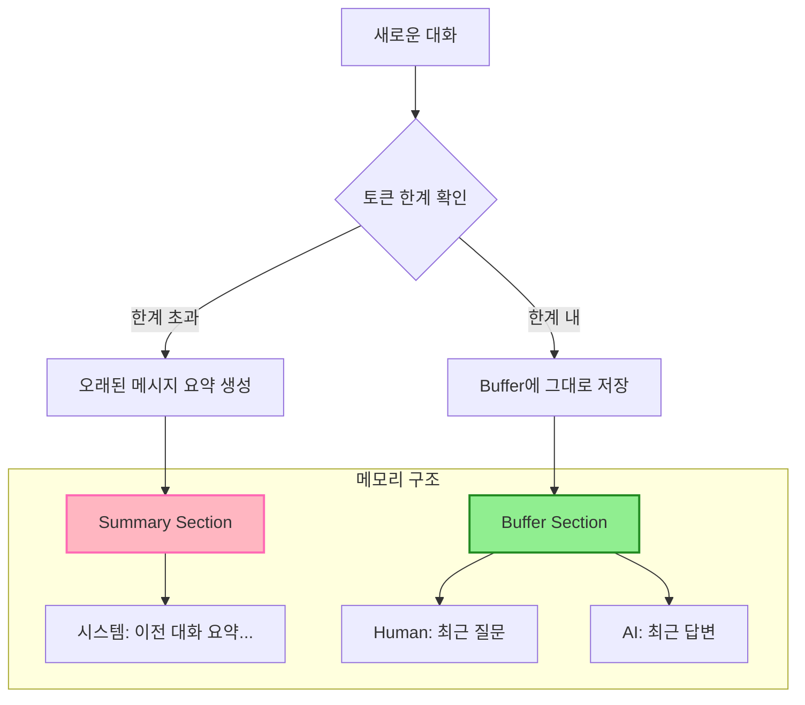

# 📖 Section 5.4: ConversationSummaryBufferMemory - 하이브리드 메모리

## 🎯 학습 목표
- ✅ ConversationSummaryBufferMemory의 하이브리드 접근 방식 이해
- ✅ max_token_limit 파라미터를 통한 토큰 임계값 제어 학습
- ✅ 최근 메시지는 보존, 오래된 메시지는 요약하는 전략 활용
- ✅ 실무에서 최적의 토큰 임계값 설정 방법 습득

## 🧠 핵심 개념

### ConversationSummaryBufferMemory란?
**ConversationSummaryBufferMemory**는 **BufferMemory**와 **SummaryMemory**의 장점을 결합한 하이브리드 메모리입니다. 최근 대화는 원본 그대로 유지하고, 토큰 한계를 초과하는 오래된 대화는 요약합니다.



### 하이브리드 접근의 장점

| 특징 | BufferMemory | SummaryMemory | SummaryBufferMemory |
|------|--------------|---------------|---------------------|
| **최근 대화** | ✅ 완전 보존 | ❌ 요약만 | ✅ 완전 보존 |
| **오래된 대화** | ✅ 완전 보존 | ✅ 요약 보존 | ✅ 요약 보존 |
| **토큰 효율성** | ❌ 계속 증가 | ✅ 일정 유지 | ✅ 제한된 증가 |
| **컨텍스트 품질** | ✅ 최고 | ⭐ 중간 | 🔥 최적 균형 |
| **비용 효율성** | ❌ 높은 비용 | ✅ 예측 가능 | ✅ 중간 비용 |

## 📋 주요 클래스/함수 레퍼런스

### ConversationSummaryBufferMemory 클래스
```python
from langchain.memory import ConversationSummaryBufferMemory
from langchain.chat_models import ChatOpenAI

class ConversationSummaryBufferMemory:
    def __init__(
        self,
        llm: BaseLanguageModel,              # 📌 용도: 요약용 LLM 모델, 타입: Required
        max_token_limit: int = 2000,         # 📌 용도: 토큰 임계값, 타입: int, 핵심 파라미터!
        return_messages: bool = False,       # 📌 용도: 메시지 객체 반환 여부
        memory_key: str = "history",         # 📌 용도: 메모리 키 이름
        summarize_step: int = 2,            # 📌 용도: N개씩 묶어서 요약
        moving_summary_buffer: str = ""      # 📌 용도: 진행 중인 요약 저장
    ):
        """
        📋 기능: 토큰 임계값 기반으로 버퍼와 요약을 결합한 하이브리드 메모리
        📥 입력: LLM 모델과 토큰 임계값 설정
        📤 출력: ConversationSummaryBufferMemory 인스턴스
        💡 사용 시나리오: 중간 길이 대화, 최근 컨텍스트가 중요한 경우
        🔗 관련 개념: Token Management, Hybrid Memory Architecture
        """
```

### 핵심 파라미터: max_token_limit

```python
# 🧠 개념: max_token_limit은 하이브리드 메모리의 핵심 제어 매개변수

# 💡 실무 권장 설정값:
token_limit_guide = {
    "간단한_대화": 500,     # 일반적인 Q&A, 간단한 상담
    "일반_대화": 1000,      # 기본 고객 서비스, 일반 챗봇
    "복잡한_상담": 2000,    # 기술 지원, 복잡한 문제 해결
    "전문_컨설팅": 4000,    # 전문적 상담, 장시간 세션
    "교육_세션": 6000       # 튜터링, 장시간 교육 대화
}

# ⚠️ 주의: 너무 높으면 BufferMemory와 차이 없음
# ⚠️ 주의: 너무 낮으면 SummaryMemory와 유사함
```

## 🔧 동작 과정 상세

### 1. 기본 하이브리드 메모리 설정
```python
# === Step 1: LLM과 하이브리드 메모리 초기화 ===
from langchain.memory import ConversationSummaryBufferMemory
from langchain.chat_models import ChatOpenAI

# LLM 설정 (요약용)
llm = ChatOpenAI(
    temperature=0.1,  # 📌 일관된 요약을 위한 낮은 온도
    model="gpt-3.5-turbo"
)

# 하이브리드 메모리 초기화
memory = ConversationSummaryBufferMemory(
    llm=llm,
    max_token_limit=150,  # 📌 핵심: 토큰 임계값 (테스트용 낮은 값)
    return_messages=True  # 📌 ChatModel용 메시지 객체 반환
)

# === Step 2: 토큰 한계 이하 대화 (버퍼 모드) ===
def add_message(human_input: str, ai_output: str):
    """대화 추가 헬퍼 함수"""
    memory.save_context({"input": human_input}, {"output": ai_output})

def get_current_state():
    """현재 메모리 상태 조회 및 분석"""
    history = memory.load_memory_variables({})
    messages = history.get("history", [])
    
    # 메시지 타입 분석
    summary_messages = [msg for msg in messages if msg.type == "system"]
    regular_messages = [msg for msg in messages if msg.type != "system"]
    
    return {
        "total_messages": len(messages),
        "summary_count": len(summary_messages),
        "buffer_count": len(regular_messages),
        "has_summary": len(summary_messages) > 0
    }

# 첫 번째 대화 (토큰 한계 이하)
print("=== 1단계: 토큰 한계 이하 대화 (버퍼 모드) ===")
add_message(
    "안녕하세요, 저는 김철수입니다. 서울에 살고 있어요.",
    "안녕하세요 김철수님! 서울은 정말 멋진 도시네요."
)

state1 = get_current_state()
print(f"메모리 상태: 전체 {state1['total_messages']}개 메시지")
print(f"요약 있음: {state1['has_summary']}")

# 두 번째 대화 (여전히 버퍼 모드)
add_message("서울 날씨가 정말 좋아요!", "정말 그렇네요! 봄 날씨가 완벽합니다.")

state2 = get_current_state()
print(f"\n두 번째 대화 후: {state2['total_messages']}개 메시지, 요약: {state2['has_summary']}")

# === Step 3: 토큰 한계 초과 시 요약 생성 ===
print("\n=== 2단계: 토큰 한계 초과 시 요약 모드 전환 ===")

# 추가 대화를 계속 진행하여 토큰 한계 초과 유도
additional_conversations = [
    ("한국에서 제일 좋아하는 음식이 뭐예요?", "김치찌개를 정말 좋아해요!"),
    ("한국 문화 중 인상 깊은 게 있나요?", "전통 음악이 아름다워요."),
    ("서울에서 가볼 만한 곳 추천해 주세요.", "경복궁과 남산타워를 추천드려요."),
    ("한국어 배우기 어렵나요?", "처음엔 어렵지만 재미있어요!")
]

for i, (human, ai) in enumerate(additional_conversations, 3):
    add_message(human, ai)
    state = get_current_state()
    
    print(f"{i}번째 대화 후 - 메시지: {state['total_messages']}개, 요약 존재: {state['has_summary']}")
    
    # 요약이 생성되면 상세 분석
    if state['has_summary']:
        print("🎉 토큰 한계 초과! 하이브리드 모드 활성화")
        messages = memory.load_memory_variables({})["history"]
        
        for msg in messages:
            if msg.type == "system":
                print(f"📋 요약: {msg.content[:100]}...")
            else:
                role = "Human" if msg.type == "human" else "AI"
                print(f"{role}: {msg.content}")
        break
```

### 2. 토큰 임계값별 동작 비교
```python
# === 토큰 임계값이 메모리 동작에 미치는 영향 분석 ===
def test_token_limits(conversations, token_limits=[100, 500, 1000, 2000]):
    """
    📋 기능: 다양한 토큰 임계값에서 메모리 동작 비교
    📥 입력: 테스트 대화와 임계값 리스트
    📤 출력: 각 임계값별 메모리 동작 분석
    💡 사용 시나리오: 최적 임계값 결정
    """
    results = {}
    
    for limit in token_limits:
        print(f"\n🔬 토큰 한계 {limit} 테스트")
        
        # 새로운 메모리 인스턴스 생성
        test_memory = ConversationSummaryBufferMemory(
            llm=ChatOpenAI(temperature=0.1),
            max_token_limit=limit,
            return_messages=True
        )
        
        # 모든 대화 추가
        summary_triggered_at = None
        for i, (human, ai) in enumerate(conversations):
            test_memory.save_context({"input": human}, {"output": ai})
            
            # 요약이 처음 생성된 시점 기록
            messages = test_memory.load_memory_variables({})["history"]
            has_summary = any(msg.type == "system" for msg in messages)
            
            if has_summary and summary_triggered_at is None:
                summary_triggered_at = i + 1
        
        # 최종 메모리 상태 분석
        final_messages = test_memory.load_memory_variables({})["history"]
        summary_msgs = [msg for msg in final_messages if msg.type == "system"]
        buffer_msgs = [msg for msg in final_messages if msg.type != "system"]
        
        results[limit] = {
            "summary_triggered_at": summary_triggered_at,
            "final_summary_count": len(summary_msgs),
            "final_buffer_count": len(buffer_msgs),
            "total_final_messages": len(final_messages)
        }
        
        print(f"   요약 시작: {summary_triggered_at}번째 대화")
        print(f"   최종 구성: 요약 {len(summary_msgs)}개 + 버퍼 {len(buffer_msgs)}개")
    
    return results

# 테스트 대화 준비
test_conversations = [
    ("안녕하세요, 저는 이영희입니다.", "안녕하세요 영희님!"),
    ("오늘 날씨가 정말 좋네요.", "정말 맑고 화창해요."),
    ("주말 계획이 있으신가요?", "공원에 산책하러 갈 예정이에요."),
    ("어떤 음식을 좋아하세요?", "한식을 가장 좋아합니다."),
    ("취미가 무엇인가요?", "책 읽기와 영화 감상이에요."),
    ("최근에 본 영화 중 기억나는 게 있나요?", "액션 영화를 하나 봤는데 정말 재미있었어요."),
    ("책은 주로 어떤 장르를 읽으시나요?", "소설과 에세이를 주로 읽어요."),
    ("추천하고 싶은 책이 있나요?", "최근에 읽은 소설 한 권을 추천드리고 싶어요.")
]

# 토큰 임계값별 테스트 실행
comparison_results = test_token_limits(test_conversations)

# 결과 분석
print("\n📊 토큰 임계값별 동작 분석 결과:")
print("=" * 60)
for limit, result in comparison_results.items():
    efficiency = "높음" if result["summary_triggered_at"] and result["summary_triggered_at"] <= 4 else "보통" if result["summary_triggered_at"] else "낮음"
    print(f"한계 {limit}: 요약시점 {result['summary_triggered_at']}, 효율성 {efficiency}")
```

## 💻 실전 예제

### 적응형 고객 서비스 시스템
```python
from langchain.memory import ConversationSummaryBufferMemory
from langchain.chat_models import ChatOpenAI
from langchain.prompts import ChatPromptTemplate, MessagesPlaceholder
from langchain.schema.runnable import RunnablePassthrough
import tiktoken
from datetime import datetime, timedelta

class AdaptiveCustomerServiceSystem:
    """
    🎯 목적: 토큰 효율성과 컨텍스트 품질을 균형잡은 고객 서비스
    💡 특징: 동적 토큰 임계값 조정, 우선순위 기반 메모리 관리
    """
    
    def __init__(self, service_type: str = "general"):
        self.service_type = service_type
        
        # 서비스 타입별 토큰 한계 설정
        self.token_limits = {
            "simple": 500,      # 간단한 FAQ
            "general": 1500,    # 일반 고객 서비스
            "technical": 3000,  # 기술 지원
            "premium": 5000     # 프리미엄 서비스
        }
        
        # LLM 설정
        self.llm = ChatOpenAI(temperature=0.2, model="gpt-3.5-turbo")
        
        # 하이브리드 메모리 초기화
        self.memory = ConversationSummaryBufferMemory(
            llm=self.llm,
            max_token_limit=self.token_limits.get(service_type, 1500),
            return_messages=True,
            memory_key="conversation_history"
        )
        
        # 고객 서비스용 프롬프트
        self.prompt = ChatPromptTemplate.from_messages([
            ("system", """당신은 전문적이고 효율적인 고객 상담사입니다.

이전 대화 내용:
{conversation_history}

상담 원칙:
1. 최근 대화를 우선적으로 참조하여 맥락을 유지하세요
2. 요약된 이전 내용도 적절히 활용하세요
3. 고객의 감정 상태를 고려하여 응답하세요
4. 구체적이고 실행 가능한 해결책을 제시하세요

현재 서비스 레벨: {service_level}"""),
            ("human", "{input}")
        ])
        
        # 체인 구성
        self.chain = (
            RunnablePassthrough.assign(
                conversation_history=lambda _: self._get_memory_context(),
                service_level=lambda _: self.service_type.upper()
            )
            | self.prompt
            | self.llm
        )
        
        # 세션 통계
        self.session_stats = {
            "start_time": datetime.now(),
            "total_interactions": 0,
            "summary_generations": 0,
            "token_usage_estimate": 0,
            "escalation_triggers": 0
        }
    
    def _get_memory_context(self) -> str:
        """메모리에서 대화 컨텍스트 추출"""
        memory_vars = self.memory.load_memory_variables({})
        history = memory_vars.get("conversation_history", [])
        
        if not history:
            return "새로운 상담 세션입니다."
        
        # 메시지들을 텍스트로 변환
        context_parts = []
        for msg in history:
            if msg.type == "system":
                context_parts.append(f"[이전 대화 요약] {msg.content}")
            elif msg.type == "human":
                context_parts.append(f"고객: {msg.content}")
            elif msg.type == "ai":
                context_parts.append(f"상담사: {msg.content}")
        
        return "\n".join(context_parts)
    
    def chat(self, customer_input: str) -> dict:
        """
        📋 기능: 고객 입력 처리 및 하이브리드 메모리 관리
        📥 입력: 고객 메시지
        📤 출력: 응답과 메모리 상태 정보
        💡 사용 시나리오: 실시간 고객 상담
        """
        # 메모리 상태 확인 (이전)
        pre_messages = self.memory.load_memory_variables({})["conversation_history"]
        pre_summary_count = sum(1 for msg in pre_messages if msg.type == "system")
        
        # 응답 생성
        response = self.chain.invoke({"input": customer_input})
        
        # 메모리에 저장 (하이브리드 동작 트리거 가능)
        self.memory.save_context(
            {"input": customer_input},
            {"output": response.content}
        )
        
        # 메모리 상태 확인 (이후)
        post_messages = self.memory.load_memory_variables({})["conversation_history"]
        post_summary_count = sum(1 for msg in post_messages if msg.type == "system")
        
        # 요약 생성 여부 확인
        summary_generated = post_summary_count > pre_summary_count
        if summary_generated:
            self.session_stats["summary_generations"] += 1
        
        # 통계 업데이트
        self.session_stats["total_interactions"] += 1
        
        # 에스컬레이션 필요성 검토
        escalation_needed = self._check_escalation_triggers(customer_input, response.content)
        
        return {
            "response": response.content,
            "memory_info": {
                "total_messages": len(post_messages),
                "has_summary": post_summary_count > 0,
                "summary_generated_now": summary_generated,
                "memory_mode": "hybrid" if post_summary_count > 0 else "buffer"
            },
            "escalation_needed": escalation_needed,
            "session_stats": self.session_stats.copy()
        }
    
    def _check_escalation_triggers(self, customer_input: str, ai_response: str) -> bool:
        """에스컬레이션 필요성 검토"""
        escalation_keywords = [
            "매니저", "불만", "화가", "취소", "환불", "소송", "항의", 
            "실망", "문제", "해결", "책임자", "상급자"
        ]
        
        if any(keyword in customer_input for keyword in escalation_keywords):
            self.session_stats["escalation_triggers"] += 1
            return True
        
        return False
    
    def get_memory_analysis(self) -> dict:
        """
        📋 기능: 현재 메모리 상태 상세 분석
        📤 출력: 메모리 구성과 효율성 분석
        💡 사용 시나리오: 메모리 최적화 및 디버깅
        """
        messages = self.memory.load_memory_variables({})["conversation_history"]
        
        # 메시지 타입별 분류
        summary_messages = [msg for msg in messages if msg.type == "system"]
        human_messages = [msg for msg in messages if msg.type == "human"]
        ai_messages = [msg for msg in messages if msg.type == "ai"]
        
        # 토큰 사용량 추정
        total_content = " ".join(msg.content for msg in messages)
        encoding = tiktoken.encoding_for_model("gpt-3.5-turbo")
        estimated_tokens = len(encoding.encode(total_content))
        
        return {
            "memory_composition": {
                "summary_messages": len(summary_messages),
                "recent_human_messages": len(human_messages),
                "recent_ai_messages": len(ai_messages),
                "total_messages": len(messages)
            },
            "token_analysis": {
                "estimated_current_tokens": estimated_tokens,
                "token_limit": self.memory.max_token_limit,
                "utilization_rate": estimated_tokens / self.memory.max_token_limit,
                "efficiency_status": self._get_efficiency_status(estimated_tokens)
            },
            "memory_mode": "hybrid" if summary_messages else "buffer_only",
            "session_duration": datetime.now() - self.session_stats["start_time"]
        }
    
    def _get_efficiency_status(self, current_tokens: int) -> str:
        """토큰 효율성 상태 판단"""
        utilization = current_tokens / self.memory.max_token_limit
        
        if utilization < 0.3:
            return "여유"
        elif utilization < 0.7:
            return "적정"
        elif utilization < 0.9:
            return "주의"
        else:
            return "위험"
    
    def adjust_token_limit(self, new_limit: int):
        """동적 토큰 한계 조정"""
        old_limit = self.memory.max_token_limit
        self.memory.max_token_limit = new_limit
        
        print(f"토큰 한계 조정: {old_limit} → {new_limit}")
        
        # 현재 토큰 사용량이 새 한계를 초과하면 요약 강제 실행
        current_analysis = self.get_memory_analysis()
        if current_analysis["token_analysis"]["estimated_current_tokens"] > new_limit:
            print("새 한계 초과로 인한 요약 재생성 필요")

# === 실제 고객 서비스 시뮬레이션 ===
print("🏢 적응형 고객 서비스 시스템 시작")
print("=" * 50)

# 기술 지원 서비스 초기화
service = AdaptiveCustomerServiceSystem("technical")

# 복잡한 기술 지원 시나리오
tech_support_scenario = [
    "안녕하세요, 노트북에 문제가 있어서 연락드렸습니다.",
    "부팅할 때 블루스크린이 나타나요. 에러 코드는 0x0000007B입니다.",
    "어제까지는 잘 됐는데 오늘 갑자기 이런 문제가 생겼어요.",
    "중요한 프레젠테이션 파일이 있는데 접근할 수 없어서 정말 급합니다.",
    "혹시 데이터 복구가 가능한가요? 백업이 없어서 걱정돼요.",
    "이전에도 가끔 느려지는 현상이 있었어요. 관련이 있을까요?",
    "하드웨어 문제인지 소프트웨어 문제인지 어떻게 알 수 있나요?",
    "수리가 필요하다면 비용이 얼마나 들까요?",
    "임시로라도 데이터에 접근할 방법이 있을까요?"
]

for i, customer_message in enumerate(tech_support_scenario, 1):
    print(f"\n--- {i}번째 상담 ---")
    print(f"👤 고객: {customer_message}")
    
    # 상담 처리
    result = service.chat(customer_message)
    
    print(f"🎧 상담사: {result['response'][:200]}...")
    
    # 메모리 상태 모니터링
    memory_info = result['memory_info']
    print(f"📊 메모리: {memory_info['memory_mode']} 모드, "
          f"{memory_info['total_messages']}개 메시지")
    
    if memory_info['summary_generated_now']:
        print("🔄 요약 생성됨 - 하이브리드 모드 활성화!")
    
    if result['escalation_needed']:
        print("⚡ 에스컬레이션 필요 감지!")

# 최종 분석
print("\n" + "=" * 60)
print("📈 최종 세션 분석")
print("=" * 60)

final_analysis = service.get_memory_analysis()
session_stats = service.session_stats

print(f"📊 메모리 구성:")
for key, value in final_analysis['memory_composition'].items():
    print(f"   {key}: {value}")

print(f"\n💰 토큰 효율성:")
token_info = final_analysis['token_analysis']
print(f"   현재 토큰: {token_info['estimated_current_tokens']}")
print(f"   토큰 한계: {token_info['token_limit']}")
print(f"   사용률: {token_info['utilization_rate']:.1%}")
print(f"   상태: {token_info['efficiency_status']}")

print(f"\n🎯 세션 통계:")
print(f"   총 상담: {session_stats['total_interactions']}회")
print(f"   요약 생성: {session_stats['summary_generations']}회")
print(f"   에스컬레이션: {session_stats['escalation_triggers']}회")
print(f"   세션 시간: {final_analysis['session_duration']}")
```

## 🔍 변수/함수 상세 설명

### 핵심 변수들
```python
# 하이브리드 메모리 제어 변수
max_token_limit = 2000         # 📌 용도: 요약 트리거 임계값, 타입: int, 핵심!
moving_summary_buffer = ""     # 📌 용도: 진행 중인 요약, 타입: str
chat_memory = []               # 📌 용도: 최근 메시지 버퍼, 타입: List[BaseMessage]

# 토큰 계산 관련
token_counter = 0              # 📌 용도: 현재 토큰 사용량, 타입: int
summarize_step = 2             # 📌 용도: N개씩 묶어서 요약, 타입: int
```

### 핵심 메서드들
```python
def _get_num_tokens_from_messages(messages: List[BaseMessage]) -> int:
    """
    📋 기능: 메시지들의 토큰 수 계산
    📥 입력: 메시지 리스트
    📤 출력: 총 토큰 수
    💡 사용 시나리오: 토큰 임계값 확인
    """

def prune(self) -> None:
    """
    📋 기능: 토큰 한계 초과 시 오래된 메시지를 요약으로 변환
    📤 출력: None (내부 메모리 상태 변경)
    💡 사용 시나리오: 자동 메모리 최적화
    """

def clear(self) -> None:
    """
    📋 기능: 버퍼와 요약 모두 초기화
    📤 출력: None
    💡 사용 시나리오: 새 세션 시작
    """
```

## 🧪 실습 과제

### 🔨 기본 과제
1. **토큰 임계값 실험**: 다양한 max_token_limit에서 메모리 동작 관찰
```python
# TODO: 100, 500, 1000, 2000 토큰 한계로 같은 대화 테스트
def experiment_token_limits():
    limits = [100, 500, 1000, 2000]
    # 각 한계에서 언제 요약이 시작되는지 분석
    pass
```

2. **메모리 효율성 측정**: BufferMemory vs SummaryBufferMemory 비교
```python
# TODO: 같은 대화에서 메모리 타입별 토큰 사용량과 품질 비교
def compare_memory_efficiency():
    # 구현하기
    pass
```

### 🚀 심화 과제
3. **적응형 토큰 관리**: 대화 패턴에 따른 동적 임계값 조정
```python
# TODO: 복잡한 대화는 높은 임계값, 간단한 대화는 낮은 임계값
class AdaptiveTokenManager:
    def __init__(self):
        self.complexity_history = []
        self.base_limit = 1000
    
    def adjust_limit_based_on_complexity(self, conversation_complexity: float):
        # 구현하기
        pass
```

4. **우선순위 기반 메모리**: 중요한 정보는 더 오래 버퍼에 유지
```python
# TODO: 중요도 점수가 높은 메시지는 요약에서 제외
class PriorityBasedSummaryBufferMemory(ConversationSummaryBufferMemory):
    def __init__(self, *args, **kwargs):
        super().__init__(*args, **kwargs)
        self.importance_scores = []
    
    def save_context_with_priority(self, inputs, outputs, importance: float):
        # 중요도 기반 저장 로직 구현
        pass
```

### 💡 창의 과제
5. **멀티레벨 요약**: 단기 요약 + 중기 요약 + 장기 요약 계층 구조
6. **컨텍스트 보존**: 요약 시 핵심 컨텍스트 강제 보존 메커니즘
7. **실시간 최적화**: 대화 진행 중 실시간 메모리 최적화

## ⚠️ 주의사항

### 토큰 임계값 설정 가이드라인
```python
# 🎯 서비스별 권장 max_token_limit 설정
service_recommendations = {
    "FAQ_봇": 300,           # 간단한 질답, 빠른 응답 필요
    "일반_고객서비스": 1500,  # 균형잡힌 품질과 효율성
    "기술_지원": 3000,       # 복잡한 문제, 긴 설명 필요
    "교육_튜터": 4000,       # 학습 맥락 유지 중요
    "전문_상담": 6000,       # 장시간 깊이 있는 대화
    "의료_상담": 8000        # 환자 히스토리 보존 필수
}

# ⚠️ 너무 낮은 설정의 위험성
if max_token_limit < 500:
    print("경고: 너무 낮은 임계값은 빈번한 요약으로 인한 정보 손실 위험")

# ⚠️ 너무 높은 설정의 문제점  
if max_token_limit > 5000:
    print("주의: 높은 임계값은 BufferMemory와 유사한 비용 증가")
```

### 요약 품질 관리
1. **중요 정보 손실 방지**: 고객 정보, 주문 번호 등 핵심 데이터 별도 저장
2. **요약 검증**: 요약된 내용이 핵심 정보를 포함하는지 확인
3. **에러 복구**: 요약 실패 시 원본 메시지로 폴백

### 비용 최적화
- **요약 모델 선택**: 저렴한 모델로 요약, 메인 대화는 고급 모델
- **배치 요약**: 여러 메시지를 한 번에 요약하여 API 호출 줄이기
- **캐시 활용**: 유사한 패턴의 요약 결과 재사용

## 🔗 관련 자료
- **이전 학습**: [5.3 ConversationSummaryMemory](./5.3_ConversationSummaryMemory.md)
- **다음 학습**: [5.5 ConversationKGMemory](./5.5_ConversationKGMemory.md)
- **성능 비교**: [Memory Types Performance Analysis](./5.9_Recap.md#performance-comparison)
- **토큰 관리**: [Token Optimization Strategies](../Advanced_Topics/Token_Management.md)

---

💡 **핵심 정리**: ConversationSummaryBufferMemory는 **최근 대화의 완전성**과 **토큰 효율성**을 모두 확보하는 최고의 하이브리드 솔루션입니다. `max_token_limit` 설정이 성능의 핵심이며, 대부분의 실무 시나리오에서 **가장 균형잡힌 선택**입니다. 토큰 비용과 컨텍스트 품질 사이의 최적 균형점을 제공합니다.