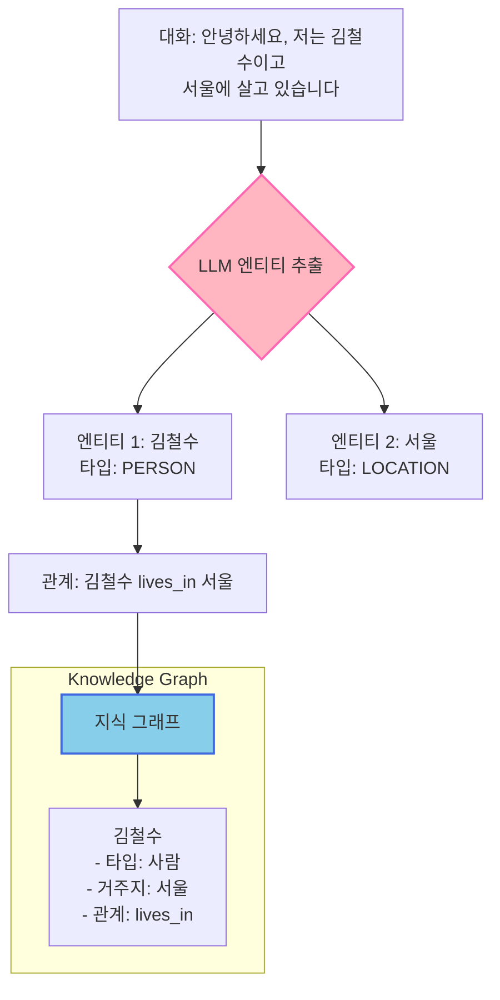

# 📖 Section 5.5: ConversationKGMemory - 지식 그래프 메모리

## 🎯 학습 목표
- ✅ ConversationKGMemory의 지식 그래프 기반 정보 추출 이해
- ✅ 엔티티와 관계를 통한 구조화된 메모리 관리 학습
- ✅ 특정 엔티티에 대한 쿼리 기반 메모리 검색 활용
- ✅ 지식 그래프 메모리의 장단점과 적합한 사용 사례 파악

## 🧠 핵심 개념

### ConversationKGMemory란?
**ConversationKGMemory**는 대화에서 **엔티티(Entity)**와 **관계(Relationship)**를 추출하여 **지식 그래프(Knowledge Graph)** 형태로 저장하는 고급 메모리입니다. 단순한 대화 저장이 아닌 **의미론적 정보 추출**에 중점을 둡니다.



### 지식 그래프 vs 일반 메모리

| 특징 | BufferMemory | SummaryMemory | KGMemory |
|------|--------------|---------------|----------|
| **저장 방식** | 전체 대화 | 텍스트 요약 | 엔티티+관계 |
| **정보 구조** | 순차적 | 단락형 | 그래프형 |
| **검색 방식** | 순서 기반 | 전체 요약 | 엔티티 쿼리 |
| **메모리 효율** | ❌ 낮음 | ✅ 높음 | ✅ 매우 높음 |
| **정보 정확성** | ✅ 완벽 | ⭐ 좋음 | 🔥 구조화됨 |
| **사용 복잡도** | ✅ 간단 | ⭐ 보통 | ❌ 복잡 |

### 핵심 장점
1. **구조화된 정보**: 사실 기반의 체계적 저장
2. **효율적 검색**: 특정 엔티티에 대한 직접 질의
3. **관계 추론**: 엔티티 간 연결 관계 파악
4. **확장성**: 새로운 정보의 점진적 확장

## 📋 주요 클래스/함수 레퍼런스

### ConversationKGMemory 클래스
```python
from langchain.memory import ConversationKGMemory
from langchain.chat_models import ChatOpenAI

class ConversationKGMemory:
    def __init__(
        self,
        llm: BaseLanguageModel,              # 📌 용도: 엔티티 추출용 LLM, 타입: Required
        memory_key: str = "history",         # 📌 용도: 메모리 키 이름
        return_messages: bool = False,       # 📌 용도: 메시지 객체 반환 여부
        entity_extraction_prompt: PromptTemplate = None,  # 📌 용도: 커스텀 추출 프롬프트
        entity_summarization_prompt: PromptTemplate = None, # 📌 용도: 엔티티 요약 프롬프트
        k: int = 10                         # 📌 용도: 반환할 최대 엔티티 수
    ):
        """
        📋 기능: 대화에서 엔티티와 관계를 추출하여 지식 그래프로 관리
        📥 입력: LLM 모델과 엔티티 추출 설정
        📤 출력: ConversationKGMemory 인스턴스
        💡 사용 시나리오: 사실 기반 정보 관리, 고객 프로필 구축, 지식 베이스
        🔗 관련 개념: Named Entity Recognition, Knowledge Graph, Semantic Memory
        """
```

### 핵심 메서드

#### load_memory_variables()
```python
def load_memory_variables(self, inputs: Dict[str, str]) -> Dict[str, Any]:
    """
    📋 기능: 특정 엔티티에 대한 지식 조회
    📥 입력: 
        - inputs: 쿼리 정보 {"input": "엔티티에 대한 질문"}
    📤 출력: 해당 엔티티의 지식 그래프 정보
    💡 사용 시나리오: "김철수가 누구인지", "서울에 대한 정보" 등 특정 질의
    🔗 관련 개념: Entity Query, Graph Traversal
    """
```

#### get_knowledge_triplets()
```python
def get_knowledge_triplets(self, text: str) -> List[Tuple[str, str, str]]:
    """
    📋 기능: 텍스트에서 (주어, 관계, 객체) 삼중항 추출
    📥 입력: 분석할 텍스트
    📤 출력: [(entity1, relation, entity2), ...] 형태의 삼중항 리스트
    💡 사용 시나리오: 지식 그래프 구축의 핵심 로직
    """
```

## 🔧 동작 과정 상세

### 1. 기본 지식 그래프 메모리 구축
```python
# === Step 1: 지식 그래프 메모리 초기화 ===
# 🧠 개념: KGMemory는 엔티티 추출을 위한 LLM이 필수
from langchain.memory import ConversationKGMemory
from langchain.chat_models import ChatOpenAI

# LLM 설정 (엔티티 추출용)
entity_extractor_llm = ChatOpenAI(
    temperature=0.1,  # 📌 중요: 정확한 엔티티 추출을 위한 낮은 온도
    model="gpt-3.5-turbo"
)

# 지식 그래프 메모리 초기화
kg_memory = ConversationKGMemory(
    llm=entity_extractor_llm,
    return_messages=True,  # 📌 시스템 메시지 형태로 지식 반환
    k=10  # 📌 한 번에 반환할 최대 엔티티 수
)

# === Step 2: 대화를 통한 지식 축적 ===
def add_knowledge(human_input: str, ai_output: str):
    """지식 그래프에 대화 정보 추가"""
    kg_memory.save_context(
        {"input": human_input}, 
        {"output": ai_output}
    )
    print(f"✅ 지식 추가: {human_input[:50]}...")

# 첫 번째 정보 추가 - 기본 인적사항
add_knowledge(
    "안녕하세요, 저는 김철수이고 서울에 살고 있습니다.",
    "안녕하세요 김철수님! 서울은 정말 좋은 도시네요."
)

# 특정 엔티티에 대한 지식 조회
print("\n=== 김철수에 대한 지식 조회 ===")
nicolas_info = kg_memory.load_memory_variables({"input": "김철수는 누구인가요?"})
for message in nicolas_info["history"]:
    print(f"📊 지식: {message.content}")

# === Step 3: 점진적 지식 확장 ===
print("\n=== 추가 정보로 지식 확장 ===")

# 취미 정보 추가
add_knowledge(
    "김철수는 프로그래밍을 좋아합니다.",
    "프로그래밍은 정말 흥미로운 취미네요!"
)

# 직업 정보 추가
add_knowledge(
    "김철수는 소프트웨어 엔지니어로 일합니다.",
    "소프트웨어 개발은 매우 전문적인 분야이군요."
)

# 확장된 지식 확인
expanded_info = kg_memory.load_memory_variables({"input": "김철수의 정보를 알려주세요"})
print("📈 확장된 김철수 지식:")
for message in expanded_info["history"]:
    print(f"   {message.content}")

# === Step 4: 관계 기반 추론 ===
print("\n=== 관계 기반 정보 추론 ===")

# 위치 기반 질의
seoul_info = kg_memory.load_memory_variables({"input": "서울에 대해 알려주세요"})
print("🌆 서울 관련 지식:")
for message in seoul_info["history"]:
    print(f"   {message.content}")

# 취미 기반 질의  
hobby_info = kg_memory.load_memory_variables({"input": "프로그래밍을 좋아하는 사람은 누구인가요?"})
print("💻 프로그래밍 관련 지식:")
for message in hobby_info["history"]:
    print(f"   {message.content}")
```

### 2. 엔티티 추출 과정 심화 분석
```python
# === 엔티티 추출 과정의 내부 동작 이해 ===
class KnowledgeGraphAnalyzer:
    """
    🎯 목적: ConversationKGMemory의 내부 동작 이해와 분석
    💡 특징: 엔티티 추출 과정 시각화, 지식 그래프 구조 분석
    """
    
    def __init__(self):
        self.llm = ChatOpenAI(temperature=0.0)  # 일관된 분석을 위한 온도 0
        self.memory = ConversationKGMemory(llm=self.llm, return_messages=True)
        self.extraction_history = []
    
    def analyze_entity_extraction(self, text: str) -> dict:
        """
        📋 기능: 텍스트에서 엔티티 추출 과정 분석
        📥 입력: 분석할 텍스트
        📤 출력: 추출된 엔티티와 관계 정보
        💡 사용 시나리오: 지식 그래프 구축 과정 이해
        """
        from langchain.graphs.networkx_graph import NetworkxEntityGraph
        
        # 수동으로 지식 삼중항 추출 (내부 동작 시뮬레이션)
        knowledge_extraction_prompt = f"""
텍스트에서 엔티티와 그들 사이의 관계를 추출해주세요.

텍스트: {text}

다음 형식으로 응답해주세요:
1. 엔티티: [엔티티명] (타입: [PERSON/LOCATION/ORGANIZATION/CONCEPT])
2. 관계: [주체] [관계] [객체]

예시:
- 엔티티: 김철수 (타입: PERSON)
- 엔티티: 서울 (타입: LOCATION)
- 관계: 김철수 lives_in 서울
"""
        
        analysis = self.llm.predict(knowledge_extraction_prompt)
        
        # 실제 메모리에 저장
        self.memory.save_context(
            {"input": text}, 
            {"output": "정보를 저장했습니다."}
        )
        
        return {
            "input_text": text,
            "extracted_knowledge": analysis,
            "timestamp": datetime.now().isoformat()
        }
    
    def build_knowledge_network(self, conversations: List[Tuple[str, str]]) -> dict:
        """
        📋 기능: 여러 대화에서 지식 네트워크 구축
        📥 입력: 대화 쌍들의 리스트
        📤 출력: 구축된 지식 네트워크 정보
        💡 사용 시나리오: 복잡한 지식 관계 분석
        """
        entities = set()
        relationships = []
        
        for human_msg, ai_msg in conversations:
            # 지식 그래프에 추가
            analysis = self.analyze_entity_extraction(human_msg)
            self.extraction_history.append(analysis)
            
            # 간단한 엔티티 및 관계 추출 (실제로는 더 복잡한 NLP 처리)
            # 이는 설명을 위한 단순화된 구현
            words = human_msg.split()
            for word in words:
                if word.istitle() and len(word) > 2:  # 대문자로 시작하는 단어를 엔티티로 간주
                    entities.add(word)
        
        return {
            "total_entities": len(entities),
            "entities": list(entities),
            "relationships_count": len(relationships),
            "extraction_history": self.extraction_history
        }
    
    def query_knowledge_graph(self, query: str) -> dict:
        """특정 쿼리에 대한 지식 그래프 검색"""
        result = self.memory.load_memory_variables({"input": query})
        
        return {
            "query": query,
            "knowledge_found": len(result.get("history", [])) > 0,
            "knowledge_content": [msg.content for msg in result.get("history", [])]
        }

# === 실제 사용 예시 ===
print("🔬 지식 그래프 분석 시스템 시작")
analyzer = KnowledgeGraphAnalyzer()

# 복잡한 개인 정보 시나리오
personal_conversations = [
    ("저는 김철수이고, 30세입니다. 서울 강남구에서 삼성전자에 다니고 있어요.", "좋은 정보 감사합니다."),
    ("저의 취미는 프로그래밍과 등산입니다. 특히 Python을 좋아해요.", "다양한 취미를 가지고 계시네요."),
    ("제 아내 이름은 김영희이고, 우리는 2년 전에 결혼했습니다.", "축하드립니다!"),
    ("최근에 강아지를 키우기 시작했어요. 이름은 멍멍이입니다.", "반려동물과 함께하는 삶이 행복하시겠어요."),
]

# 지식 네트워크 구축
network_info = analyzer.build_knowledge_network(personal_conversations)

print(f"📊 지식 네트워크 분석 결과:")
print(f"   추출된 엔티티 수: {network_info['total_entities']}")
print(f"   엔티티 목록: {', '.join(network_info['entities'])}")

# 다양한 쿼리로 지식 그래프 테스트
queries = [
    "김철수에 대해 알려주세요",
    "김철수의 직장은 어디인가요?",
    "김철수의 취미는 무엇인가요?",
    "김철수의 가족에 대해 알려주세요",
    "강남구에 사는 사람은 누구인가요?"
]

print(f"\n🔍 지식 그래프 쿼리 테스트:")
for query in queries:
    result = analyzer.query_knowledge_graph(query)
    print(f"\n질문: {query}")
    if result["knowledge_found"]:
        for knowledge in result["knowledge_content"]:
            print(f"   답변: {knowledge}")
    else:
        print("   답변: 관련 정보가 없습니다.")
```

## 💻 실전 예제

### 고객 관계 관리 시스템
```python
from langchain.memory import ConversationKGMemory
from langchain.chat_models import ChatOpenAI
from langchain.prompts import ChatPromptTemplate, MessagesPlaceholder
from langchain.schema.runnable import RunnablePassthrough
from datetime import datetime
import json

class CustomerRelationshipManager:
    """
    🎯 목적: 지식 그래프 기반 고객 관계 관리 시스템
    💡 특징: 고객 정보 구조화, 관계 추적, 개인화된 서비스
    """
    
    def __init__(self):
        # LLM 설정
        self.llm = ChatOpenAI(temperature=0.1, model="gpt-3.5-turbo")
        
        # 지식 그래프 메모리 초기화
        self.kg_memory = ConversationKGMemory(
            llm=self.llm,
            return_messages=True,
            k=20  # 더 많은 관련 정보 반환
        )
        
        # 고객 서비스 프롬프트
        self.service_prompt = ChatPromptTemplate.from_messages([
            ("system", """당신은 개인화된 고객 서비스를 제공하는 전문 상담사입니다.

고객에 대한 지식:
{customer_knowledge}

상담 원칙:
1. 고객의 개인 정보와 이전 상호작용을 활용하여 개인화된 서비스 제공
2. 고객의 관심사와 선호도를 고려한 맞춤형 추천
3. 이전 문의나 불만사항이 있다면 적절히 참조
4. 고객과의 관계를 점진적으로 발전시키는 접근

현재 시각: {current_time}"""),
            ("human", "{input}")
        ])
        
        # 체인 구성
        self.chain = (
            RunnablePassthrough.assign(
                customer_knowledge=lambda x: self._get_customer_knowledge(x["input"]),
                current_time=lambda _: datetime.now().strftime("%Y-%m-%d %H:%M:%S")
            )
            | self.service_prompt
            | self.llm
        )
        
        # 고객 프로필 캐시
        self.customer_profiles = {}
        
        # 상호작용 로그
        self.interaction_log = []
    
    def _get_customer_knowledge(self, current_input: str) -> str:
        """현재 입력을 바탕으로 관련 고객 지식 검색"""
        try:
            # 지식 그래프에서 관련 정보 조회
            knowledge_result = self.kg_memory.load_memory_variables({"input": current_input})
            
            if knowledge_result.get("history"):
                knowledge_texts = [msg.content for msg in knowledge_result["history"]]
                return "\n".join(knowledge_texts)
            else:
                return "새로운 고객 또는 관련 정보 없음"
        except Exception as e:
            return f"지식 검색 중 오류: {str(e)}"
    
    def interact(self, customer_input: str) -> dict:
        """
        📋 기능: 고객과의 상호작용 처리 및 지식 축적
        📥 입력: 고객 메시지
        📤 출력: 응답과 업데이트된 고객 지식
        💡 사용 시나리오: 실시간 고객 서비스
        """
        # 응답 생성
        response = self.chain.invoke({"input": customer_input})
        
        # 지식 그래프에 새로운 정보 저장
        self.kg_memory.save_context(
            {"input": customer_input},
            {"output": response.content}
        )
        
        # 상호작용 로그 기록
        interaction_record = {
            "timestamp": datetime.now().isoformat(),
            "customer_input": customer_input,
            "ai_response": response.content,
            "knowledge_updated": True
        }
        self.interaction_log.append(interaction_record)
        
        return {
            "response": response.content,
            "interaction_count": len(self.interaction_log),
            "knowledge_base_updated": True
        }
    
    def get_customer_profile(self, customer_query: str = "고객 정보") -> dict:
        """
        📋 기능: 특정 고객의 종합 프로필 조회
        📥 입력: 고객 식별 쿼리
        📤 출력: 구조화된 고객 프로필
        💡 사용 시나리오: 고객 이력 분석, 개인화 서비스 준비
        """
        # 지식 그래프에서 정보 조회
        profile_data = self.kg_memory.load_memory_variables({"input": customer_query})
        
        if profile_data.get("history"):
            knowledge_content = [msg.content for msg in profile_data["history"]]
            
            # 구조화된 프로필 생성 (실제로는 더 정교한 파싱 필요)
            profile = {
                "raw_knowledge": knowledge_content,
                "last_updated": datetime.now().isoformat(),
                "total_interactions": len(self.interaction_log),
                "knowledge_points": len(knowledge_content)
            }
            
            return profile
        else:
            return {"message": "해당 고객의 정보가 없습니다."}
    
    def analyze_customer_relationships(self) -> dict:
        """고객 관계 네트워크 분석"""
        # 모든 고객 상호작용 분석
        total_interactions = len(self.interaction_log)
        
        # 최근 활동 분석
        recent_interactions = [
            log for log in self.interaction_log 
            if datetime.fromisoformat(log["timestamp"]) > 
               datetime.now() - timedelta(days=7)
        ]
        
        return {
            "total_customer_interactions": total_interactions,
            "recent_interactions": len(recent_interactions),
            "knowledge_graph_size": "추정 불가 (ConversationKGMemory 내부)",
            "analysis_timestamp": datetime.now().isoformat()
        }
    
    def export_customer_knowledge(self, filename: str = None) -> str:
        """고객 지식 베이스 내보내기"""
        if not filename:
            filename = f"customer_knowledge_{datetime.now().strftime('%Y%m%d_%H%M%S')}.json"
        
        export_data = {
            "export_timestamp": datetime.now().isoformat(),
            "interaction_log": self.interaction_log,
            "customer_profiles": self.customer_profiles,
            "total_interactions": len(self.interaction_log)
        }
        
        with open(filename, 'w', encoding='utf-8') as f:
            json.dump(export_data, f, ensure_ascii=False, indent=2)
        
        return filename

# === 실제 CRM 시나리오 시뮬레이션 ===
print("🏢 고객 관계 관리 시스템 시작")
print("=" * 50)

crm = CustomerRelationshipManager()

# 고객 A (김철수)의 여러 상호작용
customer_a_interactions = [
    "안녕하세요, 저는 김철수입니다. 30세이고 서울에 살고 있어요.",
    "지난번에 구매한 노트북에 문제가 있어서 연락드렸습니다.",
    "노트북 화면이 깜빡이는 증상이 있어요. 구매한 지 3개월 정도 됐습니다.",
    "A/S를 받고 싶은데 어떻게 진행하면 될까요?",
    "참고로 저는 개발자로 일하고 있어서 노트북을 자주 사용합니다.",
]

print("👤 고객 A (김철수)와의 상호작용:")
for i, interaction in enumerate(customer_a_interactions, 1):
    print(f"\n--- {i}번째 상호작용 ---")
    print(f"고객: {interaction}")
    
    result = crm.interact(interaction)
    print(f"상담사: {result['response'][:200]}...")
    
    if i == 3:  # 중간에 프로필 확인
        print(f"\n📊 현재까지 축적된 김철수 프로필:")
        profile = crm.get_customer_profile("김철수에 대해 알려주세요")
        for knowledge in profile.get("raw_knowledge", []):
            print(f"   • {knowledge}")

# 고객 B (다른 고객)의 상호작용
print(f"\n" + "=" * 50)
print("👤 고객 B (이영희)와의 상호작용:")

customer_b_interactions = [
    "안녕하세요, 이영희입니다. 온라인으로 주문한 상품이 아직 안 왔어요.",
    "주문번호는 ORDER-98765이고, 지난주 화요일에 주문했습니다.",
    "빠른 배송으로 선택했는데 왜 이렇게 늦는지 궁금해요."
]

for interaction in customer_b_interactions:
    print(f"\n고객: {interaction}")
    result = crm.interact(interaction)
    print(f"상담사: {result['response'][:150]}...")

# 김철수의 후속 문의 (컨텍스트 유지 확인)
print(f"\n" + "=" * 50)
print("👤 김철수의 후속 문의 (컨텍스트 유지 확인):")

followup = "안녕하세요, 김철수입니다. 지난번 A/S 건은 어떻게 진행되고 있나요?"
print(f"고객: {followup}")
result = crm.interact(followup)
print(f"상담사: {result['response']}")

# 최종 분석
print(f"\n" + "=" * 60)
print("📈 CRM 시스템 분석 결과")
print("=" * 60)

# 김철수 프로필 상세 조회
kim_profile = crm.get_customer_profile("김철수의 모든 정보를 알려주세요")
print(f"📋 김철수 고객 프로필:")
print(f"   지식 포인트 수: {kim_profile.get('knowledge_points', 0)}")
print(f"   마지막 업데이트: {kim_profile.get('last_updated', 'N/A')}")

if kim_profile.get('raw_knowledge'):
    print(f"   축적된 지식:")
    for knowledge in kim_profile['raw_knowledge']:
        print(f"     • {knowledge}")

# 이영희 프로필 조회
lee_profile = crm.get_customer_profile("이영희에 대해 알려주세요")
print(f"\n📋 이영희 고객 프로필:")
if lee_profile.get('raw_knowledge'):
    for knowledge in lee_profile['raw_knowledge']:
        print(f"     • {knowledge}")

# 전체 관계 분석
relationship_analysis = crm.analyze_customer_relationships()
print(f"\n🌐 고객 관계 분석:")
for key, value in relationship_analysis.items():
    print(f"   {key}: {value}")

# 지식 베이스 내보내기
export_file = crm.export_customer_knowledge()
print(f"\n💾 고객 지식 베이스 내보내기 완료: {export_file}")
```

## 🔍 변수/함수 상세 설명

### 핵심 변수들
```python
# 지식 그래프 관련
kg = NetworkxEntityGraph()     # 📌 용도: 지식 그래프 저장소, 타입: Graph
entity_store = {}             # 📌 용도: 엔티티별 정보 저장, 타입: Dict[str, Any]
k = 10                       # 📌 용도: 반환할 최대 엔티티 수, 타입: int

# 엔티티 추출 관련
llm = ChatOpenAI()           # 📌 용도: 엔티티 추출용 LLM, 타입: Required
entity_extraction_prompt = None  # 📌 용도: 커스텀 추출 프롬프트, 타입: PromptTemplate
```

### 핵심 함수들
```python
def get_knowledge_triplets(text: str) -> List[Tuple[str, str, str]]:
    """
    📋 기능: 텍스트에서 (주어, 관계, 객체) 삼중항 추출
    📥 입력: 분석할 텍스트
    📤 출력: 삼중항 리스트
    💡 사용 시나리오: 지식 그래프 구축
    """

def get_entity_knowledge(entity: str) -> str:
    """
    📋 기능: 특정 엔티티에 대한 지식 조회
    📥 입력: 엔티티명
    📤 출력: 해당 엔티티의 지식 텍스트
    💡 사용 시나리오: 엔티티별 정보 검색
    """

def save_context(inputs: Dict, outputs: Dict) -> None:
    """
    📋 기능: 대화에서 엔티티와 관계 추출 및 저장
    📥 입력: 사용자 입력과 AI 출력
    📤 출력: None (지식 그래프 업데이트)
    💡 사용 시나리오: 대화 진행 시 자동 지식 축적
    """
```

## 🧪 실습 과제

### 🔨 기본 과제
1. **엔티티 추출 실험**: 다양한 텍스트에서 엔티티 추출 결과 분석
```python
# TODO: 개인정보, 회사정보, 제품정보 등 다양한 도메인 테스트
def test_entity_extraction():
    texts = [
        "저는 김철수이고 삼성전자에서 일합니다.",
        "애플의 아이폰 14는 뛰어난 카메라 성능을 가지고 있습니다.",
        "서울대학교 컴퓨터공학과에서 인공지능을 연구합니다."
    ]
    # 각 텍스트에서 추출되는 엔티티 비교
    pass
```

2. **지식 그래프 시각화**: 축적된 엔티티와 관계를 그래프로 시각화
```python
# TODO: networkx를 사용한 지식 그래프 시각화
import networkx as nx
import matplotlib.pyplot as plt

def visualize_knowledge_graph(kg_memory):
    # 구현하기
    pass
```

### 🚀 심화 과제
3. **도메인 특화 엔티티 추출**: 특정 도메인에 최적화된 엔티티 추출
```python
# TODO: 의료, 법률, 금융 등 전문 도메인 엔티티 추출
class DomainSpecificKGMemory:
    def __init__(self, domain: str):
        self.domain = domain
        self.custom_entity_types = self._get_domain_entities(domain)
    
    def _get_domain_entities(self, domain: str) -> Dict:
        domain_entities = {
            "medical": ["SYMPTOM", "DISEASE", "TREATMENT", "MEDICATION"],
            "legal": ["LAW", "CASE", "PERSON", "COURT", "VERDICT"],
            "financial": ["STOCK", "COMPANY", "CURRENCY", "PRICE", "MARKET"]
        }
        return domain_entities.get(domain, [])
```

4. **지식 그래프 추론**: 저장된 관계를 바탕으로 새로운 사실 추론
```python
# TODO: 트랜지티브 관계, 상속 관계 등을 통한 추론
class KnowledgeReasoner:
    def __init__(self, kg_memory):
        self.kg_memory = kg_memory
    
    def infer_relationships(self, entity1: str, entity2: str) -> List[str]:
        # A -> B, B -> C 관계에서 A -> C 추론
        pass
```

### 💡 창의 과제
5. **멀티모달 지식 그래프**: 텍스트 + 이미지 + 메타데이터 통합
6. **실시간 지식 검증**: 외부 소스와 비교한 사실 확인
7. **협업 지식 그래프**: 여러 사용자의 지식을 통합하는 시스템

## ⚠️ 주의사항

### 엔티티 추출 정확도
```python
# 🚨 엔티티 추출의 한계점 이해
limitations = {
    "동음이의어": "김철수(사람) vs 김철수(상품명) 구분 어려움",
    "문맥 의존성": "그가 좋아한다 -> '그'의 정체 불명확",
    "복합 엔티티": "삼성 갤럭시 S24 -> 하나의 제품인지 여러 엔티티인지",
    "관계 복잡성": "A가 B의 아버지이면서 C의 직장동료" 같은 복잡한 관계
}

# 💡 정확도 향상 방법
improvement_strategies = {
    "컨텍스트 확장": "더 많은 대화 기록 활용",
    "도메인 특화": "특정 분야에 특화된 엔티티 정의",
    "검증 단계": "추출된 엔티티의 일관성 검증",
    "사용자 확인": "중요한 정보는 사용자에게 확인 요청"
}
```

### 성능 고려사항
1. **LLM 비용**: 각 대화마다 엔티티 추출을 위한 LLM 호출 발생
2. **처리 시간**: 복잡한 텍스트일수록 추출 시간 증가
3. **메모리 사용량**: 지식 그래프 크기에 비례한 메모리 사용

### 프라이버시 고려
- **민감 정보**: 개인정보, 의료정보 등의 구조화된 저장 주의
- **데이터 보존**: 지식 그래프의 영구 저장 시 개인정보 보호법 준수
- **접근 제어**: 엔티티별 접근 권한 관리 필요

## 🔗 관련 자료
- **이전 학습**: [5.4 ConversationSummaryBufferMemory](./5.4_ConversationSummaryBufferMemory.md)
- **다음 학습**: [5.6 Memory on LLMChain](./5.6_Memory_on_LLMChain.md)
- **지식 그래프**: [Knowledge Graph Theory](../Advanced_Topics/Knowledge_Graphs.md)
- **NLP 기법**: [Named Entity Recognition](../Advanced_Topics/NLP_Techniques.md)

---

💡 **핵심 정리**: ConversationKGMemory는 **구조화된 지식 관리**가 중요한 도메인에서 강력한 도구입니다. 단순한 대화 저장을 넘어 **의미론적 관계**를 추출하여 지능적인 정보 검색과 추론을 가능하게 합니다. CRM, 지식 베이스, 개인 어시스턴트 등에서 특히 유용하지만, **LLM 비용과 복잡성**을 고려하여 적절한 사용 사례를 선택해야 합니다.