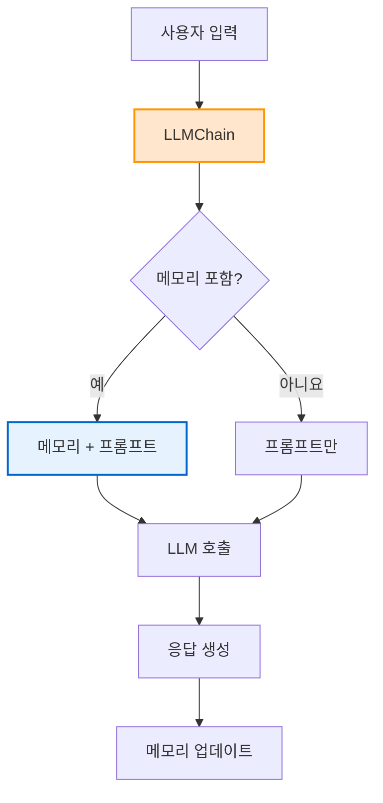
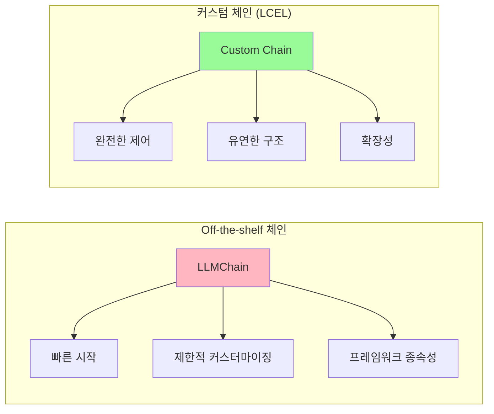

# 🔗 Section 5.6: Memory on LLMChain - LLMChain과 메모리 통합

## 🎯 학습 목표
- ✅ LLMChain에 메모리를 통합하는 방법 이해
- ✅ Off-the-shelf 체인과 커스텀 체인의 차이점 파악
- ✅ memory_key를 통한 자동 메모리 삽입 구현
- ✅ 프롬프트 템플릿에서 메모리 컨텍스트 활용

## 🧠 핵심 개념

### LLMChain이란?
**LLMChain**은 LangChain에서 제공하는 **기성품(off-the-shelf) 체인**입니다. 빠르게 시작할 수 있지만, 커스터마이징이 제한적입니다.



### Off-the-shelf vs 커스텀 체인



**💡 핵심 통찰**: 
- **시작 단계**: Off-the-shelf 체인으로 빠른 프로토타이핑
- **발전 단계**: LCEL을 사용한 커스텀 체인으로 전환
- **프로덕션**: 완전한 제어가 가능한 커스텀 솔루션

## 📋 주요 클래스/함수 레퍼런스

### LLMChain 클래스
```python
from langchain.chains import LLMChain
from langchain.prompts import PromptTemplate
from langchain.memory import ConversationSummaryBufferMemory

class LLMChain:
    def __init__(
        self,
        llm: BaseLanguageModel,              # 📌 용도: 메인 LLM 모델, 타입: Required
        prompt: PromptTemplate,              # 📌 용도: 프롬프트 템플릿, 타입: Required  
        memory: BaseMemory = None,           # 📌 용도: 메모리 인스턴스, 타입: Optional
        verbose: bool = False,               # 📌 용도: 디버깅용 로그 출력, 타입: bool
        memory_key: str = "history"          # 📌 용도: 템플릿에서 메모리 위치 지정
    ):
        """
        📋 기능: LLM과 메모리를 통합한 기성품 체인 생성
        📥 입력: LLM, 프롬프트, 메모리 설정
        📤 출력: LLMChain 인스턴스
        💡 사용 시나리오: 빠른 프로토타이핑, 간단한 대화 시스템
        🔗 관련 개념: Chain of Responsibility, Template Method Pattern
        """
```

### 핵심 메서드

#### predict()
```python
def predict(self, **kwargs) -> str:
    """
    📋 기능: 체인 실행 및 응답 생성
    📥 입력: 키워드 인자 (프롬프트 변수들)
    📤 출력: LLM 응답 텍스트
    💡 사용 시나리오: 단일 입력에 대한 응답 생성
    """
```

#### apply()
```python
def apply(self, input_list: List[Dict]) -> List[Dict]:
    """
    📋 기능: 여러 입력에 대한 배치 처리
    📥 입력: 입력 딕셔너리 리스트
    📤 출력: 응답 딕셔너리 리스트
    💡 사용 시나리오: 대량 데이터 처리
    """
```

## 🔧 동작 과정 상세

### 1. 기본 LLMChain 구성 (메모리 없음)
```python
# === Step 1: 기본 체인 설정 (문제 상황) ===
from langchain.chains import LLMChain
from langchain.prompts import PromptTemplate
from langchain.chat_models import ChatOpenAI

# LLM 초기화
llm = ChatOpenAI(temperature=0.7, model="gpt-3.5-turbo")

# 간단한 프롬프트 (메모리 없음)
simple_prompt = PromptTemplate(
    input_variables=["question"],
    template="{question}"  # 📌 문제: 컨텍스트 없는 단순한 질문만
)

# 기본 체인 생성
basic_chain = LLMChain(
    llm=llm,
    prompt=simple_prompt,
    verbose=True  # 📌 중요: 디버깅을 위한 로그 활성화
)

# === Step 2: 기본 체인 테스트 (메모리 문제 확인) ===
print("=== 기본 체인 테스트 (메모리 없음) ===")

# 첫 번째 대화
response1 = basic_chain.predict(question="안녕하세요, 제 이름은 김철수입니다.")
print(f"AI: {response1}")

# 두 번째 대화  
response2 = basic_chain.predict(question="저는 서울에 살고 있어요.")
print(f"AI: {response2}")

# 세 번째 대화 - 이름을 기억하는지 테스트
response3 = basic_chain.predict(question="제 이름이 뭐죠?")
print(f"AI: {response3}")
# 📌 문제: "죄송하지만 이름을 알려주지 않으셨습니다" 같은 응답

print("\n=== verbose=True로 프롬프트 내용 확인 ===")
# verbose=True일 때 출력되는 실제 프롬프트:
# > Entering new LLMChain chain...
# > Prompt after formatting: 제 이름이 뭐죠?
# > Finished chain.
```

### 2. 메모리 통합 - 잘못된 방법
```python
# === Step 3: 메모리 추가했지만 프롬프트에 연결 안함 (여전히 문제) ===
from langchain.memory import ConversationSummaryBufferMemory

# 메모리 초기화
memory = ConversationSummaryBufferMemory(
    llm=llm,
    max_token_limit=150,  # 📌 작은 값으로 요약 동작 테스트
    return_messages=False
)

# 메모리를 추가한 체인 (하지만 프롬프트는 그대로)
chain_with_memory = LLMChain(
    llm=llm,
    prompt=simple_prompt,  # 📌 문제: 여전히 {question}만 있는 프롬프트
    memory=memory,
    verbose=True
)

print("=== 메모리 추가했지만 프롬프트 연결 안함 ===")

# 대화 테스트
response1 = chain_with_memory.predict(question="안녕하세요, 제 이름은 김철수입니다.")
print(f"AI: {response1}")

response2 = chain_with_memory.predict(question="저는 서울에 살고 있어요.")  
print(f"AI: {response2}")

response3 = chain_with_memory.predict(question="제 이름이 뭐죠?")
print(f"AI: {response3}")
# 📌 여전히 문제: 이름을 기억하지 못함

# === 하지만 메모리는 업데이트되고 있음을 확인 ===
print("\n=== 메모리 상태 확인 ===")
memory_content = memory.load_memory_variables({})
print(f"메모리 내용: {memory_content}")
# 출력: {'history': '사용자가 김철수라고 자기소개하고 서울 거주를 언급함...'}
```

### 3. 올바른 메모리 통합
```python
# === Step 4: 올바른 메모리 통합 (해결책) ===

# 메모리를 포함한 프롬프트 템플릿
memory_prompt = PromptTemplate(
    input_variables=["chat_history", "question"],  # 📌 중요: chat_history 추가
    template="""당신은 도움이 되는 AI입니다. 사용자와 대화하고 있습니다.

대화 기록:
{chat_history}

사용자: {question}
AI 응답:"""
)

# 올바르게 구성된 체인
correct_chain = LLMChain(
    llm=llm,
    prompt=memory_prompt,
    memory=memory,
    verbose=True
)

# 📌 핵심: memory_key 설정 (자동으로 설정되지만 명시적으로 지정 가능)
# memory.memory_key = "chat_history"  # 기본값이 "history"이므로 필요시에만

print("=== 올바른 메모리 통합 테스트 ===")

# 새로운 메모리로 다시 테스트
fresh_memory = ConversationSummaryBufferMemory(
    llm=llm,
    max_token_limit=150,
    return_messages=False,
    memory_key="chat_history"  # 📌 중요: 프롬프트의 {chat_history}와 일치
)

final_chain = LLMChain(
    llm=llm,
    prompt=memory_prompt,
    memory=fresh_memory,
    verbose=True
)

# 성공적인 대화 테스트
print("1️⃣ 첫 번째 대화:")
response1 = final_chain.predict(question="안녕하세요, 제 이름은 김철수입니다.")
print(f"AI: {response1}")

print("\n2️⃣ 두 번째 대화:")
response2 = final_chain.predict(question="저는 서울에 살고 있어요.")
print(f"AI: {response2}")

print("\n3️⃣ 메모리 테스트:")
response3 = final_chain.predict(question="제 이름이 뭐죠?")
print(f"AI: {response3}")
# 📌 성공: "당신의 이름은 김철수입니다."

print("\n4️⃣ verbose 출력으로 프롬프트 내용 확인:")
# > Prompt after formatting:
# > 당신은 도움이 되는 AI입니다. 사용자와 대화하고 있습니다.
# > 
# > 대화 기록:
# > Human: 안녕하세요, 제 이름은 김철수입니다.
# > AI: 안녕하세요 김철수님!
# > Human: 저는 서울에 살고 있어요.
# > AI: 서울은 좋은 곳이네요!
# > 
# > 사용자: 제 이름이 뭐죠?
# > AI 응답:
```

### 4. 메모리 키 시스템 이해
```python
# === Step 5: memory_key 시스템 완전 이해 ===

def demonstrate_memory_key_system():
    """메모리 키 시스템 작동 원리 시연"""
    
    print("=== Memory Key 시스템 작동 원리 ===")
    
    # 1. 메모리 키와 프롬프트 변수가 일치하지 않는 경우
    wrong_prompt = PromptTemplate(
        input_variables=["conversation_context", "question"],  # conversation_context
        template="컨텍스트: {conversation_context}\n질문: {question}\n답변:"
    )
    
    memory_for_test = ConversationSummaryBufferMemory(
        llm=llm,
        memory_key="history",  # 📌 불일치: history vs conversation_context
        return_messages=False
    )
    
    try:
        wrong_chain = LLMChain(
            llm=llm,
            prompt=wrong_prompt,
            memory=memory_for_test
        )
        # 📌 오류 발생 가능: KeyError 또는 빈 컨텍스트
    except Exception as e:
        print(f"오류 발생: {e}")
    
    # 2. 올바른 매칭
    correct_memory = ConversationSummaryBufferMemory(
        llm=llm,
        memory_key="conversation_context",  # 📌 일치: conversation_context
        return_messages=False
    )
    
    correct_chain = LLMChain(
        llm=llm,
        prompt=wrong_prompt,
        memory=correct_memory
    )
    
    print("✅ 올바른 memory_key 매칭으로 정상 작동")

# 실행
demonstrate_memory_key_system()
```

## 💻 실전 예제

### 고급 멀티 컨텍스트 체인 시스템
```python
from langchain.chains import LLMChain
from langchain.prompts import PromptTemplate
from langchain.memory import ConversationSummaryBufferMemory
from langchain.chat_models import ChatOpenAI
from datetime import datetime
from typing import Dict, Any
import json

class AdvancedMemoryChain:
    """
    🎯 목적: LLMChain에서 고급 메모리 관리 시스템
    💡 특징: 다중 메모리 컨텍스트, 자동 요약, 디버깅 도구
    """
    
    def __init__(self):
        # LLM 설정
        self.llm = ChatOpenAI(
            temperature=0.3,
            model="gpt-3.5-turbo"
        )
        
        # 메인 메모리 (일반 대화용)
        self.main_memory = ConversationSummaryBufferMemory(
            llm=self.llm,
            max_token_limit=300,
            memory_key="main_conversation",
            return_messages=False
        )
        
        # 작업 메모리 (특정 작업 컨텍스트용)
        self.task_memory = ConversationSummaryBufferMemory(
            llm=self.llm,
            max_token_limit=200,
            memory_key="task_context", 
            return_messages=False
        )
        
        # 고급 프롬프트 템플릿
        self.main_prompt = PromptTemplate(
            input_variables=["main_conversation", "task_context", "current_time", "user_input"],
            template="""당신은 전문적인 AI 어시스턴트입니다.

현재 시간: {current_time}

=== 일반 대화 기록 ===
{main_conversation}

=== 현재 작업 컨텍스트 ===  
{task_context}

=== 사용자 요청 ===
{user_input}

위의 모든 컨텍스트를 고려하여 도움이 되고 정확한 응답을 제공해주세요:"""
        )
        
        # 메인 체인 생성
        self.chain = LLMChain(
            llm=self.llm,
            prompt=self.main_prompt,
            memory=self.main_memory,  # 📌 주 메모리만 자동 연결
            verbose=True
        )
        
        # 세션 정보
        self.session_info = {
            "start_time": datetime.now(),
            "interaction_count": 0,
            "debug_mode": False
        }
    
    def chat(self, user_input: str, task_context: str = "") -> str:
        """
        📋 기능: 다중 컨텍스트 대화 처리
        📥 입력: 사용자 입력과 작업 컨텍스트
        📤 출력: AI 응답
        💡 사용 시나리오: 복잡한 대화와 작업 관리
        """
        
        # 현재 시간
        current_time = datetime.now().strftime("%Y-%m-%d %H:%M:%S")
        
        # 메모리에서 컨텍스트 로드
        main_context = self.main_memory.load_memory_variables({})
        task_ctx = self.task_memory.load_memory_variables({}) if task_context else {"task_context": ""}
        
        # 작업 컨텍스트가 있으면 작업 메모리에 저장
        if task_context:
            self.task_memory.save_context(
                {"input": f"작업 컨텍스트 업데이트: {task_context}"},
                {"output": "컨텍스트가 업데이트되었습니다."}
            )
            task_ctx = self.task_memory.load_memory_variables({})
        
        # 응답 생성 (자동으로 main_memory는 업데이트됨)
        response = self.chain.predict(
            main_conversation=main_context.get("main_conversation", ""),
            task_context=task_ctx.get("task_context", ""),
            current_time=current_time,
            user_input=user_input
        )
        
        # 세션 정보 업데이트
        self.session_info["interaction_count"] += 1
        
        return response
    
    def enable_debug_mode(self):
        """디버깅 모드 활성화"""
        self.session_info["debug_mode"] = True
        self.chain.verbose = True
        print("🔧 디버깅 모드가 활성화되었습니다.")
    
    def get_memory_status(self) -> Dict[str, Any]:
        """메모리 상태 조회"""
        main_mem = self.main_memory.load_memory_variables({})
        task_mem = self.task_memory.load_memory_variables({})
        
        return {
            "main_memory": main_mem,
            "task_memory": task_mem,
            "session_info": self.session_info,
            "memory_sizes": {
                "main_tokens": len(main_mem.get("main_conversation", "").split()),
                "task_tokens": len(task_mem.get("task_context", "").split())
            }
        }
    
    def clear_task_memory(self):
        """작업 메모리 초기화"""
        self.task_memory.clear()
        print("🧹 작업 메모리가 초기화되었습니다.")
    
    def export_conversation(self, filename: str = None):
        """대화 내용 내보내기"""
        if not filename:
            filename = f"conversation_{datetime.now().strftime('%Y%m%d_%H%M%S')}.json"
        
        export_data = {
            "session_info": self.session_info,
            "memories": self.get_memory_status(),
            "export_time": datetime.now().isoformat()
        }
        
        with open(filename, 'w', encoding='utf-8') as f:
            json.dump(export_data, f, ensure_ascii=False, indent=2)
        
        print(f"📁 대화 내용이 {filename}에 저장되었습니다.")

# === 실전 사용 예제 ===
print("🚀 고급 멀티 컨텍스트 체인 시스템 시작\n")

# 시스템 초기화
advanced_chain = AdvancedMemoryChain()
advanced_chain.enable_debug_mode()

# 복합 시나리오 테스트
scenarios = [
    {
        "input": "안녕하세요, 저는 개발팀의 김개발이라고 합니다.",
        "task": "새로운 사용자 등록"
    },
    {
        "input": "Python으로 REST API를 개발하는 프로젝트를 시작하려고 합니다.",
        "task": "프로젝트 계획 수립 - Python REST API 개발"
    },
    {
        "input": "FastAPI와 Django 중에서 어떤 것을 추천하시나요?",
        "task": "기술 스택 선택 - FastAPI vs Django 비교"
    },
    {
        "input": "제가 누구였는지 기억하시나요? 그리고 지금 하고 있는 프로젝트는 뭐였죠?",
        "task": ""
    }
]

for i, scenario in enumerate(scenarios, 1):
    print(f"{'='*10} 시나리오 {i} {'='*10}")
    print(f"👤 사용자: {scenario['input']}")
    if scenario['task']:
        print(f"📋 작업 컨텍스트: {scenario['task']}")
    
    response = advanced_chain.chat(
        user_input=scenario["input"],
        task_context=scenario["task"]
    )
    
    print(f"🤖 AI 응답: {response}\n")

# 메모리 상태 분석
print("="*50)
print("📊 최종 메모리 상태 분석")
print("="*50)

memory_status = advanced_chain.get_memory_status()
print(f"📈 세션 정보:")
print(f"   시작 시간: {memory_status['session_info']['start_time']}")
print(f"   상호작용 수: {memory_status['session_info']['interaction_count']}회")

print(f"\n💾 메모리 사용량:")
print(f"   일반 대화: {memory_status['memory_sizes']['main_tokens']} 단어")
print(f"   작업 컨텍스트: {memory_status['memory_sizes']['task_tokens']} 단어")

print(f"\n📝 일반 대화 메모리:")
print(f"   {memory_status['main_memory']['main_conversation']}")

print(f"\n🎯 작업 메모리:")
print(f"   {memory_status['task_memory']['task_context']}")

# 대화 내용 저장
advanced_chain.export_conversation()
```

### LLMChain 디버깅 및 최적화 도구
```python
class LLMChainDebugger:
    """
    🎯 목적: LLMChain의 메모리 통합 문제 진단 및 최적화
    💡 특징: 자동 문제 감지, 성능 분석, 최적화 제안
    """
    
    def __init__(self, chain: LLMChain):
        self.chain = chain
        self.test_results = []
    
    def diagnose_memory_integration(self) -> Dict[str, Any]:
        """메모리 통합 상태 진단"""
        
        print("🔍 LLMChain 메모리 통합 진단 시작...\n")
        
        diagnosis = {
            "memory_present": False,
            "memory_key_match": False,
            "prompt_has_memory_slot": False,
            "recommendations": []
        }
        
        # 1. 메모리 존재 여부 확인
        if hasattr(self.chain, 'memory') and self.chain.memory is not None:
            diagnosis["memory_present"] = True
            print("✅ 메모리가 체인에 연결되어 있습니다.")
            
            # 2. 메모리 키 확인
            memory_key = getattr(self.chain.memory, 'memory_key', 'history')
            print(f"📌 메모리 키: {memory_key}")
            
            # 3. 프롬프트 변수 확인
            if hasattr(self.chain.prompt, 'input_variables'):
                prompt_vars = self.chain.prompt.input_variables
                print(f"📌 프롬프트 변수들: {prompt_vars}")
                
                if memory_key in prompt_vars:
                    diagnosis["memory_key_match"] = True
                    diagnosis["prompt_has_memory_slot"] = True
                    print("✅ 메모리 키와 프롬프트 변수가 일치합니다.")
                else:
                    diagnosis["recommendations"].append(
                        f"프롬프트에 '{memory_key}' 변수를 추가하거나 memory_key를 변경하세요."
                    )
                    print(f"❌ 프롬프트에 '{memory_key}' 변수가 없습니다.")
        else:
            diagnosis["recommendations"].append("체인에 메모리를 추가하세요.")
            print("❌ 메모리가 체인에 연결되어 있지 않습니다.")
        
        return diagnosis
    
    def test_memory_functionality(self, test_conversations: list) -> Dict[str, Any]:
        """메모리 기능 테스트"""
        
        print("\n🧪 메모리 기능 테스트 시작...")
        
        test_result = {
            "conversations": [],
            "memory_updates": [],
            "context_preservation": False,
            "summary_count": 0
        }
        
        for i, conv in enumerate(test_conversations):
            print(f"\n--- 테스트 {i+1} ---")
            print(f"입력: {conv}")
            
            try:
                # 응답 생성 전 메모리 상태
                pre_memory = None
                if self.chain.memory:
                    pre_memory = self.chain.memory.load_memory_variables({})
                
                # 응답 생성
                response = self.chain.predict(question=conv)
                print(f"응답: {response}")
                
                # 응답 생성 후 메모리 상태
                post_memory = None
                if self.chain.memory:
                    post_memory = self.chain.memory.load_memory_variables({})
                
                # 결과 저장
                conversation_result = {
                    "input": conv,
                    "output": response,
                    "pre_memory": pre_memory,
                    "post_memory": post_memory,
                    "memory_changed": pre_memory != post_memory
                }
                
                test_result["conversations"].append(conversation_result)
                
                if conversation_result["memory_changed"]:
                    test_result["memory_updates"].append(i+1)
                    print("✅ 메모리가 업데이트되었습니다.")
                else:
                    print("❌ 메모리가 업데이트되지 않았습니다.")
                    
            except Exception as e:
                print(f"❌ 오류 발생: {e}")
                test_result["conversations"].append({
                    "input": conv,
                    "error": str(e)
                })
        
        # 컨텍스트 보존 테스트 (마지막 대화에서 첫 번째 대화 정보 참조)
        if len(test_conversations) > 1:
            try:
                context_test = self.chain.predict(question="첫 번째로 말한 내용이 뭐였나요?")
                print(f"\n🔍 컨텍스트 보존 테스트: {context_test}")
                
                # 간단한 휴리스틱으로 컨텍스트 보존 여부 판단
                first_conv = test_conversations[0].lower()
                if any(word in context_test.lower() for word in first_conv.split() if len(word) > 2):
                    test_result["context_preservation"] = True
                    print("✅ 컨텍스트가 보존되고 있습니다.")
                else:
                    print("❌ 컨텍스트가 보존되지 않고 있습니다.")
            except Exception as e:
                print(f"컨텍스트 테스트 오류: {e}")
        
        return test_result
    
    def generate_optimization_report(self, diagnosis: dict, test_result: dict):
        """최적화 보고서 생성"""
        
        print("\n" + "="*60)
        print("📈 LLMChain 최적화 보고서")
        print("="*60)
        
        # 현재 상태 요약
        print("\n🎯 현재 상태:")
        print(f"   메모리 연결: {'✅' if diagnosis['memory_present'] else '❌'}")
        print(f"   키 매칭: {'✅' if diagnosis['memory_key_match'] else '❌'}")
        print(f"   컨텍스트 보존: {'✅' if test_result['context_preservation'] else '❌'}")
        print(f"   메모리 업데이트: {len(test_result['memory_updates'])}회")
        
        # 권장사항
        print("\n💡 권장사항:")
        if diagnosis["recommendations"]:
            for i, rec in enumerate(diagnosis["recommendations"], 1):
                print(f"   {i}. {rec}")
        else:
            print("   현재 설정이 올바릅니다!")
        
        # 성능 분석
        successful_conversations = [c for c in test_result["conversations"] if "error" not in c]
        error_rate = (len(test_result["conversations"]) - len(successful_conversations)) / len(test_result["conversations"])
        
        print(f"\n📊 성능 지표:")
        print(f"   성공률: {(1-error_rate)*100:.1f}%")
        print(f"   메모리 업데이트율: {len(test_result['memory_updates'])/len(successful_conversations)*100:.1f}%")
        
        if test_result["context_preservation"]:
            print("   컨텍스트 품질: 우수")
        else:
            print("   컨텍스트 품질: 개선 필요")

# === 디버깅 도구 사용 예제 ===
print("🔧 LLMChain 디버깅 도구 테스트")

# 문제가 있는 체인 생성 (의도적)
problematic_prompt = PromptTemplate(
    input_variables=["question"],  # memory_key가 없음
    template="질문: {question}\n답변:"
)

memory = ConversationSummaryBufferMemory(
    llm=ChatOpenAI(),
    memory_key="history",  # 프롬프트에 {history}가 없음
    return_messages=False
)

problematic_chain = LLMChain(
    llm=ChatOpenAI(),
    prompt=problematic_prompt,
    memory=memory
)

# 디버깅 실행
debugger = LLMChainDebugger(problematic_chain)

# 진단
diagnosis = debugger.diagnose_memory_integration()

# 테스트
test_conversations = [
    "안녕하세요, 저는 박영희입니다.",
    "제가 좋아하는 음식은 피자입니다.", 
    "저는 부산에 살고 있어요.",
    "제 이름과 좋아하는 음식을 기억하시나요?"
]

test_result = debugger.test_memory_functionality(test_conversations)

# 보고서 생성
debugger.generate_optimization_report(diagnosis, test_result)
```

## 🔍 변수/함수 상세 설명

### 핵심 변수들
```python
# 체인 구성 요소
llm = ChatOpenAI()                    # 📌 용도: 메인 LLM 모델, 타입: BaseLanguageModel
prompt = PromptTemplate()             # 📌 용도: 프롬프트 템플릿, 타입: PromptTemplate  
memory = ConversationSummaryBufferMemory()  # 📌 용도: 메모리 인스턴스, 타입: BaseMemory

# LLMChain 설정
verbose = True                        # 📌 용도: 디버깅 로그 활성화, 타입: bool
memory_key = "history"               # 📌 용도: 템플릿에서 메모리 위치 지정, 타입: str

# 프롬프트 변수
input_variables = ["history", "question"]  # 📌 용도: 템플릿 변수 목록, 타입: List[str]
template = "Context: {history}\nQ: {question}\nA:"  # 📌 용도: 프롬프트 템플릿, 타입: str
```

### 핵심 함수들
```python
def predict(**kwargs) -> str:
    """
    📋 기능: 체인 실행 및 단일 응답 생성
    📥 입력: 프롬프트 변수들 (키워드 인자)
    📤 출력: LLM 응답 텍스트
    💡 사용 시나리오: 단일 질문-답변 처리
    """

def apply(input_list: List[Dict]) -> List[Dict]:
    """
    📋 기능: 배치 처리로 여러 입력 동시 처리
    📥 입력: 입력 딕셔너리들의 리스트
    📤 출력: 응답 딕셔너리들의 리스트
    💡 사용 시나리오: 대량 데이터 일괄 처리
    """

def generate(input_list: List[Dict]) -> LLMResult:
    """
    📋 기능: 상세한 생성 결과와 메타데이터 반환
    📥 입력: 입력 딕셔너리들의 리스트
    📤 출력: LLMResult (토큰 사용량, 응답 등)
    💡 사용 시나리오: 상세한 분석이 필요한 경우
    """
```

## 🧪 실습 과제

### 🔨 기본 과제
1. **메모리 키 매칭 문제 해결**: 의도적으로 잘못된 설정으로 체인을 만들고 수정하기
```python
# TODO: memory_key와 프롬프트 변수가 일치하지 않는 문제 만들고 해결하기
def fix_memory_key_mismatch():
    # 구현하기
    pass
```

2. **Verbose 모드 활용**: 디버깅을 통한 프롬프트 플로우 분석
```python
# TODO: verbose=True로 실제 프롬프트가 어떻게 구성되는지 분석
```

### 🚀 심화 과제
3. **커스텀 메모리 키 시스템**: 여러 메모리를 하나의 체인에서 사용
```python
# TODO: 일반 대화 + 작업 컨텍스트 + 사용자 프로필 메모리 동시 사용
class MultiMemoryLLMChain:
    def __init__(self):
        self.conversation_memory = ConversationSummaryBufferMemory()
        self.task_memory = ConversationBufferWindowMemory()
        self.profile_memory = ConversationKGMemory()
        # 구현하기
```

4. **성능 비교 분석**: LLMChain vs LCEL의 메모리 처리 성능 비교
```python
# TODO: 같은 메모리와 프롬프트로 두 방식 성능 측정
```

### 💡 창의 과제
5. **자동 메모리 키 매칭**: 프롬프트를 분석해서 자동으로 memory_key 설정
6. **메모리 압축 최적화**: 체인 성능에 따른 동적 메모리 압축 전략
7. **체인 마이그레이션 도구**: LLMChain에서 LCEL로 자동 변환

## ⚠️ 주의사항

### 메모리 키 매칭
```python
# 🚨 흔한 실수: 메모리 키와 프롬프트 변수 불일치
memory = ConversationBufferMemory(memory_key="chat_history")
prompt = PromptTemplate(
    input_variables=["history", "question"],  # ❌ "history" vs "chat_history"
    template="History: {history}\nQ: {question}"
)

# ✅ 올바른 방법
memory = ConversationBufferMemory(memory_key="history")  # 일치
prompt = PromptTemplate(
    input_variables=["history", "question"],  # ✅ 일치
    template="History: {history}\nQ: {question}"
)
```

### Off-the-shelf 체인의 한계
1. **커스터마이징 제한**: 내부 로직 수정 어려움
2. **복잡한 플로우 처리**: 다중 단계 처리 제한
3. **에러 핸들링**: 세밀한 에러 제어 부족

### 성능 고려사항
- **메모리 오버헤드**: 큰 메모리는 지연 시간 증가
- **토큰 관리**: 프롬프트 크기 모니터링 필요
- **버전 호환성**: LangChain 업데이트 시 API 변경 주의

## 🔗 관련 자료
- **이전 학습**: [5.5 ConversationKGMemory](./5.5_ConversationKGMemory.md)
- **다음 학습**: [5.7 Chat Based Memory](./5.7_Chat_Based_Memory.md)
- **체인 비교**: [LCEL vs LLMChain](./5.8_LCEL_Based_Memory.md)
- **디버깅 가이드**: [LangChain Debugging Best Practices](../Advanced_Topics/Debugging.md)

---

💡 **핵심 정리**: LLMChain은 **빠른 프로토타이핑**에 적합하지만, 메모리 통합 시 **memory_key와 프롬프트 변수의 일치**가 필수입니다. **verbose=True**를 활용한 디버깅으로 실제 프롬프트 구성을 확인하고, 복잡한 요구사항이 있다면 **LCEL 기반 커스텀 체인**으로의 전환을 고려해야 합니다.