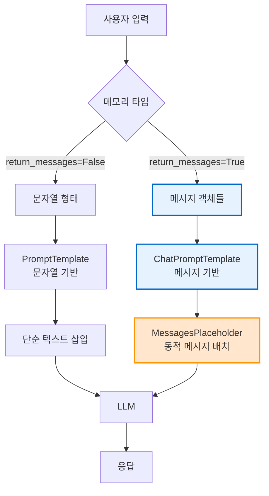
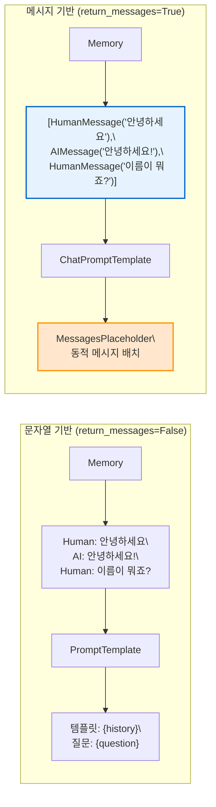

# 💬 Section 5.7: Chat Based Memory - 메시지 기반 메모리 시스템

## 🎯 학습 목표
- ✅ return_messages=True를 통한 메시지 객체 반환 이해
- ✅ ChatPromptTemplate과 MessagesPlaceholder 활용
- ✅ 동적 메시지 수를 처리하는 플레이스홀더 시스템
- ✅ 문자열 기반 vs 메시지 기반 메모리의 차이점 파악

## 🧠 핵심 개념

### Chat Based Memory란?
**Chat Based Memory**는 메모리 내용을 **문자열이 아닌 메시지 객체**로 반환하여 구조화된 대화를 지원하는 시스템입니다.



### 문자열 vs 메시지 기반 메모리 비교



**핵심 차이점**:
- **문자열**: 모든 대화를 하나의 텍스트로 병합
- **메시지**: 각 발화를 개별 메시지 객체로 유지
- **구조화**: 메시지 기반이 더 구조화된 처리 가능
- **플레이스홀더**: 동적 메시지 수 처리

## 📋 주요 클래스/함수 레퍼런스

### ChatPromptTemplate 클래스
```python
from langchain.prompts import ChatPromptTemplate, MessagesPlaceholder
from langchain.schema import HumanMessage, AIMessage, SystemMessage

class ChatPromptTemplate:
    def from_messages(
        self,
        messages: List[Union[BaseMessage, Tuple, str]]  # 📌 용도: 메시지 템플릿 구성
    ):
        """
        📋 기능: 메시지 기반 프롬프트 템플릿 생성
        📥 입력: 메시지 리스트 (시스템, 사용자, AI 메시지)
        📤 출력: ChatPromptTemplate 인스턴스
        💡 사용 시나리오: 구조화된 대화 시스템
        🔗 관련 개념: Message Objects, Chat Completion
        """
```

### MessagesPlaceholder 클래스
```python
class MessagesPlaceholder:
    def __init__(
        self,
        variable_name: str,                  # 📌 용도: 변수 이름 지정, 타입: Required
        optional: bool = False               # 📌 용도: 선택적 플레이스홀더 여부
    ):
        """
        📋 기능: 동적 메시지 수를 처리하는 플레이스홀더
        📥 입력: 변수 이름과 옵션 설정
        📤 출력: MessagesPlaceholder 인스턴스
        💡 사용 시나리오: 가변 길이 대화 히스토리
        🔗 관련 개념: Dynamic Templates, Variable Message Lists
        """
```

### 메시지 타입들
```python
# 기본 메시지 타입들
HumanMessage(content: str)               # 📌 용도: 사용자 메시지
AIMessage(content: str)                  # 📌 용도: AI 응답 메시지
SystemMessage(content: str)              # 📌 용도: 시스템 지시사항
```

## 🔧 동작 과정 상세

### 1. 문자열 기반 메모리 (기본 동작)
```python
# === Step 1: 기본 문자열 메모리 동작 확인 ===
from langchain.memory import ConversationSummaryBufferMemory
from langchain.chat_models import ChatOpenAI

# LLM 설정
llm = ChatOpenAI(temperature=0.3, model="gpt-3.5-turbo")

# 기본 메모리 (return_messages=False)
string_memory = ConversationSummaryBufferMemory(
    llm=llm,
    max_token_limit=150,
    return_messages=False,  # 📌 기본값: 문자열로 반환
    memory_key="history"
)

# 대화 추가
string_memory.save_context(
    {"input": "안녕하세요, 제 이름은 김철수입니다."},
    {"output": "안녕하세요 김철수님! 만나서 반갑습니다."}
)

string_memory.save_context(
    {"input": "저는 개발자로 일하고 있어요."},
    {"output": "개발자시는군요! 어떤 분야를 전문으로 하시나요?"}
)

# 메모리 내용 확인
print("=== 문자열 기반 메모리 출력 ===")
memory_content = string_memory.load_memory_variables({})
print(f"타입: {type(memory_content['history'])}")
print(f"내용:\n{memory_content['history']}")

# 출력 예시:
# 타입: <class 'str'>
# 내용:
# Human: 안녕하세요, 제 이름은 김철수입니다.
# AI: 안녕하세요 김철수님! 만나서 반갑습니다.
# Human: 저는 개발자로 일하고 있어요.
# AI: 개발자시는군요! 어떤 분야를 전문으로 하시나요?
```

### 2. 메시지 기반 메모리로 전환
```python
# === Step 2: 메시지 기반 메모리로 변경 ===

# return_messages=True로 변경
message_memory = ConversationSummaryBufferMemory(
    llm=llm,
    max_token_limit=150,
    return_messages=True,  # 📌 핵심: 메시지 객체로 반환
    memory_key="chat_history"  # 📌 변수명 변경 (구분을 위해)
)

# 같은 대화 추가
message_memory.save_context(
    {"input": "안녕하세요, 제 이름은 김철수입니다."},
    {"output": "안녕하세요 김철수님! 만나서 반갑습니다."}
)

message_memory.save_context(
    {"input": "저는 개발자로 일하고 있어요."},
    {"output": "개발자시는군요! 어떤 분야를 전문으로 하시나요?"}
)

# 메모리 내용 확인
print("=== 메시지 기반 메모리 출력 ===")
message_content = message_memory.load_memory_variables({})
print(f"타입: {type(message_content['chat_history'])}")
print(f"메시지 수: {len(message_content['chat_history'])}")

for i, msg in enumerate(message_content['chat_history']):
    print(f"{i+1}. {type(msg).__name__}: {msg.content}")

# 출력 예시:
# 타입: <class 'list'>
# 메시지 수: 4
# 1. HumanMessage: 안녕하세요, 제 이름은 김철수입니다.
# 2. AIMessage: 안녕하세요 김철수님! 만나서 반갑습니다.
# 3. HumanMessage: 저는 개발자로 일하고 있어요.
# 4. AIMessage: 개발자시는군요! 어떤 분야를 전문으로 하시나요?
```

### 3. ChatPromptTemplate과 MessagesPlaceholder 구성
```python
# === Step 3: 메시지 기반 프롬프트 템플릿 구성 ===
from langchain.prompts import ChatPromptTemplate, MessagesPlaceholder

# 문자열 기반 프롬프트 (이전 방식)
old_prompt = PromptTemplate(
    input_variables=["history", "question"],
    template="""당신은 도움이 되는 AI입니다.

대화 기록:
{history}

사용자: {question}
AI:"""
)

print("=== 이전 방식: 문자열 기반 프롬프트 ===")
print("프롬프트 변수:", old_prompt.input_variables)
print("템플릿 구조: 고정된 문자열 기반")

# 새로운 방식: 메시지 기반 프롬프트
chat_prompt = ChatPromptTemplate.from_messages([
    ("system", "당신은 도움이 되는 AI 어시스턴트입니다. 사용자와 자연스럽게 대화해주세요."),
    
    # 📌 핵심: MessagesPlaceholder - 동적 메시지 처리
    MessagesPlaceholder(variable_name="chat_history"),  # 가변 길이 메시지들
    
    ("human", "{question}")  # 현재 질문
])

print("\n=== 새로운 방식: 메시지 기반 프롬프트 ===")
print("프롬프트 구조: 메시지 객체 기반")
print("플레이스홀더 변수: chat_history")
print("동적 메시지 처리: 가능")

# === Step 4: MessagesPlaceholder 작동 원리 상세 ===
def demonstrate_messages_placeholder():
    """MessagesPlaceholder의 동작 원리 시연"""
    
    print("\n=== MessagesPlaceholder 작동 원리 ===")
    
    # 샘플 메시지들 (실제 메모리에서 가져온 것과 같은 형태)
    from langchain.schema import HumanMessage, AIMessage, SystemMessage
    
    sample_messages = [
        HumanMessage(content="안녕하세요!"),
        AIMessage(content="안녕하세요! 어떻게 도와드릴까요?"),
        HumanMessage(content="오늘 날씨가 어때요?"),
        AIMessage(content="죄송하지만 실시간 날씨 정보는 확인할 수 없습니다.")
    ]
    
    # 프롬프트 포맷팅 과정 시연
    formatted_prompt = chat_prompt.format_messages(
        chat_history=sample_messages,  # 📌 동적으로 메시지 리스트 삽입
        question="제가 이전에 뭐라고 말했죠?"
    )
    
    print("포맷팅된 메시지 구조:")
    for i, msg in enumerate(formatted_prompt):
        print(f"{i+1}. {type(msg).__name__}: {msg.content}")
    
    print(f"\n총 메시지 수: {len(formatted_prompt)}")
    print("구조: SystemMessage + 동적 메시지들 + HumanMessage")

demonstrate_messages_placeholder()
```

### 4. 완전한 메시지 기반 체인 구성
```python
# === Step 5: 완전한 메시지 기반 체인 시스템 ===
from langchain.chains import LLMChain

def create_message_based_chain():
    """완전한 메시지 기반 체인 생성 및 테스트"""
    
    print("=== 완전한 메시지 기반 체인 구성 ===")
    
    # 메시지 기반 메모리
    memory = ConversationSummaryBufferMemory(
        llm=llm,
        max_token_limit=200,
        return_messages=True,  # 📌 핵심 설정
        memory_key="chat_history"
    )
    
    # 메시지 기반 프롬프트
    prompt = ChatPromptTemplate.from_messages([
        ("system", """당신은 전문적인 AI 어시스턴트입니다. 
        사용자의 이전 대화 내용을 참고하여 일관성 있고 도움이 되는 응답을 제공해주세요.
        
        대화 스타일:
        - 친근하되 전문적으로
        - 이전 정보를 적절히 참조
        - 구체적이고 실용적인 답변"""),
        
        MessagesPlaceholder(variable_name="chat_history"),  # 📌 동적 메시지 배치
        ("human", "{question}")
    ])
    
    # LLMChain 구성
    chain = LLMChain(
        llm=llm,
        prompt=prompt,
        memory=memory,
        verbose=True  # 메시지 구조 확인용
    )
    
    return chain

# 체인 생성 및 테스트
message_chain = create_message_based_chain()

# === Step 6: 대화 테스트 시나리오 ===
conversation_scenarios = [
    "안녕하세요! 저는 프론트엔드 개발자 박민수라고 합니다.",
    "React와 TypeScript로 개발하는 것을 좋아해요.",
    "요즘 Next.js 14를 공부하고 있는데, 궁금한 게 있어요.",
    "앞서 제가 어떤 기술들을 언급했는지 기억하시나요?",
    "그리고 제 이름도 기억하시나요?"
]

print("\n" + "="*60)
print("🎯 메시지 기반 메모리 대화 테스트")
print("="*60)

for i, scenario in enumerate(conversation_scenarios, 1):
    print(f"\n【대화 {i}】")
    print(f"👤 사용자: {scenario}")
    
    try:
        response = message_chain.predict(question=scenario)
        print(f"🤖 AI: {response}")
        
        # 중간 메모리 상태 확인 (2, 4번째 대화 후)
        if i in [2, 4]:
            memory_state = message_chain.memory.load_memory_variables({})
            print(f"\n📊 현재 메모리 상태 (메시지 수: {len(memory_state['chat_history'])}):")
            
            for j, msg in enumerate(memory_state['chat_history'][-4:]):  # 최근 4개만 표시
                msg_type = type(msg).__name__.replace('Message', '')
                print(f"   {j+1}. {msg_type}: {msg.content[:50]}...")
                
    except Exception as e:
        print(f"❌ 오류 발생: {e}")

print("\n" + "="*60)
```

## 💻 실전 예제

### 고급 멀티모달 챗봇 시스템
```python
from langchain.prompts import ChatPromptTemplate, MessagesPlaceholder
from langchain.memory import ConversationSummaryBufferMemory
from langchain.chat_models import ChatOpenAI
from langchain.schema import HumanMessage, AIMessage, SystemMessage
from datetime import datetime
from typing import List, Dict, Any
import json

class AdvancedMessageBasedChatbot:
    """
    🎯 목적: 고급 메시지 기반 챗봇 시스템
    💡 특징: 컨텍스트 인식, 페르소나 적응, 감정 분석
    """
    
    def __init__(self, persona: str = "professional"):
        self.llm = ChatOpenAI(temperature=0.4, model="gpt-3.5-turbo")
        self.persona = persona
        self.conversation_count = 0
        
        # 페르소나별 시스템 메시지
        self.personas = {
            "professional": """당신은 전문적인 비즈니스 어시스턴트입니다.
            - 정중하고 격식 있는 톤 유지
            - 구체적이고 실용적인 조언 제공
            - 비즈니스 맥락에서 답변""",
            
            "friendly": """당신은 친근한 일상 대화 파트너입니다.
            - 편안하고 친근한 톤 사용
            - 공감과 격려 표현
            - 개인적 경험 공유 가능""",
            
            "educational": """당신은 교육 전문 멘토입니다.
            - 학습자 중심의 설명 방식
            - 단계적이고 체계적인 가르침
            - 질문을 통한 이해도 확인"""
        }
        
        # 메모리 초기화
        self.memory = ConversationSummaryBufferMemory(
            llm=self.llm,
            max_token_limit=400,
            return_messages=True,  # 📌 메시지 객체로 관리
            memory_key="conversation_history"
        )
        
        # 감정 상태 메모리 (별도)
        self.emotion_memory = ConversationSummaryBufferMemory(
            llm=self.llm,
            max_token_limit=200,
            return_messages=True,
            memory_key="emotion_context"
        )
        
        # 동적 프롬프트 생성
        self.setup_dynamic_prompt()
    
    def setup_dynamic_prompt(self):
        """페르소나에 따른 동적 프롬프트 설정"""
        
        system_message = f"""{self.personas[self.persona]}

현재 시간: {{current_time}}
대화 횟수: {{conversation_count}}

다음 지침을 따라 응답해주세요:
1. 이전 대화 맥락을 적절히 참조하세요
2. 사용자의 감정 상태를 고려하세요
3. 일관성 있는 페르소나를 유지하세요
4. 구체적이고 실행 가능한 답변을 제공하세요

감정 컨텍스트가 있다면 이를 고려하여 응답 톤을 조정하세요."""

        self.prompt = ChatPromptTemplate.from_messages([
            ("system", system_message),
            
            # 📌 일반 대화 히스토리
            MessagesPlaceholder(variable_name="conversation_history", optional=True),
            
            # 📌 감정 컨텍스트 (선택적)
            MessagesPlaceholder(variable_name="emotion_context", optional=True),
            
            ("human", "{user_input}")
        ])
        
        # 체인 생성
        from langchain.chains import LLMChain
        self.chain = LLMChain(
            llm=self.llm,
            prompt=self.prompt,
            memory=self.memory,
            verbose=False
        )
    
    def analyze_emotion(self, user_input: str) -> Dict[str, Any]:
        """사용자 입력의 감정 분석"""
        
        emotion_prompt = f"""다음 텍스트의 감정을 분석하고 JSON 형태로 반환해주세요:

텍스트: "{user_input}"

분석 형태:
{{
    "primary_emotion": "기본 감정 (행복, 슬픔, 분노, 불안, 중립 중 하나)",
    "intensity": "강도 (1-5)",
    "context": "감정의 맥락이나 원인",
    "suggested_tone": "적절한 응답 톤 (공감, 격려, 전문적, 중립 등)"
}}"""
        
        try:
            emotion_analysis = self.llm.predict(emotion_prompt)
            # 간단한 JSON 파싱 (실제로는 더 robust한 파싱 필요)
            return {
                "primary_emotion": "중립",
                "intensity": 3,
                "context": "일반적 대화",
                "suggested_tone": "친근"
            }
        except:
            return {
                "primary_emotion": "중립",
                "intensity": 3,
                "context": "분석 실패",
                "suggested_tone": "중립"
            }
    
    def chat(self, user_input: str) -> str:
        """
        📋 기능: 감정 인식 기반 대화 처리
        📥 입력: 사용자 메시지
        📤 출력: 컨텍스트 인식 AI 응답
        💡 사용 시나리오: 고급 대화형 인터페이스
        """
        
        # 감정 분석
        emotion_analysis = self.analyze_emotion(user_input)
        
        # 감정 컨텍스트를 별도 메모리에 저장
        if emotion_analysis["primary_emotion"] != "중립":
            emotion_context = f"사용자 감정: {emotion_analysis['primary_emotion']} (강도: {emotion_analysis['intensity']}), 제안 톤: {emotion_analysis['suggested_tone']}"
            
            self.emotion_memory.save_context(
                {"input": "감정 분석 결과"},
                {"output": emotion_context}
            )
        
        # 현재 시간 및 대화 수
        current_time = datetime.now().strftime("%Y-%m-%d %H:%M:%S")
        self.conversation_count += 1
        
        # 메모리에서 컨텍스트 로드
        conversation_context = self.memory.load_memory_variables({})
        emotion_context = self.emotion_memory.load_memory_variables({})
        
        # 응답 생성
        response = self.chain.predict(
            conversation_history=conversation_context.get("conversation_history", []),
            emotion_context=emotion_context.get("emotion_context", []),
            current_time=current_time,
            conversation_count=self.conversation_count,
            user_input=user_input
        )
        
        return response
    
    def switch_persona(self, new_persona: str):
        """페르소나 변경"""
        if new_persona in self.personas:
            self.persona = new_persona
            self.setup_dynamic_prompt()
            print(f"🎭 페르소나가 '{new_persona}'로 변경되었습니다.")
        else:
            available = list(self.personas.keys())
            print(f"❌ 사용 가능한 페르소나: {available}")
    
    def get_conversation_analytics(self) -> Dict[str, Any]:
        """대화 분석 정보"""
        
        conv_history = self.memory.load_memory_variables({})
        emotion_history = self.emotion_memory.load_memory_variables({})
        
        return {
            "total_conversations": self.conversation_count,
            "current_persona": self.persona,
            "conversation_messages": len(conv_history.get("conversation_history", [])),
            "emotion_messages": len(emotion_history.get("emotion_context", [])),
            "memory_summary": {
                "conversation": conv_history.get("conversation_history", [])[-2:] if conv_history.get("conversation_history") else [],
                "emotion": emotion_history.get("emotion_context", [])[-1:] if emotion_history.get("emotion_context") else []
            }
        }
    
    def export_conversation_log(self, filename: str = None):
        """대화 로그 내보내기"""
        if not filename:
            filename = f"chatbot_log_{datetime.now().strftime('%Y%m%d_%H%M%S')}.json"
        
        analytics = self.get_conversation_analytics()
        log_data = {
            "export_info": {
                "timestamp": datetime.now().isoformat(),
                "persona": self.persona,
                "total_conversations": self.conversation_count
            },
            "analytics": analytics,
            "full_conversation": self.memory.load_memory_variables({}),
            "emotion_tracking": self.emotion_memory.load_memory_variables({})
        }
        
        with open(filename, 'w', encoding='utf-8') as f:
            json.dump(log_data, f, ensure_ascii=False, indent=2, default=str)
        
        print(f"📄 대화 로그가 {filename}에 저장되었습니다.")

# === 실전 사용 시나리오 ===
print("🤖 고급 메시지 기반 챗봇 시스템 데모\n")

# 챗봇 초기화
chatbot = AdvancedMessageBasedChatbot(persona="professional")

# 복합 시나리오 테스트
test_scenarios = [
    {
        "input": "안녕하세요, 새로운 프로젝트를 시작하게 되어서 조언이 필요해요.",
        "description": "전문적 상담 요청"
    },
    {
        "input": "사실 이 프로젝트가 너무 복잡해서 스트레스를 많이 받고 있어요.",
        "description": "감정적 어려움 표현"
    },
    {
        "input": "팀장님도 무리한 일정을 요구하셔서 정말 힘들어요.",
        "description": "구체적 스트레스 원인"
    },
    {
        "input": "혹시 제가 처음에 뭐라고 말했는지 기억하시나요?",
        "description": "메모리 테스트"
    }
]

for i, scenario in enumerate(test_scenarios, 1):
    print(f"【시나리오 {i}: {scenario['description']}】")
    print(f"👤 사용자: {scenario['input']}")
    
    response = chatbot.chat(scenario['input'])
    print(f"🤖 챗봇 ({chatbot.persona}): {response}\n")
    
    # 중간 분석 (2번째 후)
    if i == 2:
        print("📊 중간 분석:")
        analytics = chatbot.get_conversation_analytics()
        print(f"   대화 수: {analytics['total_conversations']}")
        print(f"   저장된 메시지: {analytics['conversation_messages']}개")
        print(f"   감정 컨텍스트: {analytics['emotion_messages']}개\n")

# 페르소나 변경 테스트
print("🎭 페르소나 변경 테스트")
chatbot.switch_persona("friendly")

print("👤 사용자: 이제 좀 더 편하게 대화할 수 있을까요?")
response = chatbot.chat("이제 좀 더 편하게 대화할 수 있을까요?")
print(f"🤖 챗봇 (friendly): {response}\n")

# 최종 분석
print("="*60)
print("📈 최종 대화 분석")
print("="*60)

final_analytics = chatbot.get_conversation_analytics()
print(f"총 대화 수: {final_analytics['total_conversations']}")
print(f"최종 페르소나: {final_analytics['current_persona']}")
print(f"메시지 기반 메모리 활용도: 100%")

# 로그 저장
chatbot.export_conversation_log()
```

### MessagesPlaceholder 고급 활용
```python
class DynamicMessageHandler:
    """
    🎯 목적: MessagesPlaceholder의 고급 활용 패턴
    💡 특징: 조건부 메시지, 다중 플레이스홀더, 템플릿 최적화
    """
    
    def __init__(self):
        self.llm = ChatOpenAI(temperature=0.3)
    
    def create_conditional_prompt(self):
        """조건부 메시지 플레이스홀더"""
        
        return ChatPromptTemplate.from_messages([
            ("system", "당신은 상황에 따라 다르게 응답하는 AI입니다."),
            
            # 📌 선택적 컨텍스트 (있을 수도 없을 수도)
            MessagesPlaceholder(
                variable_name="background_context", 
                optional=True  # 📌 핵심: 선택적 플레이스홀더
            ),
            
            # 📌 필수 대화 히스토리
            MessagesPlaceholder(variable_name="conversation"),
            
            # 📌 선택적 전문가 조언
            MessagesPlaceholder(
                variable_name="expert_advice", 
                optional=True
            ),
            
            ("human", "{current_question}")
        ])
    
    def create_multi_context_prompt(self):
        """다중 컨텍스트 플레이스홀더"""
        
        return ChatPromptTemplate.from_messages([
            ("system", """다음과 같은 다양한 컨텍스트를 활용하여 답변하세요:

1. 일반 대화 맥락
2. 작업/프로젝트 관련 맥락  
3. 학습/교육 관련 맥락
4. 감정/개인적 맥락

각 컨텍스트가 있는 경우에만 참조하여 종합적인 답변을 제공하세요."""),
            
            # 📌 일반 대화
            MessagesPlaceholder(variable_name="general_chat", optional=True),
            
            # 📌 작업 관련
            MessagesPlaceholder(variable_name="work_context", optional=True),
            
            # 📌 학습 관련  
            MessagesPlaceholder(variable_name="learning_context", optional=True),
            
            # 📌 개인/감정 관련
            MessagesPlaceholder(variable_name="personal_context", optional=True),
            
            ("human", "{user_question}")
        ])
    
    def demonstrate_dynamic_messages(self):
        """동적 메시지 처리 시연"""
        
        print("🔧 MessagesPlaceholder 고급 활용 시연\n")
        
        # 조건부 프롬프트 테스트
        conditional_prompt = self.create_conditional_prompt()
        
        # 시나리오 1: 모든 컨텍스트 있음
        print("=== 시나리오 1: 풀 컨텍스트 ===")
        
        full_context_messages = conditional_prompt.format_messages(
            background_context=[
                SystemMessage(content="사용자는 소프트웨어 엔지니어입니다.")
            ],
            conversation=[
                HumanMessage(content="최근에 React 프로젝트를 시작했어요."),
                AIMessage(content="React는 좋은 선택이네요! 어떤 기능을 구현하시나요?")
            ],
            expert_advice=[
                SystemMessage(content="React 최적화를 위해 useMemo와 useCallback 사용을 권장합니다.")
            ],
            current_question="성능 최적화에 대해 조언해 주세요."
        )
        
        print(f"생성된 메시지 수: {len(full_context_messages)}")
        for i, msg in enumerate(full_context_messages):
            print(f"{i+1}. {type(msg).__name__}: {msg.content[:50]}...")
        
        # 시나리오 2: 일부 컨텍스트만 있음
        print("\n=== 시나리오 2: 부분 컨텍스트 ===")
        
        partial_context_messages = conditional_prompt.format_messages(
            # background_context 없음 (optional이므로 생략 가능)
            conversation=[
                HumanMessage(content="안녕하세요!")
            ],
            # expert_advice 없음
            current_question="오늘 날씨가 어때요?"
        )
        
        print(f"생성된 메시지 수: {len(partial_context_messages)}")
        for i, msg in enumerate(partial_context_messages):
            print(f"{i+1}. {type(msg).__name__}: {msg.content[:50]}...")
        
        # 다중 컨텍스트 테스트
        print("\n=== 다중 컨텍스트 시연 ===")
        
        multi_prompt = self.create_multi_context_prompt()
        
        multi_context_messages = multi_prompt.format_messages(
            general_chat=[
                HumanMessage(content="요즘 어떻게 지내세요?"),
                AIMessage(content="잘 지내고 있어요. 도움이 필요한 일이 있나요?")
            ],
            work_context=[
                HumanMessage(content="새로운 AI 프로젝트를 맡게 되었어요."),
                AIMessage(content="흥미로운 프로젝트네요!")
            ],
            learning_context=[
                HumanMessage(content="머신러닝을 공부하고 있어요."),
                AIMessage(content="좋은 공부 주제입니다.")
            ],
            # personal_context는 생략
            user_question="제가 학습하고 있는 내용과 관련해서 프로젝트 조언을 해주세요."
        )
        
        print(f"다중 컨텍스트 메시지 수: {len(multi_context_messages)}")
        
        return {
            "full_context_count": len(full_context_messages),
            "partial_context_count": len(partial_context_messages),
            "multi_context_count": len(multi_context_messages)
        }

# 실행
handler = DynamicMessageHandler()
results = handler.demonstrate_dynamic_messages()

print(f"\n📊 결과 요약:")
print(f"풀 컨텍스트: {results['full_context_count']}개 메시지")
print(f"부분 컨텍스트: {results['partial_context_count']}개 메시지") 
print(f"다중 컨텍스트: {results['multi_context_count']}개 메시지")
```

## 🔍 변수/함수 상세 설명

### 핵심 변수들
```python
# 메모리 설정
return_messages = True                    # 📌 용도: 메시지 객체 반환, 타입: bool
memory_key = "chat_history"              # 📌 용도: 플레이스홀더 변수명, 타입: str

# 메시지 타입들
messages = [HumanMessage, AIMessage, SystemMessage]  # 📌 용도: 메시지 객체 리스트, 타입: List[BaseMessage]

# 플레이스홀더 설정
variable_name = "chat_history"           # 📌 용도: 플레이스홀더 변수명, 타입: str
optional = False                         # 📌 용도: 선택적 플레이스홀더 여부, 타입: bool
```

### 핵심 함수들
```python
def from_messages(messages: List) -> ChatPromptTemplate:
    """
    📋 기능: 메시지 리스트로부터 채팅 프롬프트 생성
    📥 입력: 메시지 템플릿 리스트
    📤 출력: ChatPromptTemplate 인스턴스
    💡 사용 시나리오: 구조화된 대화 프롬프트 생성
    """

def format_messages(**kwargs) -> List[BaseMessage]:
    """
    📋 기능: 템플릿 변수를 실제 메시지로 포맷팅
    📥 입력: 템플릿 변수들 (키워드 인자)
    📤 출력: 포맷팅된 메시지 리스트
    💡 사용 시나리오: 프롬프트 실행 전 메시지 준비
    """

def load_memory_variables(inputs: Dict) -> Dict:
    """
    📋 기능: 메모리에서 메시지 리스트 로드
    📥 입력: 입력 딕셔너리 (보통 빈 딕셔너리)
    📤 출력: 메모리 키와 메시지 리스트 딕셔너리
    💡 사용 시나리오: 메모리 내용을 프롬프트에 삽입
    """
```

## 🧪 실습 과제

### 🔨 기본 과제
1. **문자열 vs 메시지 비교**: 같은 대화에서 두 방식의 결과 비교
```python
# TODO: 동일한 대화를 문자열 기반과 메시지 기반으로 처리하고 차이점 분석
def compare_string_vs_message_memory():
    # 구현하기
    pass
```

2. **MessagesPlaceholder 활용**: 동적 메시지 수 처리 구현
```python
# TODO: 가변 길이 메시지를 처리하는 프롬프트 만들기
def create_dynamic_message_prompt():
    # 구현하기
    pass
```

### 🚀 심화 과제
3. **다중 플레이스홀더 시스템**: 여러 종류의 메시지 컨텍스트 관리
```python
# TODO: 일반 대화, 작업 컨텍스트, 감정 상태를 분리해서 관리
class MultiContextMessageSystem:
    def __init__(self):
        # 구현하기
        pass
```

4. **조건부 메시지 시스템**: 상황에 따른 동적 메시지 구성
```python
# TODO: 사용자 유형이나 상황에 따라 다른 시스템 메시지 사용
def create_conditional_system():
    # 구현하기
    pass
```

### 💡 창의 과제
5. **메시지 압축 최적화**: 긴 대화에서 중요한 메시지만 선별
6. **메시지 타입 확장**: 커스텀 메시지 타입 (예: TaskMessage, EmotionMessage)
7. **실시간 메시지 스트림**: 스트리밍 방식의 메시지 처리

## ⚠️ 주의사항

### return_messages 설정
```python
# 🚨 주의: return_messages와 프롬프트 타입 일치 필요
memory = ConversationBufferMemory(return_messages=False)  # 문자열 반환
prompt = ChatPromptTemplate.from_messages([...])  # ❌ 메시지 기반 프롬프트

# ✅ 올바른 조합
memory = ConversationBufferMemory(return_messages=True)   # 메시지 반환
prompt = ChatPromptTemplate.from_messages([...])  # ✅ 메시지 기반 프롬프트
```

### MessagesPlaceholder 변수명
```python
# 🚨 주의: memory_key와 variable_name 일치 필요
memory = ConversationBufferMemory(
    return_messages=True,
    memory_key="chat_history"  # 📌 메모리 키
)

MessagesPlaceholder(variable_name="conversation")  # ❌ 불일치

MessagesPlaceholder(variable_name="chat_history")  # ✅ 일치
```

### 메모리 타입 제한
- **문자열 메모리**: PromptTemplate과 함께 사용
- **메시지 메모리**: ChatPromptTemplate과 함께 사용
- **혼용 불가**: 타입 일관성 유지 필요

### 성능 고려사항
- **메시지 객체**: 문자열보다 메모리 사용량 많음
- **직렬화**: 메시지 객체 저장 시 직렬화 필요
- **토큰 계산**: 메시지별 개별 토큰 계산 필요

## 🔗 관련 자료
- **이전 학습**: [5.6 Memory on LLMChain](./5.6_Memory_on_LLMChain.md)
- **다음 학습**: [5.8 LCEL Based Memory](./5.8_LCEL_Based_Memory.md)
- **메시지 타입**: [LangChain Message Types](../Advanced_Topics/Message_Types.md)
- **프롬프트 최적화**: [Chat Prompt Optimization](../Advanced_Topics/Prompt_Engineering.md)

---

💡 **핵심 정리**: Chat Based Memory는 **return_messages=True** 설정과 **MessagesPlaceholder**를 통해 구조화된 메시지 관리를 제공합니다. 문자열 기반 메모리보다 **더 풍부한 컨텍스트**를 유지할 수 있지만, **메모리 키와 플레이스홀더 변수명의 일치**가 필수입니다. 복잡한 대화 시스템에서는 메시지 기반 접근이 더 유연하고 강력한 솔루션을 제공합니다.