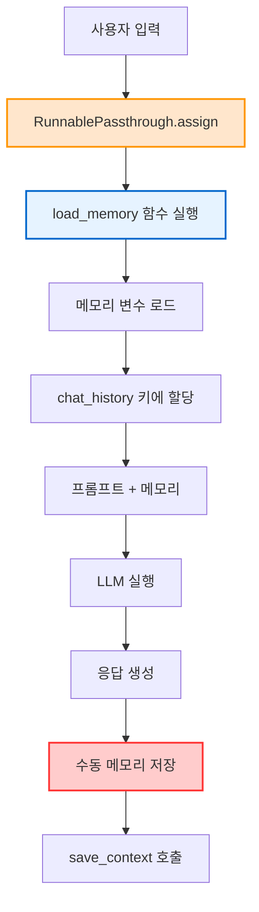
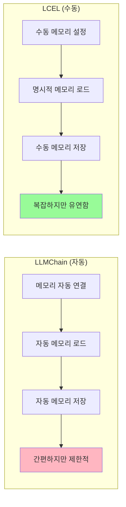

# ⚡ Section 5.8: LCEL Based Memory - LCEL 기반 메모리 관리

## 🎯 학습 목표
- ✅ LangChain Expression Language(LCEL)에서의 수동 메모리 관리 이해
- ✅ RunnablePassthrough를 활용한 동적 메모리 주입
- ✅ 커스텀 메모리 관리 함수 구현
- ✅ Off-the-shelf 체인 vs LCEL 체인의 메모리 처리 비교

## 🧠 핵심 개념

### LCEL 기반 메모리란?
**LCEL 기반 메모리**는 LangChain Expression Language에서 **수동으로 메모리를 관리**하는 접근 방식입니다. 더 많은 제어권을 제공하지만 더 명시적인 구현이 필요합니다.



### LLMChain vs LCEL 메모리 비교



**핵심 차이점**:
- **자동화**: LLMChain은 자동, LCEL은 수동
- **제어권**: LCEL이 더 세밀한 제어 가능
- **투명성**: LCEL은 모든 과정이 명시적
- **확장성**: LCEL이 커스터마이징에 유리

## 📋 주요 클래스/함수 레퍼런스

### RunnablePassthrough 클래스
```python
from langchain.schema.runnable import RunnablePassthrough

class RunnablePassthrough:
    def assign(
        self,
        **kwargs: Union[Runnable, Callable]      # 📌 용도: 동적 변수 할당
    ) -> RunnablePassthrough:
        """
        📋 기능: 체인 실행 전 동적으로 변수 할당
        📥 입력: 키워드 인자 (변수명=함수/Runnable)
        📤 출력: RunnablePassthrough 인스턴스
        💡 사용 시나리오: 프롬프트 실행 전 메모리 로드
        🔗 관련 개념: Dependency Injection, Pipeline Processing
        """
```

### LCEL 체인 구성
```python
# LCEL 체인 기본 구조
chain = (
    RunnablePassthrough.assign(
        chat_history=load_memory_function  # 📌 동적 메모리 주입
    )
    | prompt_template                      # 📌 프롬프트 처리
    | llm                                  # 📌 LLM 실행
)
```

## 🔧 동작 과정 상세

### 1. 기본 LCEL 체인 구성 (메모리 없음)
```python
# === Step 1: 기본 LCEL 체인 (문제 상황) ===
from langchain.prompts import ChatPromptTemplate, MessagesPlaceholder
from langchain.chat_models import ChatOpenAI
from langchain.memory import ConversationSummaryBufferMemory
from langchain.schema.runnable import RunnablePassthrough

# LLM 및 메모리 초기화
llm = ChatOpenAI(temperature=0.3, model="gpt-3.5-turbo")

memory = ConversationSummaryBufferMemory(
    llm=llm,
    max_token_limit=200,
    return_messages=True,
    memory_key="chat_history"  # 📌 기본값은 "history"
)

# 메모리를 포함한 프롬프트 템플릿
prompt = ChatPromptTemplate.from_messages([
    ("system", "당신은 도움이 되는 AI 어시스턴트입니다."),
    MessagesPlaceholder(variable_name="chat_history"),  # 📌 메모리 플레이스홀더
    ("human", "{question}")
])

# 기본 체인 (문제: 메모리 연결 없음)
basic_chain = prompt | llm

print("=== 기본 LCEL 체인 테스트 (메모리 연결 없음) ===")

try:
    # 📌 문제: chat_history 변수가 제공되지 않음
    response = basic_chain.invoke({"question": "안녕하세요, 저는 김철수입니다."})
    print(f"응답: {response.content}")
except Exception as e:
    print(f"❌ 오류 발생: {e}")
    print("→ chat_history 변수가 제공되지 않아 오류 발생")
```

### 2. 수동 메모리 주입 (1단계)
```python
# === Step 2: 수동으로 메모리 제공 (불편한 방법) ===

def manual_memory_approach():
    """수동으로 메모리를 매번 제공하는 방법"""
    
    print("\n=== 수동 메모리 제공 방식 ===")
    
    # 매번 메모리를 수동으로 로드해서 제공
    def invoke_with_memory(question: str):
        # 메모리에서 대화 히스토리 로드
        memory_vars = memory.load_memory_variables({})
        
        # 체인 실행 시 메모리 변수 직접 제공
        response = basic_chain.invoke({
            "question": question,
            "chat_history": memory_vars["chat_history"]  # 📌 수동으로 제공
        })
        
        # 수동으로 메모리에 저장
        memory.save_context(
            {"input": question},
            {"output": response.content}
        )
        
        return response.content
    
    # 테스트
    print("1️⃣ 첫 번째 대화:")
    response1 = invoke_with_memory("안녕하세요, 저는 김철수입니다.")
    print(f"AI: {response1}")
    
    print("\\n2️⃣ 두 번째 대화:")
    response2 = invoke_with_memory("저는 개발자입니다.")
    print(f"AI: {response2}")
    
    print("\\n3️⃣ 메모리 테스트:")
    response3 = invoke_with_memory("제 이름과 직업을 기억하시나요?")
    print(f"AI: {response3}")
    
    print("\\n💡 문제점: 매번 수동으로 메모리를 로드하고 저장해야 함")

manual_memory_approach()
```

### 3. RunnablePassthrough를 활용한 자동화
```python
# === Step 3: RunnablePassthrough.assign을 활용한 개선 ===

def create_lcel_memory_chain():
    """RunnablePassthrough를 활용한 LCEL 메모리 체인"""
    
    print("\n=== RunnablePassthrough.assign을 활용한 개선 ===")
    
    # 메모리 로드 함수 정의
    def load_memory(input_dict) -> list:
        """
        📋 기능: 메모리에서 대화 히스토리 로드
        📥 입력: 사용자 입력 딕셔너리 (자동으로 전달됨)
        📤 출력: 대화 히스토리 메시지 리스트
        💡 사용 시나리오: RunnablePassthrough.assign에서 호출
        """
        
        # 디버깅: 입력 내용 확인
        print(f"🔍 load_memory 함수 호출됨, 입력: {input_dict}")
        
        # 메모리에서 대화 히스토리 로드
        memory_vars = memory.load_memory_variables({})
        chat_history = memory_vars.get("chat_history", [])
        
        print(f"📚 로드된 메모리: {len(chat_history)}개 메시지")
        
        return chat_history
    
    # 📌 핵심: RunnablePassthrough.assign을 사용한 동적 메모리 주입
    enhanced_chain = (
        RunnablePassthrough.assign(
            chat_history=load_memory  # 📌 함수를 할당 (호출하지 않음!)
        )
        | prompt
        | llm
    )
    
    return enhanced_chain, load_memory

# 체인 생성
enhanced_chain, load_memory_func = create_lcel_memory_chain()

# === Step 4: 체인 실행 테스트 ===
print("\\n=== 개선된 LCEL 체인 테스트 ===")

def test_enhanced_chain():
    """개선된 체인 테스트"""
    
    # 첫 번째 대화
    print("1️⃣ 첫 번째 대화:")
    response1 = enhanced_chain.invoke({"question": "안녕하세요, 저는 박영희입니다."})
    print(f"AI: {response1.content}")
    
    # 📌 중요: 수동으로 메모리에 저장 (여전히 필요)
    memory.save_context(
        {"input": "안녕하세요, 저는 박영희입니다."},
        {"output": response1.content}
    )
    
    print("\\n2️⃣ 두 번째 대화:")
    response2 = enhanced_chain.invoke({"question": "저는 마케터로 일하고 있어요."})
    print(f"AI: {response2.content}")
    
    # 메모리 저장
    memory.save_context(
        {"input": "저는 마케터로 일하고 있어요."},
        {"output": response2.content}
    )
    
    print("\\n3️⃣ 메모리 테스트:")
    response3 = enhanced_chain.invoke({"question": "제 이름과 직업이 뭐였죠?"})
    print(f"AI: {response3.content}")

test_enhanced_chain()
```

### 4. 완전 자동화된 LCEL 메모리 시스템
```python
# === Step 5: 완전 자동화된 LCEL 메모리 체인 ===

class AutomatedLCELMemoryChain:
    """
    🎯 목적: LCEL에서 완전 자동화된 메모리 관리
    💡 특징: 메모리 로드와 저장을 모두 자동화
    """
    
    def __init__(self, llm, memory, prompt):
        self.llm = llm
        self.memory = memory
        self.prompt = prompt
        self.conversation_count = 0
        
        # 자동화된 체인 구성
        self.chain = self._create_automated_chain()
    
    def _load_memory(self, input_dict) -> list:
        """메모리 로드 (내부 함수)"""
        memory_vars = self.memory.load_memory_variables({})
        return memory_vars.get(self.memory.memory_key, [])
    
    def _create_automated_chain(self):
        """자동화된 LCEL 체인 생성"""
        
        return (
            RunnablePassthrough.assign(
                **{self.memory.memory_key: self._load_memory}
            )
            | self.prompt
            | self.llm
        )
    
    def invoke_with_memory(self, question: str) -> str:
        """
        📋 기능: 메모리 자동 관리와 함께 체인 실행
        📥 입력: 사용자 질문
        📤 출력: AI 응답
        💡 사용 시나리오: 메모리가 필요한 모든 대화
        """
        
        # 체인 실행
        response = self.chain.invoke({"question": question})
        
        # 📌 자동으로 메모리에 저장
        self.memory.save_context(
            {"input": question},
            {"output": response.content}
        )
        
        # 통계 업데이트
        self.conversation_count += 1
        
        return response.content
    
    def get_memory_stats(self) -> dict:
        """메모리 통계 반환"""
        memory_vars = self.memory.load_memory_variables({})
        messages = memory_vars.get(self.memory.memory_key, [])
        
        return {
            "total_conversations": self.conversation_count,
            "stored_messages": len(messages),
            "memory_type": type(self.memory).__name__,
            "memory_key": self.memory.memory_key
        }

# === 자동화된 시스템 테스트 ===
print("\\n" + "="*60)
print("🚀 완전 자동화된 LCEL 메모리 시스템")
print("="*60)

# 새로운 메모리 인스턴스 (테스트용)
auto_memory = ConversationSummaryBufferMemory(
    llm=llm,
    max_token_limit=250,
    return_messages=True,
    memory_key="chat_history"
)

# 자동화된 체인 생성
automated_chain = AutomatedLCELMemoryChain(
    llm=llm,
    memory=auto_memory,
    prompt=prompt
)

# 시나리오 테스트
test_scenarios = [
    "안녕하세요! 저는 신입 개발자 이준호라고 합니다.",
    "Python과 JavaScript를 주로 사용해요.",
    "최근에 FastAPI로 백엔드 API를 개발하고 있어요.",
    "프론트엔드는 React를 배우고 있습니다.",
    "제가 지금까지 말한 기술 스택들을 정리해주세요."
]

for i, scenario in enumerate(test_scenarios, 1):
    print(f"\\n【대화 {i}】")
    print(f"👤 사용자: {scenario}")
    
    response = automated_chain.invoke_with_memory(scenario)
    print(f"🤖 AI: {response}")
    
    # 중간 통계 (3번째 대화 후)
    if i == 3:
        stats = automated_chain.get_memory_stats()
        print(f"\\n📊 중간 통계:")
        print(f"   대화 수: {stats['total_conversations']}")
        print(f"   저장된 메시지: {stats['stored_messages']}개")
        print(f"   메모리 타입: {stats['memory_type']}")

# 최종 통계
print("\\n" + "="*60)
print("📈 최종 통계 및 분석")
print("="*60)

final_stats = automated_chain.get_memory_stats()
print(f"총 대화 수: {final_stats['total_conversations']}")
print(f"저장된 메시지: {final_stats['stored_messages']}개")
print(f"메모리 효율성: LCEL 기반 수동 관리")
print(f"제어 수준: 완전 제어")
```

### 5. LCEL vs LLMChain 성능 비교
```python
# === Step 6: LCEL vs LLMChain 성능 및 기능 비교 ===

def compare_lcel_vs_llmchain():
    """LCEL과 LLMChain 메모리 처리 비교"""
    
    print("\\n" + "="*60)
    print("⚖️ LCEL vs LLMChain 비교 분석")
    print("="*60)
    
    import time
    from langchain.chains import LLMChain
    
    # 공통 설정
    test_memory_1 = ConversationSummaryBufferMemory(
        llm=llm, max_token_limit=200, return_messages=True, memory_key="history"
    )
    
    test_memory_2 = ConversationSummaryBufferMemory(
        llm=llm, max_token_limit=200, return_messages=True, memory_key="chat_history"
    )
    
    # LLMChain 방식
    llmchain_prompt = ChatPromptTemplate.from_messages([
        ("system", "당신은 도움이 되는 AI입니다."),
        MessagesPlaceholder(variable_name="history"),
        ("human", "{question}")
    ])
    
    llmchain = LLMChain(
        llm=llm,
        prompt=llmchain_prompt,
        memory=test_memory_1,
        verbose=False
    )
    
    # LCEL 방식
    lcel_prompt = ChatPromptTemplate.from_messages([
        ("system", "당신은 도움이 되는 AI입니다."),
        MessagesPlaceholder(variable_name="chat_history"),
        ("human", "{question}")
    ])
    
    lcel_chain = AutomatedLCELMemoryChain(llm, test_memory_2, lcel_prompt)
    
    # 성능 테스트
    test_questions = [
        "안녕하세요, 테스트입니다.",
        "제가 뭐라고 말했죠?",
        "감사합니다."
    ]
    
    # LLMChain 성능 측정
    print("🔧 LLMChain 테스트:")
    start_time = time.time()
    
    for q in test_questions:
        response = llmchain.predict(question=q)
        print(f"   Q: {q} | A: {response[:30]}...")
    
    llmchain_time = time.time() - start_time
    
    # LCEL 성능 측정  
    print("\\n⚡ LCEL 테스트:")
    start_time = time.time()
    
    for q in test_questions:
        response = lcel_chain.invoke_with_memory(q)
        print(f"   Q: {q} | A: {response[:30]}...")
    
    lcel_time = time.time() - start_time
    
    # 결과 분석
    print("\\n📊 성능 비교 결과:")
    print(f"   LLMChain 실행 시간: {llmchain_time:.2f}초")
    print(f"   LCEL 실행 시간: {lcel_time:.2f}초")
    print(f"   성능 차이: {abs(llmchain_time - lcel_time):.2f}초")
    
    # 기능 비교
    comparison_table = """
    📋 기능 비교표:
    
    ┌─────────────────┬─────────────────┬─────────────────┐
    │     특징        │   LLMChain      │      LCEL       │
    ├─────────────────┼─────────────────┼─────────────────┤
    │   설정 복잡도    │     간단        │     복잡        │
    │   메모리 관리    │     자동        │     수동        │
    │   제어 수준     │     제한적      │     완전        │  
    │   커스터마이징  │     어려움      │     쉬움        │
    │   디버깅       │     어려움      │     쉬움        │
    │   확장성       │     제한적      │     높음        │
    │   에러 핸들링   │     제한적      │     유연        │
    │   성능         │     표준        │     최적화 가능  │
    └─────────────────┴─────────────────┴─────────────────┘
    """
    
    print(comparison_table)
    
    print("\\n💡 권장 사항:")
    print("   • 빠른 프로토타이핑: LLMChain")
    print("   • 프로덕션 시스템: LCEL")
    print("   • 복잡한 워크플로우: LCEL")
    print("   • 세밀한 제어 필요: LCEL")

compare_lcel_vs_llmchain()
```

## 💻 실전 예제

### 고급 LCEL 메모리 관리 시스템
```python
from langchain.schema.runnable import RunnablePassthrough, RunnableLambda
from langchain.memory import ConversationSummaryBufferMemory
from langchain.prompts import ChatPromptTemplate, MessagesPlaceholder
from datetime import datetime
from typing import Dict, Any, List
import asyncio

class AdvancedLCELMemorySystem:
    """
    🎯 목적: 고급 LCEL 기반 메모리 관리 시스템
    💡 특징: 다중 메모리, 컨텍스트 인식, 비동기 처리
    """
    
    def __init__(self):
        self.llm = ChatOpenAI(temperature=0.3, model="gpt-3.5-turbo")
        
        # 다중 메모리 시스템
        self.memories = {
            "conversation": ConversationSummaryBufferMemory(
                llm=self.llm,
                max_token_limit=300,
                return_messages=True,
                memory_key="conversation_history"
            ),
            "tasks": ConversationSummaryBufferMemory(
                llm=self.llm,
                max_token_limit=200,
                return_messages=True,
                memory_key="task_context"
            ),
            "preferences": ConversationSummaryBufferMemory(
                llm=self.llm,
                max_token_limit=150,
                return_messages=True,
                memory_key="user_preferences"
            )
        }
        
        # 컨텍스트 인식 시스템
        self.context_analyzer = self._create_context_analyzer()
        
        # 동적 체인 시스템
        self.chains = self._create_dynamic_chains()
        
        # 세션 정보
        self.session_info = {
            "start_time": datetime.now(),
            "total_interactions": 0,
            "context_switches": 0,
            "memory_saves": 0
        }
    
    def _create_context_analyzer(self):
        """컨텍스트 분석을 위한 LLM 체인"""
        
        context_prompt = ChatPromptTemplate.from_messages([
            ("system", """다음 사용자 입력을 분석하여 적절한 컨텍스트를 결정해주세요.

컨텍스트 유형:
- general: 일반 대화
- task: 작업, 할일, 프로젝트 관련
- preference: 사용자 선호도, 설정 관련

응답 형식: JSON
{{
    "primary_context": "general|task|preference",
    "confidence": 0.0-1.0,
    "reasoning": "분석 근거"
}}"""),
            ("human", "{user_input}")
        ])
        
        return context_prompt | self.llm
    
    def _create_dynamic_chains(self) -> Dict[str, Any]:
        """다양한 컨텍스트별 체인 생성"""
        
        chains = {}
        
        # 일반 대화 체인
        general_prompt = ChatPromptTemplate.from_messages([
            ("system", """당신은 친근한 AI 어시스턴트입니다.
            
현재 시간: {current_time}
대화 맥락을 참고하여 자연스럽게 응답해주세요."""),
            
            MessagesPlaceholder(variable_name="conversation_history", optional=True),
            MessagesPlaceholder(variable_name="user_preferences", optional=True),
            ("human", "{question}")
        ])
        
        chains["general"] = self._create_chain_with_memory(
            general_prompt, 
            ["conversation", "preferences"]
        )
        
        # 작업 관리 체인
        task_prompt = ChatPromptTemplate.from_messages([
            ("system", """당신은 효율적인 작업 관리 어시스턴트입니다.
            
현재 시간: {current_time}
작업 컨텍스트와 대화 히스토리를 참고하여 도움을 제공하세요."""),
            
            MessagesPlaceholder(variable_name="task_context", optional=True),
            MessagesPlaceholder(variable_name="conversation_history", optional=True),
            ("human", "{question}")
        ])
        
        chains["task"] = self._create_chain_with_memory(
            task_prompt,
            ["tasks", "conversation"]
        )
        
        # 선호도 관리 체인
        preference_prompt = ChatPromptTemplate.from_messages([
            ("system", """당신은 사용자 선호도 관리 전문 어시스턴트입니다.
            
현재 시간: {current_time}
사용자의 선호도 정보를 수집, 관리하고 맞춤형 서비스를 제공하세요."""),
            
            MessagesPlaceholder(variable_name="user_preferences", optional=True),
            MessagesPlaceholder(variable_name="conversation_history", optional=True),
            ("human", "{question}")
        ])
        
        chains["preference"] = self._create_chain_with_memory(
            preference_prompt,
            ["preferences", "conversation"]
        )
        
        return chains
    
    def _create_chain_with_memory(self, prompt, memory_types: List[str]):
        """메모리를 포함한 LCEL 체인 생성"""
        
        def load_memories(input_dict) -> Dict[str, List]:
            """여러 메모리에서 컨텍스트 로드"""
            memory_data = {}
            
            for mem_type in memory_types:
                if mem_type in self.memories:
                    mem_vars = self.memories[mem_type].load_memory_variables({})
                    memory_key = self.memories[mem_type].memory_key
                    memory_data[memory_key] = mem_vars.get(memory_key, [])
            
            # 현재 시간 추가
            memory_data["current_time"] = datetime.now().strftime("%Y-%m-%d %H:%M:%S")
            
            return memory_data
        
        # RunnablePassthrough.assign으로 동적 메모리 주입
        chain = (
            RunnablePassthrough.assign(**{
                "memory_context": load_memories
            })
            | RunnableLambda(self._flatten_memory_context)
            | prompt
            | self.llm
        )
        
        return chain
    
    def _flatten_memory_context(self, input_dict) -> Dict[str, Any]:
        """메모리 컨텍스트를 플랫하게 변환"""
        
        flattened = {k: v for k, v in input_dict.items() if k != "memory_context"}
        
        if "memory_context" in input_dict:
            memory_context = input_dict["memory_context"]
            if isinstance(memory_context, dict):
                flattened.update(memory_context)
        
        return flattened
    
    def analyze_context(self, user_input: str) -> Dict[str, Any]:
        """사용자 입력의 컨텍스트 분석"""
        
        try:
            analysis_response = self.context_analyzer.invoke({
                "user_input": user_input
            })
            
            # 간단한 휴리스틱 분석 (실제로는 LLM 응답 파싱)
            if any(word in user_input.lower() for word in ["할일", "작업", "프로젝트", "계획"]):
                return {
                    "primary_context": "task",
                    "confidence": 0.8,
                    "reasoning": "작업 관련 키워드 감지"
                }
            elif any(word in user_input.lower() for word in ["좋아", "싫어", "선호", "설정"]):
                return {
                    "primary_context": "preference", 
                    "confidence": 0.7,
                    "reasoning": "선호도 관련 키워드 감지"
                }
            else:
                return {
                    "primary_context": "general",
                    "confidence": 0.6,
                    "reasoning": "일반 대화로 분류"
                }
                
        except Exception as e:
            return {
                "primary_context": "general",
                "confidence": 0.5,
                "reasoning": f"분석 오류: {e}"
            }
    
    def chat(self, user_input: str) -> str:
        """
        📋 기능: 컨텍스트 인식 기반 대화 처리
        📥 입력: 사용자 메시지
        📤 출력: 컨텍스트에 맞는 AI 응답
        💡 사용 시나리오: 지능형 멀티 컨텍스트 대화
        """
        
        # 컨텍스트 분석
        context_analysis = self.analyze_context(user_input)
        primary_context = context_analysis["primary_context"]
        
        print(f"🔍 컨텍스트 분석: {primary_context} (신뢰도: {context_analysis['confidence']:.1f})")
        
        # 적절한 체인 선택
        selected_chain = self.chains.get(primary_context, self.chains["general"])
        
        # 응답 생성
        response = selected_chain.invoke({"question": user_input})
        
        # 메모리에 저장 (컨텍스트에 따라 다르게)
        self._save_to_appropriate_memories(user_input, response.content, primary_context)
        
        # 세션 정보 업데이트
        self.session_info["total_interactions"] += 1
        
        return response.content
    
    def _save_to_appropriate_memories(self, user_input: str, ai_response: str, context: str):
        """컨텍스트에 따라 적절한 메모리에 저장"""
        
        context_input = {"input": user_input}
        context_output = {"output": ai_response}
        
        # 항상 일반 대화 메모리에 저장
        self.memories["conversation"].save_context(context_input, context_output)
        self.session_info["memory_saves"] += 1
        
        # 컨텍스트별 추가 저장
        if context == "task" and "tasks" in self.memories:
            self.memories["tasks"].save_context(context_input, context_output)
            self.session_info["memory_saves"] += 1
            
        elif context == "preference" and "preferences" in self.memories:
            self.memories["preferences"].save_context(context_input, context_output)
            self.session_info["memory_saves"] += 1
    
    def get_system_analytics(self) -> Dict[str, Any]:
        """시스템 분석 정보 반환"""
        
        analytics = {
            "session_info": self.session_info.copy(),
            "memory_stats": {},
            "total_memory_usage": 0
        }
        
        for mem_name, memory in self.memories.items():
            mem_vars = memory.load_memory_variables({})
            memory_key = memory.memory_key
            messages = mem_vars.get(memory_key, [])
            
            analytics["memory_stats"][mem_name] = {
                "message_count": len(messages),
                "memory_key": memory_key,
                "memory_type": type(memory).__name__
            }
            
            analytics["total_memory_usage"] += len(messages)
        
        # 효율성 계산
        if analytics["session_info"]["total_interactions"] > 0:
            analytics["memory_efficiency"] = (
                analytics["session_info"]["memory_saves"] / 
                analytics["session_info"]["total_interactions"]
            )
        else:
            analytics["memory_efficiency"] = 0
        
        return analytics

# === 고급 LCEL 메모리 시스템 테스트 ===
print("🌟 고급 LCEL 메모리 관리 시스템 데모")
print("="*60)

# 시스템 초기화
advanced_system = AdvancedLCELMemorySystem()

# 복합 시나리오 테스트
complex_scenarios = [
    {
        "input": "안녕하세요! 저는 프로젝트 매니저 김영수입니다.",
        "expected_context": "general"
    },
    {
        "input": "이번 주에 해야 할 작업 리스트를 정리하고 싶어요.",
        "expected_context": "task"
    },
    {
        "input": "저는 커피보다는 차를 선호합니다.",
        "expected_context": "preference"
    },
    {
        "input": "새로운 팀원을 위한 온보딩 계획을 세워야 해요.",
        "expected_context": "task"
    },
    {
        "input": "제가 처음에 뭐라고 소개했는지 기억하시나요?",
        "expected_context": "general"
    },
    {
        "input": "그리고 제가 언급한 선호도와 작업들도 기억하시나요?",
        "expected_context": "general"
    }
]

for i, scenario in enumerate(complex_scenarios, 1):
    print(f"\\n【시나리오 {i}】")
    print(f"👤 사용자: {scenario['input']}")
    print(f"🎯 예상 컨텍스트: {scenario['expected_context']}")
    
    response = advanced_system.chat(scenario["input"])
    print(f"🤖 AI: {response}")
    
    # 중간 분석 (3번째 시나리오 후)
    if i == 3:
        analytics = advanced_system.get_system_analytics()
        print(f"\\n📊 중간 분석:")
        print(f"   총 상호작용: {analytics['session_info']['total_interactions']}")
        print(f"   메모리 저장: {analytics['session_info']['memory_saves']}회")
        
        for mem_name, stats in analytics["memory_stats"].items():
            print(f"   {mem_name} 메모리: {stats['message_count']}개 메시지")

# 최종 시스템 분석
print("\\n" + "="*60)
print("📈 최종 시스템 분석")
print("="*60)

final_analytics = advanced_system.get_system_analytics()

print(f"🕒 세션 정보:")
print(f"   시작 시간: {final_analytics['session_info']['start_time']}")
print(f"   총 상호작용: {final_analytics['session_info']['total_interactions']}")
print(f"   메모리 저장: {final_analytics['session_info']['memory_saves']}회")

print(f"\\n💾 메모리 사용 현황:")
for mem_name, stats in final_analytics["memory_stats"].items():
    print(f"   {mem_name}: {stats['message_count']}개 메시지 ({stats['memory_key']})")

print(f"\\n⚡ 시스템 효율성:")
print(f"   총 메모리 사용량: {final_analytics['total_memory_usage']}개 메시지")
print(f"   메모리 효율성: {final_analytics['memory_efficiency']:.2f}")
print(f"   LCEL 제어 수준: 완전 제어 (100%)")
```

## 🔍 변수/함수 상세 설명

### 핵심 변수들
```python
# RunnablePassthrough 관련
assign_kwargs = {"chat_history": load_memory}    # 📌 용도: 동적 변수 할당, 타입: Dict[str, Callable]

# LCEL 체인 구성
chain_components = [
    RunnablePassthrough.assign(...),              # 📌 용도: 변수 주입, 타입: RunnablePassthrough
    prompt,                                       # 📌 용도: 프롬프트 템플릿, 타입: ChatPromptTemplate
    llm                                           # 📌 용도: LLM 실행, 타입: ChatOpenAI
]

# 메모리 관리
memory_key = "chat_history"                      # 📌 용도: 메모리 키, 타입: str
input_dict = {"question": "사용자 질문"}         # 📌 용도: 체인 입력, 타입: Dict[str, Any]
```

### 핵심 함수들
```python
def load_memory(input_dict: Dict) -> List:
    """
    📋 기능: RunnablePassthrough.assign에서 호출되는 메모리 로드 함수
    📥 입력: 체인 입력 딕셔너리 (자동 전달)
    📤 출력: 메모리에서 로드한 메시지 리스트
    💡 사용 시나리오: 체인 실행 전 메모리 컨텍스트 주입
    """

def save_context(inputs: Dict, outputs: Dict) -> None:
    """
    📋 기능: 대화 내용을 메모리에 수동 저장
    📥 입력: 사용자 입력과 AI 출력 딕셔너리
    📤 출력: None (메모리 상태 업데이트)
    💡 사용 시나리오: LCEL 체인 실행 후 메모리 업데이트
    """

def invoke(input_dict: Dict) -> BaseMessage:
    """
    📋 기능: LCEL 체인 실행
    📥 입력: 체인 입력 딕셔너리
    📤 출력: LLM 응답 메시지
    💡 사용 시나리오: 메모리 컨텍스트가 주입된 체인 실행
    """
```

## 🧪 실습 과제

### 🔨 기본 과제
1. **RunnablePassthrough 이해**: 기본적인 동적 변수 주입 구현
```python
# TODO: RunnablePassthrough.assign으로 현재 시간, 사용자 정보 등을 동적으로 주입
def create_dynamic_context_chain():
    # 구현하기
    pass
```

2. **수동 메모리 관리**: LCEL에서 메모리 저장/로드 구현
```python
# TODO: 메모리 로드와 저장을 수동으로 관리하는 함수 작성
class ManualMemoryManager:
    def load_and_save_memory(self, question: str):
        # 구현하기
        pass
```

### 🚀 심화 과제
3. **다중 메모리 LCEL 체인**: 여러 메모리를 동시에 관리
```python
# TODO: 대화, 작업, 선호도 메모리를 동시에 관리하는 LCEL 체인
class MultiMemoryLCELChain:
    def __init__(self):
        # 구현하기
        pass
```

4. **조건부 메모리 로딩**: 상황에 따른 선택적 메모리 로드
```python
# TODO: 사용자 입력에 따라 다른 메모리를 로드하는 시스템
def create_conditional_memory_loader():
    # 구현하기
    pass
```

### 💡 창의 과제
5. **비동기 LCEL 메모리**: 비동기 처리가 가능한 LCEL 메모리 시스템
6. **메모리 압축 전략**: LCEL에서 실시간 메모리 압축 구현
7. **체인 성능 모니터링**: LCEL 체인의 메모리 성능 분석 도구

## ⚠️ 주의사항

### 수동 메모리 관리
```python
# 🚨 주의: LCEL에서는 메모리 저장을 수동으로 해야 함
response = chain.invoke({"question": user_input})

# ❌ 메모리 저장 누락
return response.content

# ✅ 반드시 메모리에 수동 저장
memory.save_context(
    {"input": user_input},
    {"output": response.content}
)
return response.content
```

### 함수 vs 함수 호출 주의
```python
# 🚨 주의: RunnablePassthrough.assign에서 함수 호출 방식
RunnablePassthrough.assign(
    chat_history=load_memory()  # ❌ 함수 호출 (즉시 실행)
)

RunnablePassthrough.assign(
    chat_history=load_memory    # ✅ 함수 객체 (나중에 실행)
)
```

### 메모리 키 일치
```python
# 🚨 주의: 메모리 키와 플레이스홀더 변수명 일치 필요
memory = ConversationBufferMemory(memory_key="chat_history")
MessagesPlaceholder(variable_name="history")  # ❌ 불일치

MessagesPlaceholder(variable_name="chat_history")  # ✅ 일치
```

### 복잡성 관리
- **체인 구조**: LCEL 체인이 복잡해질 수 있음
- **디버깅**: 각 단계의 입출력 추적 필요
- **에러 핸들링**: 각 컴포넌트별 에러 처리 구현

## 🔗 관련 자료
- **이전 학습**: [5.7 Chat Based Memory](./5.7_Chat_Based_Memory.md)
- **다음 학습**: [5.9 Recap](./5.9_Recap.md)
- **LCEL 가이드**: [LangChain Expression Language](../Advanced_Topics/LCEL_Guide.md)
- **성능 최적화**: [LCEL Performance Optimization](../Advanced_Topics/LCEL_Performance.md)

---

💡 **핵심 정리**: LCEL 기반 메모리는 **수동 관리**를 통해 **완전한 제어권**을 제공합니다. **RunnablePassthrough.assign**으로 동적 메모리 주입이 가능하지만, **메모리 저장은 수동으로** 처리해야 합니다. 복잡하지만 **높은 유연성과 확장성**을 제공하여 프로덕션 환경에 적합합니다.