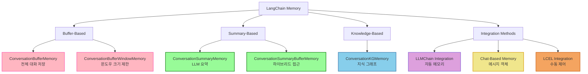
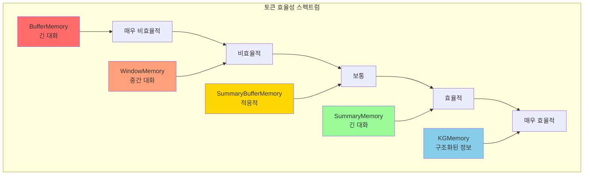
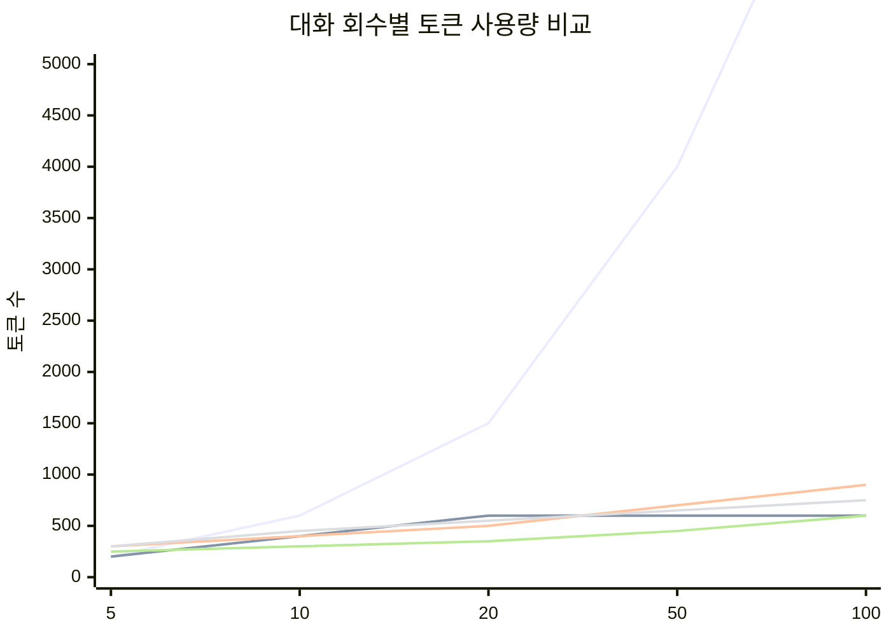
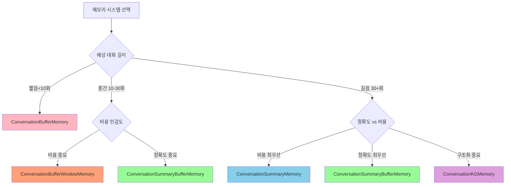

# 📚 Section 5.9: Memory Systems Recap - Chapter 5 종합 정리

## 🎯 학습 목표
- ✅ Chapter 5에서 다룬 모든 메모리 타입의 특징과 용도 정리
- ✅ 메모리 선택 기준과 최적화 전략 수립
- ✅ 실무 적용을 위한 메모리 시스템 설계 가이드라인
- ✅ 성능 비교와 비용 분석을 통한 의사결정 지원

## 🧠 Memory Systems 전체 개요

### LangChain Memory 생태계


## 📊 메모리 타입별 상세 비교

### 성능 특성 매트릭스


### 상세 비교표

| 메모리 타입 | 토큰 효율성 | 정보 보존 | 구현 복잡도 | 초기 비용 | 장기 비용 | 사용 사례 |
|-------------|-------------|-----------|-------------|-----------|-----------|-----------|
| **ConversationBufferMemory** | ❌ 매우 낮음 | ✅ 완벽 | 🟢 매우 간단 | 🟢 낮음 | ❌ 매우 높음 | 짧은 대화, 개발/테스트 |
| **ConversationBufferWindowMemory** | 🟡 보통 | 🟡 부분적 | 🟢 간단 | 🟢 낮음 | 🟡 보통 | 일반적 대화, 제한된 컨텍스트 |
| **ConversationSummaryMemory** | ✅ 높음 | 🟡 요약된 정보 | 🟡 보통 | ❌ 높음 | ✅ 낮음 | 긴 대화, 비용 효율성 중요 |
| **ConversationSummaryBufferMemory** | ✅ 매우 높음 | ✅ 우수 | 🟡 보통 | 🟡 보통 | ✅ 낮음 | 프로덕션 환경, 균형 필요 |
| **ConversationKGMemory** | ✅ 매우 높음 | 🟡 구조화된 정보 | ❌ 복잡 | ❌ 높음 | ✅ 낮음 | 복잡한 관계, 장기 기억 |

### 성능 벤치마크 (대화 회수별 토큰 사용량)



## 🛠️ 실무 적용 가이드

### 1. 메모리 선택 의사결정 트리



### 2. 시나리오별 권장 메모리

#### 🤖 고객 서비스 챗봇
```python
# 권장: ConversationSummaryBufferMemory
memory = ConversationSummaryBufferMemory(
    llm=ChatOpenAI(temperature=0.1, model="gpt-3.5-turbo"),
    max_token_limit=500,  # 적당한 버퍼 크기
    return_messages=True
)

# 이유:
# ✅ 고객 정보 보존 (최근 대화는 완전 보존)
# ✅ 장시간 상담 지원 (요약으로 토큰 효율성)
# ✅ 균형잡힌 비용 구조
```

#### 📚 교육/튜터링 시스템
```python
# 권장: ConversationKGMemory
memory = ConversationKGMemory(
    llm=ChatOpenAI(temperature=0.1),
    k=15,  # 더 많은 관련 정보 추출
    return_messages=True
)

# 이유:
# ✅ 학습 진도와 개념 관계 추적
# ✅ 학습자 특성과 선호도 기억
# ✅ 구조화된 지식 관리
```

#### 💼 업무 어시스턴트
```python
# 권장: Multi-Memory 시스템
class WorkAssistantMemory:
    def __init__(self):
        # 일반 대화 메모리
        self.conversation = ConversationSummaryBufferMemory(
            llm=llm, max_token_limit=300, memory_key="conversation"
        )
        
        # 작업/프로젝트 메모리
        self.tasks = ConversationKGMemory(
            llm=llm, k=20, memory_key="tasks"
        )
        
        # 개인 정보 메모리
        self.profile = ConversationBufferWindowMemory(
            k=5, memory_key="profile"
        )

# 이유:
# ✅ 다양한 컨텍스트 분리 관리
# ✅ 작업 관계성 추적 (KG)
# ✅ 최근 선호도 유지 (Window)
```

### 3. 통합 방식 선택 가이드

#### LLMChain vs LCEL 비교

```python
# 🔧 LLMChain: 빠른 프로토타이핑
from langchain.chains import LLMChain

chain = LLMChain(
    llm=llm,
    prompt=prompt,
    memory=memory,  # 자동 메모리 연결
    verbose=True
)

# 장점: 간단, 빠른 시작
# 단점: 제한된 커스터마이징

# ⚡ LCEL: 프로덕션 환경
from langchain.schema.runnable import RunnablePassthrough

chain = (
    RunnablePassthrough.assign(
        chat_history=lambda _: memory.load_memory_variables({})["history"]
    )
    | prompt
    | llm
)

# 장점: 완전한 제어, 확장 가능
# 단점: 복잡, 수동 메모리 관리 필요
```

## 💰 비용 최적화 전략

### 1. 토큰 비용 분석 도구
```python
import tiktoken
from typing import Dict, Any

class MemoryCostAnalyzer:
    """메모리 사용 비용 분석 도구"""
    
    def __init__(self):
        self.encoding = tiktoken.encoding_for_model("gpt-3.5-turbo")
        
        # 모델별 비용 (2024년 기준, USD per 1K tokens)
        self.costs = {
            "gpt-3.5-turbo": {"input": 0.0010, "output": 0.0020},
            "gpt-4": {"input": 0.0300, "output": 0.0600},
            "gpt-4-turbo": {"input": 0.0100, "output": 0.0300}
        }
    
    def analyze_memory_cost(
        self, 
        memory_content: str, 
        conversations_per_day: int,
        model: str = "gpt-3.5-turbo"
    ) -> Dict[str, Any]:
        """메모리 비용 분석"""
        
        tokens = len(self.encoding.encode(memory_content))
        daily_tokens = tokens * conversations_per_day
        monthly_tokens = daily_tokens * 30
        
        model_cost = self.costs.get(model, self.costs["gpt-3.5-turbo"])
        
        # 입력 토큰 비용 계산 (메모리 컨텍스트)
        daily_cost = (daily_tokens / 1000) * model_cost["input"]
        monthly_cost = daily_cost * 30
        
        return {
            "memory_tokens": tokens,
            "daily_tokens": daily_tokens,
            "monthly_tokens": monthly_tokens,
            "daily_cost_usd": daily_cost,
            "monthly_cost_usd": monthly_cost,
            "cost_per_conversation": daily_cost / conversations_per_day,
            "optimization_suggestions": self._get_optimization_suggestions(
                tokens, conversations_per_day
            )
        }
    
    def _get_optimization_suggestions(
        self, 
        tokens: int, 
        conversations_per_day: int
    ) -> List[str]:
        """비용 최적화 제안"""
        
        suggestions = []
        
        if tokens > 1000:
            suggestions.append("ConversationSummaryMemory 사용 고려")
            
        if conversations_per_day > 100:
            suggestions.append("ConversationSummaryBufferMemory로 전환")
            
        if tokens > 2000 and conversations_per_day > 50:
            suggestions.append("더 작은 모델(gpt-3.5-turbo) 사용")
            
        if tokens > 5000:
            suggestions.append("메모리 압축 전략 필요")
            
        return suggestions

# 사용 예제
analyzer = MemoryCostAnalyzer()

# 다양한 메모리 타입별 비용 분석
memory_scenarios = {
    "BufferMemory_Long": "A" * 2000,     # 긴 버퍼 메모리
    "WindowMemory": "B" * 500,           # 윈도우 메모리
    "SummaryMemory": "C" * 300           # 요약 메모리
}

for scenario, content in memory_scenarios.items():
    analysis = analyzer.analyze_memory_cost(content, 100)  # 일일 100회 대화
    
    print(f"\n📊 {scenario} 비용 분석:")
    print(f"   월 비용: ${analysis['monthly_cost_usd']:.2f}")
    print(f"   대화당 비용: ${analysis['cost_per_conversation']:.4f}")
    print(f"   최적화 제안: {analysis['optimization_suggestions']}")
```

### 2. 메모리 최적화 전략

#### A. 동적 메모리 전환
```python
class AdaptiveMemoryManager:
    """대화 길이에 따른 동적 메모리 전환"""
    
    def __init__(self):
        self.conversation_count = 0
        self.current_memory_type = "buffer"
        
        # 단계별 메모리 설정
        self.memory_configs = {
            "buffer": {"max_conversations": 10, "memory_class": ConversationBufferMemory},
            "window": {"max_conversations": 30, "memory_class": ConversationBufferWindowMemory},
            "summary": {"max_conversations": float('inf'), "memory_class": ConversationSummaryBufferMemory}
        }
    
    def should_upgrade_memory(self) -> bool:
        """메모리 업그레이드 필요 여부 확인"""
        current_config = self.memory_configs[self.current_memory_type]
        return self.conversation_count > current_config["max_conversations"]
    
    def upgrade_memory(self):
        """다음 레벨 메모리로 업그레이드"""
        if self.current_memory_type == "buffer":
            self.current_memory_type = "window"
        elif self.current_memory_type == "window":
            self.current_memory_type = "summary"
        
        print(f"🔄 메모리 업그레이드: {self.current_memory_type}")
```

#### B. 컨텍스트 압축 기법
```python
def compress_memory_context(memory_content: str, compression_ratio: float = 0.7) -> str:
    """메모리 컨텍스트 지능적 압축"""
    
    # 중요도 기반 문장 선별
    sentences = memory_content.split('.')
    important_sentences = []
    
    for sentence in sentences:
        importance_score = calculate_importance(sentence)
        if importance_score > compression_ratio:
            important_sentences.append(sentence)
    
    return '. '.join(important_sentences)

def calculate_importance(sentence: str) -> float:
    """문장 중요도 계산"""
    important_keywords = ["이름", "직업", "선호", "중요", "결정", "약속", "문제"]
    
    score = 0.5  # 기본 점수
    for keyword in important_keywords:
        if keyword in sentence:
            score += 0.1
    
    return min(score, 1.0)
```

## 🚀 고급 메모리 패턴

### 1. 메모리 페더레이션 (Federation)
```python
class FederatedMemorySystem:
    """분산 메모리 관리 시스템"""
    
    def __init__(self):
        self.memory_stores = {
            "short_term": ConversationBufferWindowMemory(k=5),
            "long_term": ConversationSummaryMemory(llm=ChatOpenAI()),
            "knowledge": ConversationKGMemory(llm=ChatOpenAI()),
            "preferences": ConversationBufferMemory()
        }
        
        self.routing_rules = {
            "personal_info": ["knowledge", "preferences"],
            "recent_context": ["short_term", "long_term"],
            "task_related": ["knowledge", "long_term"]
        }
    
    def route_memory(self, content: str, content_type: str):
        """컨텐츠 타입에 따른 메모리 라우팅"""
        
        target_stores = self.routing_rules.get(content_type, ["long_term"])
        
        for store_name in target_stores:
            if store_name in self.memory_stores:
                self.memory_stores[store_name].save_context(
                    {"input": content}, 
                    {"output": "저장됨"}
                )
    
    def retrieve_memory(self, query_type: str) -> str:
        """쿼리 타입에 따른 메모리 검색"""
        
        relevant_stores = self.routing_rules.get(query_type, ["long_term"])
        combined_context = []
        
        for store_name in relevant_stores:
            if store_name in self.memory_stores:
                store_context = self.memory_stores[store_name].load_memory_variables({})
                combined_context.append(store_context)
        
        return self._merge_contexts(combined_context)
    
    def _merge_contexts(self, contexts: List[Dict]) -> str:
        """다중 컨텍스트 병합"""
        merged = []
        for context in contexts:
            for value in context.values():
                if isinstance(value, str):
                    merged.append(value)
                elif isinstance(value, list):
                    merged.extend([str(item) for item in value])
        
        return " | ".join(merged)
```

### 2. 메모리 버전 관리
```python
class VersionedMemorySystem:
    """메모리 버전 관리 시스템"""
    
    def __init__(self):
        self.memory_versions = {}
        self.current_version = 0
        self.max_versions = 10
    
    def save_memory_snapshot(self, memory: BaseMemory, label: str = None):
        """메모리 스냅샷 저장"""
        
        self.current_version += 1
        version_key = f"v{self.current_version}"
        
        if label:
            version_key = f"{version_key}_{label}"
        
        # 메모리 상태 직렬화
        memory_state = memory.load_memory_variables({})
        self.memory_versions[version_key] = {
            "timestamp": datetime.now(),
            "state": memory_state,
            "metadata": {
                "memory_type": type(memory).__name__,
                "version": self.current_version
            }
        }
        
        # 버전 수 제한
        if len(self.memory_versions) > self.max_versions:
            oldest_version = min(self.memory_versions.keys())
            del self.memory_versions[oldest_version]
    
    def restore_memory_version(self, version_key: str, target_memory: BaseMemory):
        """특정 버전으로 메모리 복원"""
        
        if version_key not in self.memory_versions:
            raise ValueError(f"Version {version_key} not found")
        
        # 메모리 초기화
        target_memory.clear()
        
        # 저장된 상태 복원
        saved_state = self.memory_versions[version_key]["state"]
        
        # 이는 구현에 따라 달라질 수 있음
        # 실제로는 메모리 타입별 복원 로직 필요
        print(f"Memory restored to version {version_key}")
    
    def list_versions(self) -> List[Dict]:
        """사용 가능한 메모리 버전 목록"""
        
        return [
            {
                "version": key,
                "timestamp": info["timestamp"],
                "memory_type": info["metadata"]["memory_type"]
            }
            for key, info in self.memory_versions.items()
        ]
```

## 🔧 트러블슈팅 가이드

### 자주 발생하는 문제들

#### 1. 메모리 키 불일치
```python
# ❌ 문제 상황
memory = ConversationBufferMemory(memory_key="chat_history")
prompt = ChatPromptTemplate.from_messages([
    MessagesPlaceholder(variable_name="history")  # 불일치!
])

# ✅ 해결 방법
memory = ConversationBufferMemory(memory_key="history")
prompt = ChatPromptTemplate.from_messages([
    MessagesPlaceholder(variable_name="history")  # 일치
])
```

#### 2. return_messages 설정 오류
```python
# ❌ 문제 상황
memory = ConversationBufferMemory(return_messages=False)  # 문자열 반환
prompt = ChatPromptTemplate.from_messages([...])  # 메시지 기대

# ✅ 해결 방법
memory = ConversationBufferMemory(return_messages=True)   # 메시지 반환
prompt = ChatPromptTemplate.from_messages([...])
```

#### 3. 토큰 한계 초과
```python
# ❌ 문제 상황: 버퍼 메모리가 너무 큼
memory = ConversationBufferMemory()  # 제한 없음

# ✅ 해결 방법: 적절한 메모리 타입 선택
if expected_conversation_length > 20:
    memory = ConversationSummaryBufferMemory(
        llm=llm,
        max_token_limit=1000
    )
else:
    memory = ConversationBufferWindowMemory(k=10)
```

### 디버깅 도구
```python
class MemoryDebugger:
    """메모리 시스템 디버깅 도구"""
    
    def diagnose_memory_issues(self, memory: BaseMemory, prompt: Any) -> Dict[str, Any]:
        """메모리 관련 문제 진단"""
        
        issues = []
        
        # 1. 메모리 키 확인
        memory_key = getattr(memory, 'memory_key', 'history')
        
        if hasattr(prompt, 'input_variables'):
            prompt_vars = prompt.input_variables
            if memory_key not in prompt_vars:
                issues.append(f"Memory key '{memory_key}' not in prompt variables {prompt_vars}")
        
        # 2. return_messages 설정 확인
        return_messages = getattr(memory, 'return_messages', False)
        prompt_type = type(prompt).__name__
        
        if prompt_type == "ChatPromptTemplate" and not return_messages:
            issues.append("ChatPromptTemplate requires return_messages=True")
        
        if prompt_type == "PromptTemplate" and return_messages:
            issues.append("PromptTemplate requires return_messages=False")
        
        # 3. 메모리 크기 확인
        memory_vars = memory.load_memory_variables({})
        memory_content = memory_vars.get(memory_key, "")
        
        if isinstance(memory_content, str):
            token_count = len(memory_content.split())
            if token_count > 2000:
                issues.append(f"Memory too large: {token_count} words (consider summary)")
        elif isinstance(memory_content, list):
            if len(memory_content) > 50:
                issues.append(f"Too many messages: {len(memory_content)} (consider window or summary)")
        
        return {
            "issues": issues,
            "memory_type": type(memory).__name__,
            "memory_key": memory_key,
            "return_messages": return_messages,
            "prompt_type": prompt_type,
            "recommendations": self._get_recommendations(issues)
        }
    
    def _get_recommendations(self, issues: List[str]) -> List[str]:
        """문제 해결 권장사항"""
        
        recommendations = []
        
        for issue in issues:
            if "key" in issue.lower():
                recommendations.append("memory_key와 프롬프트 변수명 일치시키기")
            elif "return_messages" in issue.lower():
                recommendations.append("적절한 return_messages 설정")
            elif "too large" in issue.lower():
                recommendations.append("SummaryMemory 또는 SummaryBufferMemory 사용")
            elif "too many" in issue.lower():
                recommendations.append("WindowMemory 또는 요약 기반 메모리 사용")
        
        return recommendations

# 사용 예제
debugger = MemoryDebugger()
diagnosis = debugger.diagnose_memory_issues(memory, prompt)

if diagnosis["issues"]:
    print("🚨 발견된 문제들:")
    for issue in diagnosis["issues"]:
        print(f"   • {issue}")
    
    print("\n💡 권장사항:")
    for rec in diagnosis["recommendations"]:
        print(f"   • {rec}")
```

## 🎓 학습 체크리스트

### ✅ 기본 이해도 확인
- [ ] 각 메모리 타입의 특징과 장단점 이해
- [ ] 메모리 키와 프롬프트 변수 매칭 원리 파악
- [ ] return_messages 설정의 중요성 이해
- [ ] LLMChain vs LCEL 메모리 통합 방식 차이점 파악

### ✅ 실무 적용 능력
- [ ] 프로젝트 요구사항에 맞는 메모리 타입 선택 가능
- [ ] 토큰 비용 최적화 전략 수립 가능
- [ ] 메모리 관련 오류 디버깅 및 해결 가능
- [ ] 복합적인 메모리 시스템 설계 가능

### ✅ 고급 활용 기술
- [ ] 다중 메모리 시스템 구현 가능
- [ ] 동적 메모리 전환 로직 구현 가능
- [ ] 메모리 성능 모니터링 및 최적화 가능
- [ ] 커스텀 메모리 클래스 개발 가능

## 🚀 다음 단계 학습 방향

### 1. 고급 메모리 패턴
- **벡터 기반 메모리**: 임베딩을 활용한 의미적 검색
- **하이브리드 메모리**: 다중 저장소 통합 관리
- **분산 메모리**: 마이크로서비스 환경에서의 메모리 관리

### 2. 성능 최적화
- **메모리 압축**: 지능적 컨텍스트 압축 기법
- **캐싱 전략**: Redis 등을 활용한 메모리 캐싱
- **비동기 처리**: 대규모 메모리 시스템의 비동기 관리

### 3. 프로덕션 고려사항
- **모니터링**: 메모리 사용량 및 성능 모니터링
- **보안**: 민감 정보가 포함된 메모리 보안 관리
- **확장성**: 사용자 증가에 따른 메모리 시스템 확장

## 📚 추천 학습 자료

### 공식 문서
- [LangChain Memory Documentation](https://python.langchain.com/docs/modules/memory/)
- [Memory Types Reference](https://python.langchain.com/docs/modules/memory/types/)
- [LCEL Memory Integration](https://python.langchain.com/docs/expression_language/how_to/memory)

### 커뮤니티 리소스
- [LangChain GitHub Examples](https://github.com/langchain-ai/langchain/tree/master/docs/docs/modules/memory)
- [Memory Best Practices](https://blog.langchain.dev/memory-best-practices/)
- [Performance Optimization Guide](https://docs.langchain.com/docs/category/performance)

---

## 💡 최종 정리

**Chapter 5 Memory Systems**에서 다룬 내용을 요약하면:

### 🎯 핵심 개념
1. **메모리 타입**: Buffer, Window, Summary, SummaryBuffer, Knowledge Graph
2. **통합 방식**: LLMChain 자동 통합 vs LCEL 수동 제어
3. **메시지 처리**: 문자열 기반 vs 메시지 객체 기반
4. **비용 최적화**: 토큰 효율성과 정보 보존의 균형

### 🛠️ 실무 가이드라인
- **짧은 대화 (< 10회)**: ConversationBufferMemory
- **일반적 대화 (10-30회)**: ConversationBufferWindowMemory
- **긴 대화 (30+ 회)**: ConversationSummaryBufferMemory
- **복잡한 관계**: ConversationKGMemory
- **프로덕션 환경**: LCEL 기반 커스텀 구현

### 🚀 발전 방향
Chapter 5의 메모리 시스템은 **대화형 AI의 핵심 기반**입니다. 이를 바탕으로 더 복잡하고 지능적인 AI 시스템을 구축할 수 있습니다.

**다음 Chapter에서는** 이러한 메모리 시스템을 활용하여 **실제 문서 기반 QA 시스템(DocumentGPT)**을 구현해보겠습니다. 메모리와 문서 검색이 결합된 고급 AI 시스템의 구현을 통해 더욱 실무적이고 강력한 기술을 학습하게 됩니다.

---

🎉 **축하합니다!** Chapter 5 Memory Systems 학습을 완료하셨습니다. 이제 LangChain의 메모리 시스템을 자유자재로 활용하여 다양한 대화형 AI 애플리케이션을 구축할 수 있습니다!