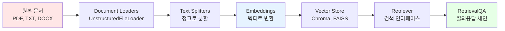
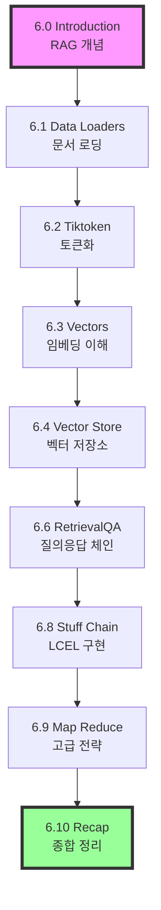

# 📖 Chapter 6: Document Processing - RAG 시스템의 핵심

## 🎯 이 장에서 배울 내용
- ✅ RAG (Retrieval Augmented Generation) 개념과 동작 원리 이해
- ✅ 문서 로딩, 분할, 임베딩, 저장의 전체 파이프라인 구축
- ✅ Vector Store와 검색 시스템 구현
- ✅ 실제 Document GPT 애플리케이션 제작

## 🧠 RAG (Retrieval Augmented Generation)란?

### 기본 개념
RAG는 **검색 증강 생성**으로, LLM의 한계를 극복하는 핵심 기법입니다.

```mermaid
graph TD
    A[사용자 질문: "foo가 뭐야?"] --> B[벡터 검색]
    B --> C[관련 문서 검색]
    C --> D[검색된 문서 + 질문]
    D --> E[LLM에게 전달]
    E --> F[컨텍스트 기반 답변 생성]
    
    style A fill:#E6F3FF
    style F fill:#E6FFE6
    style E fill:#FFE6CC
```

### RAG가 필요한 이유

| 문제 | 일반 LLM | RAG 시스템 |
|------|----------|------------|
| **훈련 데이터 한계** | 훈련 시점까지만 알고 있음 | 최신 문서 실시간 추가 가능 |
| **사적 데이터** | 회사 내부 문서 모름 | 내부 문서 검색하여 활용 |
| **정확성** | 잘못된 정보 생성 가능 | 실제 문서 기반 답변 |
| **투명성** | 정보 출처 불명 | 참조 문서 명시 |

### RAG 동작 과정
```python
# 🧠 개념: RAG의 기본 흐름
# 1. 질문 입력
user_question = "Ministry of Peace가 어디에 있나요?"

# 2. 벡터 검색으로 관련 문서 찾기
relevant_docs = vector_store.search(user_question, top_k=3)

# 3. 컨텍스트 + 질문을 LLM에게 전달
context = "\n".join([doc.content for doc in relevant_docs])
prompt = f"문서: {context}\n\n질문: {user_question}\n답변:"

# 4. LLM이 문서를 기반으로 답변 생성
answer = llm.invoke(prompt)
```

## 🔄 Document Processing 파이프라인

### 전체 흐름도


### 각 단계별 역할

#### 1. 📥 Loading (문서 로딩)
- **목적**: 다양한 형식의 문서를 LangChain Document 형태로 변환
- **도구**: `UnstructuredFileLoader`, `PyPDFLoader`, `TextLoader`
- **결과**: 메타데이터가 포함된 Document 객체

#### 2. ✂️ Splitting (텍스트 분할)
- **목적**: 긴 문서를 의미 있는 작은 청크로 분할
- **이유**: LLM 토큰 제한, 검색 정확도 향상, 비용 최적화
- **도구**: `RecursiveCharacterTextSplitter`, `CharacterTextSplitter`

#### 3. 🔢 Embedding (임베딩)
- **목적**: 텍스트를 수치 벡터로 변환하여 의미적 검색 가능하게 만듦
- **원리**: 의미가 유사한 텍스트는 벡터 공간에서 가까이 위치
- **도구**: `OpenAIEmbeddings`, `CacheBackedEmbeddings`

#### 4. 💾 Vector Store (벡터 저장)
- **목적**: 임베딩 벡터를 효율적으로 저장하고 검색
- **기능**: 유사도 검색, 하이브리드 검색, 메타데이터 필터링
- **도구**: `Chroma`, `FAISS`, `Pinecone`

## 🎯 RAG의 다양한 전략

### 1. Stuff Strategy
```python
# 🧠 개념: 모든 관련 문서를 한 번에 LLM에게 전달
relevant_docs = retriever.get_relevant_documents(query)
all_docs = "\n".join([doc.page_content for doc in relevant_docs])
response = llm.invoke(f"{all_docs}\n\n질문: {query}")
```
- **장점**: 간단한 구현, 빠른 응답
- **단점**: 토큰 제한에 걸리기 쉬움

### 2. Map-Reduce Strategy
```python
# 🧠 개념: 각 문서별로 답변을 생성한 후 종합
individual_answers = []
for doc in relevant_docs:
    answer = llm.invoke(f"문서: {doc}\n질문: {query}")
    individual_answers.append(answer)

final_answer = llm.invoke(f"개별 답변들을 종합하세요: {individual_answers}")
```
- **장점**: 많은 문서 처리 가능
- **단점**: 비용 증가, 처리 시간 증가

### 3. Refine Strategy
- 첫 번째 문서로 초기 답변 생성
- 다음 문서들로 점진적으로 답변 개선
- 순차적 처리로 맥락 유지

## 💡 실무 고려사항

### 비용 최적화
- **임베딩 캐싱**: `CacheBackedEmbeddings`로 중복 계산 방지
- **청크 크기 조절**: 너무 작으면 의미 손실, 너무 크면 비용 증가
- **검색 개수 제한**: `top_k` 매개변수로 관련 문서 수 조절

### 성능 최적화
- **벡터 저장소 선택**: 메모리(Chroma) vs 디스크(FAISS) vs 클라우드(Pinecone)
- **임베딩 모델**: 정확도 vs 속도 vs 비용 균형
- **청크 겹침**: `chunk_overlap`으로 의미 연결성 유지

### 품질 향상
- **메타데이터 활용**: 날짜, 저자, 카테고리로 검색 필터링
- **하이브리드 검색**: 벡터 검색 + 키워드 검색 조합
- **리랭킹**: 검색 결과를 다시 정렬하여 관련성 향상

## 🗺️ Chapter 6 학습 로드맵



### 학습 우선순위
1. **필수**: 6.1-6.4 (기본 파이프라인)
2. **중요**: 6.6, 6.8 (질의응답 체인)
3. **심화**: 6.9 (고급 전략)

## 🛠️ 개발 환경 준비

### 필요한 패키지
```bash
pip install langchain
pip install openai
pip install chromadb
pip install tiktoken
pip install unstructured
```

### 기본 임포트
```python
from langchain.document_loaders import UnstructuredFileLoader
from langchain.text_splitter import CharacterTextSplitter
from langchain.embeddings import OpenAIEmbeddings
from langchain.vectorstores import Chroma
from langchain.chains import RetrievalQA
from langchain.chat_models import ChatOpenAI
```

## ⚠️ 주의사항

### 비용 관련
- 임베딩 생성은 유료 서비스 (OpenAI Embeddings)
- 문서 크기와 청크 수에 비례하여 비용 증가
- 캐싱을 통한 중복 비용 방지 필수

### 성능 관련
- 큰 문서는 분할 필수 (토큰 제한)
- 벡터 검색은 정확하지만 키워드 검색도 때로는 유용
- 실시간 처리보다는 배치 처리가 효율적

### 보안 관련
- 민감한 문서는 로컬 벡터 저장소 사용 권장
- API 키 보안 관리
- 문서 접근 권한 관리

## 🔗 다음 단계
- **다음 학습**: [6.1 Data Loaders and Splitters](./6.1_Data_Loaders_and_Splitters.md)
- **관련 주제**: [Chapter 5: Memory](../Chapter_5_Memory/5.0_Introduction.md)
- **실습 프로젝트**: Document GPT 구축

---

💡 **핵심 요약**: RAG는 LLM의 한계를 극복하는 핵심 기법으로, 외부 문서를 검색하여 LLM에게 제공함으로써 더 정확하고 최신의 정보를 기반으로 한 답변을 생성할 수 있게 합니다. Document Processing 파이프라인을 통해 실제 Document GPT를 구축해보겠습니다.