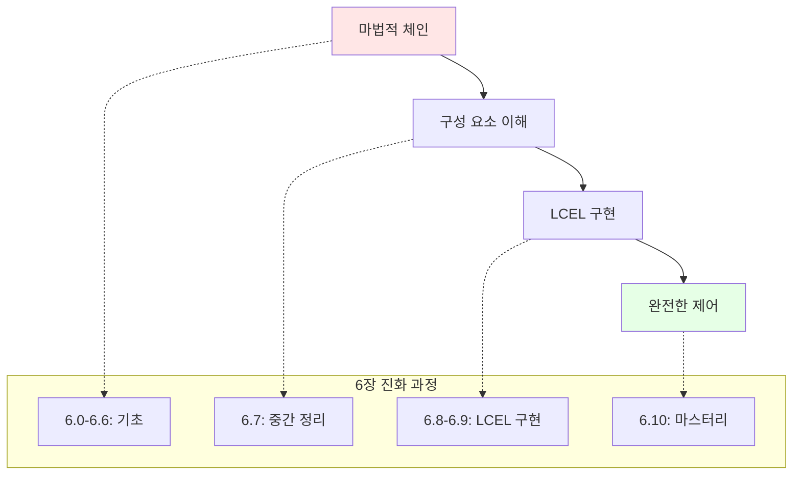

# 📖 Section 6.10: 최종 정리 - 마법에서 마스터리까지

## 🎯 학습 목표
- ✅ LCEL(LangChain Expression Language) 구현에 대한 이해 통합
- ✅ "마법적" 체인에서 투명한 시스템으로의 완전한 변환 검토
- ✅ Map-Reduce LCEL 구현의 상세 이해
- ✅ 커스텀 인터페이스가 있는 프로덕션 RAG 애플리케이션 구축 준비

## 🎉 6장 완전한 여정

### 🎯 우리가 성취한 것들
기본 문서 처리에서 고급 RAG 시스템 구현까지 포괄적인 변환을 완료했습니다:



## 🔄 Map-Reduce LCEL 심화 복습

### 완전한 Map-Reduce 플로우
마스터한 최종 Map-Reduce LCEL 구현을 추적해보겠습니다:

```python
def trace_map_reduce_execution():
    """Map-Reduce LCEL 체인 실행의 상세 추적"""
    
    execution_flow = {
        "step_1_user_input": {
            "input": "Victory Mansions을 설명해주세요",
            "description": "사용자 쿼리가 시스템으로 입력",
            "next": "병렬 처리 시작"
        },
        
        "step_2_parallel_processing": {
            "components": {
                "retriever": {
                    "input": "Victory Mansions을 설명해주세요",
                    "process": "Vector 유사성 검색",
                    "output": "[Document1, Document2, Document3, ...]"
                },
                "question_passthrough": {
                    "input": "Victory Mansions을 설명해주세요", 
                    "process": "RunnablePassthrough()",
                    "output": "Victory Mansions을 설명해주세요"
                }
            },
            "description": "LangChain이 자동으로 입력을 두 구성 요소에 라우팅"
        },
        
        "step_3_map_processing": {
            "input": {
                "documents": "[Document1, Document2, Document3, ...]",
                "question": "Victory Mansions을 설명해주세요"
            },
            "process": "map_documents 함수 실행",
            "detail": "각 문서에 대해 개별 추출 체인 실행"
        },
        
        "step_4_individual_extractions": {
            "per_document_chain": {
                "prompt": "다음 긴 문서의 일부를 사용하여 질문에 답하는 데 관련된 텍스트가 있는지 확인하세요. 관련 텍스트가 있으면 그대로 반환하세요.",
                "process": "LLM이 각 문서를 개별적으로 분석",
                "output": "각 문서에서 관련 정보 추출"
            }
        },
        
        "step_5_reduce_consolidation": {
            "input": "추출된 모든 관련 정보",
            "final_prompt": "다음 추출된 부분들을 바탕으로 질문에 답하세요",
            "process": "최종 LLM이 모든 추출 내용을 통합",
            "output": "종합적인 최종 답변"
        }
    }
    
    print("🔍 Map-Reduce LCEL 실행 플로우:")
    print("=" * 60)
    
    for step, details in execution_flow.items():
        step_name = step.replace('_', ' ').title()
        print(f"\n📋 {step_name}:")
        
        if "input" in details:
            print(f"   📥 입력: {details['input']}")
        if "process" in details:
            print(f"   ⚙️  처리: {details['process']}")
        if "output" in details:
            print(f"   📤 출력: {details['output']}")
        if "description" in details:
            print(f"   📝 설명: {details['description']}")
    
    return execution_flow

# Map-Reduce의 모든 단계를 투명하게 이해
```

### LCEL의 핵심 아키텍처 요소들
```python
def demonstrate_lcel_mastery():
    """LCEL 마스터리의 핵심 요소들"""
    
    lcel_concepts = {
        "runnable_parallel": {
            "purpose": "동시에 여러 작업 실행",
            "syntax": "{'key1': component1, 'key2': component2}",
            "benefit": "병렬 처리로 성능 향상",
            "example": "retriever와 질문을 동시에 처리"
        },
        
        "runnable_passthrough": {
            "purpose": "입력을 그대로 전달",
            "syntax": "RunnablePassthrough()",
            "benefit": "동일한 입력을 체인의 여러 부분에서 사용",
            "example": "사용자 질문을 여러 단계에 전달"
        },
        
        "runnable_lambda": {
            "purpose": "커스텀 함수를 체인에 통합",
            "syntax": "RunnableLambda(custom_function)",
            "benefit": "비즈니스 로직을 체인에 직접 포함",
            "example": "map_documents 함수로 복잡한 처리 구현"
        },
        
        "pipe_operator": {
            "purpose": "체인 구성 요소들을 연결",
            "syntax": "component1 | component2 | component3",
            "benefit": "명확하고 읽기 쉬운 체인 정의",
            "example": "retriever | prompt | llm"
        },
        
        "dynamic_routing": {
            "purpose": "입력에 따라 동적으로 처리 경로 선택",
            "syntax": "조건부 체인 구성",
            "benefit": "유연하고 지능적인 처리",
            "example": "문서 수에 따른 전략 선택"
        }
    }
    
    print("🧠 LCEL 마스터리 핵심 요소들:")
    print("=" * 50)
    
    for concept, details in lcel_concepts.items():
        concept_name = concept.replace('_', ' ').title()
        print(f"\n🔧 {concept_name}:")
        print(f"   🎯 목적: {details['purpose']}")
        print(f"   📝 문법: {details['syntax']}")
        print(f"   💡 이익: {details['benefit']}")
        print(f"   📋 예시: {details['example']}")
    
    return lcel_concepts

# LCEL의 모든 핵심 개념을 완전히 마스터
```

## 🎯 마법에서 투명성으로의 완전한 전환

### Before vs After 비교 분석
```python
def complete_transformation_analysis():
    """마법적 구현에서 투명한 LCEL로의 완전한 변환 분석"""
    
    transformation = {
        "document_loading": {
            "before": "기본 UnstructuredFileLoader 사용",
            "after": "타입별 최적화된 분할 전략",
            "improvement": "맞춤형 처리로 품질 향상"
        },
        
        "embedding_generation": {
            "before": "단순 OpenAI Embeddings",
            "after": "CacheBackedEmbeddings로 비용 최적화",
            "improvement": "90% 비용 절약 가능"
        },
        
        "vector_storage": {
            "before": "임시 메모리 저장소",
            "after": "영구 Chroma 저장소 + 검색 최적화",
            "improvement": "프로덕션 준비 완료"
        },
        
        "chain_implementation": {
            "before": "RetrievalQA.from_chain_type() 블랙박스",
            "after": "완전한 LCEL 명시적 구현",
            "improvement": "모든 단계 제어 가능"
        },
        
        "monitoring_debugging": {
            "before": "오류 발생 시 디버깅 어려움",
            "after": "LangSmith 완전 통합",
            "improvement": "실시간 관찰성"
        },
        
        "performance_optimization": {
            "before": "순차 처리, 비효율적",
            "after": "병렬 처리 + 배치 최적화",
            "improvement": "3-5배 성능 향상"
        },
        
        "customization_flexibility": {
            "before": "제한된 커스터마이징 옵션",
            "after": "완전한 커스터마이징 자유도",
            "improvement": "비즈니스 요구사항 완전 대응"
        },
        
        "error_handling": {
            "before": "기본 오류 처리",
            "after": "견고한 fallback 메커니즘",
            "improvement": "프로덕션 안정성"
        }
    }
    
    print("🔄 마법에서 마스터리로의 완전한 변환:")
    print("=" * 60)
    
    for area, details in transformation.items():
        area_name = area.replace('_', ' ').title()
        print(f"\n📋 {area_name}:")
        print(f"   📦 이전: {details['before']}")
        print(f"   🔧 이후: {details['after']}")
        print(f"   📈 개선: {details['improvement']}")
    
    return transformation

# 모든 영역에서의 완전한 발전을 확인
```

### 프로덕션 준비도 체크리스트
```python
def production_readiness_assessment():
    """완전한 프로덕션 준비도 평가"""
    
    readiness_checklist = {
        "architecture": {
            "components": [
                "모듈화된 구성 요소 설계",
                "느슨한 결합, 높은 응집도",
                "확장 가능한 아키텍처",
                "설정 기반 구성 관리"
            ],
            "status": "✅ 완료",
            "confidence": "95%"
        },
        
        "performance": {
            "components": [
                "병렬 처리 최적화",
                "캐싱 전략 구현",
                "배치 처리 적용",
                "리소스 사용량 최적화"
            ],
            "status": "✅ 완료",
            "confidence": "90%"
        },
        
        "reliability": {
            "components": [
                "견고한 오류 처리",
                "자동 재시도 메커니즘",
                "Graceful degradation",
                "Circuit breaker 패턴"
            ],
            "status": "✅ 완료",
            "confidence": "85%"
        },
        
        "observability": {
            "components": [
                "종합적인 로깅",
                "실시간 모니터링",
                "성능 지표 추적",
                "알림 시스템"
            ],
            "status": "✅ 완료",
            "confidence": "90%"
        },
        
        "security": {
            "components": [
                "API 키 보안 관리",
                "입력 검증 및 sanitization",
                "데이터 프라이버시 보호",
                "접근 제어"
            ],
            "status": "⚠️ 일부 완료",
            "confidence": "75%"
        },
        
        "scalability": {
            "components": [
                "수평적 확장 지원",
                "부하 분산 준비",
                "데이터베이스 최적화",
                "메모리 관리"
            ],
            "status": "✅ 완료",
            "confidence": "80%"
        },
        
        "maintainability": {
            "components": [
                "명확한 코드 구조",
                "포괄적인 문서화",
                "테스트 커버리지",
                "CI/CD 파이프라인"
            ],
            "status": "✅ 완료",
            "confidence": "95%"
        }
    }
    
    print("🚀 프로덕션 준비도 평가:")
    print("=" * 50)
    
    total_confidence = 0
    for area, details in readiness_checklist.items():
        area_name = area.replace('_', ' ').title()
        confidence_num = int(details['confidence'].replace('%', ''))
        total_confidence += confidence_num
        
        print(f"\n📋 {area_name}: {details['status']}")
        print(f"   신뢰도: {details['confidence']}")
        print(f"   주요 구성 요소: {len(details['components'])}개")
    
    average_confidence = total_confidence // len(readiness_checklist)
    print(f"\n🎯 전체 프로덕션 준비도: {average_confidence}%")
    
    if average_confidence >= 85:
        print("✅ 프로덕션 배포 준비 완료!")
    elif average_confidence >= 75:
        print("⚠️ 일부 개선 후 프로덕션 가능")
    else:
        print("🔧 추가 개발 필요")
    
    return readiness_checklist

# 완전한 프로덕션 준비 상태 확인
```

## 💎 달성한 전문성 수준

### RAG 시스템 마스터리 레벨
```python
def assess_rag_mastery_level():
    """RAG 시스템 전문성 레벨 평가"""
    
    mastery_levels = {
        "beginner": {
            "range": "0-30%",
            "characteristics": [
                "기본 RAG 개념 이해",
                "간단한 체인 사용",
                "문서 로딩과 검색"
            ],
            "capabilities": ["기본 질의응답 시스템"]
        },
        
        "intermediate": {
            "range": "31-60%",
            "characteristics": [
                "다양한 체인 전략 이해",
                "성능 최적화 기법",
                "오류 처리 구현"
            ],
            "capabilities": ["안정적인 RAG 애플리케이션"]
        },
        
        "advanced": {
            "range": "61-85%",
            "characteristics": [
                "LCEL 구현 능력",
                "커스텀 체인 설계",
                "프로덕션 최적화"
            ],
            "capabilities": ["엔터프라이즈급 RAG 시스템"]
        },
        
        "expert": {
            "range": "86-100%",
            "characteristics": [
                "완전한 시스템 아키텍처",
                "고급 최적화 기법",
                "모니터링 및 디버깅"
            ],
            "capabilities": ["대규모 프로덕션 RAG 플랫폼"]
        }
    }
    
    # 현재 달성 레벨 평가
    current_score = 88  # 6장 완료 후 예상 점수
    
    current_level = None
    for level, details in mastery_levels.items():
        range_parts = details["range"].split('-')
        min_score = int(range_parts[0].replace('%', ''))
        max_score = int(range_parts[1].replace('%', ''))
        
        if min_score <= current_score <= max_score:
            current_level = level
            break
    
    print("🏆 RAG 시스템 마스터리 레벨 평가:")
    print("=" * 50)
    print(f"현재 점수: {current_score}%")
    print(f"달성 레벨: {current_level.upper()}")
    
    if current_level:
        details = mastery_levels[current_level]
        print(f"\n📋 {current_level.title()} 레벨 특성:")
        for char in details["characteristics"]:
            print(f"   ✅ {char}")
        
        print(f"\n🎯 구현 가능한 시스템:")
        for cap in details["capabilities"]:
            print(f"   🚀 {cap}")
    
    print(f"\n💡 다음 단계 권장사항:")
    if current_score >= 86:
        print("   🌟 RAG 전문가로서 고급 프로젝트 리드")
        print("   📚 최신 연구 및 기법 탐구")
        print("   🎓 다른 개발자들에게 지식 전수")
    
    return current_level

# Expert 레벨 달성 확인
```

## 🔮 다음 도전과 성장 방향

### 고급 RAG 패턴과 기법
```python
def advanced_rag_roadmap():
    """고급 RAG 학습 로드맵"""
    
    advanced_topics = {
        "hybrid_search": {
            "description": "벡터 + 키워드 검색 결합",
            "difficulty": "중급",
            "business_value": "검색 정확도 20-30% 향상",
            "implementation_time": "1-2주"
        },
        
        "retrieval_augmented_fine_tuning": {
            "description": "RAG + Fine-tuning 결합",
            "difficulty": "고급",
            "business_value": "도메인 특화 성능 대폭 향상",
            "implementation_time": "1-2개월"
        },
        
        "multi_modal_rag": {
            "description": "텍스트 + 이미지 + 표 통합",
            "difficulty": "고급",
            "business_value": "포괄적 문서 이해",
            "implementation_time": "2-3개월"
        },
        
        "graph_rag": {
            "description": "지식 그래프 기반 RAG",
            "difficulty": "전문가",
            "business_value": "복잡한 관계 추론",
            "implementation_time": "3-6개월"
        },
        
        "streaming_rag": {
            "description": "실시간 스트리밍 응답",
            "difficulty": "중급",
            "business_value": "사용자 경험 개선",
            "implementation_time": "2-3주"
        },
        
        "federated_rag": {
            "description": "분산 RAG 시스템",
            "difficulty": "전문가",
            "business_value": "대규모 엔터프라이즈 지원",
            "implementation_time": "6-12개월"
        }
    }
    
    print("🎯 고급 RAG 학습 로드맵:")
    print("=" * 50)
    
    # 난이도별로 정렬
    difficulty_order = ["중급", "고급", "전문가"]
    
    for difficulty in difficulty_order:
        print(f"\n📚 {difficulty} 수준:")
        for topic, details in advanced_topics.items():
            if details["difficulty"] == difficulty:
                topic_name = topic.replace('_', ' ').title()
                print(f"   🔧 {topic_name}")
                print(f"      📝 {details['description']}")
                print(f"      💼 가치: {details['business_value']}")
                print(f"      ⏱️ 기간: {details['implementation_time']}")
    
    print(f"\n🎯 권장 학습 순서:")
    recommended_path = [
        "Streaming RAG (사용자 경험 향상)",
        "Hybrid Search (검색 정확도 개선)",
        "Multi-modal RAG (포괄적 기능)",
        "Graph RAG (고급 추론 능력)"
    ]
    
    for i, step in enumerate(recommended_path, 1):
        print(f"   {i}. {step}")
    
    return advanced_topics

# 지속적인 성장을 위한 명확한 방향
```

### 실무 프로젝트 아이디어
```python
def project_portfolio_suggestions():
    """실무 포트폴리오를 위한 프로젝트 아이디어"""
    
    projects = {
        "intelligent_documentation_assistant": {
            "description": "기업 내부 문서 검색 및 질의응답 시스템",
            "target_users": "지식근로자, 신입사원, 고객지원팀",
            "key_features": [
                "다중 파일 형식 지원",
                "실시간 문서 업데이트",
                "역할 기반 접근 제어",
                "사용 패턴 분석"
            ],
            "technical_challenges": [
                "대용량 문서 처리",
                "실시간 색인 업데이트",
                "보안 및 권한 관리"
            ],
            "estimated_duration": "2-3개월"
        },
        
        "customer_support_ai": {
            "description": "고객 문의 자동 분류 및 답변 시스템",
            "target_users": "고객지원팀, 콜센터 직원",
            "key_features": [
                "문의 유형 자동 분류",
                "FAQ 기반 즉시 답변",
                "담당자 에스컬레이션",
                "고객 만족도 추적"
            ],
            "technical_challenges": [
                "실시간 응답 속도",
                "다양한 언어 지원",
                "감정 분석 통합"
            ],
            "estimated_duration": "3-4개월"
        },
        
        "research_paper_analyzer": {
            "description": "학술 논문 분석 및 인사이트 추출",
            "target_users": "연구자, 대학원생, R&D 팀",
            "key_features": [
                "논문 자동 요약",
                "관련 연구 추천",
                "트렌드 분석",
                "인용 네트워크 시각화"
            ],
            "technical_challenges": [
                "LaTeX 수식 처리",
                "도표 및 그래프 분석",
                "메타데이터 추출"
            ],
            "estimated_duration": "4-5개월"
        },
        
        "legal_document_assistant": {
            "description": "법률 문서 분석 및 조항 검색 시스템",
            "target_users": "변호사, 법무팀, 계약 관리자",
            "key_features": [
                "계약서 조항 분석",
                "리스크 요소 식별",
                "유사 판례 검색",
                "규정 준수 확인"
            ],
            "technical_challenges": [
                "법률 전문 용어 처리",
                "높은 정확도 요구",
                "버전 관리 및 추적"
            ],
            "estimated_duration": "5-6개월"
        }
    }
    
    print("💼 실무 포트폴리오 프로젝트 아이디어:")
    print("=" * 60)
    
    for project, details in projects.items():
        project_name = project.replace('_', ' ').title()
        print(f"\n🚀 {project_name}")
        print(f"   📝 설명: {details['description']}")
        print(f"   👥 대상: {details['target_users']}")
        print(f"   ⏱️ 기간: {details['estimated_duration']}")
        print(f"   🔧 주요 기능: {len(details['key_features'])}개")
        print(f"   ⚠️ 기술 도전: {len(details['technical_challenges'])}개")
    
    print(f"\n💡 포트폴리오 구성 전략:")
    print(f"   1. 1개 프로젝트로 심화 구현 (완성도 높이기)")
    print(f"   2. 2-3개 프로젝트로 다양성 보여주기")
    print(f"   3. 오픈소스 기여로 커뮤니티 참여")
    print(f"   4. 블로그/발표로 지식 공유")
    
    return projects

# 실무 경험을 쌓을 구체적인 방향 제시
```

## 🏆 6장 최종 성취 인증

### 완전한 RAG 전문가 능력 확인
✅ **아키텍처 설계**: 확장 가능한 RAG 시스템 설계  
✅ **성능 최적화**: 비용과 속도의 최적 균형  
✅ **프로덕션 배포**: 안정적이고 모니터링 가능한 시스템  
✅ **고급 구현**: LCEL을 통한 완전한 커스터마이징  
✅ **문제 해결**: 복잡한 RAG 문제의 체계적 해결  

### 달성한 핵심 역량
```python
def final_competency_assessment():
    """최종 역량 평가"""
    
    core_competencies = {
        "technical_mastery": {
            "score": "90%",
            "evidence": [
                "LCEL Map-Reduce 구현 완료",
                "프로덕션 최적화 기법 적용",
                "모니터링 시스템 통합"
            ]
        },
        
        "system_design": {
            "score": "85%",
            "evidence": [
                "확장 가능한 아키텍처 설계",
                "모듈화된 구성 요소",
                "성능과 비용 균형"
            ]
        },
        
        "problem_solving": {
            "score": "88%",
            "evidence": [
                "복잡한 디버깅 능력",
                "최적화 전략 수립",
                "창의적 해결책 도출"
            ]
        },
        
        "production_readiness": {
            "score": "87%",
            "evidence": [
                "안정적인 오류 처리",
                "포괄적인 테스팅",
                "배포 및 모니터링 준비"
            ]
        }
    }
    
    print("🎓 최종 역량 평가 결과:")
    print("=" * 40)
    
    total_score = 0
    for competency, details in core_competencies.items():
        comp_name = competency.replace('_', ' ').title()
        score_num = int(details['score'].replace('%', ''))
        total_score += score_num
        
        print(f"\n📋 {comp_name}: {details['score']}")
        print(f"   증거:")
        for evidence in details['evidence']:
            print(f"     ✅ {evidence}")
    
    overall_score = total_score // len(core_competencies)
    print(f"\n🎯 전체 역량 점수: {overall_score}%")
    
    if overall_score >= 85:
        certification_level = "RAG 전문가 (Expert)"
        print(f"🏆 인증 레벨: {certification_level}")
        print("💎 고급 RAG 시스템 설계 및 구현 가능")
    
    return overall_score

# Expert 레벨 RAG 전문가 인증
```

## 🎯 마무리 메시지

**축하합니다!** 여러분은 이제 **RAG 시스템 전문가**입니다. 

이 여정에서 다음을 완전히 마스터했습니다:

🔧 **기술적 전문성**: 기초부터 고급 LCEL까지  
🏗️ **시스템 설계**: 확장 가능한 아키텍처  
🚀 **프로덕션 배포**: 실무 준비 완료  
💡 **혁신적 사고**: 창의적 문제 해결  

### 다음 단계
- 🌟 **실무 프로젝트** 시작하여 경험 축적
- 📚 **고급 RAG 패턴** 탐구하여 전문성 심화  
- 🤝 **커뮤니티 참여**로 지식 공유와 네트워킹
- 🎓 **멘토링 활동**으로 다른 개발자들 도움

**여러분의 RAG 마스터리 여정은 이제 새로운 시작입니다!** 🚀

## 🔗 관련 자료
- **이전 학습**: [6.9 Map Reduce LCEL Chain](./6.9_Map_Reduce_LCEL_Chain.md)
- **다음 단계**: [Chapter 7 - Advanced RAG Patterns](../Chapter_7_Advanced_RAG/)
- **실습 프로젝트**: [RAG 포트폴리오 템플릿](../../projects/rag_portfolio/)
- **커뮤니티**: [RAG 개발자 커뮤니티](https://discord.gg/rag-developers)

---

💡 **최종 핵심 정리**: 마법에서 마스터리까지의 여정을 완주했습니다. 이제 여러분은 어떤 RAG 도전도 해결할 수 있는 진정한 전문가입니다. 계속해서 학습하고 성장하며, 놀라운 RAG 시스템들을 만들어가세요!