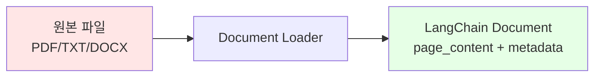

# 📖 Section 6.1: Data Loaders and Splitters - RAG의 첫 걸음

## 🎯 학습 목표
- ✅ 다양한 문서 형식(PDF, TXT, DOCX)을 LangChain으로 로딩하는 방법 습득
- ✅ UnstructuredFileLoader의 강력한 통합 로딩 기능 이해
- ✅ 문서 분할의 필요성과 다양한 분할 전략 학습
- ✅ chunk_size와 chunk_overlap 매개변수의 최적화 방법 익히기

## 🧠 핵심 개념

### 문서 로딩이란?
**Document Loading**은 다양한 형식의 외부 데이터를 LangChain이 처리할 수 있는 `Document` 객체로 변환하는 과정입니다.



### 문서 분할이 필요한 이유

| 문제 상황 | 해결책 |
|-----------|--------|
| **토큰 제한** | 큰 문서는 LLM 입력 제한을 초과 |
| **검색 정확도** | 작은 청크가 더 정확한 검색 결과 |
| **비용 효율성** | 관련 부분만 LLM에게 제공하여 비용 절약 |
| **의미 보존** | 문단이나 문장 단위로 분할하여 맥락 유지 |

## 📋 주요 클래스/함수 레퍼런스

### UnstructuredFileLoader
```python
from langchain.document_loaders import UnstructuredFileLoader

class UnstructuredFileLoader(BaseLoader):
    def __init__(
        self, 
        file_path: str,              # 📌 필수: 로딩할 파일 경로
        mode: str = "single",        # 📌 선택: "single" 또는 "paged" 모드
        **kwargs
    ):
        """
        다양한 파일 형식을 통합 지원하는 범용 문서 로더
        
        지원 형식: PDF, TXT, DOCX, HTML, PowerPoint, 이미지 등
        """
```

**📌 주요 특징**:
- **통합성**: 하나의 로더로 모든 파일 형식 처리
- **자동 감지**: 파일 확장자에 따라 적절한 처리 방식 선택
- **의존성 관리**: 필요한 패키지들을 자동으로 다운로드

### RecursiveCharacterTextSplitter
```python
from langchain.text_splitter import RecursiveCharacterTextSplitter

class RecursiveCharacterTextSplitter(TextSplitter):
    def __init__(
        self,
        chunk_size: int = 4000,        # 📌 용도: 각 청크의 최대 문자 수
        chunk_overlap: int = 200,      # 📌 용도: 청크 간 겹치는 문자 수
        separators: List[str] = None   # 📌 용도: 분할 기준 문자들
    ):
        """
        문서를 재귀적으로 분할하는 지능형 텍스트 분할기
        """
```

**📌 분할 우선순위**:
1. 문단 구분 (`\n\n`)
2. 문장 구분 (`\n`)  
3. 단어 구분 (` `)
4. 문자 단위 분할

### CharacterTextSplitter
```python
from langchain.text_splitter import CharacterTextSplitter

class CharacterTextSplitter(TextSplitter):
    def __init__(
        self,
        separator: str = "\n\n",       # 📌 용도: 분할 기준 문자
        chunk_size: int = 1000,        # 📌 용도: 최대 청크 크기
        chunk_overlap: int = 200       # 📌 용도: 청크 겹침 크기
    ):
        """
        지정된 구분자를 기준으로 문서를 분할하는 단순 분할기
        """
```

## 🔧 동작 과정 상세

### 1단계: 문서 로딩 기본 사용법
```python
# === Step 1: 다양한 로더들의 기본 사용법 ===

# 📌 텍스트 파일 로딩
from langchain.document_loaders import TextLoader
text_loader = TextLoader("./files/chapter_one.txt")
text_docs = text_loader.load()

# 📌 PDF 파일 로딩  
from langchain.document_loaders import PyPDFLoader
pdf_loader = PyPDFLoader("./files/chapter_one.pdf")
pdf_docs = pdf_loader.load()

# 📌 통합 로더 사용 (권장)
from langchain.document_loaders import UnstructuredFileLoader
loader = UnstructuredFileLoader("./files/chapter_one.docx")
docs = loader.load()

print(f"로딩된 문서 수: {len(docs)}")
print(f"첫 번째 문서 내용 미리보기: {docs[0].page_content[:200]}...")
```

### 2단계: 문서 분할 전략
```python
# === Step 2: 기본 분할 vs 지능형 분할 ===

from langchain.text_splitter import RecursiveCharacterTextSplitter

# 🧠 개념: 문서가 너무 클 때의 문제점 확인
print(f"원본 문서 길이: {len(docs[0].page_content)} 문자")
print(f"문서 개수: {len(docs)}")  # 일반적으로 1개

# 📌 지능형 분할기 생성
splitter = RecursiveCharacterTextSplitter(
    chunk_size=1000,    # 📌 각 청크는 최대 1000자
    chunk_overlap=100   # 📌 인접 청크 간 100자 겹침
)

# 🔧 분할 실행
split_docs = splitter.split_documents(docs)
print(f"분할 후 문서 개수: {len(split_docs)}")
```

### 3단계: 로딩과 분할 통합
```python
# === Step 3: 로딩과 분할을 한 번에 처리 ===

# 💡 실무 팁: load_and_split() 메서드 활용
loader = UnstructuredFileLoader("./files/chapter_one.docx")
split_docs = loader.load_and_split(text_splitter=splitter)

print(f"✅ 한 번에 로딩 및 분할 완료: {len(split_docs)}개 청크")

# 📊 분할 결과 확인
for i, doc in enumerate(split_docs[:3]):  # 첫 3개 청크만 확인
    print(f"\n--- 청크 {i+1} ---")
    print(f"길이: {len(doc.page_content)} 문자")
    print(f"내용 미리보기: {doc.page_content[:100]}...")
```

## 💻 실전 예제

### 완전한 문서 처리 파이프라인
```python
import os
from langchain.document_loaders import UnstructuredFileLoader
from langchain.text_splitter import RecursiveCharacterTextSplitter

# === 1단계: 파일 존재 확인 ===
file_path = "./files/chapter_one.docx"
if not os.path.exists(file_path):
    print("❌ 파일이 존재하지 않습니다. 파일을 files/ 폴더에 준비해주세요.")
    exit()

# === 2단계: 문서 로더 설정 ===
# 🧠 개념: UnstructuredFileLoader는 파일 형식을 자동 감지
loader = UnstructuredFileLoader(file_path)

# === 3단계: 텍스트 분할기 설정 ===  
# 💡 실무 팁: 문서 타입에 따른 최적화 매개변수
splitter = RecursiveCharacterTextSplitter(
    chunk_size=600,     # 📌 중간 크기: 너무 크지도 작지도 않게
    chunk_overlap=100,  # 📌 적절한 겹침: 문맥 연결성 유지
    separators=[        # 📌 한국어 문서에 최적화된 구분자
        "\n\n",         # 문단 구분 (최우선)
        "\n",           # 줄 구분  
        ".",            # 문장 구분
        " "             # 단어 구분 (최후)
    ]
)

# === 4단계: 로딩 및 분할 실행 ===
try:
    documents = loader.load_and_split(text_splitter=splitter)
    
    print("🎉 문서 처리 성공!")
    print(f"📊 통계:")
    print(f"   - 총 청크 수: {len(documents)}")
    
    # 청크 크기 분포 확인
    chunk_sizes = [len(doc.page_content) for doc in documents]
    print(f"   - 평균 청크 크기: {sum(chunk_sizes) // len(chunk_sizes)} 문자")
    print(f"   - 최대 청크 크기: {max(chunk_sizes)} 문자")
    print(f"   - 최소 청크 크기: {min(chunk_sizes)} 문자")
    
    # === 5단계: 분할 품질 검증 ===
    print("\n🔍 분할 품질 검증:")
    
    # 겹침 확인
    if len(documents) > 1:
        overlap_found = False
        for i in range(len(documents) - 1):
            current_end = documents[i].page_content[-50:]  # 마지막 50자
            next_start = documents[i+1].page_content[:50]   # 첫 50자
            
            # 겹치는 부분이 있는지 확인
            for j in range(10, 50):  # 최소 10자 이상 겹쳐야 유의미
                if current_end[-j:] in next_start:
                    overlap_found = True
                    print(f"   ✅ 청크 {i+1}과 {i+2} 사이에 {j}자 겹침 발견")
                    break
        
        if not overlap_found:
            print("   ⚠️ 청크 간 겹침이 발견되지 않았습니다. chunk_overlap 설정을 확인하세요.")
    
except Exception as e:
    print(f"❌ 오류 발생: {e}")
    print("💡 해결 방법:")
    print("   1. 파일 경로가 올바른지 확인")
    print("   2. 파일이 손상되지 않았는지 확인") 
    print("   3. unstructured 패키지 설치: pip install unstructured")
```

## 🔍 변수/함수 상세 설명

### 핵심 매개변수 최적화

#### chunk_size 설정 가이드
```python
# 📌 용도: 각 청크의 최대 크기 설정, 타입: int

# 작은 크기 (200-500자)
chunk_size_small = 300
# 장점: 정확한 검색, 빠른 처리
# 단점: 문맥 손실 가능, 많은 청크 생성

# 중간 크기 (500-1000자) - 권장
chunk_size_medium = 600  
# 장점: 문맥과 정확성의 균형
# 단점: 상황에 따라 조정 필요

# 큰 크기 (1000-2000자)
chunk_size_large = 1500
# 장점: 풍부한 문맥 정보
# 단점: 검색 정확도 저하, 토큰 비용 증가
```

#### chunk_overlap 최적화
```python
# 📌 용도: 청크 간 겹치는 부분 크기, 타입: int

def calculate_optimal_overlap(chunk_size: int) -> int:
    """
    📋 기능: 청크 크기에 따른 최적 겹침 크기 계산
    💡 경험 법칙: 청크 크기의 10-20%가 적절
    """
    if chunk_size <= 300:
        return chunk_size // 10      # 10% 겹침
    elif chunk_size <= 1000:
        return chunk_size // 8       # 12.5% 겹침  
    else:
        return chunk_size // 6       # 16.7% 겹침

# 사용 예시
chunk_size = 600
optimal_overlap = calculate_optimal_overlap(chunk_size)
print(f"📊 권장 겹침 크기: {optimal_overlap}자 (전체의 {optimal_overlap/chunk_size*100:.1f}%)")
```

### 고급 분할 전략
```python
# === 문서 타입별 맞춤 분할 전략 ===

def create_splitter_for_document_type(doc_type: str) -> RecursiveCharacterTextSplitter:
    """
    📋 기능: 문서 타입에 따른 최적화된 분할기 생성
    📥 입력: 문서 타입 ('academic', 'novel', 'technical', 'news')
    📤 출력: 최적화된 TextSplitter 객체
    """
    
    if doc_type == "academic":
        # 학술 논문: 긴 문단, 큰 청크 필요
        return RecursiveCharacterTextSplitter(
            chunk_size=1200,
            chunk_overlap=200,
            separators=["\n\n", "\n", ". ", " "]
        )
    
    elif doc_type == "novel":
        # 소설: 문단과 대화 구분 중요
        return RecursiveCharacterTextSplitter(
            chunk_size=800,
            chunk_overlap=100,
            separators=["\n\n", "\n", '"', ". ", " "]
        )
    
    elif doc_type == "technical":
        # 기술 문서: 코드 블록과 설명 구분
        return RecursiveCharacterTextSplitter(
            chunk_size=1000,
            chunk_overlap=150,
            separators=["\n\n", "\n", "```", ". ", " "]
        )
    
    else:  # 일반 문서
        return RecursiveCharacterTextSplitter(
            chunk_size=600,
            chunk_overlap=100
        )

# 사용 예시
novel_splitter = create_splitter_for_document_type("novel")
technical_splitter = create_splitter_for_document_type("technical")
```

## 🧪 실습 과제

### 🔨 기본 과제
1. **다중 파일 로딩**: PDF, TXT, DOCX 파일을 각각 로딩하여 결과 비교
```python
# TODO: 세 가지 파일 형식을 로딩하고 내용과 메타데이터 비교
files = ["chapter.txt", "chapter.pdf", "chapter.docx"]
# 힌트: 각 로더의 메타데이터에서 어떤 정보를 제공하는지 확인
```

2. **분할 전략 비교**: chunk_size를 300, 600, 1200으로 변경하며 결과 분석
```python
# TODO: 다양한 청크 크기로 분할 후 검색 정확도 테스트
chunk_sizes = [300, 600, 1200]
# 힌트: 각 크기별로 생성되는 청크 수와 평균 문자 수 비교
```

### 🚀 심화 과제
3. **겹침 효과 분석**: chunk_overlap을 0, 50, 100, 200으로 변경하며 효과 측정
```python
# TODO: 겹침 설정이 문맥 연결성에 미치는 영향 분석
def analyze_chunk_continuity(documents, overlap_size):
    """청크 간 연결성 점수 계산"""
    pass
```

4. **맞춤형 분할기 개발**: 특정 문서 형식에 최적화된 분할기 구현
```python
# TODO: 마크다운 문서를 위한 전용 분할기 구현
class MarkdownAwareTextSplitter(RecursiveCharacterTextSplitter):
    """마크다운 구조를 고려한 지능형 분할기"""
    
    def __init__(self, **kwargs):
        # 마크다운 구분자 추가: ##, ###, -, *, 등
        separators = ["\n## ", "\n### ", "\n- ", "\n* ", "\n\n", "\n", " "]
        super().__init__(separators=separators, **kwargs)
```

### 💡 창의 과제
5. **동적 청크 크기 조절**: 문서 내용에 따라 자동으로 청크 크기 조절
```python
# TODO: 문서의 복잡도에 따라 청크 크기를 동적 조절하는 시스템
def adaptive_chunk_size(text_complexity_score):
    """텍스트 복잡도에 따른 적응형 청크 크기 계산"""
    pass
```

6. **품질 지표 개발**: 분할 품질을 자동 평가하는 지표 시스템
```python
# TODO: 분할 품질을 수치화하는 평가 시스템
def evaluate_split_quality(original_doc, split_docs):
    """
    분할 품질 지표:
    - 의미적 일관성 점수
    - 정보 손실률  
    - 검색 효율성 점수
    """
    pass
```

## ⚠️ 주의사항

### 성능 고려사항
```python
# ❌ 비효율적인 방법
for file_path in large_file_list:
    loader = UnstructuredFileLoader(file_path)
    docs = loader.load()  # 매번 새로운 로더 생성

# ✅ 효율적인 방법  
def batch_load_documents(file_paths: List[str]) -> List[Document]:
    """배치 처리로 여러 문서를 효율적으로 로딩"""
    all_docs = []
    for file_path in file_paths:
        try:
            loader = UnstructuredFileLoader(file_path)
            docs = loader.load()
            all_docs.extend(docs)
        except Exception as e:
            print(f"⚠️ {file_path} 로딩 실패: {e}")
    return all_docs
```

### 메모리 관리
- **큰 파일 처리**: 메모리 부족을 방지하기 위해 streaming 처리 고려
- **분할 결과 캐싱**: 동일한 문서의 반복 처리 시 결과 캐싱
- **가비지 컬렉션**: 대용량 처리 후 명시적 메모리 해제

### 문서 형식별 주의점
- **PDF**: 스캔된 PDF는 OCR 필요, 복잡한 레이아웃 주의
- **DOCX**: 표와 이미지 처리 방식 확인
- **HTML**: 태그 제거 정도 조절 필요

## 🔗 관련 자료
- **이전 학습**: [6.0 Introduction](./6.0_Introduction.md)
- **다음 학습**: [6.2 Tiktoken](./6.2_Tiktoken.md)
- **참고 문서**: [LangChain Document Loaders](https://python.langchain.com/docs/modules/data_connection/document_loaders/)
- **실습 파일**: [6.1 Data Loaders and Splitters.ipynb](../../00%20lecture/6.1%20Data%20Loaders%20and%20Splitters.ipynb)

---

💡 **핵심 정리**: 문서 로딩과 분할은 RAG 시스템의 첫 단계로, 품질 좋은 청크 생성이 전체 시스템 성능을 좌우합니다. `UnstructuredFileLoader`로 다양한 형식을 통합 처리하고, `RecursiveCharacterTextSplitter`로 지능적 분할을 통해 의미 있는 청크를 생성하는 것이 핵심입니다.