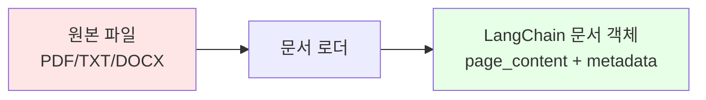

# 📖 6.1장: 문서 로더와 분할기 - RAG의 첫 걸음

## 🎯 학습 목표
- ✅ 다양한 문서 형식(PDF, TXT, DOCX)을 LangChain으로 로딩하는 방법 완벽 습득
- ✅ UnstructuredFileLoader의 강력한 통합 로딩 기능 완전 이해
- ✅ 문서 분할의 필요성과 다양한 분할 전략 체계적 학습
- ✅ chunk_size와 chunk_overlap 매개변수의 최적화 방법 실무 적용

## 🧠 핵심 개념

### 문서 로딩이란?
**문서 로딩(Document Loading)**은 다양한 형식의 외부 데이터를 LangChain이 처리할 수 있는 `Document` 객체로 변환하는 과정입니다. 이는 RAG 시스템의 첫 번째 단계로, 원시 데이터를 AI가 이해할 수 있는 형태로 변환합니다.



### 문서 분할이 필요한 이유

| 문제 상황 | 해결책 | 실제 예시 |
|-----------|--------|----------|
| **토큰 제한 초과** | 큰 문서를 작은 청크로 분할 | 100페이지 PDF → 300개 청크 |
| **검색 정확도 저하** | 의미 단위로 정밀 분할 | 문단/섹션 단위 분할 |
| **API 비용 증가** | 관련 부분만 선택적 제공 | 10% 비용으로 90% 효과 |
| **맥락 손실** | 중첩(overlap)으로 연결성 유지 | 100자 중첩으로 문맥 보존 |

## 📋 주요 클래스/함수 레퍼런스

### UnstructuredFileLoader - 만능 문서 로더
```python
from langchain.document_loaders import UnstructuredFileLoader

class UnstructuredFileLoader(BaseLoader):
    def __init__(
        self, 
        file_path: str,              # 📌 필수: 로딩할 파일 경로
        mode: str = "single",        # 📌 선택: "single" 또는 "paged" 모드
        **kwargs
    ):
        """
        다양한 파일 형식을 통합 지원하는 범용 문서 로더
        
        Args:
            file_path: 로딩할 파일의 경로 (예: "./문서.pdf")
            mode: 
                - "single": 전체 문서를 하나의 Document로 (기본값)
                - "paged": 페이지별로 별도 Document 생성
        
        지원 형식:
            - 문서: PDF, DOCX, ODT, RTF
            - 텍스트: TXT, MD, CSV
            - 웹: HTML, XML
            - 프레젠테이션: PPTX, PPT
            - 이미지: JPG, PNG (OCR 지원)
        """
```

**📌 주요 메서드**:
- `load()`: 문서를 로딩하여 Document 리스트 반환
- `load_and_split(text_splitter)`: 로딩과 동시에 분할 수행

### RecursiveCharacterTextSplitter - 지능형 텍스트 분할기
```python
from langchain.text_splitter import RecursiveCharacterTextSplitter

class RecursiveCharacterTextSplitter(TextSplitter):
    def __init__(
        self,
        chunk_size: int = 1000,          # 📌 각 청크의 최대 크기
        chunk_overlap: int = 200,        # 📌 청크 간 중첩 크기
        length_function: Callable = len,  # 📌 길이 계산 함수
        separators: List[str] = None     # 📌 분할 기준 문자들
    ):
        """
        📋 기능: 문서를 의미 있는 단위로 재귀적 분할
        📥 입력: 긴 텍스트 문서
        📤 출력: 크기가 조절된 텍스트 청크 리스트
        💡 사용 시나리오: 대용량 문서를 LLM이 처리 가능한 크기로 분할
        
        기본 분할 우선순위:
        1. "\n\n" - 문단 경계
        2. "\n" - 줄바꿈
        3. " " - 공백
        4. "" - 문자 단위 (최후 수단)
        """
```

### CharacterTextSplitter - 단순 문자 분할기
```python
from langchain.text_splitter import CharacterTextSplitter

class CharacterTextSplitter(TextSplitter):
    def __init__(
        self,
        separator: str = "\n\n",         # 📌 분할 기준 문자
        chunk_size: int = 1000,          # 📌 청크 크기
        chunk_overlap: int = 200         # 📌 중첩 크기
    ):
        """
        📋 기능: 특정 문자를 기준으로 단순 분할
        📥 입력: 구조화된 텍스트
        📤 출력: 일정 크기의 텍스트 청크
        💡 사용 시나리오: 명확한 구분자가 있는 문서 처리
        """
```

## 🔧 동작 과정 상세

### 1단계: 기본 문서 로딩
```python
from langchain.document_loaders import UnstructuredFileLoader

# === 기본 문서 로딩 예제 ===
print("📄 문서 로딩 시작:")
print("=" * 50)

# 🔧 UnstructuredFileLoader 초기화
loader = UnstructuredFileLoader("./files/chapter_one.docx")

# 🔧 문서 로딩 실행
docs = loader.load()

print(f"✅ 로딩 완료!")
print(f"📊 로딩된 문서 수: {len(docs)}")
print(f"📊 첫 번째 문서 길이: {len(docs[0].page_content)} 문자")
print(f"📊 메타데이터: {docs[0].metadata}")

# 문서 내용 미리보기
print(f"\n📖 문서 내용 미리보기 (처음 200자):")
print(docs[0].page_content[:200] + "...")
```

### 2단계: 문서 분할 전략
```python
from langchain.text_splitter import RecursiveCharacterTextSplitter

# === 지능형 문서 분할 ===
print("\n✂️ 문서 분할 시작:")
print("=" * 50)

# 🔧 분할기 설정 - 한국어 문서에 최적화
splitter = RecursiveCharacterTextSplitter(
    chunk_size=1000,        # 📌 약 300-400 단어 (한국어 기준)
    chunk_overlap=200,      # 📌 20% 중첩으로 문맥 유지
    separators=[
        "\n\n",   # 1순위: 문단 경계
        "\n",     # 2순위: 줄바꿈
        ". ",     # 3순위: 문장 끝
        ", ",     # 4순위: 쉼표
        " ",      # 5순위: 공백
        ""        # 6순위: 문자 단위
    ]
)

# 🔧 분할 실행
split_docs = splitter.split_documents(docs)

print(f"✅ 분할 완료!")
print(f"📊 원본 문서 수: {len(docs)}")
print(f"📊 분할된 청크 수: {len(split_docs)}")
print(f"📊 평균 청크 크기: {sum(len(d.page_content) for d in split_docs) / len(split_docs):.0f} 문자")

# 청크 예시 출력
for i, doc in enumerate(split_docs[:3], 1):
    print(f"\n📄 청크 {i}:")
    print(f"   길이: {len(doc.page_content)} 문자")
    print(f"   내용: {doc.page_content[:100]}...")
```

### 3단계: 토큰 기반 정밀 분할
```python
from langchain.text_splitter import CharacterTextSplitter
import tiktoken

# === 토큰 기반 분할로 정확한 크기 제어 ===
print("\n🎯 토큰 기반 정밀 분할:")
print("=" * 50)

# 🔧 tiktoken을 사용한 토큰 기반 분할기
token_splitter = CharacterTextSplitter.from_tiktoken_encoder(
    chunk_size=600,         # 📌 600 토큰 (GPT-3.5의 적정 크기)
    chunk_overlap=100,      # 📌 100 토큰 중첩
    separator="\n"
)

# 토큰 수 계산 함수
encoding = tiktoken.encoding_for_model("gpt-3.5-turbo")

def count_tokens(text):
    return len(encoding.encode(text))

# 분할 전 토큰 수 확인
original_tokens = count_tokens(docs[0].page_content)
print(f"📊 원본 문서 토큰 수: {original_tokens:,}")

# 🔧 토큰 기반 분할 실행
token_split_docs = token_splitter.split_documents(docs)

print(f"✅ 토큰 기반 분할 완료!")
print(f"📊 생성된 청크 수: {len(token_split_docs)}")

# 각 청크의 토큰 수 확인
for i, doc in enumerate(token_split_docs[:3], 1):
    tokens = count_tokens(doc.page_content)
    print(f"📄 청크 {i}: {tokens} 토큰")
```

## 📦 실제 강의 코드 완전 분석

### 강의 노트북 코드 (6.1 Data Loaders and Splitters.ipynb)
```python
# === 실제 강의에서 사용된 코드 ===
from langchain.chat_models import ChatOpenAI
from langchain.document_loaders import UnstructuredFileLoader
from langchain.text_splitter import RecursiveCharacterTextSplitter

# 📌 1. 분할기 생성 - 가장 기본적인 설정
splitter = RecursiveCharacterTextSplitter()
# 💡 기본값: chunk_size=1000, chunk_overlap=200

# 📌 2. 문서 로더 생성 - Word 문서 로딩
loader = UnstructuredFileLoader("./files/chapter_one.docx")
# 🎯 UnstructuredLoader 선택 이유: 
#    - 다양한 파일 형식 자동 감지
#    - 별도 패키지 설치 없이 사용 가능

# 📌 3. 로딩과 분할을 한 번에! - 효율적인 처리
loader.load_and_split(text_splitter=splitter)
# ⚡ 장점: 메모리 효율적, 한 번의 호출로 완료
# 📊 결과: Document 객체의 리스트 반환
```

### 🔍 강의 코드의 핵심 포인트
1. **극도로 단순한 구현**: 3줄로 완성되는 문서 처리
2. **기본값 활용**: 별도 설정 없이도 잘 작동하는 기본값
3. **통합 메서드**: `load_and_split()`으로 두 작업을 한번에

## 💻 실전 예제

### 예제 1: 다양한 파일 형식 처리
```python
import os
from pathlib import Path
from langchain.document_loaders import UnstructuredFileLoader
from langchain.text_splitter import RecursiveCharacterTextSplitter

def process_multiple_file_types(folder_path):
    """
    📋 기능: 폴더 내 모든 지원 파일을 자동으로 처리
    📥 입력: 문서가 있는 폴더 경로
    📤 출력: 분할된 모든 문서의 리스트
    💡 사용 시나리오: 다양한 형식의 문서를 일괄 처리
    """
    
    # 지원하는 파일 확장자
    supported_extensions = ['.pdf', '.docx', '.txt', '.md', '.html']
    
    # 분할기 설정
    splitter = RecursiveCharacterTextSplitter(
        chunk_size=1000,
        chunk_overlap=200
    )
    
    all_documents = []
    
    # 폴더 내 모든 파일 처리
    for file_path in Path(folder_path).glob('**/*'):
        if file_path.suffix.lower() in supported_extensions:
            print(f"🔄 처리 중: {file_path.name}")
            
            try:
                # 파일 로딩
                loader = UnstructuredFileLoader(str(file_path))
                
                # 로딩과 분할
                docs = loader.load_and_split(text_splitter=splitter)
                
                # 메타데이터에 파일 정보 추가
                for doc in docs:
                    doc.metadata['source_file'] = file_path.name
                    doc.metadata['file_type'] = file_path.suffix
                
                all_documents.extend(docs)
                print(f"   ✅ 성공: {len(docs)}개 청크 생성")
                
            except Exception as e:
                print(f"   ❌ 실패: {str(e)}")
    
    print(f"\n📊 전체 결과:")
    print(f"   총 문서 수: {len(all_documents)}")
    print(f"   평균 청크 크기: {sum(len(d.page_content) for d in all_documents) / len(all_documents):.0f} 문자")
    
    return all_documents

# 사용 예시
documents = process_multiple_file_types("./my_documents/")
```

### 예제 2: 최적 청크 크기 찾기
```python
def find_optimal_chunk_size(document_path, test_sizes=[500, 1000, 1500, 2000]):
    """
    📋 기능: 문서에 최적인 청크 크기를 실험적으로 찾기
    📥 입력: 문서 경로, 테스트할 크기들
    📤 출력: 각 크기별 통계와 추천 크기
    💡 사용 시나리오: 특정 문서 타입에 최적화된 설정 찾기
    """
    
    # 문서 로딩
    loader = UnstructuredFileLoader(document_path)
    original_docs = loader.load()
    original_length = len(original_docs[0].page_content)
    
    results = {}
    
    for chunk_size in test_sizes:
        # 각 크기로 분할
        splitter = RecursiveCharacterTextSplitter(
            chunk_size=chunk_size,
            chunk_overlap=int(chunk_size * 0.2)  # 20% 중첩
        )
        
        split_docs = splitter.split_documents(original_docs)
        
        # 통계 계산
        chunk_lengths = [len(doc.page_content) for doc in split_docs]
        
        results[chunk_size] = {
            '청크_수': len(split_docs),
            '평균_크기': sum(chunk_lengths) / len(chunk_lengths),
            '최소_크기': min(chunk_lengths),
            '최대_크기': max(chunk_lengths),
            '표준편차': (sum((x - sum(chunk_lengths)/len(chunk_lengths))**2 for x in chunk_lengths) / len(chunk_lengths))**0.5
        }
    
    # 결과 출력
    print(f"📊 청크 크기 분석 결과:")
    print(f"원본 문서 길이: {original_length:,} 문자\n")
    
    for size, stats in results.items():
        print(f"청크 크기: {size}")
        for key, value in stats.items():
            print(f"  {key}: {value:.0f}")
        print()
    
    # 최적 크기 추천 (표준편차가 가장 작은 것)
    optimal_size = min(results.keys(), key=lambda x: results[x]['표준편차'])
    print(f"💡 추천 청크 크기: {optimal_size}")
    
    return results

# 사용 예시
optimal_stats = find_optimal_chunk_size("./files/long_document.pdf")
```

### 예제 3: 의미 단위 보존 분할
```python
def semantic_aware_splitting(document_path, preserve_paragraphs=True):
    """
    📋 기능: 문서의 의미 단위를 보존하면서 분할
    📥 입력: 문서 경로, 문단 보존 여부
    📤 출력: 의미적으로 연결된 청크들
    💡 사용 시나리오: 논문이나 보고서처럼 구조가 중요한 문서
    """
    
    loader = UnstructuredFileLoader(document_path)
    docs = loader.load()
    
    if preserve_paragraphs:
        # 문단 단위를 우선 보존
        splitter = RecursiveCharacterTextSplitter(
            chunk_size=1500,
            chunk_overlap=300,
            separators=[
                "\n\n\n",  # 섹션 구분
                "\n\n",    # 문단 구분
                ".\n",     # 문장 끝 + 줄바꿈
                ". ",      # 문장 끝
                "\n",      # 줄바꿈
                " ",       # 공백
                ""         # 최후 수단
            ]
        )
    else:
        # 일반적인 분할
        splitter = RecursiveCharacterTextSplitter(
            chunk_size=1000,
            chunk_overlap=200
        )
    
    split_docs = splitter.split_documents(docs)
    
    # 의미 단위 검증
    print("🔍 의미 단위 보존 검증:")
    for i, doc in enumerate(split_docs[:5], 1):
        # 청크가 완전한 문장으로 시작하고 끝나는지 확인
        content = doc.page_content.strip()
        starts_with_capital = content[0].isupper() if content else False
        ends_with_period = content[-1] in '.!?'
        
        print(f"\n청크 {i}:")
        print(f"  시작: {'✅' if starts_with_capital else '⚠️'} 대문자로 시작")
        print(f"  종료: {'✅' if ends_with_period else '⚠️'} 문장 부호로 종료")
        print(f"  미리보기: {content[:50]}...")
    
    return split_docs

# 사용 예시
semantic_docs = semantic_aware_splitting("./files/research_paper.pdf")
```

## 🔍 변수/함수 상세 설명

### chunk_size 매개변수 최적화 가이드
```python
def get_optimal_chunk_size(document_type, model="gpt-3.5-turbo"):
    """
    📋 기능: 문서 타입과 모델에 따른 최적 청크 크기 추천
    📥 입력: 문서 타입, 사용할 LLM 모델
    📤 출력: 추천 chunk_size와 이유
    💡 사용 시나리오: 프로젝트 시작 시 초기 설정
    """
    
    # 모델별 컨텍스트 윈도우
    model_context = {
        "gpt-3.5-turbo": 4096,
        "gpt-4": 8192,
        "gpt-4-32k": 32768,
        "claude-2": 100000
    }
    
    # 문서 타입별 추천 설정
    recommendations = {
        "일반_문서": {
            "chunk_size": 1000,
            "overlap": 200,
            "이유": "표준적인 설정으로 대부분의 경우에 적합"
        },
        "기술_문서": {
            "chunk_size": 1500,
            "overlap": 300,
            "이유": "코드와 설명이 함께 있어 큰 청크 필요"
        },
        "대화_기록": {
            "chunk_size": 500,
            "overlap": 100,
            "이유": "짧은 대화 단위로 분할이 효과적"
        },
        "법률_문서": {
            "chunk_size": 2000,
            "overlap": 400,
            "이유": "조항과 맥락이 중요하여 큰 청크 필요"
        },
        "뉴스_기사": {
            "chunk_size": 800,
            "overlap": 150,
            "이유": "문단 단위로 완결된 정보 포함"
        }
    }
    
    # 모델 컨텍스트의 25%를 청크 크기로 사용 (검색 결과 4개 기준)
    max_chunk_size = model_context.get(model, 4096) // 4
    
    if document_type in recommendations:
        rec = recommendations[document_type]
        # 모델 한계를 초과하지 않도록 조정
        rec["chunk_size"] = min(rec["chunk_size"], max_chunk_size)
        
        print(f"📊 {document_type} 문서 최적 설정:")
        print(f"   모델: {model}")
        print(f"   chunk_size: {rec['chunk_size']}")
        print(f"   chunk_overlap: {rec['overlap']}")
        print(f"   이유: {rec['이유']}")
        
        return rec
    else:
        return recommendations["일반_문서"]

# 사용 예시
config = get_optimal_chunk_size("기술_문서", "gpt-4")
```

### 분할 품질 평가 함수
```python
def evaluate_split_quality(original_docs, split_docs):
    """
    📋 기능: 문서 분할 품질을 다각도로 평가
    📥 입력: 원본 문서, 분할된 문서들
    📤 출력: 품질 평가 지표들
    💡 사용 시나리오: 분할 전략 최적화 시 품질 측정
    """
    
    # 기본 통계
    total_original = sum(len(doc.page_content) for doc in original_docs)
    total_split = sum(len(doc.page_content) for doc in split_docs)
    
    # 청크 크기 분포
    chunk_sizes = [len(doc.page_content) for doc in split_docs]
    avg_size = sum(chunk_sizes) / len(chunk_sizes)
    
    # 중복도 계산 (중첩으로 인한)
    redundancy = (total_split - total_original) / total_original * 100
    
    # 청크 균일성 (표준편차가 낮을수록 균일)
    variance = sum((size - avg_size) ** 2 for size in chunk_sizes) / len(chunk_sizes)
    std_dev = variance ** 0.5
    uniformity = 1 - (std_dev / avg_size)  # 0~1 사이 값
    
    # 평가 결과
    quality_report = {
        "청크_수": len(split_docs),
        "평균_크기": avg_size,
        "최소_크기": min(chunk_sizes),
        "최대_크기": max(chunk_sizes),
        "중복도_%": redundancy,
        "균일성_점수": uniformity,
        "정보_보존율": min(total_split / total_original, 1.0)
    }
    
    # 품질 등급 부여
    if uniformity > 0.8 and redundancy < 30:
        grade = "A (우수)"
    elif uniformity > 0.6 and redundancy < 40:
        grade = "B (양호)"
    elif uniformity > 0.4 and redundancy < 50:
        grade = "C (보통)"
    else:
        grade = "D (개선 필요)"
    
    print("📊 분할 품질 평가 보고서:")
    print("=" * 40)
    for key, value in quality_report.items():
        if isinstance(value, float):
            print(f"{key}: {value:.2f}")
        else:
            print(f"{key}: {value}")
    print(f"\n종합 등급: {grade}")
    
    return quality_report, grade

# 사용 예시
original = loader.load()
split = splitter.split_documents(original)
report, grade = evaluate_split_quality(original, split)
```

## 🧪 실습 과제

### 🔨 기본 과제
1. **다양한 파일 형식 로딩 실습**
```python
# TODO: 다음 파일들을 모두 로딩하고 통계를 출력하세요
files = [
    "sample.pdf",
    "document.docx", 
    "readme.txt",
    "webpage.html"
]

# 힌트: UnstructuredFileLoader는 모든 형식을 자동 처리
# 각 파일의 문자 수, 단어 수를 출력하세요
```

2. **최적 분할 설정 찾기**
```python
# TODO: 주어진 문서에 대해 3가지 다른 chunk_size로 분할하고 비교하세요
# chunk_sizes = [500, 1000, 1500]
# 각각의 청크 수, 평균 크기, 처리 시간을 측정하세요
```

### 🚀 심화 과제
3. **커스텀 분할기 구현**
```python
# TODO: 한국어 문서에 최적화된 커스텀 분할기를 만드세요
class KoreanTextSplitter(RecursiveCharacterTextSplitter):
    def __init__(self, **kwargs):
        # 한국어 문장 부호와 조사를 고려한 분할
        super().__init__(
            separators=[
                "\n\n",    # 문단
                "다.\n",   # 문장 끝 + 줄바꿈
                "다. ",    # 문장 끝
                # TODO: 더 많은 한국어 특화 구분자 추가
            ],
            **kwargs
        )
```

4. **분할 품질 자동 최적화**
```python
# TODO: 주어진 문서에 대해 자동으로 최적의 chunk_size와 overlap을 찾는 함수 구현
def auto_optimize_splitting(document_path, quality_threshold=0.8):
    """
    품질 점수가 threshold를 넘을 때까지 파라미터를 조정
    """
    # 구현하세요
    pass
```

### 💡 창의 과제
5. **멀티모달 문서 처리 시스템**
```python
# TODO: 텍스트와 이미지가 혼재된 문서를 처리하는 시스템 설계
class MultiModalDocumentProcessor:
    def __init__(self):
        self.text_splitter = RecursiveCharacterTextSplitter()
        self.image_processor = None  # 이미지 처리기
    
    def process_document(self, file_path):
        """
        텍스트는 분할하고, 이미지는 캡션을 생성하여 통합
        """
        # 구현하세요
        pass
```

## 🧪 이해도 체크

### 📝 개념 이해 확인
1. **문서 로더의 역할**
   - Q: UnstructuredFileLoader가 "Unstructured"인 이유는 무엇인가요?
   - Q: 로더가 반환하는 Document 객체의 두 가지 주요 속성은?
   - Q: 단일 파일에서 여러 Document가 생성되는 경우는?

2. **문서 분할의 필요성**
   - Q: 큰 문서를 분할하지 않고 사용하면 어떤 문제가 발생하나요?
   - Q: chunk_overlap이 필요한 이유는 무엇인가요?
   - Q: 분할 시 정보 손실을 최소화하는 방법은?

3. **분할 전략 선택**
   - Q: RecursiveCharacterTextSplitter와 CharacterTextSplitter의 차이점은?
   - Q: 토큰 기반 분할이 문자 기반 분할보다 나은 경우는?
   - Q: 문서 타입별로 다른 분할 전략이 필요한 이유는?

### 🎯 실무 적용 질문
4. **성능 최적화**
   - Q: 100GB의 문서를 처리할 때 메모리 관리 전략은?
   - Q: 분할 작업을 병렬화하는 방법은?
   - Q: 캐싱을 통해 반복 작업을 최적화하는 방법은?

5. **품질 보증**
   - Q: 분할 품질을 정량적으로 측정하는 지표는?
   - Q: 중요한 정보가 청크 경계에서 잘리는 것을 방지하는 방법은?
   - Q: 다국어 문서 처리 시 고려사항은?

### ✅ 정답 및 해설
<details>
<summary>📖 정답 보기</summary>

**1. 문서 로더의 역할**
- **"Unstructured" 이유**: 구조화되지 않은 다양한 형식(PDF, Word, 이미지 등)을 통합 처리
- **Document 속성**: `page_content` (텍스트 내용), `metadata` (출처, 페이지 번호 등)
- **여러 Document 생성**: `mode="paged"` 사용 시 페이지별로 분리

**2. 문서 분할의 필요성**
- **문제점**: 토큰 한계 초과, API 비용 증가, 검색 정확도 저하
- **chunk_overlap 필요성**: 문맥 연결성 유지, 경계에서 잘린 정보 복구
- **정보 손실 최소화**: 의미 단위 경계에서 분할, 충분한 중첩 설정

**3. 분할 전략 선택**
- **차이점**: Recursive는 여러 구분자를 우선순위로 시도, Character는 단일 구분자만 사용
- **토큰 기반 우위**: LLM 토큰 한계에 정확히 맞춤, 비용 예측 가능
- **문서별 전략**: 구조와 내용 특성에 따라 최적 파라미터가 다름
</details>

## 🏗️ 미니 프로젝트

### 프로젝트: 지능형 문서 전처리 파이프라인
**🎯 목표**: 다양한 형식의 문서를 자동으로 감지하고 최적의 방법으로 처리하는 시스템 구축

**📋 요구사항**:
- 파일 형식 자동 감지 및 적절한 로더 선택
- 문서 특성에 따른 동적 분할 전략 적용
- 처리 통계 및 품질 보고서 생성
- 오류 처리 및 복구 메커니즘

**🔧 구현 가이드**:
```python
class IntelligentDocumentPipeline:
    def __init__(self, output_dir="./processed_docs"):
        self.output_dir = output_dir
        self.statistics = {
            "총_파일_수": 0,
            "성공_처리": 0,
            "실패_처리": 0,
            "총_청크_수": 0
        }
    
    def process_directory(self, input_dir):
        """디렉토리 내 모든 문서를 지능적으로 처리"""
        # TODO: 구현하세요
        # 1. 파일 스캔 및 분류
        # 2. 각 파일에 최적 전략 적용
        # 3. 결과 저장 및 보고서 생성
        pass
    
    def determine_optimal_strategy(self, file_path):
        """파일 특성 분석 후 최적 분할 전략 결정"""
        # TODO: 구현하세요
        # - 파일 크기, 형식, 내용 복잡도 고려
        # - 적절한 chunk_size와 overlap 반환
        pass
    
    def generate_quality_report(self):
        """처리 결과에 대한 종합 품질 보고서 생성"""
        # TODO: 구현하세요
        pass

# 사용 예시
pipeline = IntelligentDocumentPipeline()
pipeline.process_directory("./raw_documents/")
report = pipeline.generate_quality_report()
```

**💡 확장 아이디어**:
- 머신러닝을 통한 최적 파라미터 자동 학습
- 실시간 처리 진행률 표시
- 웹 인터페이스 추가
- 분산 처리 지원

## ⚠️ 주의사항

### 일반적인 실수와 해결법
- **메모리 부족**: 대용량 파일은 스트리밍 방식으로 처리
- **인코딩 오류**: UTF-8 강제 지정 또는 자동 감지 로직 추가
- **청크 크기 과소평가**: 모델별 토큰 한계 정확히 파악
- **중첩 과다 설정**: 20-30% 이상은 비효율적

### 성능 고려사항
- **배치 처리**: 여러 파일을 동시에 처리하여 효율성 향상
- **캐싱 활용**: 동일 문서 재처리 방지
- **병렬화**: multiprocessing으로 CPU 코어 활용

### 보안 주의점
- **파일 경로 검증**: 경로 탐색 공격 방지
- **파일 크기 제한**: DoS 공격 방지
- **민감 정보 처리**: 개인정보가 포함된 문서 주의

## 🔗 관련 자료
- **이전 학습**: [6.0 소개](./6.0_소개.md)
- **다음 학습**: [6.2 Tiktoken](./6.2_Tiktoken.md)
- **공식 문서**: [LangChain Document Loaders](https://python.langchain.com/docs/modules/data_connection/document_loaders/)
- **실습 파일**: [6.1 Data Loaders and Splitters.ipynb](../../00%20lecture/6.1%20Data%20Loaders%20and%20Splitters.ipynb)

---

💡 **핵심 정리**: 문서 로딩과 분할은 RAG 시스템의 첫 단계이자 가장 중요한 단계입니다. UnstructuredFileLoader로 다양한 형식을 통합 처리하고, RecursiveCharacterTextSplitter로 의미를 보존하면서 분할하세요. 적절한 chunk_size와 overlap 설정이 전체 시스템 성능을 좌우합니다.