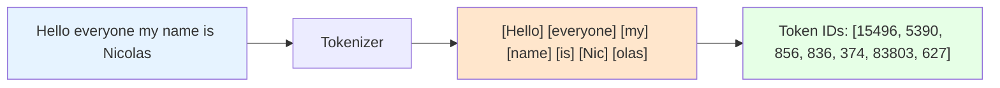

# 📖 Section 6.2: Tiktoken - 정확한 토큰 계산의 핵심

## 🎯 학습 목표
- ✅ 토큰(Token)과 문자(Character)의 차이점 완전 이해
- ✅ OpenAI 모델이 실제로 텍스트를 처리하는 방식 학습
- ✅ Tiktoken을 활용한 정확한 토큰 기반 텍스트 분할 구현
- ✅ 비용 최적화를 위한 토큰 계산 전략 습득

## 🧠 핵심 개념

### 토큰(Token)이란?
**토큰**은 LLM이 실제로 이해하고 처리하는 텍스트의 기본 단위입니다. 문자나 단어와는 다른 독특한 특성을 가집니다.



### 문자 vs 토큰 비교

| 특성 | 문자(Character) | 토큰(Token) |
|------|-----------------|-------------|
| **계산 방식** | `len("Hello")` = 5 | `encode("Hello")` = 1 토큰 |
| **언어별 차이** | 한글 1자 = 1문자 | 한글 1자 = 보통 2-3 토큰 |
| **처리 단위** | 개별 문자 | 의미있는 텍스트 조각 |
| **비용 기준** | 사용하지 않음 | OpenAI 요금 기준 |

### 토큰화 예시 분석
```python
# 🧠 개념: 동일한 텍스트의 문자 수 vs 토큰 수 비교
text = "Hello everyone my name is Nicolas nice to meet you"

# 문자 수 계산
char_count = len(text)  # 결과: 49 문자

# 토큰 수 계산 (OpenAI 기준)
# "Hello" → 1 토큰
# " everyone" → 1 토큰 (공백 포함)
# " my" → 1 토큰
# " name" → 1 토큰
# " is" → 1 토큰  
# " Nicolas" → 1 토큰이지만 실제로는 " Nic" + "olas" = 2 토큰
# 총 13 토큰
```

## 📋 주요 클래스/함수 레퍼런스

### Tiktoken 기본 사용법
```python
import tiktoken

# OpenAI 모델별 인코더 가져오기
encoder = tiktoken.encoding_for_model("gpt-3.5-turbo")
# 📌 지원 모델: "gpt-4", "gpt-3.5-turbo", "text-davinci-003" 등

# 또는 인코딩 이름으로 직접 가져오기
encoder = tiktoken.get_encoding("cl100k_base")  
# 📌 gpt-3.5-turbo와 gpt-4가 사용하는 인코딩
```

### 토큰 인코딩/디코딩
```python
class Encoding:
    def encode(self, text: str) -> List[int]:
        """
        📋 기능: 텍스트를 토큰 ID 리스트로 변환
        📥 입력: 문자열 텍스트
        📤 출력: 토큰 ID 리스트
        """
    
    def decode(self, tokens: List[int]) -> str:
        """
        📋 기능: 토큰 ID 리스트를 텍스트로 복원
        📥 입력: 토큰 ID 리스트  
        📤 출력: 원본 문자열
        """
    
    def encode_batch(self, texts: List[str]) -> List[List[int]]:
        """
        📋 기능: 여러 텍스트를 배치로 인코딩 (효율적)
        💡 사용 시나리오: 대량 텍스트 처리 시
        """
```

### LangChain 통합
```python
from langchain.text_splitter import CharacterTextSplitter

# 토큰 기반 분할기 생성
splitter = CharacterTextSplitter.from_tiktoken_encoder(
    separator="\n",           # 📌 용도: 분할 기준 문자
    chunk_size=600,          # 📌 용도: 최대 토큰 수 (문자 수 아님!)
    chunk_overlap=100,       # 📌 용도: 겹치는 토큰 수
    model_name="gpt-3.5-turbo"  # 📌 용도: 토큰화 기준 모델
)
```

## 🔧 동작 과정 상세

### 1단계: 기본 토큰화 이해
```python
import tiktoken

# === OpenAI 토큰화 실습 ===
# 🧠 개념: 실제 모델이 텍스트를 어떻게 인식하는지 확인

encoder = tiktoken.encoding_for_model("gpt-3.5-turbo")

# 한국어와 영어의 토큰화 차이
texts = [
    "Hello world!",
    "안녕하세요!",  
    "Hello everyone my name is Nicolas",
    "안녕하세요 여러분 제 이름은 니콜라스입니다"
]

print("🔍 토큰화 분석 결과:")
print("-" * 60)

for text in texts:
    # 문자 수 계산
    char_count = len(text)
    
    # 토큰 인코딩
    tokens = encoder.encode(text)
    token_count = len(tokens)
    
    # 효율성 비율 계산  
    efficiency = char_count / token_count
    
    print(f"텍스트: {text}")
    print(f"📊 문자 수: {char_count}")
    print(f"📊 토큰 수: {token_count}")
    print(f"📊 토큰 효율성: {efficiency:.2f} (문자/토큰)")
    print(f"📊 토큰 IDs: {tokens[:10]}..." if len(tokens) > 10 else f"📊 토큰 IDs: {tokens}")
    print("-" * 60)
```

### 2단계: 토큰 기반 텍스트 분할
```python
from langchain.document_loaders import UnstructuredFileLoader
from langchain.text_splitter import CharacterTextSplitter

# === 기존 문자 기반 vs 토큰 기반 분할 비교 ===

# 📌 문서 로딩
loader = UnstructuredFileLoader("./files/chapter_one.docx")
docs = loader.load()

print("📈 분할 방식 비교 분석:")
print("=" * 80)

# 🔴 기존 방식: 문자 기반 분할
char_splitter = CharacterTextSplitter(
    separator="\n",
    chunk_size=600,      # 📌 600 문자
    chunk_overlap=100    # 📌 100 문자 겹침
)

char_chunks = char_splitter.split_documents(docs)

# 🟢 개선된 방식: 토큰 기반 분할
token_splitter = CharacterTextSplitter.from_tiktoken_encoder(
    separator="\n", 
    chunk_size=600,      # 📌 600 토큰 (실제 모델 기준!)
    chunk_overlap=100,   # 📌 100 토큰 겹침
    model_name="gpt-3.5-turbo"
)

token_chunks = token_splitter.split_documents(docs)

# 결과 비교
print(f"📊 문자 기반 분할: {len(char_chunks)}개 청크")
print(f"📊 토큰 기반 분할: {len(token_chunks)}개 청크") 
print(f"📊 차이: {abs(len(char_chunks) - len(token_chunks))}개 청크")
```

### 3단계: 정확한 비용 계산
```python
import tiktoken

def calculate_embedding_cost(documents, model="text-embedding-ada-002"):
    """
    📋 기능: 임베딩 생성 비용을 정확하게 계산
    📥 입력: 문서 리스트, 임베딩 모델명
    📤 출력: 예상 비용 (USD)
    💡 사용 시나리오: 대용량 문서 처리 전 비용 예측
    """
    
    # 모델별 토큰화 인코더
    encoder = tiktoken.encoding_for_model("gpt-3.5-turbo")  # 범용적으로 사용
    
    total_tokens = 0
    
    for doc in documents:
        tokens = encoder.encode(doc.page_content)
        total_tokens += len(tokens)
    
    # OpenAI 임베딩 가격 (2024년 기준)
    # text-embedding-ada-002: $0.0001 per 1K tokens
    cost_per_1k_tokens = 0.0001
    estimated_cost = (total_tokens / 1000) * cost_per_1k_tokens
    
    print(f"💰 비용 계산 결과:")
    print(f"   📊 총 토큰 수: {total_tokens:,}")
    print(f"   💵 예상 임베딩 비용: ${estimated_cost:.6f}")
    print(f"   📈 1만 토큰당 비용: ${cost_per_1k_tokens * 10:.4f}")
    
    return estimated_cost

# 사용 예시
estimated_cost = calculate_embedding_cost(token_chunks)
```

## 💻 실전 예제

### 토큰 효율성 최적화 시스템
```python
import tiktoken
from langchain.text_splitter import CharacterTextSplitter
from langchain.document_loaders import UnstructuredFileLoader
from typing import List, Dict, Any

class TokenOptimizedDocumentProcessor:
    """
    🎯 토큰 효율성을 극대화하는 문서 처리기
    
    주요 기능:
    - 정확한 토큰 기반 분할
    - 비용 예측 및 최적화  
    - 다양한 청크 크기 시나리오 분석
    """
    
    def __init__(self, model_name: str = "gpt-3.5-turbo"):
        self.model_name = model_name
        self.encoder = tiktoken.encoding_for_model(model_name)
        
        # OpenAI 모델별 토큰 제한
        self.token_limits = {
            "gpt-3.5-turbo": 4096,
            "gpt-4": 8192, 
            "gpt-4-32k": 32768
        }
    
    def analyze_text_complexity(self, text: str) -> Dict[str, Any]:
        """
        📋 기능: 텍스트의 토큰 복잡도 분석
        📊 지표: 토큰 효율성, 압축률, 다양성 등
        """
        
        char_count = len(text)
        tokens = self.encoder.encode(text)
        token_count = len(tokens)
        
        # 토큰 효율성 (높을수록 토큰 절약)
        efficiency = char_count / token_count if token_count > 0 else 0
        
        # 토큰 다양성 (고유 토큰 비율)
        unique_tokens = len(set(tokens))
        diversity = unique_tokens / token_count if token_count > 0 else 0
        
        return {
            "character_count": char_count,
            "token_count": token_count,
            "efficiency_ratio": efficiency,
            "diversity_ratio": diversity,
            "compression_ratio": token_count / char_count if char_count > 0 else 0
        }
    
    def find_optimal_chunk_size(self, documents: List, target_count: int = None) -> Dict[str, Any]:
        """
        📋 기능: 최적의 청크 크기 자동 계산
        💡 전략: 토큰 제한, 비용, 검색 효율성을 종합 고려
        """
        
        # 전체 텍스트 분석
        full_text = "\n".join([doc.page_content for doc in documents])
        analysis = self.analyze_text_complexity(full_text)
        
        total_tokens = analysis["token_count"]
        
        # 시나리오별 청크 크기 후보
        candidates = [200, 400, 600, 800, 1000, 1500]
        
        best_scenario = None
        best_score = 0
        
        results = []
        
        for chunk_size in candidates:
            # 예상 청크 수
            estimated_chunks = total_tokens // chunk_size
            
            # 모델 토큰 제한 내에서 사용 가능한 청크 수
            model_limit = self.token_limits.get(self.model_name, 4096)
            max_context_chunks = (model_limit - 500) // chunk_size  # 500토큰은 질문+시스템메시지용
            
            # 스코어 계산 (여러 요소 종합)
            size_score = min(chunk_size / 600, 1.0)  # 600토큰을 최적으로 가정
            efficiency_score = min(estimated_chunks / 50, 1.0)  # 50개 청크를 기준
            context_score = min(max_context_chunks / 5, 1.0)  # 5개 청크 동시 사용 가능
            
            total_score = (size_score + efficiency_score + context_score) / 3
            
            scenario = {
                "chunk_size": chunk_size,
                "estimated_chunks": estimated_chunks,
                "max_context_chunks": max_context_chunks,
                "total_score": total_score
            }
            
            results.append(scenario)
            
            if total_score > best_score:
                best_score = total_score
                best_scenario = scenario
        
        return {
            "recommended": best_scenario,
            "all_scenarios": results,
            "text_analysis": analysis
        }
    
    def create_optimized_splitter(self, chunk_size: int = None) -> CharacterTextSplitter:
        """
        📋 기능: 최적화된 토큰 기반 분할기 생성
        """
        
        if chunk_size is None:
            chunk_size = 600  # 기본값
        
        # 겹침 크기는 청크 크기의 15% 정도가 적절
        chunk_overlap = min(chunk_size // 7, 150)
        
        return CharacterTextSplitter.from_tiktoken_encoder(
            separator="\n",
            chunk_size=chunk_size,
            chunk_overlap=chunk_overlap,
            model_name=self.model_name
        )
    
    def process_document_with_optimization(self, file_path: str) -> Dict[str, Any]:
        """
        📋 기능: 문서 전체 처리 파이프라인 (최적화 포함)
        """
        
        print(f"🚀 토큰 최적화 문서 처리 시작: {file_path}")
        print("=" * 80)
        
        # 1단계: 문서 로딩
        loader = UnstructuredFileLoader(file_path)
        docs = loader.load()
        
        # 2단계: 최적 청크 크기 분석
        optimization_result = self.find_optimal_chunk_size(docs)
        recommended_size = optimization_result["recommended"]["chunk_size"]
        
        print(f"📊 최적화 분석 결과:")
        print(f"   🎯 권장 청크 크기: {recommended_size} 토큰")
        print(f"   📈 예상 청크 수: {optimization_result['recommended']['estimated_chunks']}개")
        print(f"   🔄 동시 컨텍스트 가능: {optimization_result['recommended']['max_context_chunks']}개")
        
        # 3단계: 최적화된 분할기로 처리
        optimized_splitter = self.create_optimized_splitter(recommended_size)
        final_chunks = optimized_splitter.split_documents(docs)
        
        # 4단계: 비용 계산
        total_tokens = sum(len(self.encoder.encode(chunk.page_content)) for chunk in final_chunks)
        embedding_cost = (total_tokens / 1000) * 0.0001  # text-embedding-ada-002 기준
        
        print(f"\n💰 비용 분석:")
        print(f"   📊 총 토큰 수: {total_tokens:,}")
        print(f"   💵 임베딩 비용: ${embedding_cost:.6f}")
        print(f"   📈 청크당 평균 토큰: {total_tokens // len(final_chunks)}")
        
        return {
            "chunks": final_chunks,
            "optimization_analysis": optimization_result,
            "cost_analysis": {
                "total_tokens": total_tokens,
                "embedding_cost": embedding_cost,
                "chunks_count": len(final_chunks)
            }
        }

# === 사용 예시 ===
processor = TokenOptimizedDocumentProcessor("gpt-3.5-turbo")
result = processor.process_document_with_optimization("./files/chapter_one.docx")

print(f"\n✅ 처리 완료!")
print(f"📦 최종 청크 수: {len(result['chunks'])}")
print(f"💰 예상 임베딩 비용: ${result['cost_analysis']['embedding_cost']:.6f}")
```

## 🔍 변수/함수 상세 설명

### 토큰 계산 최적화 함수들
```python
def count_tokens_efficiently(texts: List[str], model: str = "gpt-3.5-turbo") -> List[int]:
    """
    📋 기능: 대량 텍스트의 토큰 수를 효율적으로 계산
    📥 입력: 텍스트 리스트, 모델명
    📤 출력: 각 텍스트의 토큰 수 리스트
    💡 사용 시나리오: 수천 개의 문서를 배치로 처리할 때
    """
    encoder = tiktoken.encoding_for_model(model)
    
    # 배치 인코딩으로 성능 최적화
    token_counts = []
    batch_size = 100  # 메모리 효율을 위한 배치 크기
    
    for i in range(0, len(texts), batch_size):
        batch = texts[i:i + batch_size]
        batch_tokens = encoder.encode_batch(batch)
        token_counts.extend([len(tokens) for tokens in batch_tokens])
    
    return token_counts

def estimate_context_window_usage(chunks: List[str], question: str, 
                                system_prompt: str = "", model: str = "gpt-3.5-turbo") -> Dict[str, int]:
    """
    📋 기능: RAG 질의 시 컨텍스트 윈도우 사용량 예측
    📥 입력: 청크 리스트, 질문, 시스템 프롬프트, 모델명
    📤 출력: 토큰 사용량 상세 분석
    💡 사용 시나리오: 모델 토큰 제한 내에서 최대한 많은 청크 활용
    """
    encoder = tiktoken.encoding_for_model(model)
    
    # 각 요소별 토큰 수 계산
    system_tokens = len(encoder.encode(system_prompt)) if system_prompt else 0
    question_tokens = len(encoder.encode(question))
    
    chunk_tokens = [len(encoder.encode(chunk)) for chunk in chunks]
    total_chunk_tokens = sum(chunk_tokens)
    
    # 모델별 토큰 제한
    model_limits = {
        "gpt-3.5-turbo": 4096,
        "gpt-4": 8192,
        "gpt-4-32k": 32768
    }
    
    max_tokens = model_limits.get(model, 4096)
    
    # 응답 생성을 위한 여유 토큰 (보통 500-1000토큰 필요)
    response_buffer = 800
    
    available_tokens = max_tokens - system_tokens - question_tokens - response_buffer
    
    return {
        "system_tokens": system_tokens,
        "question_tokens": question_tokens, 
        "chunk_tokens": total_chunk_tokens,
        "total_input_tokens": system_tokens + question_tokens + total_chunk_tokens,
        "available_tokens": available_tokens,
        "token_limit": max_tokens,
        "can_fit_all_chunks": total_chunk_tokens <= available_tokens,
        "max_chunks_can_fit": len([t for t in chunk_tokens if sum(chunk_tokens[:chunk_tokens.index(t)+1]) <= available_tokens])
    }
```

### 비용 최적화 전략
```python
class TokenCostOptimizer:
    """토큰 기반 비용 최적화 도구"""
    
    def __init__(self):
        # 2024년 OpenAI 가격표 (USD per 1K tokens)
        self.pricing = {
            "gpt-3.5-turbo": {"input": 0.0015, "output": 0.002},
            "gpt-4": {"input": 0.03, "output": 0.06},
            "text-embedding-ada-002": {"embedding": 0.0001}
        }
    
    def calculate_rag_session_cost(self, chunks: List[str], questions: List[str], 
                                 model: str = "gpt-3.5-turbo") -> Dict[str, float]:
        """
        📋 기능: RAG 세션 전체 비용 계산
        💰 포함 항목: 임베딩 생성 + 질의응답 처리
        """
        encoder = tiktoken.encoding_for_model(model)
        
        # 임베딩 비용 계산
        chunk_tokens = sum(len(encoder.encode(chunk)) for chunk in chunks)
        embedding_cost = (chunk_tokens / 1000) * self.pricing["text-embedding-ada-002"]["embedding"]
        
        # 질의응답 비용 계산
        qa_cost = 0
        for question in questions:
            # 평균적으로 상위 3개 청크 사용 가정
            context_tokens = sum(len(encoder.encode(chunk)) for chunk in chunks[:3])
            question_tokens = len(encoder.encode(question))
            response_tokens = 150  # 평균 응답 길이 추정
            
            input_cost = ((context_tokens + question_tokens) / 1000) * self.pricing[model]["input"]
            output_cost = (response_tokens / 1000) * self.pricing[model]["output"]
            
            qa_cost += input_cost + output_cost
        
        return {
            "embedding_cost": embedding_cost,
            "qa_cost": qa_cost,
            "total_cost": embedding_cost + qa_cost,
            "cost_per_question": qa_cost / len(questions) if questions else 0
        }
```

## 🧪 실습 과제

### 🔨 기본 과제
1. **토큰-문자 비교 분석**: 다양한 언어의 토큰 효율성 비교
```python
# TODO: 영어, 한국어, 일본어, 중국어 텍스트의 토큰화 효율성 분석
languages = {
    "English": "Hello everyone, my name is Nicolas",
    "Korean": "안녕하세요 여러분, 제 이름은 니콜라스입니다", 
    "Japanese": "こんにちは皆さん、私の名前はニコラスです",
    "Chinese": "大家好，我的名字是尼古拉斯"
}
# 힌트: 각 언어별 토큰 수와 문자 수 비율 계산
```

2. **모델별 토큰화 차이**: GPT-3.5와 GPT-4의 토큰화 차이 분석
```python
# TODO: 동일한 텍스트를 다른 모델로 토큰화하여 차이점 분석
models = ["gpt-3.5-turbo", "gpt-4"]
# 힌트: 대부분 동일하지만 특수 문자나 코드에서 차이 발생 가능
```

### 🚀 심화 과제
3. **동적 청크 크기 조절**: 텍스트 복잡도에 따른 청크 크기 자동 조절
```python
# TODO: 텍스트의 토큰 밀도에 따라 청크 크기를 동적으로 조절
def adaptive_chunk_size(text_complexity: float, base_size: int = 600) -> int:
    """복잡도가 높으면 청크를 크게, 낮으면 작게 조절"""
    pass
```

4. **비용 최적화 시뮬레이터**: 다양한 시나리오의 비용 비교
```python
# TODO: 청크 크기, 질문 수, 모델 선택에 따른 비용 시뮬레이션
def simulate_cost_scenarios(document_size: int, questions_per_day: int) -> Dict:
    """일일 사용량 기반 비용 최적화 시나리오 분석"""
    pass
```

### 💡 창의 과제
5. **토큰 압축 알고리즘**: 의미를 유지하면서 토큰 수를 줄이는 기법
```python
# TODO: 불필요한 단어 제거, 문장 압축 등으로 토큰 절약
def compress_text_for_tokens(text: str, target_ratio: float = 0.8) -> str:
    """의미 보존하면서 토큰 20% 절약하는 텍스트 압축"""
    pass
```

6. **실시간 토큰 모니터링**: 토큰 사용량 실시간 추적 시스템
```python
# TODO: 실시간으로 토큰 사용량과 비용을 추적하는 시스템
class TokenUsageMonitor:
    """실시간 토큰 사용량 모니터링 및 알림 시스템"""
    pass
```

## ⚠️ 주의사항

### 토큰 계산의 정확성
```python
# ❌ 잘못된 방법: 문자 수로 토큰 수 추정
def estimate_tokens_wrong(text: str) -> int:
    return len(text) // 4  # 부정확한 추정

# ✅ 올바른 방법: Tiktoken 사용
def estimate_tokens_correct(text: str, model: str = "gpt-3.5-turbo") -> int:
    encoder = tiktoken.encoding_for_model(model)
    return len(encoder.encode(text))
```

### 모델별 차이점 고려
- **GPT-3.5-turbo**: cl100k_base 인코딩 사용
- **GPT-4**: 동일한 cl100k_base 인코딩
- **이전 모델들**: 다른 인코딩 방식 사용 (p50k_base 등)

### 언어별 토큰 효율성
- **영어**: 1토큰 ≈ 4문자 (높은 효율성)
- **한국어**: 1토큰 ≈ 2문자 (중간 효율성)  
- **중국어/일본어**: 1토큰 ≈ 1.5문자 (낮은 효율성)

### 특수 문자와 코드
- **코드**: 들여쓰기, 특수문자로 인해 토큰 수 증가
- **마크다운**: 포맷팅 문자들이 별도 토큰으로 처리
- **URL/이메일**: 특수 패턴으로 인한 비효율성

## 🔗 관련 자료
- **이전 학습**: [6.1 Data Loaders and Splitters](./6.1_Data_Loaders_and_Splitters.md)
- **다음 학습**: [6.3 Vectors and Embeddings](./6.3_Vectors_and_Embeddings.md)
- **참고 문서**: [OpenAI Tiktoken](https://github.com/openai/tiktoken)
- **토큰 계산기**: [OpenAI Tokenizer Tool](https://platform.openai.com/tokenizer)
- **실습 파일**: [6.2 Tiktoken.ipynb](../../00%20lecture/6.2%20Tiktoken.ipynb)

---

💡 **핵심 정리**: Tiktoken은 OpenAI 모델이 실제로 사용하는 토큰화 방식으로, 정확한 비용 계산과 토큰 제한 관리에 필수적입니다. 문자 수가 아닌 토큰 수 기준으로 텍스트를 분할하고 비용을 계산해야 실제 사용량과 일치하는 정확한 시스템을 구축할 수 있습니다.