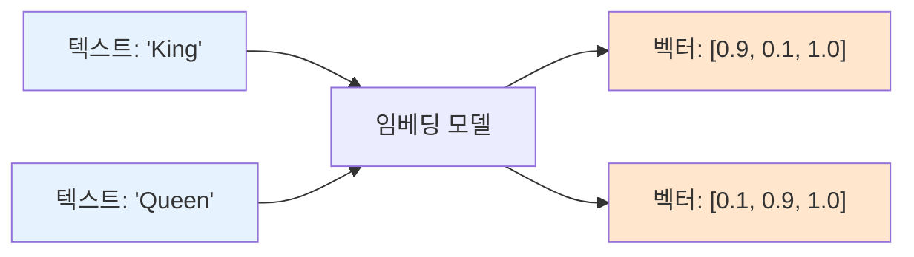

# 📖 Section 6.3: Vectors and Embeddings - 텍스트를 숫자로 변환하는 마법

## 🎯 학습 목표
- ✅ 임베딩(Embedding)의 개념과 벡터화(Vectorization)의 원리 완전 이해
- ✅ 3차원 벡터 예제를 통한 의미적 유사성과 벡터 연산 학습
- ✅ OpenAI Embeddings의 고차원 벡터 공간과 실제 활용 방법 습득
- ✅ 벡터 검색과 추천 시스템의 동작 원리 이해

## 🧠 핵심 개념

### 임베딩(Embedding)이란?
**임베딩**은 인간이 읽는 텍스트를 컴퓨터가 이해하는 숫자(벡터)로 변환하는 과정입니다. 의미적으로 유사한 텍스트는 벡터 공간에서 가까운 위치에 배치됩니다.



### 벡터 차원(Dimensions)의 이해

#### 3차원 예제: 왕국의 세계
강의에서 사용한 3차원 벡터 예제로 개념을 이해해보겠습니다.

| 차원 | 의미 | 설명 |
|------|------|------|
| **Masculinity (남성성)** | 0.0 ~ 1.0 | 단어가 가진 남성적 특성의 정도 |
| **Femininity (여성성)** | 0.0 ~ 1.0 | 단어가 가진 여성적 특성의 정도 |
| **Royalty (왕족성)** | 0.0 ~ 1.0 | 단어가 가진 왕족/귀족적 특성의 정도 |

#### 단어별 벡터 값 예시
```python
# 🧠 개념: 의미적 특성을 수치로 표현
word_vectors = {
    "King":   [0.9, 0.1, 1.0],  # 높은 남성성, 낮은 여성성, 최고 왕족성
    "Queen":  [0.1, 0.9, 1.0],  # 낮은 남성성, 높은 여성성, 최고 왕족성
    "Man":    [0.9, 0.1, 0.0],  # 높은 남성성, 낮은 여성성, 왕족성 없음
    "Woman":  [0.1, 0.9, 0.0],  # 낮은 남성성, 높은 여성성, 왕족성 없음
    "Royal":  [0.0, 0.0, 1.0]   # 성별 중립적, 순수한 왕족성
}
```

### 벡터 연산의 마법: 단어 대수학(Word Algebra)

#### 기본 연산 예제
```python
# 🧠 개념: 벡터 연산으로 새로운 의미 도출

# King - Man = ?
king_vector = [0.9, 0.1, 1.0]
man_vector = [0.9, 0.1, 0.0]
result = [0.9-0.9, 0.1-0.1, 1.0-0.0]  # [0.0, 0.0, 1.0]
# 결과: Royal (순수한 왕족성만 남음)

# Royal + Woman = ?
royal_vector = [0.0, 0.0, 1.0]
woman_vector = [0.1, 0.9, 0.0]
result = [0.0+0.1, 0.0+0.9, 1.0+0.0]  # [0.1, 0.9, 1.0]
# 결과: Queen (여성 + 왕족 = 여왕)
```

### 고차원 벡터의 실제

#### OpenAI Embeddings 특성
- **차원 수**: ~1,536차원 (text-embedding-ada-002)
- **표현 가능 개념**: 정치성, 감정, 시간성, 기술성, 문화성 등 수천 가지
- **정확도**: 인간 수준의 의미적 유사성 판단

```python
# 실제 OpenAI 임베딩 예제
from langchain.embeddings import OpenAIEmbeddings

embeddings = OpenAIEmbeddings()

# 각 텍스트는 1,536개 숫자로 변환됨
king_embedding = embeddings.embed_query("King")      # [0.234, -0.567, 0.123, ...]
queen_embedding = embeddings.embed_query("Queen")    # [0.189, -0.423, 0.145, ...]

print(f"King 벡터 차원: {len(king_embedding)}")     # 1536
print(f"Queen 벡터 차원: {len(queen_embedding)}")    # 1536
```

## 📋 주요 클래스/함수 레퍼런스

### OpenAIEmbeddings
```python
from langchain.embeddings import OpenAIEmbeddings

class OpenAIEmbeddings:
    def __init__(
        self,
        model: str = "text-embedding-ada-002",    # 📌 용도: 임베딩 모델 선택
        openai_api_key: str = None,               # 📌 용도: OpenAI API 키
        chunk_size: int = 1000                    # 📌 용도: 배치 처리 크기
    ):
        """
        OpenAI의 임베딩 API를 사용하는 임베딩 생성기
        
        💰 비용: $0.0001 per 1K tokens (text-embedding-ada-002 기준)
        """
    
    def embed_query(self, text: str) -> List[float]:
        """
        📋 기능: 단일 텍스트를 벡터로 변환
        📥 입력: 문자열 텍스트
        📤 출력: 1,536차원 벡터 (리스트)
        💡 사용 시나리오: 사용자 질문 임베딩
        """
    
    def embed_documents(self, texts: List[str]) -> List[List[float]]:
        """
        📋 기능: 여러 문서를 배치로 벡터화
        📥 입력: 문자열 리스트
        📤 출력: 벡터 리스트의 리스트
        💡 사용 시나리오: 문서 컬렉션 임베딩
        """
```

### CacheBackedEmbeddings (비용 절약)
```python
from langchain.embeddings import CacheBackedEmbeddings
from langchain.storage import LocalFileStore

class CacheBackedEmbeddings:
    def __init__(
        self,
        underlying_embeddings,                     # 📌 용도: 실제 임베딩 모델
        document_embedding_cache,                  # 📌 용도: 캐시 저장소
        namespace: str = ""                        # 📌 용도: 캐시 네임스페이스
    ):
        """
        캐싱을 통한 비용 최적화 임베딩 래퍼
        
        💰 절약 효과: 중복 텍스트 재계산 방지로 최대 90% 비용 절약
        """
```

## 🔧 동작 과정 상세

### 1단계: 벡터 유사성 이해
```python
import numpy as np
from sklearn.metrics.pairwise import cosine_similarity

# === 3차원 벡터로 유사성 계산 실습 ===
# 🧠 개념: 벡터 간 거리로 의미적 유사성 측정

# 왕국 단어들의 3차원 벡터
vectors = {
    "King":   np.array([0.9, 0.1, 1.0]),
    "Queen":  np.array([0.1, 0.9, 1.0]), 
    "Man":    np.array([0.9, 0.1, 0.0]),
    "Woman":  np.array([0.1, 0.9, 0.0]),
    "Knight": np.array([0.9, 0.2, 0.7])  # 남성적이고 어느정도 왕족적
}

print("🔍 벡터 유사성 분석:")
print("-" * 50)

# King과 다른 단어들의 유사성 계산
king_vector = vectors["King"].reshape(1, -1)

for word, vector in vectors.items():
    if word != "King":
        similarity = cosine_similarity(king_vector, vector.reshape(1, -1))[0][0]
        print(f"King ↔ {word:6}: {similarity:.3f}")

# 예상 결과:
# King ↔ Queen : 0.316 (왕족성은 같지만 성별이 반대)
# King ↔ Man   : 0.900 (성별은 같지만 왕족성 차이)
# King ↔ Woman : 0.100 (성별과 왕족성 모두 다름)
# King ↔ Knight: 0.940 (매우 유사함)
```

### 2단계: OpenAI 임베딩 실전 사용
```python
from langchain.embeddings import OpenAIEmbeddings
from langchain.document_loaders import UnstructuredFileLoader
from langchain.text_splitter import CharacterTextSplitter
import numpy as np

# === 실제 문서 임베딩 파이프라인 ===

# 🔧 1단계: 문서 로딩 및 분할
loader = UnstructuredFileLoader("./files/chapter_one.docx")
documents = loader.load()

splitter = CharacterTextSplitter.from_tiktoken_encoder(
    chunk_size=600,
    chunk_overlap=100,
    model_name="gpt-3.5-turbo"
)

split_docs = splitter.split_documents(documents)
print(f"📊 분할된 문서: {len(split_docs)}개 청크")

# 🔧 2단계: 임베딩 모델 설정
embeddings = OpenAIEmbeddings(
    model="text-embedding-ada-002",
    chunk_size=1000  # 배치 처리 크기 (비용 최적화)
)

# 🔧 3단계: 문서 임베딩 생성
print("🚀 임베딩 생성 시작...")

# 텍스트만 추출
texts = [doc.page_content for doc in split_docs]

# 배치로 임베딩 생성 (효율적)
doc_embeddings = embeddings.embed_documents(texts)

print(f"✅ 임베딩 생성 완료!")
print(f"📊 생성된 벡터 수: {len(doc_embeddings)}")
print(f"📊 각 벡터 차원: {len(doc_embeddings[0])}")

# 🔧 4단계: 임베딩 품질 확인
first_chunk = texts[0][:100] + "..."
first_embedding = doc_embeddings[0]

print(f"\n🔍 첫 번째 청크 임베딩 확인:")
print(f"텍스트: {first_chunk}")
print(f"벡터 예시: [{first_embedding[0]:.4f}, {first_embedding[1]:.4f}, {first_embedding[2]:.4f}, ...]")
print(f"벡터 크기: {np.linalg.norm(first_embedding):.4f}")
```

### 3단계: 비용 최적화 캐싱
```python
from langchain.embeddings import CacheBackedEmbeddings
from langchain.storage import LocalFileStore
import os

# === 캐싱을 통한 비용 절약 ===
# 💰 중요: 동일한 텍스트를 여러 번 임베딩하지 않도록 캐싱 사용

# 🔧 1단계: 캐시 저장소 설정
cache_dir = "./cache/embeddings"
os.makedirs(cache_dir, exist_ok=True)

file_store = LocalFileStore(cache_dir)

# 🔧 2단계: 캐시 지원 임베딩 생성
underlying_embeddings = OpenAIEmbeddings(
    model="text-embedding-ada-002"
)

cached_embeddings = CacheBackedEmbeddings.from_bytes_store(
    underlying_embeddings=underlying_embeddings,
    document_embedding_cache=file_store,
    namespace="chapter_embeddings"  # 프로젝트별 구분
)

print("💰 캐싱 시스템 활성화!")

# 🔧 3단계: 첫 번째 실행 (실제 API 호출)
print("1️⃣ 첫 번째 임베딩 생성...")
start_time = time.time()

embeddings_1 = cached_embeddings.embed_documents(texts[:5])  # 처음 5개만 테스트
first_time = time.time() - start_time

print(f"⏱️ 첫 번째 실행 시간: {first_time:.2f}초")
print(f"💸 API 호출: {len(texts[:5])}번")

# 🔧 4단계: 두 번째 실행 (캐시에서 로딩)
print("\n2️⃣ 동일한 텍스트 재임베딩...")
start_time = time.time()

embeddings_2 = cached_embeddings.embed_documents(texts[:5])  # 같은 텍스트
second_time = time.time() - start_time

print(f"⏱️ 두 번째 실행 시간: {second_time:.2f}초")
print(f"💸 API 호출: 0번 (캐시 사용)")
print(f"📈 속도 향상: {(first_time / second_time):.1f}배 빠름")

# 캐시 정확성 확인
vectors_match = np.array_equal(embeddings_1[0], embeddings_2[0])
print(f"🔍 캐시 정확성: {'✅ 정확' if vectors_match else '❌ 오류'}")
```

## 💻 실전 예제

### 의미적 검색 시스템 구현
```python
import numpy as np
from sklearn.metrics.pairwise import cosine_similarity
from langchain.embeddings import OpenAIEmbeddings
from typing import List, Tuple

class SemanticSearchEngine:
    """
    🎯 의미적 유사성 기반 문서 검색 엔진
    
    주요 기능:
    - 벡터 유사성 기반 검색
    - 다중 검색 결과 랭킹
    - 유사성 점수 제공
    """
    
    def __init__(self, embeddings_model=None):
        self.embeddings_model = embeddings_model or OpenAIEmbeddings()
        self.documents = []
        self.document_embeddings = []
        
    def add_documents(self, documents: List[str]):
        """
        📋 기능: 문서 컬렉션에 문서들을 추가하고 임베딩 생성
        📥 입력: 문서 텍스트 리스트
        💡 사용 시나리오: 검색 대상 문서 데이터베이스 구축
        """
        print(f"📚 문서 {len(documents)}개 임베딩 생성 중...")
        
        # 기존 문서에 추가
        self.documents.extend(documents)
        
        # 새 문서들의 임베딩 생성
        new_embeddings = self.embeddings_model.embed_documents(documents)
        self.document_embeddings.extend(new_embeddings)
        
        print(f"✅ 총 {len(self.documents)}개 문서 임베딩 완료")
    
    def search(self, query: str, top_k: int = 5) -> List[Tuple[str, float]]:
        """
        📋 기능: 질의에 가장 유사한 문서들을 검색
        📥 입력: 검색 질의, 반환할 상위 결과 수
        📤 출력: (문서_텍스트, 유사성_점수) 튜플 리스트
        """
        if not self.document_embeddings:
            return []
        
        # 질의 임베딩 생성
        query_embedding = self.embeddings_model.embed_query(query)
        query_vector = np.array(query_embedding).reshape(1, -1)
        
        # 모든 문서와의 유사성 계산
        doc_vectors = np.array(self.document_embeddings)
        similarities = cosine_similarity(query_vector, doc_vectors)[0]
        
        # 상위 k개 결과 선택
        top_indices = np.argsort(similarities)[::-1][:top_k]
        
        results = []
        for i in top_indices:
            similarity_score = similarities[i]
            document_text = self.documents[i]
            results.append((document_text, similarity_score))
        
        return results
    
    def find_similar_documents(self, doc_index: int, top_k: int = 3) -> List[Tuple[str, float]]:
        """
        📋 기능: 특정 문서와 유사한 다른 문서들 찾기
        📥 입력: 기준 문서 인덱스, 반환할 결과 수  
        📤 출력: 유사한 문서들과 유사성 점수
        💡 사용 시나리오: 추천 시스템, 관련 문서 제안
        """
        if doc_index >= len(self.document_embeddings):
            return []
        
        # 기준 문서의 벡터
        base_vector = np.array(self.document_embeddings[doc_index]).reshape(1, -1)
        
        # 모든 문서와의 유사성 계산
        doc_vectors = np.array(self.document_embeddings)
        similarities = cosine_similarity(base_vector, doc_vectors)[0]
        
        # 자기 자신 제외하고 상위 k개 선택
        similarities[doc_index] = -1  # 자기 자신 제외
        top_indices = np.argsort(similarities)[::-1][:top_k]
        
        results = []
        for i in top_indices:
            if similarities[i] > 0:  # 유효한 유사성 점수만
                similarity_score = similarities[i]
                document_text = self.documents[i]
                results.append((document_text, similarity_score))
        
        return results

# === 사용 예시 ===
# 검색 엔진 초기화
search_engine = SemanticSearchEngine()

# 샘플 문서들 (실제로는 앞에서 분할한 문서 사용)
sample_documents = [
    "The king ruled the kingdom with wisdom and justice.",
    "The queen was beloved by all her subjects.",
    "The knight defended the castle bravely.",
    "The princess lived in a beautiful palace.",
    "Democracy is a form of government by the people.",
    "The computer processes data using algorithms.",
    "Machine learning algorithms can predict outcomes."
]

# 문서 추가 및 임베딩
search_engine.add_documents(sample_documents)

print("\n🔍 의미적 검색 테스트:")
print("=" * 50)

# 검색 테스트
queries = [
    "royal family",
    "government system", 
    "artificial intelligence"
]

for query in queries:
    print(f"\n📋 질의: '{query}'")
    results = search_engine.search(query, top_k=3)
    
    for i, (doc, score) in enumerate(results):
        print(f"  {i+1}. [{score:.3f}] {doc[:50]}...")

# 유사 문서 찾기 테스트
print(f"\n🔗 첫 번째 문서와 유사한 문서들:")
similar_docs = search_engine.find_similar_documents(0, top_k=2)
for doc, score in similar_docs:
    print(f"  [{score:.3f}] {doc[:50]}...")
```

## 🔍 변수/함수 상세 설명

### 벡터 유사성 측정 함수들

#### 코사인 유사성 (Cosine Similarity)
```python
def calculate_cosine_similarity(vector1: List[float], vector2: List[float]) -> float:
    """
    📋 기능: 두 벡터 간의 코사인 유사성 계산
    📥 입력: 두 개의 벡터 (같은 차원)
    📤 출력: -1.0 ~ 1.0 범위의 유사성 점수
    💡 해석: 1.0=완전 동일, 0.0=무관련, -1.0=완전 반대
    """
    import math
    
    # 내적 계산
    dot_product = sum(a * b for a, b in zip(vector1, vector2))
    
    # 벡터 크기 계산
    magnitude1 = math.sqrt(sum(a * a for a in vector1))
    magnitude2 = math.sqrt(sum(b * b for b in vector2))
    
    # 0으로 나누기 방지
    if magnitude1 == 0 or magnitude2 == 0:
        return 0.0
    
    # 코사인 유사성 = 내적 / (크기1 * 크기2)
    cosine_sim = dot_product / (magnitude1 * magnitude2)
    return cosine_sim

# 사용 예시
king_vector = [0.9, 0.1, 1.0]
queen_vector = [0.1, 0.9, 1.0]
similarity = calculate_cosine_similarity(king_vector, queen_vector)
print(f"King ↔ Queen 유사성: {similarity:.3f}")  # 약 0.316
```

#### 유클리드 거리 (Euclidean Distance)
```python
def calculate_euclidean_distance(vector1: List[float], vector2: List[float]) -> float:
    """
    📋 기능: 두 벡터 간의 유클리드 거리 계산
    📥 입력: 두 개의 벡터 (같은 차원)
    📤 출력: 0.0 이상의 거리 값
    💡 해석: 0.0=완전 동일, 값이 클수록 더 다름
    """
    import math
    
    # 차이의 제곱들의 합
    squared_diffs = [(a - b) ** 2 for a, b in zip(vector1, vector2)]
    
    # 제곱근을 취해서 거리 계산
    distance = math.sqrt(sum(squared_diffs))
    return distance

# 사용 예시
distance = calculate_euclidean_distance(king_vector, queen_vector)
print(f"King ↔ Queen 거리: {distance:.3f}")  # 약 1.131
```

### 임베딩 품질 평가 함수들
```python
def evaluate_embedding_quality(embeddings_list: List[List[float]], 
                             labels: List[str] = None) -> dict:
    """
    📋 기능: 임베딩의 품질을 다양한 지표로 평가
    📥 입력: 임베딩 벡터 리스트, 선택적 라벨
    📤 출력: 품질 지표 딕셔너리
    💡 사용 시나리오: 임베딩 모델 성능 평가, 차원 수 최적화
    """
    import numpy as np
    from sklearn.decomposition import PCA
    from sklearn.cluster import KMeans
    
    vectors = np.array(embeddings_list)
    
    # 기본 통계
    mean_vector = np.mean(vectors, axis=0)
    std_vector = np.std(vectors, axis=0)
    
    # 차원별 분산 분석
    variance_per_dim = np.var(vectors, axis=0)
    effective_dimensions = np.sum(variance_per_dim > 0.01)  # 실질적 차원 수
    
    # PCA로 주요 성분 분석
    pca = PCA()
    pca.fit(vectors)
    explained_variance_ratio = pca.explained_variance_ratio_
    
    # 95% 정보를 포함하는 차원 수
    cumsum = np.cumsum(explained_variance_ratio)
    dims_95_percent = np.argmax(cumsum >= 0.95) + 1
    
    # 클러스터링 품질 (라벨이 있을 때)
    clustering_score = None
    if labels and len(set(labels)) > 1:
        kmeans = KMeans(n_clusters=len(set(labels)), random_state=42)
        cluster_labels = kmeans.fit_predict(vectors)
        from sklearn.metrics import adjusted_rand_score
        clustering_score = adjusted_rand_score(labels, cluster_labels)
    
    return {
        "vector_count": len(vectors),
        "vector_dimension": vectors.shape[1],
        "effective_dimensions": effective_dimensions,
        "mean_magnitude": np.linalg.norm(mean_vector),
        "std_magnitude": np.mean(np.std(vectors, axis=0)),
        "dims_for_95_percent": dims_95_percent,
        "first_pc_variance": explained_variance_ratio[0],
        "clustering_quality": clustering_score
    }

# 사용 예시
quality_report = evaluate_embedding_quality(doc_embeddings[:10])
print("📊 임베딩 품질 리포트:")
for metric, value in quality_report.items():
    if isinstance(value, float):
        print(f"  {metric}: {value:.4f}")
    else:
        print(f"  {metric}: {value}")
```

## 🧪 실습 과제

### 🔨 기본 과제
1. **3차원 벡터 실습**: 추가 단어들을 3차원으로 임베딩하고 유사성 계산
```python
# TODO: 다음 단어들을 3차원(Masculinity, Femininity, Royalty)으로 벡터화
words_to_embed = ["Prince", "Princess", "Duke", "Duchess", "Soldier", "Maid"]
# 힌트: 각 단어의 의미를 분석하여 0.0~1.0 범위로 점수 부여
```

2. **벡터 연산 실험**: 다양한 단어 조합으로 벡터 연산 수행
```python
# TODO: King - Man + Woman = Queen 외에 다른 조합들 시도해보기
# 예시: Prince - Boy + Girl = ?
# 힌트: 성별과 왕족성의 변환 패턴 확인
```

### 🚀 심화 과제
3. **실제 임베딩 유사성 분석**: OpenAI 임베딩으로 단어 관계 분석
```python
# TODO: 실제 OpenAI 임베딩으로 단어들의 유사성 매트릭스 생성
word_list = ["King", "Queen", "President", "Minister", "CEO", "Manager"]
# 힌트: 모든 단어 쌍의 코사인 유사성을 계산하여 히트맵으로 시각화
```

4. **문서 임베딩 클러스터링**: 문서들을 벡터 유사성으로 그룹화
```python
# TODO: 분할된 문서 청크들을 K-means로 클러스터링
from sklearn.cluster import KMeans
# 힌트: 임베딩을 차원 축소 후 시각화하여 클러스터 확인
```

### 💡 창의 과제
5. **맞춤형 유사성 척도**: 특정 도메인에 최적화된 유사성 측정 방법
```python
# TODO: 기술 문서에 특화된 유사성 척도 개발
def technical_similarity(embedding1, embedding2, domain_weights):
    """기술적 유사성에 가중치를 둔 커스텀 유사성 함수"""
    pass
```

6. **임베딩 품질 최적화**: 청크 크기에 따른 임베딩 품질 분석
```python
# TODO: 다양한 청크 크기(200, 400, 600, 800자)로 임베딩 품질 비교
def optimize_chunk_size_for_embedding_quality(documents):
    """임베딩 품질을 극대화하는 최적 청크 크기 찾기"""
    pass
```

## ⚠️ 주의사항

### 비용 관리
```python
# ❌ 비효율적인 방법: 매번 새로 임베딩 생성
def inefficient_embedding(texts):
    embeddings = OpenAIEmbeddings()
    results = []
    for text in texts:
        result = embeddings.embed_query(text)  # 개별 API 호출
        results.append(result)
    return results

# ✅ 효율적인 방법: 배치 처리와 캐싱
def efficient_embedding(texts):
    from langchain.embeddings import CacheBackedEmbeddings
    from langchain.storage import LocalFileStore
    
    # 캐시 설정
    store = LocalFileStore("./cache/")
    underlying = OpenAIEmbeddings()
    cached = CacheBackedEmbeddings.from_bytes_store(underlying, store)
    
    # 배치로 처리
    return cached.embed_documents(texts)
```

### 벡터 차원과 성능
- **고차원의 저주**: 차원이 너무 높으면 유사성 구분이 어려워짐
- **메모리 사용량**: 1,536차원 벡터는 상당한 메모리 필요
- **계산 복잡도**: 벡터 연산 시간이 차원에 비례

### 임베딩 모델 선택
```python
# 모델별 특성 비교
embedding_models = {
    "text-embedding-ada-002": {
        "dimensions": 1536,
        "cost_per_1k_tokens": 0.0001,
        "quality": "높음",
        "speed": "보통"
    },
    "text-embedding-3-small": {
        "dimensions": 1536,
        "cost_per_1k_tokens": 0.00002,
        "quality": "보통",
        "speed": "빠름"
    },
    "text-embedding-3-large": {
        "dimensions": 3072,
        "cost_per_1k_tokens": 0.00013,
        "quality": "매우 높음",
        "speed": "느림"
    }
}
```

### 언어별 임베딩 품질
- **영어**: 가장 높은 품질 (훈련 데이터 풍부)
- **한국어**: 양호한 품질 (멀티링구얼 지원)
- **전문 용어**: 도메인 특화 임베딩 모델 고려 필요

## 🔗 관련 자료
- **이전 학습**: [6.2 Tiktoken](./6.2_Tiktoken.md)
- **다음 학습**: [6.4 Vector Stores](./6.4_Vector_Stores.md)
- **참고 자료**: [Word2Vec Visualization](https://word2vec.mramohyeddin.me/)
- **추천 영상**: [Gustav Söderström - Spotify의 벡터 검색](https://www.youtube.com/watch?v=example)
- **실습 파일**: [6.3 Vectors and Embeddings.ipynb](../../00%20lecture/6.3%20Vectors.ipynb)

---

💡 **핵심 정리**: 임베딩은 텍스트를 의미를 보존하는 숫자 벡터로 변환하는 과정입니다. 벡터 간 거리로 의미적 유사성을 측정할 수 있고, 벡터 연산으로 단어의 의미적 관계를 수학적으로 표현할 수 있습니다. 실제 OpenAI 임베딩은 1,536차원의 고차원 벡터로 복잡한 의미 관계를 포착하며, RAG 시스템에서 관련 문서를 찾는 핵심 기술입니다.