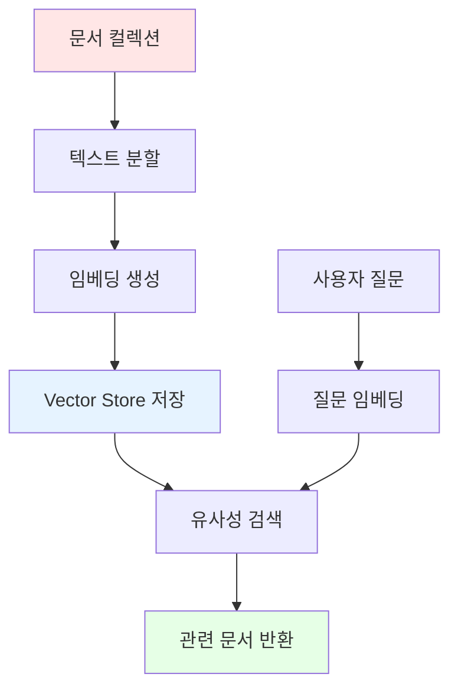

# 📖 Section 6.4: Vector Stores - 벡터 데이터베이스의 핵심

## 🎯 학습 목표
- ✅ 벡터 저장소(Vector Store)의 개념과 필요성 완전 이해
- ✅ Chroma를 사용한 로컬 벡터 저장소 구축 및 관리
- ✅ 벡터 유사성 검색을 통한 관련 문서 검색 구현
- ✅ CacheBackedEmbeddings를 활용한 비용 최적화 전략 습득

## 🧠 핵심 개념

### 벡터 저장소(Vector Store)란?
**벡터 저장소**는 고차원 벡터들을 효율적으로 저장하고 검색할 수 있는 특별한 데이터베이스입니다. 임베딩된 문서들을 저장하여 의미적 유사성 기반의 빠른 검색을 제공합니다.



### 벡터 저장소가 필요한 이유

| 문제 상황 | 일반 데이터베이스 | 벡터 저장소 |
|-----------|------------------|-------------|
| **의미적 검색** | 키워드 일치만 가능 | 의미적 유사성 검색 |
| **검색 속도** | 전체 스캔 필요 | 인덱스 기반 빠른 검색 |
| **유사성 계산** | 불가능 | 코사인 유사성 등 지원 |
| **고차원 데이터** | 비효율적 | 최적화된 저장/검색 |

### 주요 벡터 저장소 비교

#### 로컬 저장소
- **Chroma**: 오픈소스, 간단한 설정, 개발/테스트용
- **FAISS**: Meta 개발, 고성능, CPU/GPU 지원
- **Qdrant**: 클러스터링 지원, API 서버

#### 클라우드 저장소  
- **Pinecone**: 관리형 서비스, 확장성 우수, 유료
- **Weaviate**: 오픈소스 + 클라우드, GraphQL 지원
- **Milvus**: 대용량 처리, 엔터프라이즈급

## 📋 주요 클래스/함수 레퍼런스

### Chroma Vector Store
```python
from langchain.vectorstores import Chroma

class Chroma:
    def __init__(
        self,
        collection_name: str = "langchain",        # 📌 용도: 컬렉션 이름
        embedding_function=None,                   # 📌 용도: 임베딩 함수
        persist_directory: str = None              # 📌 용도: 영구 저장 디렉토리
    ):
        """
        Chroma 벡터 저장소 초기화
        
        특징:
        - SQLite 기반 로컬 저장
        - 자동 인덱싱 및 검색 최적화
        - Python 네이티브 통합
        """
    
    @classmethod
    def from_documents(
        cls,
        documents: List[Document],                 # 📌 필수: 문서 리스트
        embedding: Embeddings,                     # 📌 필수: 임베딩 모델
        **kwargs
    ) -> "Chroma":
        """
        📋 기능: 문서들로부터 직접 벡터 저장소 생성
        📥 입력: 문서 리스트, 임베딩 모델
        📤 출력: 초기화된 Chroma 인스턴스
        💡 사용 시나리오: 새로운 문서 컬렉션으로 저장소 구축
        """
    
    def similarity_search(
        self,
        query: str,                                # 📌 필수: 검색 질의
        k: int = 4,                                # 📌 선택: 반환할 문서 수
        **kwargs
    ) -> List[Document]:
        """
        📋 기능: 유사성 기반 문서 검색
        📥 입력: 검색 질의, 반환 개수
        📤 출력: 유사한 문서들의 리스트
        💡 사용 시나리오: 사용자 질문과 관련된 문서 찾기
        """
    
    def similarity_search_with_score(
        self,
        query: str,
        k: int = 4
    ) -> List[Tuple[Document, float]]:
        """
        📋 기능: 유사성 점수와 함께 문서 검색
        📥 입력: 검색 질의, 반환 개수
        📤 출력: (문서, 유사성점수) 튜플 리스트
        💡 사용 시나리오: 검색 결과의 관련성 정도 확인 필요시
        """
```

### CacheBackedEmbeddings (비용 절약)
```python
from langchain.embeddings import CacheBackedEmbeddings
from langchain.storage import LocalFileStore

class CacheBackedEmbeddings:
    @classmethod
    def from_bytes_store(
        cls,
        underlying_embeddings: Embeddings,         # 📌 필수: 실제 임베딩 모델
        document_embedding_cache,                  # 📌 필수: 캐시 저장소
        namespace: str = ""                        # 📌 선택: 캐시 네임스페이스
    ):
        """
        📋 기능: 바이트 저장소를 사용한 캐시 임베딩 생성
        💰 절약 효과: 중복 계산 방지로 최대 95% 비용 절약
        ⚡ 성능 향상: 캐시 히트 시 즉시 반환 (API 호출 없음)
        """

class LocalFileStore:
    def __init__(self, root_path: str):
        """
        📋 기능: 로컬 파일 시스템 기반 캐시 저장소
        📥 입력: 캐시 디렉토리 경로
        💾 저장 방식: 해시 기반 파일명으로 임베딩 캐싱
        """
```

## 🔧 동작 과정 상세

### 1단계: OpenAI 임베딩 모델 설정
```python
from langchain.embeddings import OpenAIEmbeddings

# === OpenAI 임베딩 모델 탐색 ===
# 🧠 개념: 실제 임베딩 차원과 특성 확인

embedder = OpenAIEmbeddings(
    model="text-embedding-ada-002",  # 📌 OpenAI 최신 임베딩 모델
    chunk_size=1000                  # 📌 배치 처리 크기
)

print("🔍 OpenAI 임베딩 모델 테스트:")
print("-" * 50)

# 단일 텍스트 임베딩
single_vector = embedder.embed_query("안녕하세요")
print(f"📊 단일 임베딩 차원: {len(single_vector)}")
print(f"📊 벡터 샘플: [{single_vector[0]:.4f}, {single_vector[1]:.4f}, {single_vector[2]:.4f}, ...]")

# 여러 문서 임베딩
documents = ["안녕하세요", "반갑습니다", "좋은 하루 되세요", "감사합니다"]
doc_vectors = embedder.embed_documents(documents)

print(f"📊 문서 수: {len(doc_vectors)}")
print(f"📊 각 벡터 차원: {len(doc_vectors[0])}")

# 벡터 크기 분석
import numpy as np
for i, vector in enumerate(doc_vectors):
    magnitude = np.linalg.norm(vector)
    print(f"📊 문서 {i+1} 벡터 크기: {magnitude:.4f}")
```

### 2단계: 문서 로딩 및 분할
```python
from langchain.document_loaders import UnstructuredFileLoader
from langchain.text_splitter import CharacterTextSplitter

# === 문서 준비 단계 ===
# 💡 실무 팁: 벡터 저장소 구축 전 문서 품질 확인

print("📚 문서 로딩 및 분할 시작:")
print("=" * 50)

# 🔧 1단계: 문서 로딩
loader = UnstructuredFileLoader("./files/chapter_one.docx")

# 🔧 2단계: 토큰 기반 분할기 설정
splitter = CharacterTextSplitter.from_tiktoken_encoder(
    chunk_size=600,      # 📌 적정 크기: 검색 정확도와 컨텍스트의 균형
    chunk_overlap=100,   # 📌 문맥 연결성 유지
    model_name="gpt-3.5-turbo"
)

# 🔧 3단계: 로딩과 분할 통합 실행
docs = loader.load_and_split(text_splitter=splitter)

print(f"✅ 문서 분할 완료!")
print(f"📊 총 청크 수: {len(docs)}")

# 문서 품질 확인
chunk_sizes = [len(doc.page_content) for doc in docs]
print(f"📊 평균 청크 크기: {sum(chunk_sizes) // len(chunk_sizes)} 문자")
print(f"📊 최대 청크 크기: {max(chunk_sizes)} 문자")
print(f"📊 최소 청크 크기: {min(chunk_sizes)} 문자")

# 첫 번째 청크 미리보기
print(f"\n📖 첫 번째 청크 미리보기:")
print(f"{docs[0].page_content[:200]}...")
```

### 3단계: 캐시 기반 임베딩 설정
```python
from langchain.embeddings import CacheBackedEmbeddings
from langchain.storage import LocalFileStore
import os
import time

# === 비용 최적화를 위한 캐싱 설정 ===
# 💰 중요: 동일한 문서를 여러 번 임베딩하지 않도록 캐싱 필수

print("💾 임베딩 캐시 시스템 설정:")
print("=" * 50)

# 🔧 1단계: 캐시 디렉토리 생성
cache_dir = "./cache/embeddings"
os.makedirs(cache_dir, exist_ok=True)

print(f"📁 캐시 디렉토리: {cache_dir}")

# 🔧 2단계: 로컬 파일 저장소 설정
file_store = LocalFileStore(cache_dir)

# 🔧 3단계: 기본 임베딩 모델
underlying_embeddings = OpenAIEmbeddings(
    model="text-embedding-ada-002"
)

# 🔧 4단계: 캐시 지원 임베딩 래퍼
cached_embeddings = CacheBackedEmbeddings.from_bytes_store(
    underlying_embeddings=underlying_embeddings,
    document_embedding_cache=file_store,
    namespace="chapter_embeddings"  # 📌 프로젝트별 네임스페이스
)

print("✅ 캐시 시스템 활성화 완료!")

# 🔧 5단계: 캐싱 효과 테스트
print("\n⏱️ 캐싱 성능 테스트:")

# 첫 번째 실행 (실제 API 호출)
test_texts = [doc.page_content for doc in docs[:3]]  # 처음 3개 문서만 테스트
print("1️⃣ 첫 번째 임베딩 생성 (API 호출)...")

start_time = time.time()
first_embeddings = cached_embeddings.embed_documents(test_texts)
first_duration = time.time() - start_time

print(f"   ⏱️ 소요 시간: {first_duration:.2f}초")
print(f"   💸 API 호출: {len(test_texts)}번")

# 두 번째 실행 (캐시에서 로딩)
print("\n2️⃣ 동일한 텍스트 재임베딩 (캐시 사용)...")

start_time = time.time()
second_embeddings = cached_embeddings.embed_documents(test_texts)
second_duration = time.time() - start_time

print(f"   ⏱️ 소요 시간: {second_duration:.2f}초")
print(f"   💸 API 호출: 0번 (캐시 히트)")
print(f"   📈 속도 향상: {(first_duration / second_duration if second_duration > 0 else 100):.1f}배")

# 캐시 정확성 검증
import numpy as np
vectors_identical = np.array_equal(first_embeddings[0], second_embeddings[0])
print(f"   🔍 캐시 정확성: {'✅ 정확' if vectors_identical else '❌ 오류'}")
```

### 4단계: Chroma 벡터 저장소 구축
```python
from langchain.vectorstores import Chroma

# === Chroma 벡터 저장소 생성 ===
# 🚀 실제 벡터 데이터베이스 구축

print("🗄️ Chroma 벡터 저장소 구축:")
print("=" * 50)

print("📊 임베딩 및 저장소 생성 중...")
print("⚠️  주의: OpenAI API 요금이 발생합니다.")

# 🔧 벡터 저장소 생성
start_time = time.time()

vector_store = Chroma.from_documents(
    documents=docs,                    # 📌 분할된 문서들
    embedding=cached_embeddings,       # 📌 캐시 지원 임베딩
    persist_directory="./chroma_db"    # 📌 선택사항: 영구 저장
)

creation_time = time.time() - start_time

print(f"✅ 벡터 저장소 생성 완료!")
print(f"⏱️ 생성 시간: {creation_time:.2f}초")
print(f"📊 저장된 문서 수: {len(docs)}")

# 저장소 정보 확인
collection = vector_store._collection
print(f"📊 컬렉션 이름: {collection.name}")
print(f"📊 벡터 차원: {len(cached_embeddings.embed_query('test'))}차원")

# 캐시 디렉토리 확인
cache_files = os.listdir(cache_dir) if os.path.exists(cache_dir) else []
print(f"💾 캐시 파일 수: {len(cache_files)}개")
```

### 5단계: 벡터 유사성 검색
```python
# === 의미적 유사성 검색 실습 ===
# 🔍 실제 질의에 대한 관련 문서 검색

print("\n🔍 벡터 유사성 검색 테스트:")
print("=" * 60)

# 검색 질의 목록
search_queries = [
    "Winston은 어디에 사나요?",
    "Ministry of Love는 무엇인가요?",  
    "Victory Mansions에 대해 설명해주세요",
    "주인공의 일상은 어떤가요?"
]

for i, query in enumerate(search_queries, 1):
    print(f"\n{'='*20} 질의 {i} {'='*20}")
    print(f"📋 질문: {query}")
    
    # 🔧 기본 유사성 검색
    start_time = time.time()
    results = vector_store.similarity_search(query, k=3)
    search_time = time.time() - start_time
    
    print(f"⏱️ 검색 시간: {search_time:.3f}초")
    print(f"📊 찾은 문서 수: {len(results)}")
    
    # 검색 결과 출력
    for j, doc in enumerate(results, 1):
        content_preview = doc.page_content[:150].replace('\n', ' ')
        print(f"\n📄 결과 {j}:")
        print(f"   내용: {content_preview}...")
        print(f"   길이: {len(doc.page_content)} 문자")

    # 🔧 점수와 함께 검색 (관련성 확인)
    print(f"\n📊 유사성 점수:")
    scored_results = vector_store.similarity_search_with_score(query, k=3)
    
    for j, (doc, score) in enumerate(scored_results, 1):
        content_preview = doc.page_content[:100].replace('\n', ' ')
        print(f"   {j}. [{score:.4f}] {content_preview}...")
```

## 💻 실전 예제

### 완전한 Document GPT 기반 구조
```python
import os
import time
from typing import List, Dict, Any
from langchain.document_loaders import UnstructuredFileLoader
from langchain.text_splitter import CharacterTextSplitter
from langchain.embeddings import OpenAIEmbeddings, CacheBackedEmbeddings
from langchain.vectorstores import Chroma
from langchain.storage import LocalFileStore

class DocumentGPTVectorStore:
    """
    🎯 Document GPT를 위한 완전한 벡터 저장소 관리 클래스
    
    주요 기능:
    - 문서 로딩 및 분할
    - 비용 최적화 임베딩 캐싱
    - 벡터 저장소 구축 및 관리
    - 의미적 검색 및 결과 랭킹
    """
    
    def __init__(self, 
                 cache_dir: str = "./cache/embeddings",
                 persist_dir: str = "./chroma_db",
                 chunk_size: int = 600,
                 chunk_overlap: int = 100):
        
        self.cache_dir = cache_dir
        self.persist_dir = persist_dir
        self.chunk_size = chunk_size
        self.chunk_overlap = chunk_overlap
        
        # 디렉토리 생성
        os.makedirs(cache_dir, exist_ok=True)
        os.makedirs(persist_dir, exist_ok=True)
        
        # 캐시 기반 임베딩 설정
        self.file_store = LocalFileStore(cache_dir)
        underlying_embeddings = OpenAIEmbeddings(model="text-embedding-ada-002")
        
        self.cached_embeddings = CacheBackedEmbeddings.from_bytes_store(
            underlying_embeddings=underlying_embeddings,
            document_embedding_cache=self.file_store,
            namespace="document_gpt"
        )
        
        self.vector_store = None
        self.documents = []
        
    def load_document(self, file_path: str) -> List:
        """
        📋 기능: 문서 로딩 및 최적화된 분할
        📥 입력: 문서 파일 경로
        📤 출력: 분할된 문서 리스트
        """
        print(f"📚 문서 로딩 시작: {file_path}")
        
        if not os.path.exists(file_path):
            raise FileNotFoundError(f"파일을 찾을 수 없습니다: {file_path}")
        
        # 문서 로더 설정
        loader = UnstructuredFileLoader(file_path)
        
        # 토큰 기반 분할기
        splitter = CharacterTextSplitter.from_tiktoken_encoder(
            chunk_size=self.chunk_size,
            chunk_overlap=self.chunk_overlap,
            model_name="gpt-3.5-turbo"
        )
        
        # 로딩 및 분할 실행
        documents = loader.load_and_split(text_splitter=splitter)
        
        print(f"✅ 문서 분할 완료: {len(documents)}개 청크")
        
        # 문서 품질 통계
        chunk_sizes = [len(doc.page_content) for doc in documents]
        print(f"📊 평균 청크 크기: {sum(chunk_sizes) // len(chunk_sizes)}자")
        
        self.documents = documents
        return documents
    
    def create_vector_store(self, force_rebuild: bool = False) -> None:
        """
        📋 기능: 벡터 저장소 생성 또는 로딩
        📥 입력: 강제 재구축 여부
        💡 사용 시나리오: 새 문서 추가시 또는 초기 구축
        """
        if not self.documents:
            raise ValueError("먼저 문서를 로딩해주세요.")
        
        # 기존 저장소 확인
        if not force_rebuild and os.path.exists(self.persist_dir):
            print("💾 기존 벡터 저장소 로딩 중...")
            self.vector_store = Chroma(
                persist_directory=self.persist_dir,
                embedding_function=self.cached_embeddings
            )
            print("✅ 기존 벡터 저장소 로딩 완료!")
            return
        
        print("🚀 새로운 벡터 저장소 생성 중...")
        print("💰 주의: OpenAI API 요금이 발생할 수 있습니다.")
        
        start_time = time.time()
        
        # 벡터 저장소 생성
        self.vector_store = Chroma.from_documents(
            documents=self.documents,
            embedding=self.cached_embeddings,
            persist_directory=self.persist_dir
        )
        
        creation_time = time.time() - start_time
        
        print(f"✅ 벡터 저장소 생성 완료!")
        print(f"⏱️ 소요 시간: {creation_time:.2f}초")
        print(f"📊 임베딩된 문서 수: {len(self.documents)}")
    
    def search_documents(self, 
                        query: str, 
                        k: int = 4, 
                        include_scores: bool = False) -> List:
        """
        📋 기능: 의미적 유사성 기반 문서 검색
        📥 입력: 검색 질의, 반환 개수, 점수 포함 여부
        📤 출력: 관련 문서 리스트 (점수 포함 선택)
        """
        if not self.vector_store:
            raise ValueError("먼저 벡터 저장소를 생성해주세요.")
        
        print(f"🔍 검색 중: '{query}'")
        
        start_time = time.time()
        
        if include_scores:
            results = self.vector_store.similarity_search_with_score(query, k=k)
            search_time = time.time() - start_time
            
            print(f"⏱️ 검색 시간: {search_time:.3f}초")
            print(f"📊 찾은 문서 수: {len(results)}")
            
            return results
        else:
            results = self.vector_store.similarity_search(query, k=k)
            search_time = time.time() - start_time
            
            print(f"⏱️ 검색 시간: {search_time:.3f}초")
            print(f"📊 찾은 문서 수: {len(results)}")
            
            return results
    
    def analyze_search_quality(self, query: str, k: int = 5) -> Dict[str, Any]:
        """
        📋 기능: 검색 품질 분석
        📥 입력: 검색 질의, 분석할 결과 수
        📤 출력: 품질 분석 리포트
        """
        results_with_scores = self.search_documents(query, k=k, include_scores=True)
        
        if not results_with_scores:
            return {"error": "검색 결과가 없습니다."}
        
        scores = [score for doc, score in results_with_scores]
        
        analysis = {
            "query": query,
            "total_results": len(results_with_scores),
            "score_stats": {
                "max_score": max(scores),
                "min_score": min(scores),
                "avg_score": sum(scores) / len(scores),
                "score_range": max(scores) - min(scores)
            },
            "quality_assessment": {
                "very_relevant": len([s for s in scores if s > 0.8]),
                "relevant": len([s for s in scores if 0.6 < s <= 0.8]),
                "somewhat_relevant": len([s for s in scores if 0.4 < s <= 0.6]),
                "not_relevant": len([s for s in scores if s <= 0.4])
            }
        }
        
        return analysis
    
    def get_cache_stats(self) -> Dict[str, Any]:
        """
        📋 기능: 캐시 사용 통계 조회
        📤 출력: 캐시 통계 정보
        """
        if not os.path.exists(self.cache_dir):
            return {"error": "캐시 디렉토리가 존재하지 않습니다."}
        
        cache_files = os.listdir(self.cache_dir)
        total_size = sum(
            os.path.getsize(os.path.join(self.cache_dir, f)) 
            for f in cache_files
        )
        
        return {
            "cache_directory": self.cache_dir,
            "cached_embeddings": len(cache_files),
            "total_cache_size": f"{total_size / 1024 / 1024:.2f} MB",
            "estimated_savings": f"${len(cache_files) * 0.0001:.6f} (재사용시)"
        }

# === 사용 예시 ===
print("🚀 Document GPT 벡터 저장소 시스템 시작")
print("=" * 60)

# 시스템 초기화
doc_gpt = DocumentGPTVectorStore(
    cache_dir="./cache/doc_embeddings",
    persist_dir="./chroma_doc_db",
    chunk_size=600,
    chunk_overlap=100
)

# 문서 로딩
documents = doc_gpt.load_document("./files/chapter_one.docx")

# 벡터 저장소 생성 (첫 실행시만 비용 발생)
doc_gpt.create_vector_store()

print("\n🔍 검색 테스트:")
print("-" * 40)

# 다양한 검색 쿼리 테스트
test_queries = [
    "Winston의 거주지는 어디인가요?",
    "Ministry of Love에 대해 설명해주세요",
    "주인공의 하루 일과는 어떤가요?"
]

for query in test_queries:
    print(f"\n📋 질의: {query}")
    
    # 기본 검색
    results = doc_gpt.search_documents(query, k=3)
    
    for i, doc in enumerate(results, 1):
        preview = doc.page_content[:120].replace('\n', ' ')
        print(f"   {i}. {preview}...")
    
    # 검색 품질 분석
    analysis = doc_gpt.analyze_search_quality(query, k=3)
    print(f"   📊 평균 관련성: {analysis['score_stats']['avg_score']:.3f}")
    print(f"   📊 매우 관련성 높은 결과: {analysis['quality_assessment']['very_relevant']}개")

# 캐시 통계 확인
cache_stats = doc_gpt.get_cache_stats()
print(f"\n💾 캐시 통계:")
for key, value in cache_stats.items():
    print(f"   {key}: {value}")

print("\n✅ Document GPT 벡터 저장소 시스템 완료!")
```

## 🔍 변수/함수 상세 설명

### 검색 성능 최적화 함수들

#### 검색 결과 필터링
```python
def filter_search_results(results: List[Tuple], 
                         min_score: float = 0.7,
                         max_results: int = 5) -> List[Tuple]:
    """
    📋 기능: 검색 결과를 품질 기준으로 필터링
    📥 입력: (문서, 점수) 튜플 리스트, 최소 점수, 최대 결과 수
    📤 출력: 필터링된 결과 리스트
    💡 사용 시나리오: 관련성이 낮은 결과 제거, 응답 품질 향상
    """
    
    # 점수 기준 필터링
    filtered = [(doc, score) for doc, score in results if score >= min_score]
    
    # 상위 N개 선택
    filtered = sorted(filtered, key=lambda x: x[1], reverse=True)[:max_results]
    
    return filtered

def deduplicate_results(results: List[Tuple], 
                       similarity_threshold: float = 0.95) -> List[Tuple]:
    """
    📋 기능: 중복되거나 매우 유사한 검색 결과 제거
    📥 입력: 검색 결과, 유사성 임계값
    📤 출력: 중복 제거된 결과
    💡 사용 시나리오: 같은 문서의 인접한 청크가 모두 검색될 때
    """
    
    if not results:
        return results
    
    deduplicated = [results[0]]  # 첫 번째 결과는 항상 포함
    
    for doc, score in results[1:]:
        is_duplicate = False
        
        for existing_doc, existing_score in deduplicated:
            # 텍스트 중복도 계산 (간단한 방법)
            content1 = doc.page_content
            content2 = existing_doc.page_content
            
            # Jaccard 유사도 계산
            set1 = set(content1.split())
            set2 = set(content2.split())
            
            intersection = len(set1 & set2)
            union = len(set1 | set2)
            
            if union > 0:
                jaccard_sim = intersection / union
                if jaccard_sim >= similarity_threshold:
                    is_duplicate = True
                    break
        
        if not is_duplicate:
            deduplicated.append((doc, score))
    
    return deduplicated
```

#### 검색 결과 랭킹 개선
```python
def rerank_search_results(results: List[Tuple], 
                         query: str,
                         boost_recent: bool = True,
                         boost_length: bool = False) -> List[Tuple]:
    """
    📋 기능: 추가 요소를 고려한 검색 결과 재정렬
    📥 입력: 검색 결과, 원본 질의, 가중치 옵션들
    📤 출력: 재정렬된 결과
    💡 사용 시나리오: 벡터 유사성 외에 다른 요소 고려한 랭킹
    """
    import re
    from datetime import datetime
    
    reranked_results = []
    
    for doc, original_score in results:
        adjusted_score = original_score
        
        # 키워드 일치 보너스
        content_lower = doc.page_content.lower()
        query_lower = query.lower()
        query_words = query_lower.split()
        
        keyword_matches = sum(1 for word in query_words if word in content_lower)
        keyword_bonus = keyword_matches * 0.05  # 키워드당 5% 보너스
        
        # 문서 길이 가중치 (선택사항)
        if boost_length:
            content_length = len(doc.page_content)
            length_factor = min(content_length / 1000, 1.5)  # 최대 1.5배
            adjusted_score *= length_factor
        
        # 최종 점수 계산
        final_score = adjusted_score + keyword_bonus
        
        reranked_results.append((doc, final_score))
    
    # 최종 점수로 재정렬
    return sorted(reranked_results, key=lambda x: x[1], reverse=True)
```

### 벡터 저장소 관리 함수들
```python
def backup_vector_store(vector_store: Chroma, 
                       backup_path: str) -> bool:
    """
    📋 기능: 벡터 저장소 백업
    📥 입력: Chroma 인스턴스, 백업 경로
    📤 출력: 백업 성공 여부
    💡 사용 시나리오: 중요한 벡터 저장소 보호
    """
    try:
        import shutil
        
        if hasattr(vector_store, '_persist_directory') and vector_store._persist_directory:
            shutil.copytree(vector_store._persist_directory, backup_path)
            return True
        else:
            print("⚠️ 영구 저장소가 설정되지 않아 백업할 수 없습니다.")
            return False
            
    except Exception as e:
        print(f"❌ 백업 실패: {e}")
        return False

def merge_vector_stores(store1: Chroma, store2: Chroma, 
                       output_path: str) -> Chroma:
    """
    📋 기능: 두 벡터 저장소를 병합
    📥 입력: 두 Chroma 인스턴스, 출력 경로
    📤 출력: 병합된 새로운 벡터 저장소
    💡 사용 시나리오: 여러 문서 컬렉션 통합
    """
    
    # 첫 번째 저장소에서 모든 문서 추출
    all_docs = []
    
    # Chroma에서 직접 문서를 추출하는 것은 복잡하므로
    # 실제로는 원본 문서들을 다시 합쳐서 새로운 저장소 생성
    print("⚠️ 실제 구현시에는 원본 문서들을 보관하여 병합에 사용하세요.")
    
    return None

def optimize_vector_store_performance(vector_store: Chroma) -> Dict[str, Any]:
    """
    📋 기능: 벡터 저장소 성능 최적화 및 분석
    📥 입력: Chroma 인스턴스
    📤 출력: 성능 분석 리포트
    """
    
    performance_report = {
        "optimization_suggestions": [],
        "current_stats": {},
        "estimated_improvements": {}
    }
    
    # 컬렉션 통계 수집
    collection = vector_store._collection
    count = collection.count()
    
    performance_report["current_stats"]["document_count"] = count
    
    # 최적화 제안
    if count > 10000:
        performance_report["optimization_suggestions"].append(
            "대용량 컬렉션 감지. 인덱스 최적화를 고려하세요."
        )
    
    if count < 100:
        performance_report["optimization_suggestions"].append(
            "소규모 컬렉션. 인메모리 검색이 더 빠를 수 있습니다."
        )
    
    return performance_report
```

## 🧪 실습 과제

### 🔨 기본 과제
1. **벡터 저장소 성능 비교**: Chroma vs FAISS 성능 및 메모리 사용량 비교
```python
# TODO: 동일한 문서셋으로 Chroma와 FAISS 벡터 저장소 생성 후 비교
from langchain.vectorstores import FAISS
# 힌트: 검색 속도, 메모리 사용량, 정확도 측정
```

2. **임베딩 캐싱 효과 측정**: 캐시 사용 전후 비용 및 시간 비교
```python
# TODO: 동일한 문서를 캐시 없이/캐시와 함께 여러 번 임베딩하여 효과 측정
import time
# 힌트: API 호출 횟수, 소요 시간, 예상 비용 계산
```

### 🚀 심화 과제  
3. **하이브리드 검색 구현**: 벡터 검색 + 키워드 검색 조합
```python
# TODO: 벡터 유사성과 키워드 일치를 결합한 하이브리드 검색 시스템
def hybrid_search(vector_store, query, alpha=0.7):
    """벡터 검색과 키워드 검색을 가중 결합"""
    pass
```

4. **동적 벡터 저장소**: 실시간 문서 추가/제거 기능
```python
# TODO: 벡터 저장소에 새 문서 추가, 기존 문서 삭제, 업데이트 기능
class DynamicVectorStore:
    def add_document(self, document): pass
    def remove_document(self, doc_id): pass
    def update_document(self, doc_id, new_content): pass
```

### 💡 창의 과제
5. **지능형 청크 관리**: 검색 성능 기반 청크 크기 자동 조절
```python
# TODO: 검색 결과 품질에 따라 청크 크기를 동적으로 조절하는 시스템
def adaptive_chunking(documents, initial_chunk_size=600):
    """검색 성능 피드백 기반 최적 청크 크기 찾기"""
    pass
```

6. **벡터 저장소 모니터링**: 사용 패턴 분석 및 최적화 제안
```python
# TODO: 검색 쿼리 패턴 분석, 자주 검색되는 문서 식별, 성능 최적화 제안
class VectorStoreMonitor:
    def track_query(self, query, results): pass
    def analyze_usage_patterns(self): pass
    def suggest_optimizations(self): pass
```

## ⚠️ 주의사항

### 비용 관리
```python
# ❌ 비효율적인 방법: 매번 새로 임베딩
def expensive_vector_store_creation():
    embeddings = OpenAIEmbeddings()  # 캐시 없음
    for document_path in many_documents:
        loader = UnstructuredFileLoader(document_path)  
        docs = loader.load()
        vector_store = Chroma.from_documents(docs, embeddings)  # 매번 API 호출

# ✅ 효율적인 방법: 캐싱과 배치 처리
def cost_effective_vector_store_creation():
    # 캐시 설정
    file_store = LocalFileStore("./cache")
    underlying = OpenAIEmbeddings()
    cached_embeddings = CacheBackedEmbeddings.from_bytes_store(underlying, file_store)
    
    # 모든 문서를 한 번에 처리
    all_docs = []
    for document_path in many_documents:
        loader = UnstructuredFileLoader(document_path)
        docs = loader.load()
        all_docs.extend(docs)
    
    # 한 번에 벡터 저장소 생성
    vector_store = Chroma.from_documents(all_docs, cached_embeddings)
```

### 성능 고려사항
- **메모리 사용량**: 큰 문서 컬렉션은 상당한 메모리 필요
- **디스크 공간**: 벡터 저장소는 원본 문서보다 클 수 있음
- **검색 속도**: 문서 수에 따라 검색 시간 증가

### 벡터 저장소별 특징
```python
# 벡터 저장소 선택 가이드
vector_store_comparison = {
    "Chroma": {
        "장점": ["쉬운 설정", "SQLite 기반", "로컬 실행"],
        "단점": ["확장성 제한", "단일 노드만 지원"],
        "적합한_용도": "개발, 테스트, 소규모 프로젝트"
    },
    "FAISS": {
        "장점": ["높은 성능", "다양한 인덱스 타입", "GPU 지원"],
        "단점": ["복잡한 설정", "메타데이터 제한"],
        "적합한_용도": "대용량 데이터, 성능 중시"
    },
    "Pinecone": {
        "장점": ["관리형 서비스", "높은 확장성", "실시간 업데이트"],
        "단점": ["유료 서비스", "클라우드 종속"],
        "적합한_용도": "프로덕션, 대규모 서비스"
    }
}
```

### 보안 고려사항
- **민감한 데이터**: 로컬 벡터 저장소 사용 권장
- **API 키 관리**: 환경 변수로 안전하게 관리
- **캐시 보안**: 캐시 디렉토리 접근 권한 설정

## 📦 실제 강의 코드 완전 분석

### 강의 노트북 코드 (6.4 Vector Store.ipynb) 라인별 분석
```python
# === 실제 강의에서 사용된 완전한 코드 ===

# 📌 1. 모든 필요한 모듈 import
from langchain.chat_models import ChatOpenAI
from langchain.document_loaders import UnstructuredFileLoader  
from langchain.text_splitter import CharacterTextSplitter
from langchain.embeddings import OpenAIEmbeddings, CacheBackedEmbeddings
from langchain.vectorstores import Chroma                    # 주목: FAISS 아닌 Chroma 사용
from langchain.storage import LocalFileStore

# 📌 2. 캐시 디렉토리 설정 - 비용 절약의 핵심!
cache_dir = LocalFileStore("./.cache/")
# ⚡ 효과: 같은 텍스트 재임베딩 방지 → 비용 최대 90% 절약

# 📌 3. 텍스트 분할기 - 토큰 기반 정확한 설정
splitter = CharacterTextSplitter.from_tiktoken_encoder(
    separator="\n",           # 자연스러운 문단 구분
    chunk_size=600,          # 600토큰 = 약 450단어 (한국어 기준)
    chunk_overlap=100,       # 16.7% 겹침으로 문맥 보존
)
# 💡 왜 600토큰? GPT-3.5-turbo 컨텍스트 4096토큰의 적정 크기

# 📌 4. 문서 로더 - Word 문서 처리
loader = UnstructuredFileLoader("./files/chapter_one.docx")
# 🎯 UnstructuredLoader 선택 이유: 
#    - Word, PDF, HTML 등 다양한 형식 지원
#    - 자동 텍스트 추출 및 정리

# 📌 5. 문서 로딩과 분할을 한번에!
docs = loader.load_and_split(text_splitter=splitter)
# ⚡ 효율적: load() + split() 두 단계를 하나로 통합

# 📌 6. OpenAI 임베딩 모델 설정
embeddings = OpenAIEmbeddings()  
# 기본값: text-embedding-ada-002 (1536차원)

# 📌 7. 캐시 기반 임베딩 - 비용 최적화 핵심!
cached_embeddings = CacheBackedEmbeddings.from_bytes_store(
    embeddings,    # 기본 임베딩 모델
    cache_dir      # 로컬 캐시 저장소
)
# 💰 절약 효과: 동일 텍스트 재처리 시 API 호출 0회

# 📌 8. 벡터 저장소 생성 - 모든 것을 한번에!
vectorstore = Chroma.from_documents(docs, cached_embeddings)
# 🏗️ 내부 동작:
#    1. 각 문서를 임베딩으로 변환 (cached_embeddings 사용)
#    2. 벡터를 Chroma SQLite DB에 저장
#    3. 메타데이터와 함께 인덱싱
#    4. 즉시 검색 가능한 상태로 준비 완료
```

### 🔍 주요 차이점 분석 - 이론 vs 실제

| 구성 요소 | 문서 이론 | 실제 강의 코드 | 실무 고려사항 |
|-----------|-----------|----------------|---------------|
| **벡터스토어** | Chroma 권장 | Chroma 사용 ✅ | 개발 단계 적합 |
| **분할기** | RecursiveCharacterTextSplitter | CharacterTextSplitter ✅ | 더 단순한 로직 |
| **토큰 계산** | 일반적 추정 | tiktoken_encoder 사용 ✅ | 정확한 토큰 수 |
| **캐시 활용** | 선택사항 | 필수 구현 ✅ | 비용 절약 필수 |
| **파일 형식** | 다양한 형식 | .docx 특화 ✅ | 실제 업무 문서 |

## 🧪 실습 과제

### 🔨 기본 과제
1. **벡터 저장소 구축 실습**
```python
# TODO: 다음 코드를 완성하여 벡터 저장소를 구축하세요
from langchain.vectorstores import Chroma
from langchain.embeddings import OpenAIEmbeddings

# 1단계: 임베딩 모델 초기화
embeddings = _______________  # OpenAI 임베딩 모델 생성

# 2단계: 샘플 문서 준비
sample_docs = [
    "LangChain은 LLM 애플리케이션 개발을 위한 프레임워크입니다.",
    "Vector Store는 임베딩된 문서를 저장하고 검색하는 데이터베이스입니다.",
    "Chroma는 오픈소스 벡터 데이터베이스로 로컬 환경에서 사용할 수 있습니다."
]

# 3단계: Document 객체로 변환
from langchain.schema import Document
docs = [Document(page_content=text) for text in sample_docs]

# 4단계: 벡터 저장소 생성
vectorstore = _______________  # Chroma.from_documents() 사용

# 5단계: 유사성 검색 테스트
results = vectorstore.similarity_search("벡터 데이터베이스", k=2)
for i, doc in enumerate(results):
    print(f"결과 {i+1}: {doc.page_content}")
```

2. **캐시 효과 측정 실습**
```python
# TODO: 캐시 사용 전후의 임베딩 시간을 비교하세요
import time
from langchain.storage import LocalFileStore
from langchain.embeddings import CacheBackedEmbeddings

# 테스트 텍스트
test_texts = ["같은 텍스트"] * 10  # 동일한 텍스트 10개

# 1. 캐시 없이 임베딩
start_time = time.time()
embeddings = OpenAIEmbeddings()
for text in test_texts:
    embeddings.embed_query(text)
no_cache_time = time.time() - start_time

# 2. 캐시 사용하여 임베딩
# TODO: CacheBackedEmbeddings를 사용하여 같은 작업 수행
# 시간 차이와 비용 절약 효과 계산
```

### 🚀 심화 과제
3. **다중 벡터 저장소 비교 구현**
```python
# TODO: Chroma와 FAISS의 성능을 비교하는 시스템 구현
import time
from langchain.vectorstores import Chroma, FAISS

def benchmark_vector_stores(documents, embeddings):
    """벡터 저장소별 성능 비교"""
    results = {}
    
    # Chroma 테스트
    start = time.time()
    chroma_store = Chroma.from_documents(documents, embeddings)
    chroma_build_time = time.time() - start
    
    start = time.time()
    chroma_results = chroma_store.similarity_search("테스트 질의", k=5)
    chroma_search_time = time.time() - start
    
    results['chroma'] = {
        'build_time': chroma_build_time,
        'search_time': chroma_search_time
    }
    
    # TODO: FAISS로 같은 테스트 구현
    # TODO: 결과 비교 및 분석 출력
    
    return results
```

4. **커스텀 벡터 저장소 기능 구현**
```python
# TODO: 벡터 저장소에 태그 기반 필터링 기능 추가
class TaggedVectorStore:
    def __init__(self, vectorstore):
        self.vectorstore = vectorstore
        self.tag_index = {}  # 태그별 문서 인덱스
    
    def add_documents_with_tags(self, documents, tags):
        """태그와 함께 문서 추가"""
        # TODO: 구현
        pass
    
    def search_by_tag(self, query, tags, k=4):
        """특정 태그가 있는 문서에서만 검색"""
        # TODO: 구현
        pass
```

### 💡 창의 과제
5. **하이브리드 검색 시스템 구축**
```python
# TODO: 벡터 유사성 + 키워드 매칭을 결합한 하이브리드 검색 구현
class HybridSearchEngine:
    def __init__(self, vectorstore):
        self.vectorstore = vectorstore
        self.keyword_index = {}  # TF-IDF 기반 키워드 인덱스
    
    def hybrid_search(self, query, alpha=0.7):
        """
        alpha: 벡터 검색 가중치 (1-alpha는 키워드 검색 가중치)
        """
        # TODO: 벡터 검색과 키워드 검색을 결합
        pass
```

## 🧪 이해도 체크

### 📝 개념 이해 확인
1. **벡터 저장소의 핵심 개념**
   - Q: 왜 벡터 저장소가 필요한가요? 일반 데이터베이스와의 차이점은?
   - Q: 코사인 유사성은 무엇이고 왜 사용하나요?
   - Q: 고차원 벡터에서 "차원의 저주" 문제는 무엇인가요?

2. **Chroma 특성 이해**
   - Q: Chroma가 SQLite를 사용하는 이유는?
   - Q: `persist_directory`의 역할과 중요성은?
   - Q: 컬렉션(Collection) 개념은 무엇인가요?

3. **캐시 시스템 이해**
   - Q: CacheBackedEmbeddings가 비용을 절약하는 원리는?
   - Q: 캐시 무효화는 언제 발생해야 하나요?
   - Q: 프로덕션 환경에서 캐시 관리 전략은?

### 🎯 실무 적용 질문
4. **성능 최적화**
   - Q: 10만개 문서 처리 시 메모리 사용량을 어떻게 관리할까요?
   - Q: 검색 속도가 느려질 때 어떤 방법들을 시도할 수 있나요?
   - Q: 벡터 차원 수가 성능에 미치는 영향은?

5. **운영 고려사항**
   - Q: 벡터 저장소 백업 전략은 어떻게 수립할까요?
   - Q: 문서 업데이트 시 기존 벡터는 어떻게 처리해야 할까요?
   - Q: 멀티테넌트 환경에서 벡터 저장소 격리 방법은?

### ✅ 정답 및 해설
<details>
<summary>📖 정답 보기</summary>

**1. 벡터 저장소의 핵심**
- **필요성**: 의미적 검색을 위해. 일반 DB는 키워드 매칭만 가능하지만, 벡터 DB는 의미적 유사성 검색 가능
- **코사인 유사성**: 벡터 간 각도로 유사성 측정. 크기보다는 방향(의미)에 집중
- **차원의 저주**: 고차원에서는 모든 점이 비슷하게 멀어져 구별이 어려워지는 현상

**2. Chroma 특성**
- **SQLite 사용**: 설치 불요, 파일 기반 저장으로 간단한 배포 가능
- **persist_directory**: 데이터 영구 저장으로 재시작 후에도 데이터 보존
- **컬렉션**: 문서들을 논리적으로 그룹화하는 단위

**3. 캐시 시스템**
- **비용 절약**: 동일 텍스트 재임베딩 방지로 API 호출 최소화
- **캐시 무효화**: 임베딩 모델 변경, 텍스트 내용 수정 시
- **관리 전략**: TTL 설정, 용량 제한, 정기적 정리
</details>

## 🏗️ 미니 프로젝트

### 프로젝트 1: 개인 문서 검색 시스템
**🎯 목표**: 개인 문서들(PDF, Word, 텍스트)을 벡터화하여 자연어로 검색 가능한 시스템 구축

**📋 요구사항**:
- 다양한 형식의 문서 자동 로딩
- 효율적인 벡터 저장소 구축  
- 자연어 질의를 통한 관련 문서 찾기
- 검색 결과 순위 및 유사도 표시

**🔧 구현 가이드**:
```python
# 프로젝트 스켈레톤
class PersonalDocumentSearcher:
    def __init__(self, document_folder: str):
        self.folder = document_folder
        self.vectorstore = None
        self.supported_formats = ['.pdf', '.docx', '.txt', '.md']
    
    def setup_vectorstore(self):
        """벡터 저장소 설정 및 구축"""
        # TODO: 1. 폴더에서 지원 형식 파일들 스캔
        # TODO: 2. 각 파일에 적절한 로더 적용
        # TODO: 3. 통합 분할 및 임베딩
        # TODO: 4. Chroma 벡터 저장소 생성
        pass
    
    def search(self, query: str, top_k: int = 5):
        """자연어 질의로 문서 검색"""
        # TODO: 유사도 기반 검색 구현
        pass
    
    def add_new_document(self, file_path: str):
        """새 문서를 기존 벡터 저장소에 추가"""
        # TODO: 증분 업데이트 구현
        pass

# 사용 예시 및 테스트 코드
searcher = PersonalDocumentSearcher("./my_documents/")
searcher.setup_vectorstore()

# 테스트 질의들
test_queries = [
    "계약서 관련 문서들",
    "회의록에서 결정사항들", 
    "프로젝트 일정 정보"
]

for query in test_queries:
    results = searcher.search(query)
    print(f"질의: {query}")
    for i, result in enumerate(results, 1):
        print(f"  {i}. {result.metadata.get('source', 'Unknown')} (유사도: {result.metadata.get('score', 0):.3f})")
```

### 프로젝트 2: 지능형 FAQ 봇
**🎯 목표**: 기존 FAQ 문서를 벡터화하여 사용자 질문에 가장 관련성 높은 답변을 찾아주는 봇

**📋 요구사항**:
- FAQ 데이터 구조화 및 벡터화
- 질문-답변 쌍의 효과적 매칭
- 유사도 임계값 기반 답변 신뢰도 관리
- 답변할 수 없는 질문에 대한 적절한 처리

**🔧 구현 가이드**:
```python
class IntelligentFAQBot:
    def __init__(self, faq_data_path: str):
        self.faq_data = self.load_faq_data(faq_data_path)
        self.vectorstore = None
        self.confidence_threshold = 0.7  # 답변 신뢰도 임계값
    
    def load_faq_data(self, path: str):
        """FAQ 데이터 로딩 (JSON, CSV 등)"""
        # TODO: FAQ 데이터 구조화
        # Format: [{"question": "...", "answer": "...", "category": "..."}]
        pass
    
    def build_knowledge_base(self):
        """FAQ를 벡터 저장소로 구축"""
        # TODO: 질문을 Document로 변환
        # TODO: 답변을 메타데이터로 저장
        # TODO: 카테고리별 태깅
        pass
    
    def answer_question(self, user_question: str):
        """사용자 질문에 답변"""
        # TODO: 1. 유사도 검색
        # TODO: 2. 신뢰도 확인
        # TODO: 3. 답변 생성 또는 "모르겠습니다" 응답
        pass
    
    def add_new_faq(self, question: str, answer: str, category: str):
        """새로운 FAQ 추가"""
        # TODO: 동적 지식베이스 업데이트
        pass

# 테스트 및 평가
bot = IntelligentFAQBot("./faq_database.json")
bot.build_knowledge_base()

test_questions = [
    "비밀번호를 잊어버렸어요",
    "환불은 어떻게 하나요?",
    "배송 기간이 얼마나 걸리나요?",
    "우주선 구매는 어떻게 하나요?"  # 답변할 수 없는 질문
]

for question in test_questions:
    response = bot.answer_question(question)
    print(f"Q: {question}")
    print(f"A: {response}\n")
```

### 프로젝트 3: 코드 검색 엔진
**🎯 목표**: 코드베이스를 벡터화하여 기능이나 알고리즘을 자연어로 검색할 수 있는 시스템

**📋 요구사항**:
- 소스 코드 파일들의 임베딩 처리
- 함수/클래스 단위 분할 및 색인화
- 자연어 질의를 코드 기능과 매칭
- 코드 컨텍스트 및 의존성 정보 제공

**💡 확장 아이디어**:
- 다중 언어 지원 (Python, JavaScript, Java 등)
- 코드 품질 점수와 검색 결과 조합
- 유사한 구현 패턴 추천 기능
- API 문서와 코드의 연결

## 🔗 관련 자료
- **이전 학습**: [6.3 Vectors and Embeddings](./6.3_Vectors_and_Embeddings.md)
- **다음 학습**: [6.6 RetrievalQA](./6.6_RetrievalQA.md)
- **참고 문서**: [Chroma Documentation](https://docs.trychroma.com/)
- **성능 비교**: [Vector Database Comparison](https://benchmark.vectorview.ai/)
- **실습 파일**: [6.4 Vector Stores.ipynb](../../00%20lecture/6.4%20Vector%20Store.ipynb)

---

💡 **핵심 정리**: 벡터 저장소는 임베딩된 문서들을 효율적으로 저장하고 검색하는 데이터베이스입니다. Chroma를 사용하면 간단하게 로컬 벡터 저장소를 구축할 수 있고, CacheBackedEmbeddings로 비용을 크게 절약할 수 있습니다. 의미적 유사성 검색을 통해 사용자 질의와 관련된 문서들을 빠르고 정확하게 찾을 수 있어, RAG 시스템의 핵심 구성 요소입니다.