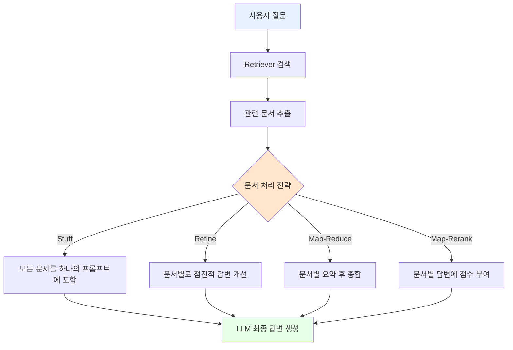

# 📖 Section 6.6: RetrievalQA - 문서 기반 질의응답 체인

## 🎯 학습 목표
- ✅ RetrievalQA Chain의 구조와 동작 원리 완전 이해
- ✅ 4가지 문서 처리 전략(Stuff, Refine, Map-Reduce, Map-Rerank) 학습
- ✅ Retriever 인터페이스와 벡터 저장소 연동 구현
- ✅ 각 전략별 비용, 성능, 정확도 트레이드오프 분석

## 🧠 핵심 개념

### RetrievalQA Chain이란?
**RetrievalQA Chain**은 문서 검색과 질의응답을 결합한 체인으로, 사용자 질문에 관련된 문서를 자동으로 검색하여 컨텍스트로 활용해 답변을 생성합니다.



### Retriever 인터페이스
**Retriever**는 구조화되지 않은 질의에 대해 관련 문서를 반환하는 인터페이스입니다. 벡터 저장소보다 더 일반적인 개념입니다.

| 특성 | Vector Store | Retriever |
|------|--------------|-----------|
| **저장 기능** | 문서 저장 + 검색 | 검색만 수행 |
| **데이터 소스** | 자체 저장소 | 다양한 소스(DB, API, 파일) |
| **검색 방식** | 벡터 유사성 기반 | 다양한 검색 알고리즘 |
| **사용 범위** | 임베딩된 문서 | 모든 종류의 문서 |

## 📋 주요 클래스/함수 레퍼런스

### RetrievalQA Chain
```python
from langchain.chains import RetrievalQA

class RetrievalQA:
    @classmethod
    def from_chain_type(
        cls,
        llm,                                       # 📌 필수: 언어 모델
        chain_type: str = "stuff",                 # 📌 용도: 문서 처리 전략
        retriever,                                 # 📌 필수: 문서 검색기
        return_source_documents: bool = False,     # 📌 용도: 소스 문서 반환 여부
        **kwargs
    ):
        """
        📋 기능: 검색 기반 질의응답 체인 생성
        📥 입력: LLM, 체인 타입, 리트리버, 옵션
        📤 출력: RetrievalQA 인스턴스
        💡 사용 시나리오: 문서 컬렉션에 대한 질의응답 시스템
        
        ⚠️  주의: 이 클래스는 Legacy로 분류됨 (LCEL 사용 권장)
        """
    
    def run(self, query: str) -> str:
        """
        📋 기능: 질의에 대한 답변 생성
        📥 입력: 사용자 질문
        📤 출력: 문서 기반 답변
        """

# 지원되는 chain_type 옵션
CHAIN_TYPES = {
    "stuff": "모든 검색된 문서를 하나의 프롬프트에 포함",
    "refine": "문서별로 답변을 점진적으로 개선",
    "map_reduce": "문서별 요약 후 최종 종합",
    "map_rerank": "문서별 답변에 점수를 부여하여 최고점 선택"
}
```

### Retriever 변환
```python
from langchain.vectorstores import Chroma

class VectorStoreRetriever:
    def __init__(
        self,
        vectorstore,                               # 📌 필수: 벡터 저장소
        search_kwargs: dict = {"k": 4}             # 📌 용도: 검색 옵션 (반환 문서 수)
    ):
        """
        📋 기능: 벡터 저장소를 Retriever로 변환
        💡 활용: 기존 벡터 저장소를 RetrievalQA에서 사용 가능
        """

# 벡터 저장소에서 Retriever 생성
vector_store = Chroma.from_documents(docs, embeddings)
retriever = vector_store.as_retriever(
    search_kwargs={"k": 4}  # 상위 4개 문서 반환
)
```

## 🔧 동작 과정 상세

### 1단계: 기본 RetrievalQA 체인 구축
```python
from langchain.chains import RetrievalQA
from langchain.chat_models import ChatOpenAI
from langchain.vectorstores import Chroma
from langchain.embeddings import OpenAIEmbeddings

# === 기본 RetrievalQA 체인 설정 ===
# 🧠 개념: 문서 검색과 답변 생성을 자동화하는 체인

print("🔗 RetrievalQA 체인 구축:")
print("=" * 50)

# 🔧 1단계: 필요한 구성 요소 준비
llm = ChatOpenAI(
    model="gpt-3.5-turbo",
    temperature=0  # 📌 일관된 답변을 위해 temperature=0
)

# 이전에 생성한 벡터 저장소 사용
embeddings = OpenAIEmbeddings()
vector_store = Chroma(
    persist_directory="./chroma_db",
    embedding_function=embeddings
)

# 🔧 2단계: 벡터 저장소를 Retriever로 변환
retriever = vector_store.as_retriever(
    search_kwargs={
        "k": 4,  # 📌 상위 4개 관련 문서 검색
        "score_threshold": 0.7  # 📌 최소 유사성 임계값 (선택사항)
    }
)

print(f"✅ Retriever 설정 완료 (검색 문서 수: 4개)")

# 🔧 3단계: RetrievalQA 체인 생성
qa_chain = RetrievalQA.from_chain_type(
    llm=llm,
    chain_type="stuff",  # 📌 기본 전략: 모든 문서를 하나의 프롬프트에
    retriever=retriever,
    return_source_documents=True,  # 📌 소스 문서도 함께 반환
    verbose=True  # 📌 디버깅용: 중간 과정 출력
)

print(f"✅ RetrievalQA 체인 생성 완료 (전략: stuff)")

# 🔧 4단계: 체인 테스트
test_queries = [
    "Winston은 어디에 살고 있나요?",
    "Victory Mansions에 대해 설명해주세요",
    "Ministry of Love는 무엇인가요?"
]

for i, query in enumerate(test_queries, 1):
    print(f"\n{'='*20} 테스트 {i} {'='*20}")
    print(f"📋 질문: {query}")
    
    # 체인 실행
    result = qa_chain({"query": query})
    
    print(f"🤖 답변: {result['result']}")
    print(f"📊 사용된 문서 수: {len(result['source_documents'])}")
    
    # 소스 문서 미리보기
    for j, doc in enumerate(result['source_documents'][:2], 1):
        preview = doc.page_content[:100].replace('\n', ' ')
        print(f"   📄 문서 {j}: {preview}...")
```

### 2단계: 4가지 문서 처리 전략 비교
```python
import time
from typing import Dict, List

# === 문서 처리 전략 비교 분석 ===
# 🧠 개념: 각 전략의 특성과 성능 비교

class ChainStrategyComparison:
    """문서 처리 전략별 성능 및 결과 비교 클래스"""
    
    def __init__(self, llm, retriever):
        self.llm = llm
        self.retriever = retriever
        self.strategies = ["stuff", "refine", "map_reduce", "map_rerank"]
        
    def create_chain(self, strategy: str) -> RetrievalQA:
        """전략별 체인 생성"""
        return RetrievalQA.from_chain_type(
            llm=self.llm,
            chain_type=strategy,
            retriever=self.retriever,
            return_source_documents=True
        )
    
    def compare_strategies(self, query: str) -> Dict:
        """모든 전략으로 동일한 질문을 처리하여 비교"""
        
        print(f"🔍 전략별 비교 분석: '{query}'")
        print("=" * 80)
        
        results = {}
        
        for strategy in self.strategies:
            print(f"\n📊 {strategy.upper()} 전략 실행 중...")
            
            try:
                # 체인 생성
                chain = self.create_chain(strategy)
                
                # 실행 시간 측정
                start_time = time.time()
                result = chain({"query": query})
                execution_time = time.time() - start_time
                
                # 결과 분석
                answer_length = len(result['result'])
                source_count = len(result.get('source_documents', []))
                
                results[strategy] = {
                    "answer": result['result'],
                    "execution_time": execution_time,
                    "answer_length": answer_length,
                    "source_documents_count": source_count,
                    "success": True
                }
                
                print(f"   ⏱️ 실행 시간: {execution_time:.2f}초")
                print(f"   📏 답변 길이: {answer_length} 문자")
                print(f"   📚 사용 문서: {source_count}개")
                print(f"   🎯 답변 미리보기: {result['result'][:100]}...")
                
            except Exception as e:
                print(f"   ❌ 오류 발생: {e}")
                results[strategy] = {
                    "error": str(e),
                    "success": False
                }
        
        return results
    
    def analyze_results(self, results: Dict) -> None:
        """결과 분석 및 요약"""
        
        print("\n📊 전략별 성능 요약:")
        print("-" * 60)
        
        successful_results = {k: v for k, v in results.items() if v.get('success')}
        
        if not successful_results:
            print("❌ 성공한 전략이 없습니다.")
            return
        
        # 성능 지표 계산
        fastest_strategy = min(successful_results.keys(), 
                             key=lambda x: successful_results[x]['execution_time'])
        longest_answer = max(successful_results.keys(),
                           key=lambda x: successful_results[x]['answer_length'])
        
        print(f"🚀 가장 빠른 전략: {fastest_strategy} "
              f"({successful_results[fastest_strategy]['execution_time']:.2f}초)")
        print(f"📝 가장 상세한 답변: {longest_answer} "
              f"({successful_results[longest_answer]['answer_length']} 문자)")
        
        # 각 전략별 특성 요약
        strategy_characteristics = {
            "stuff": "💰 비용 효율적, ⚡ 빠름, ⚠️ 토큰 제한",
            "refine": "🎯 점진적 개선, 💰💰 비용 높음, 🎨 창의적",
            "map_reduce": "📚 대용량 처리, 💰💰 비용 높음, 🔄 병렬 가능",
            "map_rerank": "🏆 신뢰도 기반, 💰💰 비용 높음, 📊 점수 제공"
        }
        
        print(f"\n📋 전략별 특성:")
        for strategy, chars in strategy_characteristics.items():
            status = "✅" if strategy in successful_results else "❌"
            print(f"   {status} {strategy.upper()}: {chars}")

# === 실제 비교 실행 ===
comparator = ChainStrategyComparison(llm, retriever)

# 테스트 질문들
comparison_queries = [
    "Winston Smith의 일상생활은 어떤가요?",
    "1984년 소설의 주요 테마는 무엇인가요?"
]

for query in comparison_queries:
    results = comparator.compare_strategies(query)
    comparator.analyze_results(results)
    print("\n" + "="*80 + "\n")
```

### 3단계: 각 전략의 상세 동작 분석
```python
# === Stuff Strategy 상세 분석 ===
# 🧠 개념: 모든 관련 문서를 하나의 프롬프트에 포함

def analyze_stuff_strategy(qa_chain, query: str):
    """Stuff 전략의 프롬프트 구성 분석"""
    
    print("🔍 STUFF 전략 상세 분석:")
    print("=" * 50)
    
    # 먼저 retriever로 문서 검색
    retrieved_docs = qa_chain.retriever.get_relevant_documents(query)
    
    print(f"📋 질문: {query}")
    print(f"📚 검색된 문서 수: {len(retrieved_docs)}")
    
    # 문서들의 총 토큰 수 추정
    total_chars = sum(len(doc.page_content) for doc in retrieved_docs)
    estimated_tokens = total_chars // 4  # 대략적인 토큰 수 추정
    
    print(f"📊 총 문자 수: {total_chars}")
    print(f"📊 예상 토큰 수: {estimated_tokens}")
    
    if estimated_tokens > 3000:  # GPT-3.5-turbo 기준
        print("⚠️ 경고: 토큰 수가 많아 모델 제한에 걸릴 수 있습니다.")
    
    # 각 문서 미리보기
    print(f"\n📄 검색된 문서들:")
    for i, doc in enumerate(retrieved_docs, 1):
        preview = doc.page_content[:150].replace('\n', ' ')
        print(f"   {i}. [{len(doc.page_content)}자] {preview}...")
    
    # 실제 체인 실행
    result = qa_chain({"query": query})
    
    print(f"\n🤖 최종 답변:")
    print(f"{result['result']}")
    
    return result

# Stuff 전략 분석 실행
stuff_chain = RetrievalQA.from_chain_type(
    llm=llm,
    chain_type="stuff",
    retriever=retriever,
    return_source_documents=True
)

stuff_result = analyze_stuff_strategy(
    stuff_chain, 
    "Winston Smith는 어떤 종류의 사람인가요?"
)
```

### 4단계: 벡터 저장소 성능 비교
```python
from langchain.vectorstores import FAISS
import numpy as np

# === 벡터 저장소별 성능 비교 ===
# 🧠 개념: Chroma vs FAISS 성능 및 특성 비교

class VectorStoreComparison:
    """벡터 저장소별 성능 비교 클래스"""
    
    def __init__(self, documents, embeddings):
        self.documents = documents
        self.embeddings = embeddings
        
    def create_chroma_store(self) -> Chroma:
        """Chroma 벡터 저장소 생성"""
        print("🔵 Chroma 벡터 저장소 생성 중...")
        start_time = time.time()
        
        chroma_store = Chroma.from_documents(
            self.documents,
            self.embeddings,
            persist_directory="./chroma_comparison"
        )
        
        creation_time = time.time() - start_time
        print(f"   ⏱️ 생성 시간: {creation_time:.2f}초")
        
        return chroma_store
    
    def create_faiss_store(self) -> FAISS:
        """FAISS 벡터 저장소 생성"""
        print("🟠 FAISS 벡터 저장소 생성 중...")
        start_time = time.time()
        
        faiss_store = FAISS.from_documents(
            self.documents,
            self.embeddings
        )
        
        creation_time = time.time() - start_time
        print(f"   ⏱️ 생성 시간: {creation_time:.2f}초")
        
        return faiss_store
    
    def compare_search_performance(self, query: str, k: int = 4):
        """검색 성능 비교"""
        
        print(f"\n🔍 검색 성능 비교: '{query}'")
        print("-" * 60)
        
        # Chroma 검색
        chroma_store = self.create_chroma_store()
        
        start_time = time.time()
        chroma_results = chroma_store.similarity_search(query, k=k)
        chroma_search_time = time.time() - start_time
        
        print(f"🔵 Chroma 검색 시간: {chroma_search_time:.4f}초")
        
        # FAISS 검색  
        faiss_store = self.create_faiss_store()
        
        start_time = time.time()
        faiss_results = faiss_store.similarity_search(query, k=k)
        faiss_search_time = time.time() - start_time
        
        print(f"🟠 FAISS 검색 시간: {faiss_search_time:.4f}초")
        
        # 성능 비교
        speed_ratio = chroma_search_time / faiss_search_time
        faster_store = "FAISS" if speed_ratio > 1 else "Chroma"
        
        print(f"🏆 더 빠른 저장소: {faster_store} "
              f"({abs(speed_ratio):.1f}배)")
        
        # 결과 일관성 확인
        chroma_content = [doc.page_content for doc in chroma_results]
        faiss_content = [doc.page_content for doc in faiss_results]
        
        matching_docs = len(set(chroma_content) & set(faiss_content))
        consistency = matching_docs / k * 100
        
        print(f"📊 결과 일관성: {consistency:.1f}% ({matching_docs}/{k}개 일치)")
        
        return {
            "chroma_time": chroma_search_time,
            "faiss_time": faiss_search_time,
            "faster_store": faster_store,
            "consistency": consistency
        }

# 성능 비교 실행 (이전에 분할된 문서들 사용)
if 'docs' in locals() and docs:  # docs가 정의되어 있다면
    comparison = VectorStoreComparison(docs[:10], embeddings)  # 처음 10개 문서로 테스트
    
    test_queries = [
        "Winston의 거주지",
        "Ministry of Love",
        "Victory Mansions"
    ]
    
    for query in test_queries:
        result = comparison.compare_search_performance(query)
        print()
else:
    print("⚠️ 비교를 위한 문서가 없습니다. 먼저 문서를 로딩하세요.")
```

## 💻 실전 예제

### 고급 Document GPT 시스템
```python
from typing import Dict, List, Optional, Any
import logging
from langchain.schema import BaseRetriever
from langchain.callbacks import get_openai_callback

class AdvancedDocumentGPT:
    """
    🎯 고급 Document GPT 시스템
    
    주요 기능:
    - 다중 체인 전략 지원
    - 성능 모니터링 및 비용 추적
    - 동적 전략 선택
    - 결과 품질 평가
    """
    
    def __init__(self, 
                 llm,
                 retriever: BaseRetriever,
                 default_strategy: str = "stuff",
                 enable_monitoring: bool = True):
        
        self.llm = llm
        self.retriever = retriever
        self.default_strategy = default_strategy
        self.enable_monitoring = enable_monitoring
        
        # 전략별 체인 캐시
        self._chains = {}
        
        # 사용 통계
        self.usage_stats = {
            "total_queries": 0,
            "strategy_usage": {},
            "total_cost": 0.0,
            "avg_response_time": 0.0
        }
        
        # 로거 설정
        if enable_monitoring:
            logging.basicConfig(level=logging.INFO)
            self.logger = logging.getLogger(__name__)
        
    def _get_chain(self, strategy: str) -> RetrievalQA:
        """전략별 체인 캐시 및 반환"""
        if strategy not in self._chains:
            self._chains[strategy] = RetrievalQA.from_chain_type(
                llm=self.llm,
                chain_type=strategy,
                retriever=self.retriever,
                return_source_documents=True
            )
        return self._chains[strategy]
    
    def _select_optimal_strategy(self, query: str) -> str:
        """질의 특성에 따른 최적 전략 선택"""
        
        # 질의 길이 기반 분석
        query_length = len(query.split())
        
        # 복잡한 질문 패턴 감지
        complex_patterns = [
            "분석", "비교", "설명", "요약", "평가",
            "analyze", "compare", "describe", "summarize"
        ]
        
        is_complex = any(pattern in query.lower() for pattern in complex_patterns)
        
        # 전략 선택 로직
        if query_length > 20 and is_complex:
            return "refine"  # 복잡한 긴 질문은 refine
        elif "비교" in query or "compare" in query.lower():
            return "map_rerank"  # 비교 질문은 map_rerank
        elif query_length > 15:
            return "map_reduce"  # 중간 길이는 map_reduce
        else:
            return "stuff"  # 간단한 질문은 stuff
    
    def ask(self, 
            query: str,
            strategy: Optional[str] = None,
            auto_select_strategy: bool = False) -> Dict[str, Any]:
        """
        📋 기능: 문서 기반 질의응답 실행
        📥 입력: 질문, 전략(선택), 자동 전략 선택 여부
        📤 출력: 답변과 메타데이터
        """
        
        # 전략 결정
        if auto_select_strategy:
            selected_strategy = self._select_optimal_strategy(query)
        else:
            selected_strategy = strategy or self.default_strategy
        
        if self.enable_monitoring:
            self.logger.info(f"Query: {query[:50]}... | Strategy: {selected_strategy}")
        
        # 비용 및 시간 추적
        start_time = time.time()
        
        try:
            if self.enable_monitoring:
                with get_openai_callback() as cb:
                    chain = self._get_chain(selected_strategy)
                    result = chain({"query": query})
                    
                    execution_time = time.time() - start_time
                    cost = cb.total_cost
            else:
                chain = self._get_chain(selected_strategy)
                result = chain({"query": query})
                execution_time = time.time() - start_time
                cost = 0.0
            
            # 통계 업데이트
            self._update_stats(selected_strategy, execution_time, cost)
            
            # 결과 품질 평가
            quality_score = self._evaluate_answer_quality(
                query, result['result'], result['source_documents']
            )
            
            return {
                "answer": result['result'],
                "source_documents": result['source_documents'],
                "strategy_used": selected_strategy,
                "execution_time": execution_time,
                "cost": cost,
                "quality_score": quality_score,
                "success": True
            }
            
        except Exception as e:
            if self.enable_monitoring:
                self.logger.error(f"Query failed: {e}")
            
            return {
                "error": str(e),
                "strategy_used": selected_strategy,
                "success": False
            }
    
    def _update_stats(self, strategy: str, execution_time: float, cost: float):
        """사용 통계 업데이트"""
        self.usage_stats["total_queries"] += 1
        self.usage_stats["strategy_usage"][strategy] = \
            self.usage_stats["strategy_usage"].get(strategy, 0) + 1
        self.usage_stats["total_cost"] += cost
        
        # 평균 응답 시간 업데이트
        total_queries = self.usage_stats["total_queries"]
        current_avg = self.usage_stats["avg_response_time"]
        self.usage_stats["avg_response_time"] = \
            (current_avg * (total_queries - 1) + execution_time) / total_queries
    
    def _evaluate_answer_quality(self, query: str, answer: str, sources: List) -> float:
        """답변 품질 평가 (0.0-1.0 점수)"""
        
        quality_factors = []
        
        # 1. 답변 길이 적절성 (너무 짧거나 길지 않음)
        answer_length = len(answer.split())
        if 10 <= answer_length <= 200:
            quality_factors.append(0.8)
        elif 5 <= answer_length < 10 or 200 < answer_length <= 500:
            quality_factors.append(0.6)
        else:
            quality_factors.append(0.3)
        
        # 2. 소스 문서 활용도
        if len(sources) >= 2:
            quality_factors.append(0.9)
        elif len(sources) == 1:
            quality_factors.append(0.7)
        else:
            quality_factors.append(0.3)
        
        # 3. "모르겠다" 답변 체크 (신뢰성)
        uncertainty_phrases = ["모르겠", "don't know", "확실하지", "not sure"]
        if any(phrase in answer.lower() for phrase in uncertainty_phrases):
            # 적절한 불확실성 표현은 좋은 신호
            quality_factors.append(0.8)
        else:
            quality_factors.append(0.9)
        
        return sum(quality_factors) / len(quality_factors)
    
    def get_usage_report(self) -> Dict[str, Any]:
        """사용 통계 리포트"""
        return {
            "summary": self.usage_stats,
            "most_used_strategy": max(
                self.usage_stats["strategy_usage"].items(),
                key=lambda x: x[1],
                default=("none", 0)
            )[0],
            "cost_per_query": (
                self.usage_stats["total_cost"] / max(self.usage_stats["total_queries"], 1)
            )
        }
    
    def batch_ask(self, queries: List[str], **kwargs) -> List[Dict[str, Any]]:
        """배치 질의 처리"""
        
        results = []
        total_start = time.time()
        
        print(f"🚀 배치 질의 처리 시작: {len(queries)}개")
        
        for i, query in enumerate(queries, 1):
            print(f"\n📋 질의 {i}/{len(queries)}: {query[:50]}...")
            
            result = self.ask(query, **kwargs)
            results.append(result)
            
            if result['success']:
                print(f"   ✅ 완료 ({result['execution_time']:.2f}초, 품질: {result['quality_score']:.2f})")
            else:
                print(f"   ❌ 실패: {result['error']}")
        
        total_time = time.time() - total_start
        success_count = sum(1 for r in results if r['success'])
        
        print(f"\n📊 배치 처리 완료:")
        print(f"   ✅ 성공: {success_count}/{len(queries)}")
        print(f"   ⏱️ 총 시간: {total_time:.2f}초")
        print(f"   📈 평균 시간: {total_time/len(queries):.2f}초/질의")
        
        return results

# === 고급 Document GPT 시스템 사용 예시 ===
print("🚀 고급 Document GPT 시스템 시작")
print("=" * 60)

# 시스템 초기화
advanced_gpt = AdvancedDocumentGPT(
    llm=llm,
    retriever=retriever,
    default_strategy="stuff",
    enable_monitoring=True
)

# 다양한 질의 테스트
test_queries = [
    "Winston Smith는 누구인가요?",  # 간단한 질문 → stuff
    "1984년 소설에서 감시 사회의 특징을 자세히 분석해주세요",  # 복잡한 질문 → refine
    "Ministry of Love와 Ministry of Truth를 비교해주세요",  # 비교 질문 → map_rerank
    "소설의 주요 테마들을 요약해주세요"  # 요약 질문 → map_reduce
]

# 개별 질의 테스트 (자동 전략 선택)
print("\n🎯 자동 전략 선택 테스트:")
for query in test_queries:
    result = advanced_gpt.ask(query, auto_select_strategy=True)
    
    if result['success']:
        print(f"\n📋 질문: {query}")
        print(f"🔧 전략: {result['strategy_used']}")
        print(f"⏱️ 시간: {result['execution_time']:.2f}초")
        print(f"📊 품질: {result['quality_score']:.2f}/1.0")
        print(f"🤖 답변: {result['answer'][:100]}...")
    else:
        print(f"❌ 실패: {result['error']}")

# 배치 처리 테스트
print("\n🔄 배치 처리 테스트:")
batch_results = advanced_gpt.batch_ask(
    test_queries[:2], 
    auto_select_strategy=True
)

# 사용 통계 리포트
print("\n📈 사용 통계 리포트:")
report = advanced_gpt.get_usage_report()
for key, value in report.items():
    print(f"   {key}: {value}")

print("\n✅ 고급 Document GPT 시스템 테스트 완료!")
```

## 🔍 변수/함수 상세 설명

### 체인 전략별 특성 분석

#### Stuff 전략 최적화
```python
def optimize_stuff_strategy(retriever, query: str, max_tokens: int = 3500) -> List:
    """
    📋 기능: Stuff 전략을 위한 문서 수 최적화
    📥 입력: 리트리버, 질의, 최대 토큰 수
    📤 출력: 최적화된 문서 리스트
    💡 사용 시나리오: 토큰 제한 내에서 최대한 관련성 높은 문서 선택
    """
    
    # 모든 관련 문서 검색 (더 많은 후보 확보)
    all_docs = retriever.get_relevant_documents(query, k=10)
    
    selected_docs = []
    current_tokens = 0
    
    # 시스템 메시지, 질문 등을 위한 토큰 예약
    reserved_tokens = 500
    available_tokens = max_tokens - reserved_tokens
    
    for doc in all_docs:
        # 토큰 수 추정 (문자 수 / 4)
        doc_tokens = len(doc.page_content) // 4
        
        if current_tokens + doc_tokens <= available_tokens:
            selected_docs.append(doc)
            current_tokens += doc_tokens
        else:
            # 토큰 제한 초과시 중단
            break
    
    print(f"📊 선택된 문서: {len(selected_docs)}개")
    print(f"📊 예상 토큰: {current_tokens}/{available_tokens}")
    
    return selected_docs

def estimate_refine_cost(docs: List, model: str = "gpt-3.5-turbo") -> Dict[str, float]:
    """
    📋 기능: Refine 전략의 예상 비용 계산
    📥 입력: 문서 리스트, 모델명
    📤 출력: 비용 분석 리포트
    💡 사용 시나리오: Refine 전략 사용 전 비용 예측
    """
    
    # OpenAI 가격 (2024년 기준)
    pricing = {
        "gpt-3.5-turbo": {"input": 0.0015, "output": 0.002},
        "gpt-4": {"input": 0.03, "output": 0.06}
    }
    
    if model not in pricing:
        model = "gpt-3.5-turbo"
    
    # 각 문서별 처리 비용 계산
    doc_count = len(docs)
    avg_doc_length = sum(len(doc.page_content) for doc in docs) / doc_count
    
    # 토큰 추정 (문자 / 4)
    tokens_per_doc = avg_doc_length // 4
    
    # Refine은 문서별로 점진적 처리
    total_input_tokens = 0
    total_output_tokens = 0
    
    for i in range(doc_count):
        # i번째 문서 처리시 필요한 토큰
        # 현재 문서 + 이전까지의 답변 (누적)
        current_input = tokens_per_doc + (i * 100)  # 답변 누적 추정
        current_output = 150  # 답변 토큰 추정
        
        total_input_tokens += current_input
        total_output_tokens += current_output
    
    # 비용 계산
    input_cost = (total_input_tokens / 1000) * pricing[model]["input"]
    output_cost = (total_output_tokens / 1000) * pricing[model]["output"]
    total_cost = input_cost + output_cost
    
    return {
        "document_count": doc_count,
        "estimated_input_tokens": total_input_tokens,
        "estimated_output_tokens": total_output_tokens,
        "input_cost": input_cost,
        "output_cost": output_cost,
        "total_cost": total_cost,
        "cost_per_document": total_cost / doc_count
    }
```

#### 결과 품질 평가 함수
```python
def evaluate_answer_comprehensiveness(answer: str, query: str, sources: List) -> Dict[str, float]:
    """
    📋 기능: 답변의 포괄성과 품질 평가
    📥 입력: 답변, 질문, 소스 문서들
    📤 출력: 품질 지표들
    """
    
    import re
    from collections import Counter
    
    metrics = {}
    
    # 1. 답변 길이 적절성
    word_count = len(answer.split())
    if 50 <= word_count <= 300:
        metrics["length_score"] = 1.0
    elif 20 <= word_count < 50 or 300 < word_count <= 500:
        metrics["length_score"] = 0.7
    else:
        metrics["length_score"] = 0.4
    
    # 2. 키워드 커버리지
    query_words = set(re.findall(r'\b\w+\b', query.lower()))
    answer_words = set(re.findall(r'\b\w+\b', answer.lower()))
    
    keyword_coverage = len(query_words & answer_words) / max(len(query_words), 1)
    metrics["keyword_coverage"] = keyword_coverage
    
    # 3. 소스 활용도
    source_utilization = min(len(sources) / 3, 1.0)  # 최적 3-4개 문서
    metrics["source_utilization"] = source_utilization
    
    # 4. 구조적 완성도 (문장 완성, 논리적 흐름)
    sentences = re.split(r'[.!?]', answer)
    complete_sentences = [s for s in sentences if len(s.strip()) > 5]
    structure_score = min(len(complete_sentences) / 3, 1.0)
    metrics["structure_score"] = structure_score
    
    # 5. 신뢰성 지표 (불확실성 적절한 표현)
    uncertainty_phrases = [
        "확실하지", "아마도", "것으로 보임", "가능성이", 
        "not certain", "appears", "likely", "seems"
    ]
    
    has_uncertainty = any(phrase in answer.lower() for phrase in uncertainty_phrases)
    
    # 짧은 답변에서 불확실성 표현은 좋은 신호
    if word_count < 50 and has_uncertainty:
        reliability_score = 0.9
    elif word_count >= 50 and not has_uncertainty:
        reliability_score = 0.8  # 긴 답변에서는 확신 있는 답변이 좋을 수 있음
    else:
        reliability_score = 0.7
    
    metrics["reliability_score"] = reliability_score
    
    # 6. 종합 점수
    weights = {
        "length_score": 0.2,
        "keyword_coverage": 0.3,
        "source_utilization": 0.2,
        "structure_score": 0.2,
        "reliability_score": 0.1
    }
    
    overall_score = sum(metrics[key] * weights[key] for key in weights)
    metrics["overall_score"] = overall_score
    
    return metrics

def compare_chain_outputs(query: str, results: Dict[str, str]) -> Dict[str, Any]:
    """
    📋 기능: 여러 체인 전략 결과 비교 분석
    📥 입력: 질의, 전략별 결과 딕셔너리
    📤 출력: 비교 분석 리포트
    """
    
    comparison = {
        "query": query,
        "strategies_compared": list(results.keys()),
        "detailed_analysis": {}
    }
    
    for strategy, result in results.items():
        if result.get('success', False):
            answer = result['answer']
            sources = result.get('source_documents', [])
            
            # 개별 평가
            quality_metrics = evaluate_answer_comprehensiveness(answer, query, sources)
            
            comparison["detailed_analysis"][strategy] = {
                "answer_preview": answer[:100] + "...",
                "word_count": len(answer.split()),
                "source_count": len(sources),
                "execution_time": result.get('execution_time', 0),
                "quality_metrics": quality_metrics
            }
    
    # 최고 성능 전략 식별
    if comparison["detailed_analysis"]:
        best_quality = max(
            comparison["detailed_analysis"].items(),
            key=lambda x: x[1]["quality_metrics"]["overall_score"]
        )
        
        fastest = min(
            comparison["detailed_analysis"].items(),
            key=lambda x: x[1]["execution_time"]
        )
        
        comparison["recommendations"] = {
            "best_quality": best_quality[0],
            "fastest": fastest[0],
            "quality_score": best_quality[1]["quality_metrics"]["overall_score"],
            "fastest_time": fastest[1]["execution_time"]
        }
    
    return comparison
```

## 🧪 실습 과제

### 🔨 기본 과제
1. **전략별 성능 벤치마크**: 동일한 질문에 대한 4가지 전략의 성능 측정
```python
# TODO: 다양한 타입의 질문으로 전략별 성능 측정
question_types = {
    "factual": "Winston Smith는 누구인가요?",
    "analytical": "1984년 소설의 감시 사회를 분석해주세요",
    "comparative": "Ministry of Love와 Truth를 비교해주세요",
    "summarization": "소설의 주요 내용을 요약해주세요"
}
# 힌트: 실행 시간, 답변 품질, 비용을 종합적으로 평가
```

2. **Retriever 커스터마이징**: 검색 매개변수에 따른 결과 품질 변화 분석
```python
# TODO: k값, score_threshold 등 매개변수 변경에 따른 영향 분석
retriever_configs = [
    {"k": 2}, {"k": 4}, {"k": 8},
    {"k": 4, "score_threshold": 0.7},
    {"k": 4, "score_threshold": 0.8}
]
```

### 🚀 심화 과제
3. **적응형 전략 선택기**: 질문 유형을 자동 분류하여 최적 전략 선택
```python
# TODO: 질문 분석을 통한 지능형 전략 선택 시스템
class IntelligentStrategySelector:
    def analyze_question_complexity(self, query): pass
    def detect_question_type(self, query): pass  
    def select_optimal_strategy(self, query): pass
```

4. **하이브리드 체인**: 여러 전략의 결과를 조합하는 앙상블 방법
```python
# TODO: 다중 전략 결과를 조합하여 더 나은 답변 생성
class EnsembleQAChain:
    def combine_results(self, results): pass
    def weighted_voting(self, answers, weights): pass
    def confidence_based_selection(self, results): pass
```

### 💡 창의 과제
5. **동적 문서 필터링**: 질문 관련성에 따른 실시간 문서 필터링
```python
# TODO: 검색된 문서의 관련성을 재평가하여 품질 향상
class DynamicDocumentFilter:
    def calculate_relevance_score(self, doc, query): pass
    def filter_low_relevance_docs(self, docs, threshold): pass
    def rerank_documents(self, docs, query): pass
```

6. **비용 최적화 시스템**: 예산 제한 내에서 최적 전략 선택
```python
# TODO: 예산 제약 조건 하에서 최적의 품질/비용 균형점 찾기
class CostOptimizedQA:
    def estimate_strategy_cost(self, strategy, docs): pass
    def select_within_budget(self, budget, strategies): pass
    def optimize_quality_per_dollar(self, strategies): pass
```

## ⚠️ 주의사항

### 비용 관리
```python
# ❌ 비효율적인 방법: 모든 전략을 매번 시도
def expensive_qa_approach(query):
    strategies = ["stuff", "refine", "map_reduce", "map_rerank"]
    results = []
    for strategy in strategies:  # 4배 비용!
        chain = RetrievalQA.from_chain_type(llm=llm, chain_type=strategy, retriever=retriever)
        result = chain({"query": query})
        results.append(result)
    return results

# ✅ 효율적인 방법: 질문 유형에 따른 적응형 선택
def cost_effective_qa_approach(query):
    # 질문 분석
    if len(query.split()) > 20:
        strategy = "refine"  # 복잡한 질문만 refine 사용
    else:
        strategy = "stuff"   # 간단한 질문은 stuff
    
    chain = RetrievalQA.from_chain_type(llm=llm, chain_type=strategy, retriever=retriever)
    return chain({"query": query})
```

### 성능 최적화
- **토큰 제한**: Stuff 전략 사용시 문서 수 제한 필요
- **캐시 활용**: 동일한 질문의 반복 처리시 결과 캐싱
- **병렬 처리**: Map-Reduce에서 문서별 병렬 처리 고려

### 전략별 특성 이해
```python
# 전략별 사용 시나리오 가이드
strategy_use_cases = {
    "stuff": {
        "적합한_상황": ["간단한 질문", "적은 문서", "빠른 응답 필요"],
        "부적합한_상황": ["복잡한 분석", "많은 문서", "토큰 제한 초과"],
        "비용": "낮음",
        "정확도": "보통"
    },
    "refine": {
        "적합한_상황": ["복잡한 분석", "점진적 개선", "높은 품질"],
        "부적합한_상황": ["간단한 질문", "빠른 응답", "비용 민감"],
        "비용": "높음",
        "정확도": "높음"
    },
    "map_reduce": {
        "적합한_상황": ["많은 문서", "요약 작업", "병렬 처리"],
        "부적합한_상황": ["문맥 연결", "세부 분석", "실시간 처리"],
        "비용": "높음",
        "정확도": "보통"
    },
    "map_rerank": {
        "적합한_상황": ["신뢰도 중요", "여러 답변 비교", "품질 검증"],
        "부적합한_상황": ["단순 사실 질문", "빠른 처리", "비용 절약"],
        "비용": "매우 높음",
        "정확도": "매우 높음"
    }
}
```

### 품질 보장
- **"모르겠다" 답변 허용**: 잘못된 정보보다 불확실성 표현이 중요
- **소스 검증**: 반환된 문서들의 관련성 확인
- **답변 일관성**: 동일한 질문에 대한 일관된 답변 확보

## 🔗 관련 자료
- **이전 학습**: [6.4 Vector Stores](./6.4_Vector_Stores.md)
- **다음 학습**: [6.8 Stuff LCEL Chain](./6.8_Stuff_LCEL_Chain.md)
- **참고 문서**: [LangChain RetrievalQA](https://python.langchain.com/docs/modules/chains/popular/vector_db_qa)
- **성능 모니터링**: [LangSmith](https://docs.smith.langchain.com/)
- **실습 파일**: [6.6 RetrievalQA.ipynb](../../00%20lecture/6.6%20RetrievalQA.ipynb)

---

💡 **핵심 정리**: RetrievalQA Chain은 문서 검색과 질의응답을 자동화하는 강력한 도구입니다. 4가지 문서 처리 전략(Stuff, Refine, Map-Reduce, Map-Rerank)은 각각 다른 상황에 최적화되어 있어, 질문 유형과 요구사항에 따라 적절한 전략을 선택하는 것이 중요합니다. 비용, 성능, 정확도의 트레이드오프를 이해하고 상황에 맞는 최적화가 필요합니다.