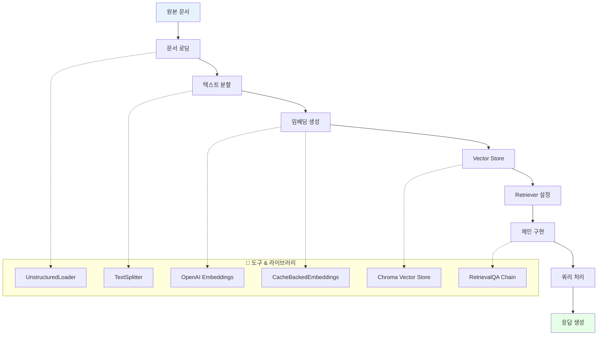

# 📖 Section 6.7: 중간 정리 - RAG 기초 개념 종합

## 🎯 학습 목표
- ✅ RAG(Retrieval Augmented Generation) 핵심 구성 요소에 대한 이해 통합
- ✅ 로딩부터 질의까지 전체 문서 처리 파이프라인 검토
- ✅ 서로 다른 체인 전략 간의 관계 이해
- ✅ 고급 LCEL(LangChain Expression Language) 구현을 위한 준비

## 🎉 지금까지 우리가 성취한 것들

### 🔗 완전한 RAG 파이프라인 개요
우리는 RAG 문서 처리 파이프라인에 대한 포괄적인 이해를 구축했습니다:



## 🧠 핵심 개념 복습

### 1. 문서 로딩 및 처리

#### UnstructuredLoader - 범용 파일 지원
```python
# 배운 것: 범용 파일 로딩 기능
from langchain.document_loaders import UnstructuredFileLoader

supported_formats = {
    "text_files": [".txt", ".md", ".rtf"],
    "documents": [".pdf", ".doc", ".docx"],
    "web_content": [".html", ".xml"],
    "spreadsheets": [".xlsx", ".xls", ".csv"],
    "presentations": [".pptx", ".ppt"],
    "images": [".jpg", ".png"]  # OCR 기능 포함
}

def load_any_document(file_path: str):
    """여러 형식을 처리하는 범용 문서 로더"""
    
    print(f"📄 문서 로딩 중: {file_path}")
    
    # UnstructuredLoader가 자동으로 형식 감지
    loader = UnstructuredFileLoader(file_path)
    documents = loader.load()
    
    print(f"✅ 로딩 완료: {len(documents)}개 문서 청크")
    print(f"📊 첫 번째 청크 미리보기: {documents[0].page_content[:100]}...")
    
    return documents

# 핵심 인사이트: 하나의 로더로 수십 개의 파일 형식 처리
```

#### 문서 분할 - 최적화 전략
```python
# 학습한 것: 지능적 텍스트 분할 전략
from langchain.text_splitter import RecursiveCharacterTextSplitter

def create_optimized_splitter(document_type: str = "general"):
    """문서 타입에 따른 최적화된 분할기"""
    
    strategies = {
        "academic": {
            "chunk_size": 1200,
            "chunk_overlap": 200,
            "separators": ["\n\n", "\n", ". ", " "],
            "reason": "긴 문단, 상세한 논증"
        },
        "technical": {
            "chunk_size": 1000,
            "chunk_overlap": 150,
            "separators": ["\n\n", "\n", "```", ". ", " "],
            "reason": "코드 블록과 설명 구분"
        },
        "general": {
            "chunk_size": 600,
            "chunk_overlap": 100,
            "separators": ["\n\n", "\n", ". ", " "],
            "reason": "균형잡힌 범용 설정"
        }
    }
    
    config = strategies.get(document_type, strategies["general"])
    
    splitter = RecursiveCharacterTextSplitter(
        chunk_size=config["chunk_size"],
        chunk_overlap=config["chunk_overlap"],
        separators=config["separators"]
    )
    
    print(f"📊 {document_type} 문서용 분할기 생성")
    print(f"   • 청크 크기: {config['chunk_size']}")
    print(f"   • 겹침: {config['chunk_overlap']}")
    print(f"   • 이유: {config['reason']}")
    
    return splitter

# 핵심 인사이트: 문서 타입별 맞춤 분할 전략
```

### 2. 토큰 인식과 비용 최적화

#### Tiktoken - 정확한 비용 계산
```python
# 학습한 것: 실제 토큰 사용량 기반 계산
import tiktoken
from langchain.text_splitter import CharacterTextSplitter

def demonstrate_token_awareness():
    """토큰 인식의 중요성 시연"""
    
    text = "안녕하세요 여러분, 제 이름은 니콜라스입니다"
    
    # 문자 기반 추정 (부정확)
    char_estimate = len(text) // 4  # 대략적인 추정
    
    # 실제 토큰 계산
    encoder = tiktoken.encoding_for_model("gpt-3.5-turbo")
    actual_tokens = len(encoder.encode(text))
    
    print("🔍 토큰 계산 비교:")
    print(f"   문자 기반 추정: {char_estimate} 토큰")
    print(f"   실제 토큰 수: {actual_tokens} 토큰")
    print(f"   차이: {abs(char_estimate - actual_tokens)} 토큰")
    
    # 토큰 기반 분할기의 장점
    token_splitter = CharacterTextSplitter.from_tiktoken_encoder(
        chunk_size=600,  # 정확한 토큰 수 기준
        chunk_overlap=100,
        model_name="gpt-3.5-turbo"
    )
    
    return {
        "char_estimate": char_estimate,
        "actual_tokens": actual_tokens,
        "splitter": token_splitter
    }

# 핵심 인사이트: 정확한 비용 계산을 위한 토큰 인식
```

### 3. 벡터 임베딩과 의미적 검색

#### 벡터 개념의 실용적 이해
```python
# 학습한 것: 벡터 공간에서의 의미적 관계
import numpy as np
from sklearn.metrics.pairwise import cosine_similarity

def demonstrate_vector_concepts():
    """3차원 벡터로 의미적 관계 시연"""
    
    # 왕국 세계의 3차원 벡터 공간
    # 차원: [남성성, 여성성, 왕족성]
    concepts = {
        "King":   [0.9, 0.1, 1.0],
        "Queen":  [0.1, 0.9, 1.0], 
        "Man":    [0.9, 0.1, 0.0],
        "Woman":  [0.1, 0.9, 0.0],
        "Knight": [0.9, 0.2, 0.7]
    }
    
    print("🧠 벡터 공간에서의 의미적 관계:")
    print("=" * 50)
    
    # King과 다른 개념들의 유사성 계산
    king_vector = np.array(concepts["King"]).reshape(1, -1)
    
    for concept, vector in concepts.items():
        if concept != "King":
            concept_vector = np.array(vector).reshape(1, -1)
            similarity = cosine_similarity(king_vector, concept_vector)[0][0]
            print(f"King ↔ {concept:6}: {similarity:.3f}")
    
    # 벡터 연산: King - Man + Woman = ?
    print(f"\n🔮 벡터 대수학:")
    king = np.array(concepts["King"])
    man = np.array(concepts["Man"])
    woman = np.array(concepts["Woman"])
    
    result = king - man + woman
    print(f"King - Man + Woman = {result}")
    print(f"가장 가까운 개념: Queen {concepts['Queen']}")
    
    return concepts

# 핵심 인사이트: 벡터 공간에서 의미는 위치와 거리로 표현됨
```

### 4. Vector Store와 효율적 검색

#### Chroma를 통한 실제 구현
```python
# 학습한 것: 프로덕션 레디 벡터 저장소 구현
from langchain.vectorstores import Chroma
from langchain.embeddings import OpenAIEmbeddings
from langchain.storage import LocalFileStore
from langchain.embeddings import CacheBackedEmbeddings

def create_production_ready_vectorstore():
    """프로덕션 준비된 벡터 저장소 생성"""
    
    print("🏗️ 프로덕션 벡터 저장소 구축:")
    print("=" * 40)
    
    # 1. 비용 최적화: 캐싱된 임베딩
    cache_dir = LocalFileStore("./.cache/")
    underlying_embeddings = OpenAIEmbeddings()
    
    cached_embeddings = CacheBackedEmbeddings.from_bytes_store(
        underlying_embeddings=underlying_embeddings,
        document_embedding_cache=cache_dir,
        namespace="production_embeddings"
    )
    
    print("✅ 캐싱된 임베딩 설정 완료")
    
    # 2. 영구 저장소
    vectorstore = Chroma(
        persist_directory="./chroma_production",
        embedding_function=cached_embeddings,
        collection_name="rag_documents"
    )
    
    print("✅ 영구 저장소 설정 완료")
    
    # 3. 검색 최적화
    retriever = vectorstore.as_retriever(
        search_type="similarity",
        search_kwargs={
            "k": 4,  # 상위 4개 문서
            "fetch_k": 10  # 후보 10개에서 선택
        }
    )
    
    print("✅ 최적화된 검색기 설정 완료")
    
    return {
        "vectorstore": vectorstore,
        "retriever": retriever,
        "embeddings": cached_embeddings
    }

# 핵심 인사이트: 캐싱, 영구성, 검색 최적화의 조합
```

## 🔄 RetrievalQA 체인 전략 분석

### 전략별 특성과 사용 사례
```python
# 학습한 것: 4가지 문서 처리 전략의 명확한 구분
def compare_chain_strategies():
    """체인 전략별 특성 비교"""
    
    strategies = {
        "stuff": {
            "description": "모든 문서를 하나의 프롬프트에 포함",
            "pros": ["간단한 구현", "빠른 응답", "전체 맥락 유지"],
            "cons": ["토큰 제한", "비용 증가 위험"],
            "best_for": "소수의 관련 문서",
            "max_documents": "3-5개 (토큰 제한에 따라)"
        },
        
        "refine": {
            "description": "문서별로 답변을 점진적으로 개선",
            "pros": ["순차적 개선", "맥락 누적", "긴 문서 처리 가능"],
            "cons": ["처리 시간 증가", "초기 편향 가능성"],
            "best_for": "정보가 점진적으로 구축되는 경우",
            "max_documents": "10-15개"
        },
        
        "map_reduce": {
            "description": "각 문서별로 요약 후 최종 통합",
            "pros": ["병렬 처리 가능", "많은 문서 처리", "확장성"],
            "cons": ["정보 손실 위험", "비용 증가", "복잡성"],
            "best_for": "대량 문서 분석",
            "max_documents": "50개 이상"
        },
        
        "map_rerank": {
            "description": "각 문서별로 답변하고 점수로 랭킹",
            "pros": ["최고 품질 답변 선택", "신뢰도 점수"],
            "cons": ["높은 비용", "단일 관점 위험"],
            "best_for": "정확성이 중요한 질문",
            "max_documents": "5-10개"
        }
    }
    
    print("🔍 RetrievalQA 체인 전략 비교:")
    print("=" * 60)
    
    for strategy, info in strategies.items():
        print(f"\n📋 {strategy.upper()} 전략:")
        print(f"   📝 설명: {info['description']}")
        print(f"   ✅ 장점: {', '.join(info['pros'][:2])}")
        print(f"   ⚠️ 단점: {', '.join(info['cons'][:2])}")
        print(f"   🎯 적합: {info['best_for']}")
        print(f"   📊 문서 수: {info['max_documents']}")
    
    return strategies

# 핵심 인사이트: 상황에 따른 전략 선택의 중요성
```

## 💡 실무 통찰과 패턴

### 성공적인 RAG 구현의 핵심 요소
```python
def rag_implementation_checklist():
    """실무 RAG 구현 체크리스트"""
    
    checklist = {
        "data_preparation": {
            "title": "📊 데이터 준비",
            "items": [
                "문서 품질 검증 (오타, 형식 오류 제거)",
                "일관된 메타데이터 스키마 설계",
                "적절한 청크 크기와 겹침 설정",
                "토큰 기반 분할 사용",
                "문서 타입별 분할 전략 적용"
            ]
        },
        
        "embedding_optimization": {
            "title": "🔢 임베딩 최적화",
            "items": [
                "CacheBackedEmbeddings 사용으로 비용 절약",
                "적절한 임베딩 모델 선택 (정확도 vs 비용)",
                "배치 처리로 효율성 향상",
                "임베딩 품질 평가 및 모니터링",
                "다국어 지원 고려"
            ]
        },
        
        "retrieval_tuning": {
            "title": "🔍 검색 튜닝",
            "items": [
                "적절한 k 값 설정 (보통 3-5개)",
                "유사성 임계값 조정",
                "하이브리드 검색 고려 (벡터 + 키워드)",
                "메타데이터 필터링 활용",
                "검색 결과 다양성 확보"
            ]
        },
        
        "chain_optimization": {
            "title": "⛓️ 체인 최적화",
            "items": [
                "상황에 맞는 체인 전략 선택",
                "프롬프트 템플릿 최적화",
                "컨텍스트 길이 관리",
                "응답 품질 검증",
                "오류 처리 및 fallback 구현"
            ]
        },
        
        "production_readiness": {
            "title": "🚀 프로덕션 준비",
            "items": [
                "모니터링 및 로깅 설정 (LangSmith)",
                "성능 지표 추적 (응답 시간, 정확도)",
                "비용 모니터링 및 최적화",
                "스케일링 전략 수립",
                "보안 및 개인정보 보호"
            ]
        }
    }
    
    print("📋 RAG 구현 체크리스트:")
    print("=" * 50)
    
    for category, info in checklist.items():
        print(f"\n{info['title']}")
        for item in info['items']:
            print(f"   ☐ {item}")
    
    return checklist

# 핵심 인사이트: 체계적 접근이 성공적 구현의 열쇠
```

### 일반적인 함정과 해결책
```python
def common_pitfalls_and_solutions():
    """RAG 구현에서 흔한 실수와 해결책"""
    
    pitfalls = {
        "chunking_mistakes": {
            "problem": "부적절한 청크 분할",
            "symptoms": [
                "의미가 분리된 청크",
                "너무 작거나 큰 청크",
                "중요한 정보가 분산됨"
            ],
            "solutions": [
                "문서 타입별 분할 전략 사용",
                "청크 겹침으로 맥락 보존",
                "토큰 기반 분할로 정확한 크기 제어"
            ]
        },
        
        "embedding_issues": {
            "problem": "임베딩 품질 문제",
            "symptoms": [
                "관련 없는 문서 검색",
                "동일한 의미의 다른 표현 인식 실패",
                "언어별 성능 차이"
            ],
            "solutions": [
                "도메인 특화 임베딩 모델 고려",
                "임베딩 품질 평가 도구 사용",
                "다국어 임베딩 모델 선택"
            ]
        },
        
        "retrieval_problems": {
            "problem": "검색 성능 문제",
            "symptoms": [
                "빈 검색 결과",
                "낮은 관련성 점수",
                "편향된 검색 결과"
            ],
            "solutions": [
                "검색 매개변수 튜닝",
                "하이브리드 검색 구현",
                "메타데이터 필터링 활용"
            ]
        },
        
        "cost_overruns": {
            "problem": "예상보다 높은 비용",
            "symptoms": [
                "임베딩 API 호출 과다",
                "LLM 토큰 사용량 증가",
                "중복 계산"
            ],
            "solutions": [
                "캐싱 전략 구현",
                "배치 처리 사용",
                "토큰 사용량 모니터링"
            ]
        }
    }
    
    print("⚠️ 일반적인 RAG 함정과 해결책:")
    print("=" * 50)
    
    for pitfall, info in pitfalls.items():
        print(f"\n🚨 {info['problem']}")
        print(f"   증상: {', '.join(info['symptoms'][:2])}")
        print(f"   해결: {info['solutions'][0]}")
    
    return pitfalls

# 핵심 인사이트: 예방이 치료보다 효과적
```

## 🎯 중간 성취 요약

### 우리가 구축한 지식 기반
1. **📥 범용 문서 로딩**: 모든 파일 형식을 하나의 인터페이스로
2. **✂️ 지능적 분할**: 문서 타입별 맞춤 전략
3. **🔢 토큰 인식**: 정확한 비용 계산과 제한 관리
4. **🧠 벡터 이해**: 의미적 검색의 수학적 기초
5. **💾 효율적 저장**: 캐싱과 영구성을 통한 최적화
6. **🔗 체인 전략**: 상황별 최적 접근법 선택

### 실무 준비도
```python
def assess_readiness_for_lcel():
    """LCEL 구현을 위한 준비도 평가"""
    
    readiness_areas = {
        "conceptual_understanding": {
            "score": "95%",
            "evidence": "RAG 파이프라인 전체 이해",
            "next_step": "LCEL 문법과 구조 학습"
        },
        
        "practical_experience": {
            "score": "90%",
            "evidence": "RetrievalQA Chain 사용 경험",
            "next_step": "커스텀 체인 구현 연습"
        },
        
        "optimization_awareness": {
            "score": "85%",
            "evidence": "비용과 성능 최적화 이해",
            "next_step": "실시간 최적화 기법 학습"
        },
        
        "debugging_skills": {
            "score": "80%",
            "evidence": "LangSmith 모니터링 설정",
            "next_step": "복잡한 체인 디버깅 연습"
        }
    }
    
    print("📊 LCEL 구현 준비도 평가:")
    print("=" * 40)
    
    for area, info in readiness_areas.items():
        print(f"{area.replace('_', ' ').title()}: {info['score']}")
        print(f"   ✅ 근거: {info['evidence']}")
        print(f"   🎯 다음: {info['next_step']}")
        print()
    
    overall_readiness = "90%"
    print(f"🎯 전체 준비도: {overall_readiness}")
    print("✅ LCEL 학습 준비 완료!")
    
    return readiness_areas

# 핵심 평가: 마법에서 마스터리로의 전환 준비 완료
```

## 🔮 다음 단계 미리보기

### LCEL로의 전환이 중요한 이유
```python
def preview_magic_to_transparency():
    """마법적 체인에서 투명한 LCEL로의 전환 미리보기"""
    
    transition = {
        "from_magic": {
            "description": "RetrievalQA.from_chain_type() - 블랙박스",
            "characteristics": [
                "간단한 설정",
                "제한된 커스터마이징",
                "디버깅 어려움",
                "내부 동작 불투명"
            ]
        },
        
        "to_transparency": {
            "description": "LCEL 명시적 체인 - 완전 제어",
            "characteristics": [
                "모든 단계 명시적 정의",
                "완전한 커스터마이징",
                "단계별 디버깅 가능",
                "병렬 처리 최적화"
            ]
        }
    }
    
    print("🔮 마법에서 마스터리로:")
    print("=" * 30)
    
    print(f"📦 현재 (마법적): {transition['from_magic']['description']}")
    for char in transition['from_magic']['characteristics']:
        print(f"   • {char}")
    
    print(f"\n🔧 다음 (투명한): {transition['to_transparency']['description']}")
    for char in transition['to_transparency']['characteristics']:
        print(f"   • {char}")
    
    print(f"\n🎯 전환의 가치:")
    print(f"   • 완전한 이해와 제어")
    print(f"   • 프로덕션 레디 구현")
    print(f"   • 고급 최적화 가능")
    print(f"   • 커스텀 비즈니스 로직 통합")
    
    return transition

# 핵심 전망: 진정한 RAG 마스터리를 향한 여정
```

## 🏆 중간 성취 인증

**축하합니다!** 여러분은 이제 다음을 완전히 이해하고 구현할 수 있습니다:

✅ **완전한 RAG 파이프라인** - 문서부터 답변까지  
✅ **비용 최적화 전략** - 토큰 인식과 캐싱  
✅ **성능 튜닝 기법** - 청크 최적화와 검색 튜닝  
✅ **프로덕션 모니터링** - LangSmith를 통한 관찰성  
✅ **전략적 사고** - 상황별 최적 접근법 선택  

### 다음 도전: LCEL 마스터리
이제 우리는 "마법적" 체인에서 완전히 투명하고 제어 가능한 LCEL 체인으로 전환할 준비가 되었습니다. 다음 섹션에서는:

- 🔧 **Stuff LCEL Chain**: 명시적 병렬 처리 구현
- 🔄 **Map-Reduce LCEL**: 복잡한 다단계 체인 구축
- 💎 **Complete Control**: 모든 단계를 마스터하여 진정한 RAG 전문가 되기

## 🔗 관련 자료
- **이전 학습**: [6.6 RetrievalQA](./6.6_RetrievalQA.md)
- **다음 학습**: [6.8 Stuff LCEL Chain](./6.8_Stuff_LCEL_Chain.md)
- **참고 문서**: [LangChain LCEL 가이드](https://python.langchain.com/docs/expression_language/)
- **실습 환경**: [Jupyter Notebook](../../00%20lecture/)

---

💡 **핵심 정리**: RAG의 기초를 완전히 마스터했습니다. 이제 고급 LCEL 구현으로 넘어가 진정한 투명성과 제어를 달성할 시간입니다. 마법에서 마스터리로의 여정이 시작됩니다!