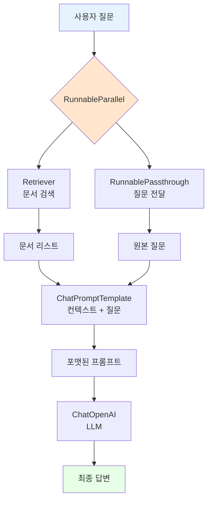

# 📖 Section 6.8: Stuff LCEL Chain - 투명한 체인 구현

## 🎯 학습 목표
- ✅ LCEL(LangChain Expression Language)을 사용한 투명한 체인 구현
- ✅ RunnablePassthrough와 병렬 실행(RunnableParallel)의 이해와 활용
- ✅ 커스터마이징 가능한 Stuff 전략 체인 구축
- ✅ 기존 "magical" chain 대비 LCEL의 장점과 투명성 이해

## 🧠 핵심 개념

### LCEL(LangChain Expression Language)이란?
**LCEL**은 LangChain의 표현 언어로, 체인의 각 구성 요소를 명시적으로 정의하여 투명하고 커스터마이징 가능한 체인을 구축할 수 있게 해줍니다.



### 기존 방식 vs LCEL 비교

| 특성 | RetrievalQA Chain | LCEL Chain |
|------|-------------------|------------|
| **투명성** | "Magical" 블랙박스 | 모든 단계 명시적 정의 |
| **커스터마이징** | 제한적 | 완전한 자유도 |
| **디버깅** | 어려움 | 각 단계별 추적 가능 |
| **성능** | 순차 실행 | 병렬 실행 최적화 |
| **학습 곡선** | 쉬움 (설정 최소) | 보통 (구조 이해 필요) |

### RunnablePassthrough의 역할
**RunnablePassthrough**는 입력값을 그대로 통과시켜 체인의 다른 부분으로 전달하는 유틸리티 클래스입니다.

```python
# 🧠 개념: 동일한 입력을 여러 곳에서 사용
input_text = "Winston은 어디에 살고 있나요?"

# RunnablePassthrough는 입력을 그대로 전달
passthrough_output = RunnablePassthrough().invoke(input_text)
# passthrough_output == "Winston은 어디에 살고 있나요?"
```

## 📋 주요 클래스/함수 레퍼런스

### LCEL 핵심 구성 요소
```python
from langchain.schema.runnable import RunnablePassthrough, RunnableParallel
from langchain.prompts import ChatPromptTemplate
from langchain.chat_models import ChatOpenAI

class RunnablePassthrough:
    def invoke(self, input_data):
        """
        📋 기능: 입력 데이터를 그대로 통과시킴
        📥 입력: 임의의 데이터
        📤 출력: 동일한 데이터
        💡 사용 시나리오: 동일한 입력을 체인의 여러 부분에서 사용
        """
        return input_data

class RunnableParallel:
    def __init__(self, **kwargs):
        """
        📋 기능: 여러 Runnable을 병렬로 실행
        📥 입력: 키-값 쌍의 Runnable 딕셔너리
        📤 출력: 각 Runnable의 결과를 담은 딕셔너리
        💡 사용 시나리오: 독립적인 작업들을 동시에 실행하여 성능 향상
        """
```

### ChatPromptTemplate 고급 사용법
```python
from langchain.prompts import ChatPromptTemplate

# RAG용 전용 프롬프트 템플릿
rag_prompt = ChatPromptTemplate.from_messages([
    ("system", """당신은 도움이 되는 AI 어시스턴트입니다. 
    주어진 컨텍스트만을 사용하여 질문에 답하세요.
    답을 모르면 모른다고 솔직히 말하고, 답을 지어내지 마세요.
    
    컨텍스트:
    {context}"""),
    ("human", "{question}")
])
```

## 🔧 동작 과정 상세

### 1단계: 기본 LCEL Stuff Chain 구현
```python
from langchain.schema.runnable import RunnablePassthrough
from langchain.prompts import ChatPromptTemplate
from langchain.chat_models import ChatOpenAI
from langchain.vectorstores import Chroma
from langchain.embeddings import OpenAIEmbeddings

# === 기본 LCEL Stuff Chain 구현 ===
# 🧠 개념: 투명하고 커스터마이징 가능한 체인 구축

print("🔗 LCEL Stuff Chain 구축:")
print("=" * 50)

# 🔧 1단계: 필요한 구성 요소 준비
llm = ChatOpenAI(
    model="gpt-3.5-turbo",
    temperature=0.1  # 📌 낮은 창의성으로 일관된 답변
)

# 기존 벡터 저장소에서 retriever 생성
embeddings = OpenAIEmbeddings()
vector_store = Chroma(
    persist_directory="./chroma_db",
    embedding_function=embeddings
)
retriever = vector_store.as_retriever()

# 🔧 2단계: RAG 전용 프롬프트 템플릿 생성
prompt = ChatPromptTemplate.from_messages([
    ("system", """당신은 도움이 되는 AI 어시스턴트입니다.
    아래 제공된 컨텍스트만을 사용하여 질문에 답변해주세요.
    
    답을 모르는 경우에는 솔직히 '모르겠습니다'라고 답변하고,
    답을 지어내지 마세요.
    
    컨텍스트:
    {context}"""),
    ("human", "{question}")
])

print("✅ 구성 요소 준비 완료")
print(f"   📊 LLM 모델: {llm.model_name}")
print(f"   📊 Temperature: {llm.temperature}")
print(f"   📊 Retriever 설정: k={retriever.search_kwargs.get('k', 4)}")

# 🔧 3단계: LCEL 체인 구성
# 핵심: 각 구성 요소를 명시적으로 연결
chain = (
    {
        "context": retriever,                    # 📌 입력 질문으로 관련 문서 검색
        "question": RunnablePassthrough()       # 📌 입력 질문을 그대로 전달
    }
    | prompt                                    # 📌 컨텍스트와 질문을 프롬프트에 포맷
    | llm                                       # 📌 포맷된 프롬프트를 LLM에 전달
)

print("✅ LCEL Chain 구성 완료")
print(f"   🔗 체인 구조: {{context: retriever, question: passthrough}} → prompt → llm")

# 🔧 4단계: 체인 테스트
test_questions = [
    "Winston Smith는 어디에 살고 있나요?",
    "Victory Mansions에 대해 설명해주세요",
    "Ministry of Love의 역할은 무엇인가요?"
]

for i, question in enumerate(test_questions, 1):
    print(f"\n{'='*20} 테스트 {i} {'='*20}")
    print(f"📋 질문: {question}")
    
    try:
        # LCEL 체인 실행
        start_time = time.time()
        response = chain.invoke(question)
        execution_time = time.time() - start_time
        
        print(f"🤖 답변: {response.content}")
        print(f"⏱️ 실행 시간: {execution_time:.2f}초")
        
    except Exception as e:
        print(f"❌ 오류 발생: {e}")

print("\n✅ 기본 LCEL Stuff Chain 테스트 완료!")
```

### 2단계: 고급 LCEL Chain (문서 품질 검증 포함)
```python
from langchain.schema.runnable import RunnableLambda
from typing import List, Dict, Any

# === 고급 LCEL Chain with 문서 품질 검증 ===
# 🧠 개념: 검색된 문서의 품질을 검증하여 답변 신뢰도 향상

def format_docs(docs: List) -> str:
    """
    📋 기능: 검색된 문서들을 읽기 좋은 형태로 포맷
    📥 입력: 문서 리스트
    📤 출력: 포맷된 문서 텍스트
    💡 사용 시나리오: 프롬프트에 포함할 컨텍스트 정리
    """
    if not docs:
        return "관련 문서를 찾을 수 없습니다."
    
    formatted_docs = []
    for i, doc in enumerate(docs, 1):
        content = doc.page_content.strip()
        # 문서가 너무 길면 처음 500자만 사용
        if len(content) > 500:
            content = content[:500] + "..."
        
        formatted_docs.append(f"[문서 {i}]\n{content}")
    
    return "\n\n".join(formatted_docs)

def filter_relevant_docs(docs: List, query: str, min_score: float = 0.7) -> List:
    """
    📋 기능: 관련성이 낮은 문서 필터링
    📥 입력: 문서 리스트, 질의, 최소 점수
    📤 출력: 필터링된 문서 리스트
    💡 사용 시나리오: 노이즈 문서 제거로 답변 품질 향상
    """
    # 실제 구현에서는 더 정교한 필터링 로직 사용
    # 여기서는 간단한 키워드 기반 필터링
    
    filtered_docs = []
    query_words = set(query.lower().split())
    
    for doc in docs:
        content_words = set(doc.page_content.lower().split())
        
        # 질의 단어와의 겹침 정도 계산
        intersection = len(query_words & content_words)
        similarity = intersection / len(query_words) if query_words else 0
        
        if similarity >= min_score or len(filtered_docs) == 0:  # 최소 1개는 유지
            filtered_docs.append(doc)
    
    return filtered_docs[:4]  # 최대 4개 문서만 사용

def create_retrieval_chain_with_quality_check() -> dict:
    """고급 검색 체인 생성 (문서 품질 검증 포함)"""
    
    def enhanced_retrieval(query: str) -> str:
        """품질 검증이 포함된 검색 함수"""
        # 1단계: 기본 검색
        raw_docs = retriever.get_relevant_documents(query)
        
        # 2단계: 관련성 필터링
        filtered_docs = filter_relevant_docs(raw_docs, query, min_score=0.3)
        
        # 3단계: 문서 포맷팅
        formatted_context = format_docs(filtered_docs)
        
        return formatted_context
    
    return RunnableLambda(enhanced_retrieval)

print("\n🔧 고급 LCEL Chain 구성:")
print("=" * 50)

# 고급 검색 체인 생성
enhanced_retriever = create_retrieval_chain_with_quality_check()

# 향상된 프롬프트 템플릿
enhanced_prompt = ChatPromptTemplate.from_messages([
    ("system", """당신은 문서 분석 전문가입니다. 
    제공된 컨텍스트를 주의 깊게 분석하여 정확한 답변을 제공하세요.
    
    답변 가이드라인:
    1. 제공된 컨텍스트에 기반해서만 답변하세요
    2. 확실하지 않은 정보는 추측하지 마세요
    3. 관련 문서가 부족하면 솔직히 말하세요
    4. 가능한 한 구체적이고 유용한 답변을 제공하세요
    
    컨텍스트:
    {context}
    
    위 컨텍스트가 질문과 관련이 없다면, "제공된 문서에서 해당 질문에 대한 정보를 찾을 수 없습니다"라고 답변하세요."""),
    ("human", "{question}")
])

# 고급 LCEL 체인 구성
enhanced_chain = (
    {
        "context": enhanced_retriever,
        "question": RunnablePassthrough()
    }
    | enhanced_prompt
    | llm
)

print("✅ 고급 LCEL Chain 구성 완료")

# 고급 체인 테스트
test_cases = [
    {
        "question": "Winston Smith의 직업은 무엇인가요?",
        "description": "구체적 사실 질문"
    },
    {
        "question": "소설에서 언급되지 않은 등장인물의 취미는?",
        "description": "문서에 없는 정보 질문 (불확실성 테스트)"
    },
    {
        "question": "1984년 소설의 전반적인 분위기는 어떤가요?",
        "description": "해석이 필요한 질문"
    }
]

for i, test_case in enumerate(test_cases, 1):
    print(f"\n{'='*25} 고급 테스트 {i} {'='*25}")
    print(f"📋 질문: {test_case['question']}")
    print(f"📝 유형: {test_case['description']}")
    
    try:
        start_time = time.time()
        response = enhanced_chain.invoke(test_case['question'])
        execution_time = time.time() - start_time
        
        print(f"🤖 답변: {response.content}")
        print(f"⏱️ 실행 시간: {execution_time:.2f}초")
        
        # 답변 품질 평가
        answer_length = len(response.content.split())
        has_uncertainty = any(phrase in response.content.lower() 
                            for phrase in ['모르겠', '찾을 수 없', 'not sure', "don't know"])
        
        print(f"📊 답변 길이: {answer_length} 단어")
        print(f"📊 불확실성 표현: {'있음' if has_uncertainty else '없음'}")
        
    except Exception as e:
        print(f"❌ 오류 발생: {e}")
```

### 3단계: 병렬 실행과 성능 최적화
```python
import asyncio
from langchain.schema.runnable import RunnableParallel
import time

# === 병렬 실행과 성능 분석 ===
# 🧠 개념: RunnableParallel의 성능 이점 측정

def create_parallel_analysis_chain():
    """병렬 실행 분석을 위한 체인 생성"""
    
    # 시간 측정용 래퍼 함수들
    def timed_retrieval(query: str) -> str:
        """시간 측정이 포함된 검색"""
        start = time.time()
        docs = retriever.get_relevant_documents(query)
        end = time.time()
        
        formatted = format_docs(docs)
        print(f"   🔍 검색 완료: {end - start:.3f}초")
        return formatted
    
    def timed_passthrough(query: str) -> str:
        """시간 측정이 포함된 passthrough"""
        start = time.time()
        result = query
        end = time.time()
        
        print(f"   ➡️ Passthrough 완료: {end - start:.3f}초")
        return result
    
    # 병렬 실행 체인
    parallel_chain = RunnableParallel(
        context=RunnableLambda(timed_retrieval),
        question=RunnableLambda(timed_passthrough)
    )
    
    return parallel_chain

def create_sequential_analysis_chain():
    """순차 실행 비교를 위한 체인 생성"""
    
    def sequential_processing(query: str) -> dict:
        """순차적 처리"""
        print("   📊 순차 실행 시작:")
        
        # 1단계: 검색
        start = time.time()
        docs = retriever.get_relevant_documents(query)
        context = format_docs(docs)
        end = time.time()
        print(f"   🔍 검색 완료: {end - start:.3f}초")
        
        # 2단계: Passthrough (인위적 지연 시뮬레이션)
        start = time.time()
        question = query
        end = time.time()
        print(f"   ➡️ Passthrough 완료: {end - start:.3f}초")
        
        return {
            "context": context,
            "question": question
        }
    
    return RunnableLambda(sequential_processing)

print("\n⚡ 병렬 vs 순차 실행 성능 비교:")
print("=" * 60)

# 테스트 질문
test_query = "Winston Smith의 일상생활은 어떤가요?"

# 병렬 실행 테스트
print(f"📋 테스트 질문: {test_query}")
print(f"\n🔄 병렬 실행 (RunnableParallel) 테스트:")

parallel_chain = create_parallel_analysis_chain()

start_time = time.time()
parallel_result = parallel_chain.invoke(test_query)
parallel_total_time = time.time() - start_time

print(f"   ✅ 병렬 실행 총 시간: {parallel_total_time:.3f}초")

# 순차 실행 테스트  
print(f"\n🔄 순차 실행 테스트:")

sequential_chain = create_sequential_analysis_chain()

start_time = time.time()
sequential_result = sequential_chain.invoke(test_query)
sequential_total_time = time.time() - start_time

print(f"   ✅ 순차 실행 총 시간: {sequential_total_time:.3f}초")

# 성능 비교
if sequential_total_time > 0:
    speedup = sequential_total_time / parallel_total_time
    efficiency = ((sequential_total_time - parallel_total_time) / sequential_total_time) * 100
    
    print(f"\n📈 성능 비교 결과:")
    print(f"   🚀 속도 향상: {speedup:.2f}배")
    print(f"   📊 효율성 개선: {efficiency:.1f}%")
    
    if speedup > 1.1:
        print(f"   💡 병렬 실행이 효과적입니다!")
    else:
        print(f"   💡 이 경우 병렬 실행 이점이 제한적입니다.")
```

### 4단계: 커스텀 체인 구성 요소 개발
```python
from langchain.schema.runnable import Runnable
from langchain.callbacks.manager import CallbackManagerForChainRun
from typing import Any, Dict, List, Optional

# === 커스텀 Runnable 구성 요소 개발 ===
# 🧠 개념: 특화된 기능을 가진 커스텀 구성 요소 생성

class ContextualRetriever(Runnable):
    """
    🎯 상황 인식 검색기
    
    특징:
    - 질문 유형에 따른 동적 검색 전략
    - 관련성 점수 기반 문서 필터링
    - 검색 결과 품질 최적화
    """
    
    def __init__(self, vector_store, default_k: int = 4):
        self.vector_store = vector_store
        self.retriever = vector_store.as_retriever()
        self.default_k = default_k
    
    def invoke(
        self, 
        input_data: str, 
        config: Optional[Dict] = None,
        **kwargs: Any
    ) -> str:
        """상황에 맞는 지능형 검색 수행"""
        
        query = input_data
        
        # 질문 유형 분석
        question_type = self._analyze_question_type(query)
        
        # 질문 유형에 따른 검색 전략 선택
        search_params = self._get_search_params(question_type)
        
        print(f"   🔍 질문 유형: {question_type}")
        print(f"   ⚙️ 검색 설정: {search_params}")
        
        # 검색 실행
        docs = self.vector_store.similarity_search(
            query, 
            k=search_params['k']
        )
        
        # 결과 후처리
        filtered_docs = self._post_process_docs(docs, query, question_type)
        
        # 포맷팅
        formatted_context = self._format_context(filtered_docs, question_type)
        
        return formatted_context
    
    def _analyze_question_type(self, query: str) -> str:
        """질문 유형 자동 분류"""
        
        query_lower = query.lower()
        
        # 패턴 기반 분류
        if any(word in query_lower for word in ['누구', 'who', '인물', '등장인물']):
            return "character"
        elif any(word in query_lower for word in ['어디', 'where', '장소', '위치']):
            return "location"
        elif any(word in query_lower for word in ['언제', 'when', '시간', '시기']):
            return "time"
        elif any(word in query_lower for word in ['무엇', 'what', '설명', 'describe']):
            return "description"
        elif any(word in query_lower for word in ['왜', 'why', '이유', '원인']):
            return "explanation"
        elif any(word in query_lower for word in ['어떻게', 'how', '방법', '과정']):
            return "process"
        else:
            return "general"
    
    def _get_search_params(self, question_type: str) -> Dict[str, Any]:
        """질문 유형별 최적 검색 매개변수"""
        
        params_map = {
            "character": {"k": 3},  # 인물 정보는 적은 문서로도 충분
            "location": {"k": 2},   # 장소 정보도 집중된 검색
            "time": {"k": 3},       # 시간 정보
            "description": {"k": 4}, # 설명은 더 많은 컨텍스트 필요
            "explanation": {"k": 5}, # 설명/분석은 풍부한 컨텍스트
            "process": {"k": 4},    # 과정 설명
            "general": {"k": 4}     # 일반적인 질문
        }
        
        return params_map.get(question_type, {"k": self.default_k})
    
    def _post_process_docs(self, docs: List, query: str, question_type: str) -> List:
        """검색 결과 후처리"""
        
        # 중복 제거
        unique_docs = []
        seen_contents = set()
        
        for doc in docs:
            content_hash = hash(doc.page_content[:100])  # 처음 100자 기준 중복 체크
            if content_hash not in seen_contents:
                unique_docs.append(doc)
                seen_contents.add(content_hash)
        
        # 질문 유형별 추가 필터링
        if question_type == "character":
            # 인물 관련 질문은 인물명이 포함된 문서 우선
            character_docs = [doc for doc in unique_docs if self._contains_character_info(doc.page_content)]
            if character_docs:
                unique_docs = character_docs[:3]
        
        return unique_docs[:5]  # 최대 5개 문서
    
    def _contains_character_info(self, content: str) -> bool:
        """문서가 인물 정보를 포함하는지 확인"""
        character_indicators = ['said', '말했', 'thought', '생각했', 'felt', '느꼈']
        return any(indicator in content.lower() for indicator in character_indicators)
    
    def _format_context(self, docs: List, question_type: str) -> str:
        """질문 유형에 따른 컨텍스트 포맷팅"""
        
        if not docs:
            return f"[{question_type} 유형 질문에 대한 관련 문서를 찾을 수 없습니다.]"
        
        formatted_parts = []
        for i, doc in enumerate(docs, 1):
            content = doc.page_content.strip()
            
            # 질문 유형별 내용 길이 조절
            max_length = {
                "character": 300,
                "location": 250,
                "description": 400,
                "explanation": 500,
                "general": 350
            }.get(question_type, 350)
            
            if len(content) > max_length:
                content = content[:max_length] + "..."
            
            formatted_parts.append(f"[참고자료 {i}]\n{content}")
        
        return "\n\n".join(formatted_parts)

class SmartPromptTemplate(Runnable):
    """
    🎯 지능형 프롬프트 템플릿
    
    특징:
    - 질문 유형에 따른 동적 프롬프트 조정
    - 컨텍스트 품질에 따른 지시사항 변경
    - 답변 품질 향상을 위한 맞춤형 지침
    """
    
    def __init__(self):
        self.base_templates = self._create_base_templates()
    
    def invoke(self, input_data: Dict, config: Optional[Dict] = None, **kwargs) -> List:
        """입력에 따른 동적 프롬프트 생성"""
        
        context = input_data.get("context", "")
        question = input_data.get("question", "")
        
        # 질문 유형 분석
        question_type = self._analyze_question_type(question)
        
        # 컨텍스트 품질 평가
        context_quality = self._assess_context_quality(context, question)
        
        # 적절한 프롬프트 선택
        prompt_template = self._select_prompt_template(question_type, context_quality)
        
        # 프롬프트 생성
        messages = prompt_template.format_messages(context=context, question=question)
        
        return messages
    
    def _create_base_templates(self) -> Dict[str, ChatPromptTemplate]:
        """기본 프롬프트 템플릿들"""
        
        return {
            "high_quality": ChatPromptTemplate.from_messages([
                ("system", """당신은 문학 작품 분석 전문가입니다.
                제공된 고품질 컨텍스트를 바탕으로 정확하고 상세한 답변을 제공하세요.
                
                컨텍스트:
                {context}"""),
                ("human", "{question}")
            ]),
            
            "medium_quality": ChatPromptTemplate.from_messages([
                ("system", """당신은 도움이 되는 AI 어시스턴트입니다.
                제공된 컨텍스트를 주의깊게 분석하여 답변하세요.
                정보가 부족한 부분은 솔직히 인정하세요.
                
                컨텍스트:
                {context}"""),
                ("human", "{question}")
            ]),
            
            "low_quality": ChatPromptTemplate.from_messages([
                ("system", """당신은 신중한 AI 어시스턴트입니다.
                제공된 컨텍스트가 제한적일 수 있으니, 확실한 정보만 답변하세요.
                추측하지 말고, 불확실한 경우 솔직히 말하세요.
                
                컨텍스트:
                {context}"""),
                ("human", "{question}")
            ])
        }
    
    def _analyze_question_type(self, question: str) -> str:
        """질문 유형 분석 (ContextualRetriever와 동일한 로직)"""
        query_lower = question.lower()
        
        if any(word in query_lower for word in ['누구', 'who', '인물']):
            return "character"
        elif any(word in query_lower for word in ['어디', 'where', '장소']):
            return "location"
        elif any(word in query_lower for word in ['설명', 'describe', '어떤']):
            return "description"
        elif any(word in query_lower for word in ['왜', 'why', '이유']):
            return "explanation"
        else:
            return "general"
    
    def _assess_context_quality(self, context: str, question: str) -> str:
        """컨텍스트 품질 평가"""
        
        if "관련 문서를 찾을 수 없습니다" in context:
            return "low_quality"
        
        # 컨텍스트 길이 기준
        context_length = len(context.split())
        
        # 질문과 컨텍스트의 관련성 체크
        question_words = set(question.lower().split())
        context_words = set(context.lower().split())
        relevance = len(question_words & context_words) / max(len(question_words), 1)
        
        if context_length > 200 and relevance > 0.3:
            return "high_quality"
        elif context_length > 100 and relevance > 0.2:
            return "medium_quality"
        else:
            return "low_quality"
    
    def _select_prompt_template(self, question_type: str, context_quality: str) -> ChatPromptTemplate:
        """질문 유형과 컨텍스트 품질에 따른 프롬프트 선택"""
        
        return self.base_templates[context_quality]

# === 커스텀 구성 요소를 사용한 고급 LCEL Chain ===
print("\n🚀 커스텀 구성 요소 기반 고급 LCEL Chain:")
print("=" * 60)

# 커스텀 구성 요소 초기화
contextual_retriever = ContextualRetriever(vector_store)
smart_prompt = SmartPromptTemplate()

# 고급 커스텀 체인 구성
advanced_custom_chain = (
    {
        "context": contextual_retriever,
        "question": RunnablePassthrough()
    }
    | smart_prompt
    | llm
)

print("✅ 커스텀 LCEL Chain 구성 완료")

# 다양한 질문 유형으로 테스트
advanced_test_cases = [
    "Winston Smith는 누구인가요?",        # character
    "Winston은 어디에 살고 있나요?",       # location  
    "Victory Mansions를 설명해주세요",     # description
    "Winston이 일기를 쓰는 이유는 무엇인가요?",  # explanation
    "존재하지 않는 등장인물의 이름은?",     # 정보 부족 상황
]

for i, question in enumerate(advanced_test_cases, 1):
    print(f"\n{'='*15} 커스텀 체인 테스트 {i} {'='*15}")
    print(f"📋 질문: {question}")
    
    try:
        start_time = time.time()
        response = advanced_custom_chain.invoke(question)
        execution_time = time.time() - start_time
        
        print(f"🤖 답변: {response.content}")
        print(f"⏱️ 실행 시간: {execution_time:.2f}초")
        
    except Exception as e:
        print(f"❌ 오류 발생: {e}")

print("\n✅ 커스텀 LCEL Chain 테스트 완료!")
```

## 💻 실전 예제

### 프로덕션 급 LCEL Document GPT
```python
from typing import Optional, Dict, Any, List
import logging
from langchain.callbacks import get_openai_callback
from langchain.schema.runnable import Runnable, RunnablePassthrough
import json
import time

class ProductionLCELDocumentGPT:
    """
    🎯 프로덕션 환경용 LCEL Document GPT
    
    주요 기능:
    - 모듈식 구성 요소 설계
    - 에러 처리 및 복구
    - 성능 모니터링
    - 확장 가능한 아키텍처
    - 상세 로깅 및 디버깅
    """
    
    def __init__(self, 
                 vector_store,
                 llm_config: Dict[str, Any] = None,
                 retriever_config: Dict[str, Any] = None,
                 enable_monitoring: bool = True):
        
        self.vector_store = vector_store
        self.enable_monitoring = enable_monitoring
        
        # 설정 초기화
        self.llm_config = llm_config or {"model": "gpt-3.5-turbo", "temperature": 0.1}
        self.retriever_config = retriever_config or {"k": 4, "score_threshold": 0.7}
        
        # 구성 요소 초기화
        self._initialize_components()
        
        # 모니터링 설정
        if enable_monitoring:
            logging.basicConfig(level=logging.INFO)
            self.logger = logging.getLogger(__name__)
            self.metrics = {
                "total_queries": 0,
                "successful_queries": 0,
                "avg_response_time": 0.0,
                "total_cost": 0.0,
                "error_count": 0
            }
        
        # 체인 구성
        self.chain = self._build_chain()
    
    def _initialize_components(self):
        """핵심 구성 요소 초기화"""
        
        # LLM 초기화
        self.llm = ChatOpenAI(**self.llm_config)
        
        # Retriever 초기화
        self.retriever = self.vector_store.as_retriever(
            search_kwargs=self.retriever_config
        )
        
        # 프롬프트 템플릿
        self.prompt_template = ChatPromptTemplate.from_messages([
            ("system", """당신은 전문적인 문서 분석 AI입니다.
            
            제공된 컨텍스트를 바탕으로 정확하고 도움이 되는 답변을 해주세요:
            
            지침:
            1. 제공된 컨텍스트만을 사용하여 답변하세요
            2. 정보가 불충분하면 솔직히 인정하세요
            3. 추측이나 가정은 하지 마세요
            4. 구체적이고 실용적인 답변을 제공하세요
            
            컨텍스트:
            {context}"""),
            ("human", "{question}")
        ])
    
    def _build_chain(self) -> Runnable:
        """LCEL 체인 구성"""
        
        # 에러 처리가 포함된 retriever 래퍼
        def safe_retrieval(query: str) -> str:
            try:
                docs = self.retriever.get_relevant_documents(query)
                if not docs:
                    return "관련 문서를 찾을 수 없습니다."
                
                # 문서 포맷팅
                formatted_docs = []
                for i, doc in enumerate(docs[:4], 1):  # 최대 4개
                    content = doc.page_content.strip()
                    if len(content) > 500:
                        content = content[:500] + "..."
                    formatted_docs.append(f"[문서 {i}]\n{content}")
                
                return "\n\n".join(formatted_docs)
                
            except Exception as e:
                if self.enable_monitoring:
                    self.logger.error(f"Retrieval error: {e}")
                return f"문서 검색 중 오류가 발생했습니다: {str(e)}"
        
        # LCEL 체인 구성
        chain = (
            {
                "context": RunnableLambda(safe_retrieval),
                "question": RunnablePassthrough()
            }
            | self.prompt_template
            | self.llm
        )
        
        return chain
    
    def ask(self, 
            question: str,
            include_metadata: bool = False,
            timeout: float = 30.0) -> Dict[str, Any]:
        """
        📋 기능: 질문에 대한 답변 생성
        📥 입력: 질문, 메타데이터 포함 여부, 타임아웃
        📤 출력: 답변과 메타데이터
        """
        
        start_time = time.time()
        
        # 메트릭 업데이트
        if self.enable_monitoring:
            self.metrics["total_queries"] += 1
            self.logger.info(f"Processing query: {question[:50]}...")
        
        try:
            # 비용 추적
            if self.enable_monitoring:
                with get_openai_callback() as cb:
                    response = self.chain.invoke(question)
                    cost = cb.total_cost
                    input_tokens = cb.prompt_tokens
                    output_tokens = cb.completion_tokens
            else:
                response = self.chain.invoke(question)
                cost = 0.0
                input_tokens = 0
                output_tokens = 0
            
            # 실행 시간 계산
            execution_time = time.time() - start_time
            
            # 성공 메트릭 업데이트
            if self.enable_monitoring:
                self.metrics["successful_queries"] += 1
                self.metrics["total_cost"] += cost
                
                # 평균 응답 시간 업데이트
                total_queries = self.metrics["total_queries"]
                current_avg = self.metrics["avg_response_time"]
                self.metrics["avg_response_time"] = (
                    (current_avg * (total_queries - 1) + execution_time) / total_queries
                )
            
            # 결과 구성
            result = {
                "answer": response.content,
                "success": True,
                "execution_time": execution_time
            }
            
            if include_metadata:
                result.update({
                    "cost": cost,
                    "input_tokens": input_tokens,
                    "output_tokens": output_tokens,
                    "model": self.llm_config["model"],
                    "timestamp": time.time()
                })
            
            return result
            
        except Exception as e:
            # 에러 메트릭 업데이트
            if self.enable_monitoring:
                self.metrics["error_count"] += 1
                self.logger.error(f"Query failed: {e}")
            
            return {
                "error": str(e),
                "success": False,
                "execution_time": time.time() - start_time
            }
    
    def batch_ask(self, 
                  questions: List[str],
                  include_metadata: bool = False,
                  max_concurrent: int = 3) -> List[Dict[str, Any]]:
        """
        📋 기능: 여러 질문 배치 처리
        📥 입력: 질문 리스트, 메타데이터 포함 여부, 최대 동시 실행 수
        📤 출력: 각 질문별 결과 리스트
        """
        
        results = []
        batch_start = time.time()
        
        if self.enable_monitoring:
            self.logger.info(f"Starting batch processing: {len(questions)} questions")
        
        for i, question in enumerate(questions, 1):
            if self.enable_monitoring:
                self.logger.info(f"Processing {i}/{len(questions)}: {question[:30]}...")
            
            result = self.ask(question, include_metadata=include_metadata)
            results.append(result)
            
            # 진행 상황 출력
            if i % 5 == 0 or i == len(questions):
                success_count = sum(1 for r in results if r.get('success', False))
                print(f"📊 진행: {i}/{len(questions)} (성공: {success_count})")
        
        batch_time = time.time() - batch_start
        success_count = sum(1 for r in results if r.get('success', False))
        
        if self.enable_monitoring:
            self.logger.info(f"Batch completed: {success_count}/{len(questions)} successful, "
                           f"Total time: {batch_time:.2f}s")
        
        return results
    
    def get_performance_report(self) -> Dict[str, Any]:
        """성능 리포트 생성"""
        
        if not self.enable_monitoring:
            return {"error": "Monitoring is disabled"}
        
        success_rate = (
            self.metrics["successful_queries"] / max(self.metrics["total_queries"], 1) * 100
        )
        
        return {
            "summary": {
                "total_queries": self.metrics["total_queries"],
                "successful_queries": self.metrics["successful_queries"],
                "success_rate": f"{success_rate:.1f}%",
                "total_cost": f"${self.metrics['total_cost']:.6f}",
                "avg_response_time": f"{self.metrics['avg_response_time']:.3f}s",
                "error_count": self.metrics["error_count"]
            },
            "configuration": {
                "llm_model": self.llm_config["model"],
                "temperature": self.llm_config["temperature"],
                "retriever_k": self.retriever_config["k"]
            },
            "recommendations": self._generate_recommendations()
        }
    
    def _generate_recommendations(self) -> List[str]:
        """성능 기반 추천사항 생성"""
        
        recommendations = []
        
        # 성공률 기반
        success_rate = self.metrics["successful_queries"] / max(self.metrics["total_queries"], 1)
        if success_rate < 0.9:
            recommendations.append("성공률이 낮습니다. 에러 로그를 확인하세요.")
        
        # 응답 시간 기반
        if self.metrics["avg_response_time"] > 10.0:
            recommendations.append("응답 시간이 깁니다. Retriever 설정을 최적화하세요.")
        
        # 비용 기반
        if self.metrics["total_cost"] > 1.0:
            recommendations.append("비용이 높습니다. 캐싱이나 더 저렴한 모델을 고려하세요.")
        
        # 에러율 기반
        error_rate = self.metrics["error_count"] / max(self.metrics["total_queries"], 1)
        if error_rate > 0.1:
            recommendations.append("에러율이 높습니다. 입력 검증을 강화하세요.")
        
        return recommendations or ["성능이 양호합니다."]
    
    def update_configuration(self, **kwargs):
        """설정 동적 업데이트"""
        
        updated = False
        
        # LLM 설정 업데이트
        if 'temperature' in kwargs:
            self.llm_config['temperature'] = kwargs['temperature']
            updated = True
        
        # Retriever 설정 업데이트
        if 'retriever_k' in kwargs:
            self.retriever_config['k'] = kwargs['retriever_k']
            updated = True
        
        if updated:
            # 구성 요소 재초기화
            self._initialize_components()
            self.chain = self._build_chain()
            
            if self.enable_monitoring:
                self.logger.info(f"Configuration updated: {kwargs}")

# === 프로덕션 LCEL Document GPT 사용 예시 ===
print("\n🚀 프로덕션 LCEL Document GPT 시스템:")
print("=" * 60)

# 시스템 초기화
prod_gpt = ProductionLCELDocumentGPT(
    vector_store=vector_store,
    llm_config={
        "model": "gpt-3.5-turbo",
        "temperature": 0.1
    },
    retriever_config={
        "k": 4,
        "score_threshold": 0.7
    },
    enable_monitoring=True
)

# 개별 질의 테스트
test_questions = [
    "Winston Smith의 직업은 무엇인가요?",
    "1984년 소설의 배경은 어디인가요?",
    "Big Brother는 누구인가요?",
    "존재하지 않는 정보에 대한 질문입니다."  # 에러 처리 테스트
]

print("\n📝 개별 질의 테스트:")
for i, question in enumerate(test_questions, 1):
    print(f"\n📋 질의 {i}: {question}")
    
    result = prod_gpt.ask(question, include_metadata=True)
    
    if result['success']:
        print(f"🤖 답변: {result['answer'][:100]}...")
        print(f"⏱️ 시간: {result['execution_time']:.2f}초")
        print(f"💰 비용: ${result['cost']:.6f}")
    else:
        print(f"❌ 오류: {result['error']}")

# 배치 처리 테스트
print(f"\n🔄 배치 처리 테스트:")
batch_questions = test_questions[:3]  # 처음 3개만
batch_results = prod_gpt.batch_ask(batch_questions, include_metadata=True)

# 성능 리포트
print(f"\n📈 성능 리포트:")
report = prod_gpt.get_performance_report()

print(f"📊 요약:")
for key, value in report['summary'].items():
    print(f"   {key}: {value}")

print(f"\n💡 추천사항:")
for rec in report['recommendations']:
    print(f"   - {rec}")

print("\n✅ 프로덕션 LCEL Document GPT 테스트 완료!")
```

## 🔍 변수/함수 상세 설명

### LCEL 핵심 함수들

#### RunnablePassthrough 활용 패턴
```python
from langchain.schema.runnable import RunnablePassthrough

# 기본 사용법
def basic_passthrough_usage():
    """RunnablePassthrough 기본 활용"""
    
    # 단순 전달
    passthrough = RunnablePassthrough()
    result = passthrough.invoke("Hello World")
    # result == "Hello World"
    
    # 체인에서 활용
    chain = {
        "original": RunnablePassthrough(),
        "processed": RunnableLambda(lambda x: x.upper())
    }
    
    result = chain.invoke("hello")
    # result == {"original": "hello", "processed": "HELLO"}

def advanced_passthrough_patterns():
    """고급 RunnablePassthrough 패턴"""
    
    # 변환과 함께 사용
    def add_metadata(text: str) -> Dict[str, str]:
        return {
            "content": text,
            "length": len(text),
            "timestamp": time.time()
        }
    
    # 복합 체인
    complex_chain = {
        "raw_input": RunnablePassthrough(),
        "metadata": RunnableLambda(add_metadata),
        "processed": RunnableLambda(lambda x: x.strip().title())
    }
    
    return complex_chain

# 조건부 Passthrough
def conditional_passthrough(condition_func):
    """조건에 따른 선택적 전달"""
    
    def conditional_invoke(input_data):
        if condition_func(input_data):
            return input_data
        else:
            return None  # 또는 기본값
    
    return RunnableLambda(conditional_invoke)
```

#### 체인 디버깅 및 모니터링
```python
from langchain.callbacks import BaseCallbackHandler
import json

class LCELDebugCallback(BaseCallbackHandler):
    """LCEL 체인 실행 과정 디버깅"""
    
    def __init__(self, verbose: bool = True):
        self.verbose = verbose
        self.execution_log = []
    
    def on_chain_start(self, serialized: Dict[str, Any], inputs: Dict[str, Any], **kwargs):
        if self.verbose:
            print(f"🔗 체인 시작: {serialized.get('name', 'Unknown')}")
            print(f"📥 입력: {str(inputs)[:100]}...")
        
        self.execution_log.append({
            "type": "chain_start",
            "name": serialized.get('name'),
            "inputs": inputs,
            "timestamp": time.time()
        })
    
    def on_chain_end(self, outputs: Dict[str, Any], **kwargs):
        if self.verbose:
            print(f"✅ 체인 완료")
            print(f"📤 출력: {str(outputs)[:100]}...")
        
        self.execution_log.append({
            "type": "chain_end",
            "outputs": outputs,
            "timestamp": time.time()
        })
    
    def on_llm_start(self, serialized: Dict[str, Any], prompts: List[str], **kwargs):
        if self.verbose:
            print(f"🤖 LLM 호출: {serialized.get('name')}")
            print(f"📝 프롬프트 수: {len(prompts)}")
    
    def on_llm_end(self, response, **kwargs):
        if self.verbose:
            print(f"🤖 LLM 완료: {len(response.generations)} 응답")
    
    def get_execution_summary(self) -> Dict[str, Any]:
        """실행 요약 생성"""
        
        if not self.execution_log:
            return {"message": "실행 기록이 없습니다."}
        
        start_time = self.execution_log[0]["timestamp"]
        end_time = self.execution_log[-1]["timestamp"]
        total_time = end_time - start_time
        
        chain_steps = len([log for log in self.execution_log if log["type"] == "chain_start"])
        
        return {
            "total_execution_time": f"{total_time:.3f}초",
            "chain_steps": chain_steps,
            "start_time": time.ctime(start_time),
            "end_time": time.ctime(end_time),
            "detailed_log": self.execution_log
        }

def create_debuggable_chain(retriever, llm) -> tuple:
    """디버깅 가능한 체인과 콜백 생성"""
    
    debug_callback = LCELDebugCallback(verbose=True)
    
    # 디버깅이 포함된 체인
    chain = (
        {
            "context": retriever,
            "question": RunnablePassthrough()
        }
        | ChatPromptTemplate.from_messages([
            ("system", "Context: {context}"),
            ("human", "{question}")
        ])
        | llm
    )
    
    return chain, debug_callback

# 사용 예시
debuggable_chain, debug_cb = create_debuggable_chain(retriever, llm)

# 디버그 모드로 실행
result = debuggable_chain.invoke(
    "테스트 질문", 
    config={"callbacks": [debug_cb]}
)

# 실행 요약 확인
summary = debug_cb.get_execution_summary()
print(json.dumps(summary, indent=2, ensure_ascii=False))
```

### 성능 최적화 도구
```python
def benchmark_lcel_vs_traditional(retriever, llm, test_queries: List[str]) -> Dict[str, Any]:
    """
    📋 기능: LCEL vs 전통적 체인 성능 비교
    📥 입력: 검색기, LLM, 테스트 쿼리들
    📤 출력: 성능 비교 리포트
    """
    
    # LCEL 체인
    lcel_chain = (
        {
            "context": retriever,
            "question": RunnablePassthrough()
        }
        | ChatPromptTemplate.from_messages([
            ("system", "Context: {context}"),
            ("human", "{question}")
        ])
        | llm
    )
    
    # 전통적 RetrievalQA 체인
    traditional_chain = RetrievalQA.from_chain_type(
        llm=llm,
        chain_type="stuff",
        retriever=retriever
    )
    
    results = {
        "lcel": {"times": [], "success": 0, "errors": []},
        "traditional": {"times": [], "success": 0, "errors": []}
    }
    
    # LCEL 테스트
    print("🔗 LCEL 체인 테스트 중...")
    for query in test_queries:
        try:
            start = time.time()
            lcel_chain.invoke(query)
            results["lcel"]["times"].append(time.time() - start)
            results["lcel"]["success"] += 1
        except Exception as e:
            results["lcel"]["errors"].append(str(e))
    
    # 전통적 체인 테스트
    print("🔗 전통적 체인 테스트 중...")
    for query in test_queries:
        try:
            start = time.time()
            traditional_chain.run(query)
            results["traditional"]["times"].append(time.time() - start)
            results["traditional"]["success"] += 1
        except Exception as e:
            results["traditional"]["errors"].append(str(e))
    
    # 결과 분석
    lcel_avg = sum(results["lcel"]["times"]) / max(len(results["lcel"]["times"]), 1)
    traditional_avg = sum(results["traditional"]["times"]) / max(len(results["traditional"]["times"]), 1)
    
    return {
        "query_count": len(test_queries),
        "lcel_performance": {
            "avg_time": f"{lcel_avg:.3f}초",
            "success_rate": f"{results['lcel']['success'] / len(test_queries) * 100:.1f}%",
            "error_count": len(results["lcel"]["errors"])
        },
        "traditional_performance": {
            "avg_time": f"{traditional_avg:.3f}초", 
            "success_rate": f"{results['traditional']['success'] / len(test_queries) * 100:.1f}%",
            "error_count": len(results["traditional"]["errors"])
        },
        "comparison": {
            "speed_difference": f"{'LCEL이' if lcel_avg < traditional_avg else '전통적 방식이'} "
                              f"{abs(lcel_avg - traditional_avg):.3f}초 빠름",
            "winner": "LCEL" if lcel_avg < traditional_avg else "Traditional"
        }
    }
```

## 🧪 실습 과제

### 🔨 기본 과제
1. **커스텀 Runnable 개발**: 특화된 기능을 가진 커스텀 Runnable 클래스 구현
```python
# TODO: 질문 전처리를 담당하는 커스텀 Runnable 구현
class QuestionPreprocessor(Runnable):
    def invoke(self, input_data):
        # 질문 정제, 오타 수정, 형식 통일 등
        pass
```

2. **조건부 체인**: 입력에 따라 다른 처리 경로를 선택하는 동적 체인 구현
```python
# TODO: 질문 복잡도에 따라 다른 검색 전략을 선택하는 체인
def create_adaptive_chain(simple_retriever, complex_retriever, llm):
    # 질문 분석 후 적절한 retriever 선택
    pass
```

### 🚀 심화 과제
3. **스트리밍 LCEL 체인**: 실시간 응답 스트리밍이 가능한 체인 구현
```python
# TODO: 토큰 단위로 실시간 응답을 스트리밍하는 LCEL 체인
async def create_streaming_chain():
    # 스트리밍 가능한 체인 구성
    pass
```

4. **멀티모달 LCEL 체인**: 텍스트와 이미지를 함께 처리하는 체인 구현
```python
# TODO: 문서의 텍스트와 이미지를 모두 활용하는 멀티모달 체인
class MultimodalDocumentChain:
    def process_text_and_images(self, query, text_docs, image_docs):
        pass
```

### 💡 창의 과제
5. **자가 개선 체인**: 사용자 피드백을 학습하여 성능을 개선하는 체인
```python
# TODO: 사용자 평점을 수집하여 프롬프트나 검색 전략을 자동 개선
class SelfImprovingChain:
    def learn_from_feedback(self, query, answer, user_rating):
        pass
```

6. **체인 앙상블**: 여러 LCEL 체인의 결과를 조합하는 앙상블 시스템
```python
# TODO: 다양한 전략의 체인 결과를 가중 평균하여 최종 답변 생성
class ChainEnsemble:
    def combine_chain_outputs(self, outputs, weights):
        pass
```

## ⚠️ 주의사항

### LCEL 설계 원칙
```python
# ✅ 올바른 LCEL 체인 설계
def good_lcel_chain():
    return (
        {"context": retriever, "question": RunnablePassthrough()}  # 명확한 구조
        | prompt_template                                           # 단계별 분리
        | llm                                                      # 체인의 마지막
    )

# ❌ 잘못된 LCEL 체인 설계
def bad_lcel_chain():
    # 복잡하고 이해하기 어려운 중첩 구조
    return (
        {
            "nested": {
                "context": retriever,
                "meta": {"question": RunnablePassthrough()}
            }
        }
        | complex_transform
        | another_transform
        | prompt_template
        | llm
    )
```

### 에러 처리 패턴
- **Graceful Degradation**: 구성 요소 실패시 부분적 기능 제공
- **명시적 에러 처리**: 각 단계별 예외 상황 처리
- **사용자 친화적 메시지**: 기술적 오류를 이해하기 쉽게 변환

### 성능 고려사항
```python
# 성능 최적화 가이드라인
performance_tips = {
    "병렬화": "독립적인 작업은 RunnableParallel 사용",
    "캐싱": "반복되는 연산 결과 캐싱",
    "배치처리": "여러 요청을 배치로 처리",
    "지연로딩": "필요한 시점에만 리소스 로딩",
    "스트리밍": "긴 응답의 경우 스트리밍 적용"
}
```

### 디버깅 전략
- **단계별 검증**: 각 구성 요소의 입출력 확인
- **로깅 활용**: 실행 과정 상세 기록
- **콜백 활용**: 중간 단계 모니터링
- **테스트 케이스**: 다양한 시나리오로 검증

## 🔗 관련 자료
- **이전 학습**: [6.6 RetrievalQA](./6.6_RetrievalQA.md)
- **다음 학습**: [6.9 Map Reduce LCEL Chain](./6.9_Map_Reduce_LCEL_Chain.md)
- **참고 문서**: [LCEL Documentation](https://python.langchain.com/docs/expression_language/)
- **고급 패턴**: [LCEL Cookbook](https://python.langchain.com/docs/expression_language/cookbook/)
- **실습 파일**: [6.8 Stuff LCEL Chain.ipynb](../../00%20lecture/6.8%20Stuff%20LCEL%20Chain.ipynb)

---

💡 **핵심 정리**: LCEL(LangChain Expression Language)은 투명하고 커스터마이징 가능한 체인을 구축할 수 있게 해주는 강력한 도구입니다. RunnablePassthrough와 RunnableParallel을 활용하여 효율적이고 모니터링 가능한 체인을 구성할 수 있으며, 기존의 "magical" chain보다 더 나은 제어와 디버깅 기능을 제공합니다. 프로덕션 환경에서는 에러 처리, 성능 모니터링, 설정 관리가 중요합니다.