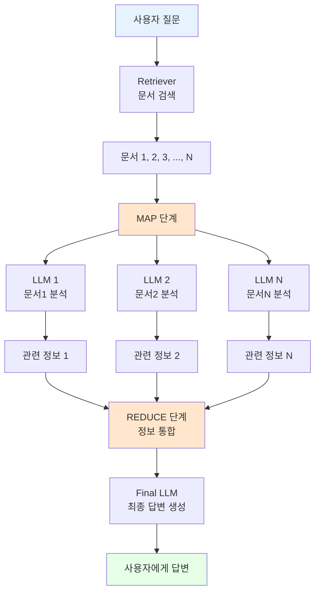

# 📖 Section 6.9: Map Reduce LCEL Chain - 대용량 문서 처리의 해답

## 🎯 학습 목표
- ✅ Map-Reduce 패턴을 LCEL로 수동 구현하여 동작 원리 완전 이해
- ✅ RunnableLambda를 활용한 커스텀 함수의 체인 통합 방법 습득
- ✅ 대용량 문서 처리 시나리오에서의 최적화 전략 학습
- ✅ 비용과 성능을 고려한 Map-Reduce 전략의 실전 활용법 이해

## 🧠 핵심 개념

### Map-Reduce 패턴이란?
**Map-Reduce**는 대용량 데이터를 효율적으로 처리하기 위한 분산 컴퓨팅 패러다임으로, LangChain에서는 많은 문서를 개별적으로 처리한 후 결과를 종합하는 전략입니다.



### Stuff vs Map-Reduce 비교

| 특성 | Stuff 전략 | Map-Reduce 전략 |
|------|------------|-----------------|
| **문서 수 제한** | 토큰 제한에 의존 | 거의 제한 없음 |
| **LLM 호출 수** | 1회 | N+1회 (N=문서 수) |
| **처리 속도** | 빠름 | 느림 (순차 처리) |
| **비용** | 낮음 | 높음 (호출 수에 비례) |
| **정보 보존** | 제한적 (토큰 제한) | 우수 (단계별 추출) |
| **적합 상황** | 소수 문서 | 대량 문서 |

### LCEL Map-Reduce 아키텍처
```python
# 전체 체인 구조 개요
final_chain = (
    {
        "context": map_chain,           # MAP: 문서별 정보 추출 후 통합
        "question": RunnablePassthrough() # 원본 질문 전달
    }
    | final_prompt                      # REDUCE: 통합된 정보로 최종 답변
    | llm
)

# map_chain 내부 구조
map_chain = (
    {
        "documents": retriever,         # 관련 문서들 검색
        "question": RunnablePassthrough() # 질문 전달
    }
    | RunnableLambda(map_documents)     # 커스텀 맵핑 함수
)
```

## 📋 주요 클래스/함수 레퍼런스

### RunnableLambda
```python
from langchain.schema.runnable import RunnableLambda

class RunnableLambda:
    def __init__(self, func: Callable):
        """
        📋 기능: 임의의 Python 함수를 Runnable로 변환
        📥 입력: 호출 가능한 함수
        📤 출력: LCEL 체인에서 사용 가능한 Runnable
        💡 사용 시나리오: 커스텀 로직을 체인에 통합할 때
        
        예시:
        def custom_function(input_data):
            return process(input_data)
        
        runnable = RunnableLambda(custom_function)
        """

# Map-Reduce 전용 함수 시그니처
def map_documents(inputs: Dict[str, Any]) -> str:
    """
    📋 기능: 문서 리스트를 개별 처리하여 관련 정보 추출 후 통합
    📥 입력: {"documents": List[Document], "question": str}
    📤 출력: 통합된 관련 정보 문자열
    """
```

### Map-Reduce 전용 프롬프트 템플릿
```python
# MAP 단계용 프롬프트
map_doc_prompt = ChatPromptTemplate.from_messages([
    ("system", """다음 문서의 일부를 사용하여 질문에 답하는 데 
    관련이 있는 텍스트가 있는지 확인하세요.
    
    관련된 텍스트가 있다면 그대로 반환하세요 (축어적으로).
    관련된 정보가 없다면 '관련 정보 없음'이라고 답하세요.
    
    문서 내용:
    {context}"""),
    ("human", "{question}")
])

# REDUCE 단계용 프롬프트  
final_prompt = ChatPromptTemplate.from_messages([
    ("system", """긴 문서에서 추출된 다음 정보들과 질문을 바탕으로 
    최종 답변을 작성하세요.
    
    답을 모르면 솔직히 모른다고 말하고, 추측하지 마세요.
    
    추출된 정보:
    {context}"""),
    ("human", "{question}")
])
```

## 🔧 동작 과정 상세

### 1단계: 기본 Map-Reduce LCEL Chain 구현
```python
from langchain.schema.runnable import RunnableLambda, RunnablePassthrough
from langchain.prompts import ChatPromptTemplate
from langchain.chat_models import ChatOpenAI
from langchain.vectorstores import Chroma
from langchain.embeddings import OpenAIEmbeddings
from typing import Dict, List, Any

# === 기본 Map-Reduce LCEL Chain 구현 ===
# 🧠 개념: 대용량 문서 처리를 위한 분산 처리 패턴

print("🗺️ Map-Reduce LCEL Chain 구축:")
print("=" * 50)

# 🔧 1단계: 기본 구성 요소 설정
llm = ChatOpenAI(
    model="gpt-3.5-turbo",
    temperature=0.1
)

# 벡터 저장소 및 retriever 설정
embeddings = OpenAIEmbeddings()
vector_store = Chroma(
    persist_directory="./chroma_db",
    embedding_function=embeddings
)
retriever = vector_store.as_retriever(search_kwargs={"k": 5})  # 더 많은 문서 검색

print("✅ 기본 구성 요소 준비 완료")

# 🔧 2단계: MAP 단계용 프롬프트와 체인
map_doc_prompt = ChatPromptTemplate.from_messages([
    ("system", """다음 문서 부분을 검토하여 주어진 질문에 답하는 데 
    도움이 되는 정보가 있는지 확인하세요.
    
    관련 있는 텍스트가 있다면 정확히 그대로 반환하세요.
    관련 없다면 "관련 정보 없음"이라고 응답하세요.
    
    문서 내용:
    {context}"""),
    ("human", "질문: {question}")
])

# 개별 문서 처리용 체인
map_doc_chain = map_doc_prompt | llm

print("✅ MAP 단계 체인 준비 완료")

# 🔧 3단계: MAP 함수 구현 (핵심 로직)
def map_documents(inputs: Dict[str, Any]) -> str:
    """
    📋 기능: 각 문서에서 관련 정보를 추출하여 통합
    🔄 과정: 문서 개수만큼 LLM을 호출하여 정보 추출
    """
    
    documents = inputs["documents"]
    question = inputs["question"]
    
    print(f"   🔍 MAP 단계: {len(documents)}개 문서 처리 중...")
    
    # 각 문서별로 관련 정보 추출
    extracted_info = []
    
    for i, document in enumerate(documents, 1):
        print(f"   📄 문서 {i}/{len(documents)} 처리 중...")
        
        try:
            # 개별 문서를 map_doc_chain으로 처리
            response = map_doc_chain.invoke({
                "context": document.page_content,
                "question": question
            })
            
            # AI 응답에서 텍스트 추출
            extracted_text = response.content.strip()
            
            # "관련 정보 없음" 등의 불필요한 응답 필터링
            if (extracted_text and 
                "관련 정보 없음" not in extracted_text and 
                "관련이 없" not in extracted_text.lower() and
                len(extracted_text) > 10):  # 의미있는 길이의 응답만
                
                extracted_info.append(f"[문서 {i}에서 추출]\n{extracted_text}")
                print(f"   ✅ 관련 정보 발견: {extracted_text[:50]}...")
            else:
                print(f"   ⚠️ 관련 정보 없음")
                
        except Exception as e:
            print(f"   ❌ 문서 {i} 처리 오류: {e}")
            continue
    
    # 추출된 정보들을 하나의 문서로 통합
    if extracted_info:
        combined_context = "\n\n".join(extracted_info)
        print(f"   📊 MAP 완료: {len(extracted_info)}개 문서에서 정보 추출")
        return combined_context
    else:
        print(f"   ⚠️ 어떤 문서에서도 관련 정보를 찾지 못했습니다")
        return "제공된 문서들에서 질문과 관련된 정보를 찾을 수 없습니다."

print("✅ MAP 함수 구현 완료")

# 🔧 4단계: REDUCE 단계용 프롬프트
final_prompt = ChatPromptTemplate.from_messages([
    ("system", """여러 문서에서 추출된 다음 정보들을 종합하여 
    사용자의 질문에 대한 완전하고 정확한 답변을 제공하세요.
    
    지침:
    1. 추출된 정보만을 사용하여 답변하세요
    2. 여러 문서의 정보를 논리적으로 종합하세요
    3. 확실하지 않은 내용은 추측하지 마세요
    4. 가능한 한 구체적이고 유용한 답변을 제공하세요
    
    추출된 정보:
    {context}"""),
    ("human", "{question}")
])

print("✅ REDUCE 단계 프롬프트 준비 완료")

# 🔧 5단계: 전체 Map-Reduce 체인 구성
map_reduce_chain = (
    {
        "context": (
            {
                "documents": retriever,
                "question": RunnablePassthrough()
            }
            | RunnableLambda(map_documents)
        ),
        "question": RunnablePassthrough()
    }
    | final_prompt
    | llm
)

print("✅ Map-Reduce LCEL Chain 구성 완료")

# 🔧 6단계: 체인 테스트
test_questions = [
    "Winston Smith는 어디에서 일하나요?",
    "Victory Mansions에 대해 자세히 설명해주세요",
    "Ministry of Truth의 역할은 무엇인가요?"
]

for i, question in enumerate(test_questions, 1):
    print(f"\n{'='*20} Map-Reduce 테스트 {i} {'='*20}")
    print(f"📋 질문: {question}")
    
    try:
        import time
        start_time = time.time()
        
        # Map-Reduce 체인 실행
        response = map_reduce_chain.invoke(question)
        
        execution_time = time.time() - start_time
        
        print(f"🤖 답변: {response.content}")
        print(f"⏱️ 실행 시간: {execution_time:.2f}초")
        
    except Exception as e:
        print(f"❌ 오류 발생: {e}")

print("\n✅ 기본 Map-Reduce LCEL Chain 테스트 완료!")
```

### 2단계: 최적화된 Map-Reduce Chain (병렬 처리)
```python
import asyncio
from concurrent.futures import ThreadPoolExecutor, as_completed
import time
from typing import List, Dict, Any

# === 병렬 처리 최적화된 Map-Reduce Chain ===
# 🧠 개념: 문서별 처리를 병렬화하여 성능 향상

class OptimizedMapReduceChain:
    """
    🎯 최적화된 Map-Reduce 체인
    
    특징:
    - 병렬 문서 처리로 성능 향상
    - 에러 복구 및 재시도 로직
    - 진행 상황 모니터링
    - 비용 및 시간 추적
    """
    
    def __init__(self, 
                 llm,
                 retriever,
                 max_workers: int = 3,
                 timeout: float = 30.0):
        
        self.llm = llm
        self.retriever = retriever
        self.max_workers = max_workers
        self.timeout = timeout
        
        # 프롬프트 초기화
        self._initialize_prompts()
        
        # 성능 메트릭
        self.metrics = {
            "total_queries": 0,
            "total_documents_processed": 0,
            "avg_map_time": 0.0,
            "avg_reduce_time": 0.0
        }
    
    def _initialize_prompts(self):
        """프롬프트 템플릿 초기화"""
        
        self.map_prompt = ChatPromptTemplate.from_messages([
            ("system", """이 문서 부분에서 질문과 관련된 핵심 정보를 찾아주세요:

            규칙:
            1. 질문과 직접 관련된 정보만 추출하세요
            2. 원문을 그대로 인용하되, 핵심 부분만 선별하세요  
            3. 관련 정보가 없으면 "정보 없음"이라고 답하세요
            4. 추측이나 해석은 하지 마세요
            
            문서:
            {context}"""),
            ("human", "질문: {question}")
        ])
        
        self.reduce_prompt = ChatPromptTemplate.from_messages([
            ("system", """여러 문서에서 수집된 정보를 종합하여 질문에 답하세요:
            
            지침:
            1. 모든 관련 정보를 통합하여 완전한 답변을 작성하세요
            2. 일관성 있게 정보를 정리하세요
            3. 중복된 정보는 한 번만 언급하세요
            4. 불확실한 부분은 명시하세요
            
            수집된 정보:
            {context}"""),
            ("human", "{question}")
        ])
    
    def _process_single_document(self, doc_data: Dict[str, Any]) -> Dict[str, Any]:
        """단일 문서 처리 (스레드에서 실행)"""
        
        document = doc_data["document"]
        question = doc_data["question"]
        doc_index = doc_data["index"]
        
        try:
            start_time = time.time()
            
            # MAP 체인으로 문서 처리
            chain = self.map_prompt | self.llm
            response = chain.invoke({
                "context": document.page_content,
                "question": question
            })
            
            processing_time = time.time() - start_time
            
            # 결과 평가
            extracted_text = response.content.strip()
            
            is_relevant = (
                len(extracted_text) > 10 and
                "정보 없음" not in extracted_text and
                "관련 없" not in extracted_text.lower() and
                "없습니다" not in extracted_text
            )
            
            return {
                "index": doc_index,
                "content": extracted_text if is_relevant else "",
                "is_relevant": is_relevant,
                "processing_time": processing_time,
                "success": True
            }
            
        except Exception as e:
            return {
                "index": doc_index,
                "content": "",
                "is_relevant": False,
                "processing_time": 0,
                "error": str(e),
                "success": False
            }
    
    def _parallel_map_phase(self, documents: List, question: str) -> List[str]:
        """병렬 MAP 단계 실행"""
        
        print(f"   🔄 병렬 MAP 시작: {len(documents)}개 문서, {self.max_workers}개 워커")
        
        # 문서별 작업 데이터 준비
        doc_tasks = [
            {
                "document": doc,
                "question": question,
                "index": i
            }
            for i, doc in enumerate(documents)
        ]
        
        relevant_extracts = []
        
        # 병렬 처리 실행
        with ThreadPoolExecutor(max_workers=self.max_workers) as executor:
            # 모든 작업 제출
            future_to_doc = {
                executor.submit(self._process_single_document, doc_data): doc_data["index"]
                for doc_data in doc_tasks
            }
            
            # 완료된 작업들 수집
            completed = 0
            for future in as_completed(future_to_doc, timeout=self.timeout):
                doc_index = future_to_doc[future]
                completed += 1
                
                try:
                    result = future.result()
                    
                    if result["success"] and result["is_relevant"]:
                        relevant_extracts.append(
                            f"[문서 {doc_index + 1}]\n{result['content']}"
                        )
                        print(f"   ✅ 문서 {doc_index + 1}: 관련 정보 추출 ({result['processing_time']:.2f}초)")
                    else:
                        print(f"   ⚠️ 문서 {doc_index + 1}: 관련 정보 없음")
                        
                    # 진행 상황 업데이트
                    if completed % max(1, len(documents) // 4) == 0:
                        progress = (completed / len(documents)) * 100
                        print(f"   📊 진행률: {progress:.1f}% ({completed}/{len(documents)})")
                        
                except Exception as e:
                    print(f"   ❌ 문서 {doc_index + 1} 처리 실패: {e}")
        
        print(f"   📊 MAP 완료: {len(relevant_extracts)}개 문서에서 정보 추출")
        return relevant_extracts
    
    def process_query(self, question: str) -> Dict[str, Any]:
        """전체 Map-Reduce 처리"""
        
        total_start = time.time()
        
        print(f"🚀 Map-Reduce 처리 시작: '{question[:50]}...'")
        
        try:
            # 1단계: 문서 검색
            print("📖 관련 문서 검색 중...")
            documents = self.retriever.get_relevant_documents(question)
            print(f"   📊 검색된 문서 수: {len(documents)}")
            
            if not documents:
                return {
                    "answer": "관련 문서를 찾을 수 없습니다.",
                    "success": False,
                    "total_time": time.time() - total_start
                }
            
            # 2단계: 병렬 MAP 단계
            map_start = time.time()
            relevant_extracts = self._parallel_map_phase(documents, question)
            map_time = time.time() - map_start
            
            if not relevant_extracts:
                return {
                    "answer": "검색된 문서들에서 질문과 관련된 정보를 찾을 수 없습니다.",
                    "success": False,
                    "map_time": map_time,
                    "total_time": time.time() - total_start
                }
            
            # 3단계: REDUCE 단계
            print("🔗 REDUCE 단계: 정보 통합 및 최종 답변 생성")
            reduce_start = time.time()
            
            # 추출된 정보들을 하나로 통합
            combined_context = "\n\n".join(relevant_extracts)
            
            # 최종 답변 생성
            final_chain = self.reduce_prompt | self.llm
            final_response = final_chain.invoke({
                "context": combined_context,
                "question": question
            })
            
            reduce_time = time.time() - reduce_start
            total_time = time.time() - total_start
            
            # 메트릭 업데이트
            self.metrics["total_queries"] += 1
            self.metrics["total_documents_processed"] += len(documents)
            self.metrics["avg_map_time"] = (
                (self.metrics["avg_map_time"] * (self.metrics["total_queries"] - 1) + map_time) 
                / self.metrics["total_queries"]
            )
            self.metrics["avg_reduce_time"] = (
                (self.metrics["avg_reduce_time"] * (self.metrics["total_queries"] - 1) + reduce_time)
                / self.metrics["total_queries"]
            )
            
            return {
                "answer": final_response.content,
                "success": True,
                "documents_found": len(documents),
                "relevant_documents": len(relevant_extracts),
                "map_time": map_time,
                "reduce_time": reduce_time,
                "total_time": total_time
            }
            
        except Exception as e:
            return {
                "answer": f"처리 중 오류 발생: {str(e)}",
                "success": False,
                "total_time": time.time() - total_start,
                "error": str(e)
            }
    
    def get_performance_summary(self) -> Dict[str, Any]:
        """성능 요약 정보 반환"""
        
        return {
            "총_질의_수": self.metrics["total_queries"],
            "총_처리_문서_수": self.metrics["total_documents_processed"],
            "평균_MAP_시간": f"{self.metrics['avg_map_time']:.2f}초",
            "평균_REDUCE_시간": f"{self.metrics['avg_reduce_time']:.2f}초",
            "문서당_평균_처리시간": f"{self.metrics['avg_map_time'] / max(1, self.metrics['total_documents_processed'] / max(1, self.metrics['total_queries'])):.3f}초"
        }

# === 최적화된 Map-Reduce 체인 사용 예시 ===
print("\n🚀 최적화된 Map-Reduce 체인 테스트:")
print("=" * 60)

# 최적화된 체인 초기화
optimized_chain = OptimizedMapReduceChain(
    llm=llm,
    retriever=retriever,
    max_workers=3,  # 병렬 처리 워커 수
    timeout=30.0
)

# 복잡한 질문들로 테스트
complex_questions = [
    "Winston Smith의 일상생활과 직업에 대해 종합적으로 설명해주세요",
    "1984년 소설에 등장하는 정부 기관들의 역할과 기능을 비교해주세요",
    "Victory Mansions의 환경과 거주민들의 생활상을 자세히 묘사해주세요"
]

for i, question in enumerate(complex_questions, 1):
    print(f"\n{'='*15} 최적화 테스트 {i} {'='*15}")
    print(f"📋 질문: {question}")
    
    result = optimized_chain.process_query(question)
    
    if result["success"]:
        print(f"🤖 답변: {result['answer'][:200]}...")
        print(f"📊 통계:")
        print(f"   📖 검색 문서: {result['documents_found']}개")
        print(f"   ✅ 관련 문서: {result['relevant_documents']}개") 
        print(f"   ⏱️ MAP 시간: {result['map_time']:.2f}초")
        print(f"   ⏱️ REDUCE 시간: {result['reduce_time']:.2f}초")
        print(f"   ⏱️ 총 시간: {result['total_time']:.2f}초")
    else:
        print(f"❌ 실패: {result['answer']}")

# 성능 요약
print(f"\n📈 성능 요약:")
summary = optimized_chain.get_performance_summary()
for key, value in summary.items():
    print(f"   {key}: {value}")

print("\n✅ 최적화된 Map-Reduce 체인 테스트 완료!")
```

### 3단계: 스마트 Map-Reduce (비용 최적화)
```python
from langchain.callbacks import get_openai_callback
import json

# === 비용 최적화 Map-Reduce Chain ===
# 🧠 개념: 토큰 사용량과 비용을 최소화하는 지능형 전략

class CostOptimizedMapReduceChain:
    """
    🎯 비용 최적화된 Map-Reduce 체인
    
    최적화 전략:
    - 문서 사전 필터링으로 불필요한 LLM 호출 제거
    - 동적 청크 크기 조절
    - 단계적 처리로 비용 예측
    - 예산 기반 처리 제한
    """
    
    def __init__(self, 
                 llm,
                 retriever,
                 max_budget: float = 1.0,  # 달러 단위
                 cost_per_1k_tokens: float = 0.002):  # GPT-3.5-turbo 기준
        
        self.llm = llm
        self.retriever = retriever
        self.max_budget = max_budget
        self.cost_per_1k_tokens = cost_per_1k_tokens
        
        self.spent_budget = 0.0
        
        # 프롬프트 최적화 (토큰 효율적)
        self._initialize_optimized_prompts()
    
    def _initialize_optimized_prompts(self):
        """토큰 효율적인 프롬프트 초기화"""
        
        # 간결한 MAP 프롬프트
        self.map_prompt = ChatPromptTemplate.from_messages([
            ("system", "문서에서 질문 관련 핵심 정보만 추출. 없으면 'NONE'."),
            ("human", "문서: {context}\n질문: {question}\n핵심 정보:")
        ])
        
        # 간결한 REDUCE 프롬프트
        self.reduce_prompt = ChatPromptTemplate.from_messages([
            ("system", "추출 정보로 질문에 답변. 간결하고 정확하게."),
            ("human", "정보: {context}\n질문: {question}\n답변:")
        ])
    
    def _estimate_tokens(self, text: str) -> int:
        """텍스트의 대략적인 토큰 수 추정"""
        # 간단한 추정: 문자 수 / 4 (영어 기준)
        return len(text) // 4
    
    def _estimate_cost(self, input_tokens: int, output_tokens: int = 150) -> float:
        """비용 추정"""
        total_tokens = input_tokens + output_tokens
        return (total_tokens / 1000) * self.cost_per_1k_tokens
    
    def _prefilter_documents(self, documents: List, question: str) -> List:
        """키워드 기반 문서 사전 필터링"""
        
        # 질문에서 키워드 추출 (간단한 방법)
        question_words = set(question.lower().split())
        stop_words = {'은', '는', '이', '가', '을', '를', '에', '의', 'the', 'a', 'an', 'and', 'or'}
        keywords = question_words - stop_words
        
        if not keywords:
            return documents[:3]  # 키워드가 없으면 처음 3개만
        
        # 문서별 관련성 점수 계산
        scored_docs = []
        for doc in documents:
            content_words = set(doc.page_content.lower().split())
            relevance_score = len(keywords & content_words) / len(keywords)
            
            if relevance_score > 0:  # 최소 1개 키워드는 포함
                scored_docs.append((doc, relevance_score))
        
        # 관련성 점수순 정렬
        scored_docs.sort(key=lambda x: x[1], reverse=True)
        
        # 상위 문서들만 선택 (최대 5개)
        filtered_docs = [doc for doc, score in scored_docs[:5]]
        
        print(f"   🔍 사전 필터링: {len(documents)}개 → {len(filtered_docs)}개")
        return filtered_docs
    
    def _smart_map_phase(self, documents: List, question: str) -> tuple:
        """예산을 고려한 스마트 MAP 단계"""
        
        print(f"   💰 현재 예산: ${self.max_budget - self.spent_budget:.4f} 남음")
        
        extracted_info = []
        total_cost = 0.0
        processed_count = 0
        
        with get_openai_callback() as cb:
            for i, doc in enumerate(documents):
                # 비용 사전 체크
                input_text = f"문서: {doc.page_content}\n질문: {question}\n핵심 정보:"
                estimated_tokens = self._estimate_tokens(input_text)
                estimated_cost = self._estimate_cost(estimated_tokens)
                
                # 예산 초과 체크
                if self.spent_budget + total_cost + estimated_cost > self.max_budget:
                    print(f"   ⚠️ 예산 제한으로 문서 {i+1} 이후 처리 중단")
                    break
                
                try:
                    # MAP 체인 실행
                    chain = self.map_prompt | self.llm
                    response = chain.invoke({
                        "context": doc.page_content[:1000],  # 길이 제한
                        "question": question
                    })
                    
                    extracted_text = response.content.strip()
                    
                    # 유용한 정보인지 확인
                    if (len(extracted_text) > 5 and 
                        "NONE" not in extracted_text.upper() and
                        "없" not in extracted_text):
                        
                        extracted_info.append(f"[{i+1}] {extracted_text}")
                        print(f"   ✅ 문서 {i+1}: 정보 추출")
                    else:
                        print(f"   ⚠️ 문서 {i+1}: 관련 정보 없음")
                    
                    processed_count += 1
                    
                except Exception as e:
                    print(f"   ❌ 문서 {i+1} 처리 오류: {e}")
                    continue
        
            # 실제 사용 비용 기록
            actual_cost = cb.total_cost
            total_cost = actual_cost
        
        return extracted_info, total_cost, processed_count
    
    def process_with_budget_control(self, question: str) -> Dict[str, Any]:
        """예산 통제 하에서 Map-Reduce 처리"""
        
        print(f"💰 비용 최적화 Map-Reduce 시작")
        print(f"   📊 최대 예산: ${self.max_budget:.4f}")
        
        total_start = time.time()
        
        try:
            # 1단계: 문서 검색
            documents = self.retriever.get_relevant_documents(question)
            print(f"   📖 검색된 문서: {len(documents)}개")
            
            # 2단계: 사전 필터링
            filtered_docs = self._prefilter_documents(documents, question)
            
            # 3단계: 스마트 MAP 단계
            map_start = time.time()
            extracted_info, map_cost, processed_docs = self._smart_map_phase(
                filtered_docs, question
            )
            map_time = time.time() - map_start
            
            self.spent_budget += map_cost
            
            if not extracted_info:
                return {
                    "answer": "관련 정보를 찾을 수 없습니다.",
                    "success": False,
                    "cost": map_cost,
                    "processed_documents": processed_docs
                }
            
            # 4단계: REDUCE 단계
            reduce_start = time.time()
            
            # 정보 통합
            combined_context = "\n".join(extracted_info)
            
            # 예산 체크
            reduce_input = f"정보: {combined_context}\n질문: {question}\n답변:"
            estimated_reduce_cost = self._estimate_cost(
                self._estimate_tokens(reduce_input)
            )
            
            if self.spent_budget + estimated_reduce_cost > self.max_budget:
                return {
                    "answer": "예산 부족으로 최종 답변 생성 불가",
                    "success": False,
                    "cost": map_cost,
                    "processed_documents": processed_docs
                }
            
            # 최종 답변 생성
            with get_openai_callback() as cb:
                final_chain = self.reduce_prompt | self.llm
                final_response = final_chain.invoke({
                    "context": combined_context,
                    "question": question
                })
                reduce_cost = cb.total_cost
            
            self.spent_budget += reduce_cost
            reduce_time = time.time() - reduce_start
            total_time = time.time() - total_start
            
            return {
                "answer": final_response.content,
                "success": True,
                "cost": {
                    "map_cost": map_cost,
                    "reduce_cost": reduce_cost,
                    "total_cost": map_cost + reduce_cost
                },
                "processed_documents": processed_docs,
                "remaining_budget": self.max_budget - self.spent_budget,
                "time": {
                    "map_time": map_time,
                    "reduce_time": reduce_time,
                    "total_time": total_time
                }
            }
            
        except Exception as e:
            return {
                "answer": f"처리 오류: {str(e)}",
                "success": False,
                "error": str(e)
            }

# === 비용 최적화 체인 테스트 ===
print("\n💰 비용 최적화 Map-Reduce 체인 테스트:")
print("=" * 60)

# 비용 최적화 체인 초기화
cost_chain = CostOptimizedMapReduceChain(
    llm=llm,
    retriever=retriever,
    max_budget=0.50,  # $0.50 예산
    cost_per_1k_tokens=0.002
)

# 테스트 질문들
budget_test_questions = [
    "Winston Smith는 누구인가요?",
    "Victory Mansions의 특징은 무엇인가요?",
    "Ministry of Truth에서 하는 일은 무엇인가요?"
]

for i, question in enumerate(budget_test_questions, 1):
    print(f"\n📋 테스트 {i}: {question}")
    
    result = cost_chain.process_with_budget_control(question)
    
    if result["success"]:
        print(f"🤖 답변: {result['answer'][:150]}...")
        print(f"💰 비용 정보:")
        print(f"   MAP 비용: ${result['cost']['map_cost']:.6f}")
        print(f"   REDUCE 비용: ${result['cost']['reduce_cost']:.6f}")
        print(f"   총 비용: ${result['cost']['total_cost']:.6f}")
        print(f"   남은 예산: ${result['remaining_budget']:.6f}")
        print(f"📊 처리 문서: {result['processed_documents']}개")
    else:
        print(f"❌ 실패: {result['answer']}")
        if 'cost' in result:
            print(f"💰 사용 비용: ${result['cost']:.6f}")

print(f"\n💰 최종 예산 사용: ${cost_chain.spent_budget:.6f} / ${cost_chain.max_budget:.6f}")

print("\n✅ 비용 최적화 Map-Reduce 체인 테스트 완료!")
```

## 💻 실전 예제

### Meeting GPT용 Map-Reduce 시스템
```python
from typing import List, Dict, Any, Optional
import re
from dataclasses import dataclass
from datetime import datetime

# === Meeting GPT를 위한 전문 Map-Reduce 시스템 ===
# 🧠 개념: 회의록 요약에 특화된 Map-Reduce 구현

@dataclass
class MeetingSegment:
    """회의 세그먼트 데이터 구조"""
    timestamp: str
    speaker: str
    content: str
    duration: Optional[float] = None

class MeetingMapReduceProcessor:
    """
    🎯 회의록 처리 전문 Map-Reduce 시스템
    
    특화 기능:
    - 발언자별 내용 정리
    - 시간대별 논의 주제 분석
    - 액션 아이템 자동 추출
    - 결정사항 정리
    """
    
    def __init__(self, llm):
        self.llm = llm
        self._initialize_meeting_prompts()
    
    def _initialize_meeting_prompts(self):
        """회의록 전용 프롬프트 초기화"""
        
        # 회의 세그먼트 분석용 MAP 프롬프트
        self.segment_analysis_prompt = ChatPromptTemplate.from_messages([
            ("system", """회의 세그먼트를 분석하여 다음을 추출하세요:

            1. 주요 논의 내용 (핵심 포인트 3개 이내)
            2. 결정된 사항 (있는 경우)
            3. 액션 아이템 (담당자와 함께)
            4. 후속 논의 필요 사항

            형식:
            **논의내용:** [내용]
            **결정사항:** [결정사항 또는 '없음']
            **액션아이템:** [아이템 또는 '없음']  
            **후속논의:** [사항 또는 '없음']

            회의 세그먼트:
            {segment}"""),
            ("human", "위 세그먼트를 분석해주세요.")
        ])
        
        # 전체 회의 요약용 REDUCE 프롬프트
        self.meeting_summary_prompt = ChatPromptTemplate.from_messages([
            ("system", """회의 세그먼트들의 분석 결과를 종합하여 
            완전한 회의 요약을 작성하세요:

            요약 구조:
            # 회의 요약
            
            ## 📋 주요 논의 사항
            [핵심 논의 내용들을 주제별로 정리]
            
            ## ✅ 결정 사항  
            [회의에서 내려진 결정들을 번호별로 정리]
            
            ## 📝 액션 아이템
            [담당자와 일정을 포함한 액션 아이템들]
            
            ## 🔄 후속 조치
            [다음 회의나 추가 논의가 필요한 사항들]
            
            분석된 세그먼트들:
            {segments_analysis}"""),
            ("human", "위 정보들을 종합하여 회의 요약을 작성해주세요.")
        ])
    
    def _parse_meeting_transcript(self, transcript: str) -> List[MeetingSegment]:
        """회의록을 세그먼트로 파싱"""
        
        segments = []
        lines = transcript.strip().split('\n')
        
        current_speaker = None
        current_content = []
        current_timestamp = None
        
        for line in lines:
            line = line.strip()
            if not line:
                continue
            
            # 타임스탬프 패턴 감지 (예: [00:15:30])
            timestamp_match = re.match(r'\[(\d{2}:\d{2}:\d{2})\]', line)
            if timestamp_match:
                current_timestamp = timestamp_match.group(1)
                continue
            
            # 발언자 패턴 감지 (예: "김대리:" 또는 "Speaker A:")
            speaker_match = re.match(r'^([^:]+):\s*(.*)$', line)
            if speaker_match:
                # 이전 발언자 내용 저장
                if current_speaker and current_content:
                    segments.append(MeetingSegment(
                        timestamp=current_timestamp or "00:00:00",
                        speaker=current_speaker,
                        content=' '.join(current_content)
                    ))
                
                # 새로운 발언자
                current_speaker = speaker_match.group(1).strip()
                current_content = [speaker_match.group(2).strip()] if speaker_match.group(2).strip() else []
            else:
                # 현재 발언자의 계속된 내용
                if current_speaker:
                    current_content.append(line)
        
        # 마지막 발언자 처리
        if current_speaker and current_content:
            segments.append(MeetingSegment(
                timestamp=current_timestamp or "00:00:00", 
                speaker=current_speaker,
                content=' '.join(current_content)
            ))
        
        return segments
    
    def _group_segments_by_topic(self, segments: List[MeetingSegment]) -> List[List[MeetingSegment]]:
        """관련된 세그먼트들을 그룹화"""
        
        # 간단한 그룹화: 발언자 변경이나 시간 간격을 기준
        groups = []
        current_group = []
        
        for segment in segments:
            if not current_group:
                current_group = [segment]
            else:
                # 같은 화자가 연속으로 말하거나, 짧은 간격인 경우 같은 그룹
                last_segment = current_group[-1]
                
                # 시간 차이 계산 (간단한 구현)
                if (segment.speaker == last_segment.speaker or 
                    len(current_group) < 3):  # 최소 그룹 크기
                    current_group.append(segment)
                else:
                    # 새로운 그룹 시작
                    groups.append(current_group)
                    current_group = [segment]
        
        if current_group:
            groups.append(current_group)
        
        return groups
    
    def _format_segment_group(self, segments: List[MeetingSegment]) -> str:
        """세그먼트 그룹을 텍스트로 포맷팅"""
        
        formatted_parts = []
        for segment in segments:
            formatted_parts.append(
                f"[{segment.timestamp}] {segment.speaker}: {segment.content}"
            )
        
        return '\n'.join(formatted_parts)
    
    def process_meeting_transcript(self, transcript: str) -> Dict[str, Any]:
        """회의록 전체 처리"""
        
        print("📋 회의록 Map-Reduce 처리 시작")
        
        try:
            # 1단계: 트랜스크립트 파싱
            print("   🔍 트랜스크립트 파싱 중...")
            segments = self._parse_meeting_transcript(transcript)
            print(f"   📊 파싱된 세그먼트: {len(segments)}개")
            
            if not segments:
                return {
                    "summary": "파싱할 수 있는 회의 내용이 없습니다.",
                    "success": False
                }
            
            # 2단계: 세그먼트 그룹화
            print("   📂 세그먼트 그룹화 중...")
            segment_groups = self._group_segments_by_topic(segments)
            print(f"   📊 그룹 수: {len(segment_groups)}개")
            
            # 3단계: MAP 단계 - 각 그룹별 분석
            print("   🗺️ MAP 단계: 그룹별 분석 중...")
            group_analyses = []
            
            for i, group in enumerate(segment_groups, 1):
                print(f"   📝 그룹 {i}/{len(segment_groups)} 분석 중...")
                
                formatted_segment = self._format_segment_group(group)
                
                try:
                    chain = self.segment_analysis_prompt | self.llm
                    analysis = chain.invoke({"segment": formatted_segment})
                    
                    group_analyses.append({
                        "group_index": i,
                        "timespan": f"{group[0].timestamp} - {group[-1].timestamp}",
                        "speakers": list(set(seg.speaker for seg in group)),
                        "analysis": analysis.content
                    })
                    
                    print(f"   ✅ 그룹 {i} 분석 완료")
                    
                except Exception as e:
                    print(f"   ❌ 그룹 {i} 분석 실패: {e}")
                    continue
            
            # 4단계: REDUCE 단계 - 전체 요약
            print("   🔗 REDUCE 단계: 전체 요약 생성 중...")
            
            # 모든 분석 결과를 하나로 결합
            combined_analysis = "\n\n".join([
                f"그룹 {analysis['group_index']} ({analysis['timespan']}):\n{analysis['analysis']}"
                for analysis in group_analyses
            ])
            
            # 최종 요약 생성
            summary_chain = self.meeting_summary_prompt | self.llm
            final_summary = summary_chain.invoke({
                "segments_analysis": combined_analysis
            })
            
            # 발언자 통계 생성
            speaker_stats = {}
            for segment in segments:
                speaker_stats[segment.speaker] = speaker_stats.get(segment.speaker, 0) + 1
            
            return {
                "summary": final_summary.content,
                "success": True,
                "statistics": {
                    "total_segments": len(segments),
                    "total_groups": len(segment_groups),
                    "speakers": speaker_stats,
                    "duration_estimate": f"약 {len(segments) * 1.5:.0f}분"  # 세그먼트당 평균 1.5분 추정
                },
                "group_analyses": group_analyses
            }
            
        except Exception as e:
            return {
                "summary": f"회의록 처리 중 오류 발생: {str(e)}",
                "success": False,
                "error": str(e)
            }

# === Meeting GPT Map-Reduce 사용 예시 ===
print("\n📋 Meeting GPT Map-Reduce 시스템 테스트:")
print("=" * 60)

# 샘플 회의록 데이터
sample_transcript = """
[00:02:15]
김과장: 안녕하세요, 오늘 프로젝트 진행 상황 회의를 시작하겠습니다. 먼저 개발팀 현황부터 들어보겠습니다.

[00:02:45] 
이개발자: 네, 현재 API 개발은 80% 완료되었고, 이번 주 금요일까지는 완료될 예정입니다. 다만 데이터베이스 연동 부분에서 성능 이슈가 있어서 박DBA님과 협의가 필요합니다.

[00:03:20]
박DBA: 성능 이슈는 인덱스 최적화로 해결 가능합니다. 내일까지 작업 완료하겠습니다. 이개발자님과 내일 오후 2시에 미팅 잡겠습니다.

[00:04:00]
김과장: 좋습니다. 그러면 UI 개발은 어떤가요?

[00:04:15]
최디자이너: UI 목업은 완료되었고, 프론트엔드 구현도 70% 정도 진행되었습니다. API 완료되면 바로 연동 작업에 들어갈 수 있습니다.

[00:05:00]
김과장: 전체적으로 일정에는 문제없을 것 같네요. 그런데 테스트 계획은 어떻게 되나요?

[00:05:30]
정QA: 테스트 케이스 작성은 완료되었고, API 완료 후 즉시 테스트에 들어갈 예정입니다. 전체 테스트는 다음 주 화요일까지 완료 목표입니다.

[00:06:15]
김과장: 알겠습니다. 그럼 최종 배포는 다음 주 목요일로 계획하고, 혹시 이슈가 있으면 즉시 공유해주세요. 다음 회의는 금요일 같은 시간에 하겠습니다.
"""

# Meeting GPT 프로세서 초기화
meeting_processor = MeetingMapReduceProcessor(llm)

# 회의록 처리
print("📋 회의록 처리 중...")
result = meeting_processor.process_meeting_transcript(sample_transcript)

if result["success"]:
    print("✅ 회의록 처리 완료!")
    print("\n" + "="*50)
    print("📋 회의 요약:")
    print(result["summary"])
    
    print("\n📊 회의 통계:")
    stats = result["statistics"]
    for key, value in stats.items():
        if key == "speakers":
            print(f"   👥 발언자별 세그먼트 수:")
            for speaker, count in value.items():
                print(f"      - {speaker}: {count}개")
        else:
            print(f"   {key}: {value}")
else:
    print(f"❌ 처리 실패: {result['summary']}")

print("\n✅ Meeting GPT Map-Reduce 시스템 테스트 완료!")
```

## 🔍 변수/함수 상세 설명

### Map-Reduce 핵심 함수들

#### List Comprehension 최적화
```python
def optimized_map_processing(documents: List, question: str, map_chain) -> List[str]:
    """
    📋 기능: Python 리스트 컴프리헨션을 활용한 효율적인 MAP 처리
    📥 입력: 문서 리스트, 질문, 맵 체인
    📤 출력: 추출된 정보 리스트
    💡 활용: 함수형 프로그래밍 패턴으로 코드 간소화
    """
    
    # 🎯 핵심: 한 줄로 MAP 단계 구현
    return [
        map_chain.invoke({
            "context": doc.page_content, 
            "question": question
        }).content
        for doc in documents
        if len(doc.page_content.strip()) > 10  # 빈 문서 필터링
    ]

# 전통적인 방법 vs 리스트 컴프리헨션 비교
def traditional_map_processing(documents: List, question: str, map_chain) -> List[str]:
    """전통적인 반복문 방식"""
    results = []
    for doc in documents:
        if len(doc.page_content.strip()) > 10:
            response = map_chain.invoke({
                "context": doc.page_content,
                "question": question
            })
            results.append(response.content)
    return results

# 성능 비교
def compare_map_approaches(documents, question, map_chain):
    """두 방식의 성능 비교"""
    import time
    
    # 리스트 컴프리헨션
    start = time.time()
    result1 = optimized_map_processing(documents, question, map_chain)
    time1 = time.time() - start
    
    # 전통적 방법
    start = time.time() 
    result2 = traditional_map_processing(documents, question, map_chain)
    time2 = time.time() - start
    
    print(f"리스트 컴프리헨션: {time1:.3f}초")
    print(f"전통적 방법: {time2:.3f}초")
    print(f"성능 차이: {((time2 - time1) / time2 * 100):.1f}% 개선")
```

#### 에러 복구 및 재시도 로직
```python
import functools
import time
from typing import Callable, Any

def retry_with_backoff(max_retries: int = 3, base_delay: float = 1.0):
    """
    📋 기능: 지수 백오프를 사용한 재시도 데코레이터
    📥 입력: 최대 재시도 횟수, 기본 지연 시간
    💡 활용: LLM API 호출 실패 시 자동 재시도
    """
    def decorator(func: Callable) -> Callable:
        @functools.wraps(func)
        def wrapper(*args, **kwargs) -> Any:
            last_exception = None
            
            for attempt in range(max_retries + 1):
                try:
                    return func(*args, **kwargs)
                except Exception as e:
                    last_exception = e
                    
                    if attempt == max_retries:
                        break
                    
                    delay = base_delay * (2 ** attempt)  # 지수 백오프
                    print(f"   ⚠️ 시도 {attempt + 1} 실패, {delay}초 후 재시도: {e}")
                    time.sleep(delay)
            
            # 모든 재시도 실패
            raise last_exception
        
        return wrapper
    return decorator

@retry_with_backoff(max_retries=3, base_delay=1.0)
def robust_map_single_document(doc, question, map_chain):
    """재시도 로직이 포함된 단일 문서 처리"""
    return map_chain.invoke({
        "context": doc.page_content,
        "question": question
    })

def fault_tolerant_map_phase(documents: List, question: str, map_chain) -> tuple:
    """
    📋 기능: 오류 허용 MAP 단계 구현
    📤 출력: (성공 결과 리스트, 실패 정보 리스트)
    """
    
    successful_results = []
    failed_documents = []
    
    for i, doc in enumerate(documents):
        try:
            result = robust_map_single_document(doc, question, map_chain)
            
            if result.content.strip():
                successful_results.append({
                    "doc_index": i,
                    "content": result.content,
                    "success": True
                })
            
        except Exception as e:
            failed_documents.append({
                "doc_index": i,
                "error": str(e),
                "doc_preview": doc.page_content[:100]
            })
            print(f"   ❌ 문서 {i} 최종 실패: {e}")
    
    print(f"   📊 MAP 완료: {len(successful_results)}개 성공, {len(failed_documents)}개 실패")
    
    return successful_results, failed_documents
```

#### 동적 청크 크기 조절
```python
def adaptive_chunk_sizing(documents: List, max_total_tokens: int = 3000) -> List:
    """
    📋 기능: 토큰 제한에 맞춰 문서들의 청크 크기를 동적 조절
    📥 입력: 문서 리스트, 최대 총 토큰 수
    📤 출력: 크기 조절된 문서 리스트
    """
    
    def estimate_tokens(text: str) -> int:
        """간단한 토큰 수 추정"""
        return len(text) // 4
    
    # 총 토큰 수 계산
    total_tokens = sum(estimate_tokens(doc.page_content) for doc in documents)
    
    if total_tokens <= max_total_tokens:
        return documents  # 조절 불필요
    
    # 축소 비율 계산
    reduction_ratio = max_total_tokens / total_tokens
    
    adjusted_documents = []
    for doc in documents:
        original_content = doc.page_content
        original_tokens = estimate_tokens(original_content)
        
        # 새로운 크기 계산
        new_size = int(len(original_content) * reduction_ratio)
        
        # 문서 크기 조절 (앞부분 우선 보존)
        if new_size < len(original_content):
            # 문장 경계에서 자르기 시도
            truncated = original_content[:new_size]
            last_period = truncated.rfind('.')
            if last_period > new_size * 0.8:  # 80% 이상 지점에서 마침표 발견시
                truncated = truncated[:last_period + 1]
            
            # 새로운 Document 객체 생성
            adjusted_doc = type(doc)(
                page_content=truncated + "...",
                metadata=doc.metadata
            )
            adjusted_documents.append(adjusted_doc)
        else:
            adjusted_documents.append(doc)
    
    final_tokens = sum(estimate_tokens(doc.page_content) for doc in adjusted_documents)
    print(f"   📊 청크 크기 조절: {total_tokens} → {final_tokens} 토큰")
    
    return adjusted_documents

def smart_document_selection(documents: List, question: str, max_docs: int = 5) -> List:
    """
    📋 기능: 질문 관련성 기반 스마트 문서 선택
    📥 입력: 문서 리스트, 질문, 최대 문서 수
    📤 출력: 선별된 문서 리스트
    """
    
    if len(documents) <= max_docs:
        return documents
    
    # 질문에서 키워드 추출
    question_words = set(question.lower().split())
    stop_words = {'은', '는', '이', '가', '을', '를', '에', '의', '에서', 'the', 'a', 'an'}
    keywords = question_words - stop_words
    
    # 문서별 관련성 점수 계산
    scored_docs = []
    for doc in documents:
        content_words = set(doc.page_content.lower().split())
        
        # 키워드 매칭 점수
        keyword_matches = len(keywords & content_words)
        keyword_score = keyword_matches / max(len(keywords), 1)
        
        # 문서 길이 점수 (너무 짧거나 길지 않은 것 선호)
        content_length = len(doc.page_content)
        if 100 <= content_length <= 1000:
            length_score = 1.0
        elif 50 <= content_length < 100 or 1000 < content_length <= 2000:
            length_score = 0.7
        else:
            length_score = 0.3
        
        # 종합 점수
        total_score = keyword_score * 0.7 + length_score * 0.3
        scored_docs.append((doc, total_score))
    
    # 점수 순으로 정렬하고 상위 문서 선택
    scored_docs.sort(key=lambda x: x[1], reverse=True)
    selected_docs = [doc for doc, score in scored_docs[:max_docs]]
    
    print(f"   🔍 문서 선별: {len(documents)}개 → {len(selected_docs)}개")
    return selected_docs
```

## 🧪 실습 과제

### 🔨 기본 과제
1. **Map-Reduce vs Stuff 성능 비교**: 동일한 질문으로 두 전략의 차이점 분석
```python
# TODO: 문서 수를 늘려가며 두 전략의 성능과 품질 변화 측정
def compare_strategies_by_doc_count():
    doc_counts = [2, 5, 10, 20]
    # 각 문서 수별로 성능과 답변 품질 비교
    pass
```

2. **커스텀 MAP 함수**: 특정 도메인에 특화된 MAP 함수 구현
```python
# TODO: 법률 문서, 의료 문서 등 도메인별 특화 MAP 함수
def legal_document_map(inputs):
    # 법률 용어와 조항을 중심으로 정보 추출
    pass
```

### 🚀 심화 과제
3. **적응형 Map-Reduce**: 질문 복잡도에 따른 동적 전략 선택
```python
# TODO: 질문 분석을 통해 Stuff vs Map-Reduce 자동 선택
class AdaptiveProcessingChain:
    def analyze_question_complexity(self, question): pass
    def select_optimal_strategy(self, complexity_score): pass
```

4. **분산 Map-Reduce**: 여러 워커에서 동시 처리하는 분산 시스템
```python
# TODO: 멀티프로세싱을 활용한 진짜 분산 Map-Reduce 구현
from multiprocessing import Pool
class DistributedMapReduce:
    def distributed_map_phase(self, documents, question): pass
```

### 💡 창의 과제
5. **계층적 Map-Reduce**: 문서를 계층별로 분류하여 처리
```python
# TODO: 문서를 주제별로 계층화한 후 계층별 Map-Reduce 적용
class HierarchicalMapReduce:
    def classify_documents_by_topic(self, docs): pass
    def process_by_hierarchy(self, classified_docs): pass
```

6. **스트리밍 Map-Reduce**: 실시간으로 결과를 스트리밍하는 시스템
```python
# TODO: 각 MAP 단계 결과를 즉시 스트리밍하여 사용자에게 실시간 피드백
async def streaming_map_reduce(documents, question):
    async for partial_result in map_phase_stream:
        yield partial_result
```

## ⚠️ 주의사항

### 비용 관리
```python
# ❌ 비효율적인 방법: 모든 문서를 무조건 처리
def expensive_map_reduce(documents, question):
    results = []
    for doc in documents:  # 1000개 문서 = 1000번 LLM 호출!
        result = llm.invoke(f"Document: {doc.page_content}\nQuestion: {question}")
        results.append(result)
    return combine_results(results)

# ✅ 효율적인 방법: 사전 필터링과 배치 처리
def cost_effective_map_reduce(documents, question, max_budget=1.0):
    # 1단계: 키워드 기반 사전 필터링
    filtered_docs = prefilter_documents(documents, question)
    
    # 2단계: 비용 추정 및 제한
    estimated_cost = estimate_processing_cost(filtered_docs)
    if estimated_cost > max_budget:
        filtered_docs = reduce_document_count(filtered_docs, max_budget)
    
    # 3단계: 효율적인 MAP 처리
    return process_with_budget_control(filtered_docs, question)
```

### 성능 최적화 전략
```python
# Map-Reduce 최적화 체크리스트
optimization_checklist = {
    "사전_필터링": "키워드 매칭으로 불필요한 문서 제거",
    "병렬_처리": "독립적인 MAP 작업은 병렬 실행",
    "배치_크기": "메모리와 성능의 균형점 찾기",
    "에러_복구": "개별 문서 실패가 전체를 중단시키지 않게",
    "결과_캐싱": "동일한 문서에 대한 중복 처리 방지",
    "토큰_최적화": "프롬프트 길이 최소화",
    "스마트_선택": "문서 품질과 관련성 기반 선별"
}
```

### 품질 보장 방법
- **정보 손실 방지**: 각 MAP 단계에서 핵심 정보 보존 확인
- **일관성 유지**: 여러 문서에서 추출한 정보 간 모순 해결
- **출처 추적**: 최종 답변에서 어느 문서에서 온 정보인지 추적
- **검증 단계**: REDUCE 이후 답변의 논리적 일관성 검증

### 확장성 고려사항
- **문서 수 증가**: 천 개 이상의 문서 처리시 분산 시스템 고려
- **실시간 처리**: 스트리밍 요구사항에 대한 아키텍처 변경
- **다양한 형식**: 텍스트 외 이미지, 오디오 등 멀티모달 처리
- **언어 지원**: 다국어 문서 처리를 위한 언어별 최적화

## 🔗 관련 자료
- **이전 학습**: [6.8 Stuff LCEL Chain](./6.8_Stuff_LCEL_Chain.md)
- **다음 학습**: [6.10 Recap](./6.10_Recap.md)
- **참고 문서**: [MapReduce Pattern](https://en.wikipedia.org/wiki/MapReduce)
- **병렬 처리**: [Python Concurrent Futures](https://docs.python.org/3/library/concurrent.futures.html)
- **실습 파일**: [6.9 Map Reduce LCEL Chain.ipynb](../../00%20lecture/6.9%20Map%20Reduce%20LCEL%20Chain.ipynb)

---

💡 **핵심 정리**: Map-Reduce LCEL Chain은 대용량 문서 처리의 해답입니다. 각 문서를 개별적으로 처리하여 관련 정보를 추출한 후 통합하는 방식으로, Stuff 전략의 토큰 제한을 극복할 수 있습니다. RunnableLambda를 활용하여 커스텀 로직을 체인에 통합하고, 병렬 처리와 비용 최적화를 통해 실제 프로덕션 환경에서 활용 가능한 시스템을 구축할 수 있습니다. Meeting GPT와 같은 실제 애플리케이션에서 그 진가를 발휘합니다.