# Chapter 6: RAG & Document Processing 완벽 가이드

## 목차
1. [RAG 개요](#rag-개요)
2. [데이터 로더와 문서 분할](#데이터-로더와-문서-분할)
3. [Tiktoken과 토큰 계산](#tiktoken과-토큰-계산)
4. [벡터와 임베딩](#벡터와-임베딩)
5. [벡터 스토어](#벡터-스토어)
6. [LangSmith 모니터링](#langsmith-모니터링)
7. [RetrievalQA](#retrievalqa)
8. [Stuff LCEL Chain](#stuff-lcel-chain)
9. [Map Reduce LCEL Chain](#map-reduce-lcel-chain)
10. [실습 코드 예제](#실습-코드-예제)

## RAG 개요

### RAG(Retrieval Augmented Generation)란?

**RAG**는 외부 문서에서 관련 정보를 검색하여 LLM의 응답을 향상시키는 기법입니다.

```mermaid
graph LR
    A[사용자 질문] --> B[문서 검색]
    B --> C[관련 문서]
    C --> D[프롬프트 구성]
    A --> D
    D --> E[LLM 응답]
```



### RAG의 핵심 단계

1. **Load**: 다양한 소스에서 데이터 로드
2. **Transform**: 문서를 작은 청크로 분할
3. **Embed**: 텍스트를 벡터로 변환
4. **Store**: 벡터를 데이터베이스에 저장
5. **Retrieve**: 질문과 관련된 문서 검색
6. **Generate**: 검색된 문서와 질문으로 답변 생성

### RAG의 장점

- ✅ **최신 정보**: 실시간으로 외부 문서 활용
- ✅ **도메인 특화**: 특정 분야의 전문 지식 활용
- ✅ **투명성**: 답변의 근거가 되는 문서 확인 가능
- ✅ **비용 효율**: 모델 재훈련 없이 지식 확장

## 데이터 로더와 문서 분할

### Document Loaders

LangChain은 **50가지 이상의 다양한 데이터 소스**를 지원합니다.

#### 기본 로더들

```python
# 텍스트 파일
from langchain.document_loaders import TextLoader
loader = TextLoader("document.txt")

# PDF 파일
from langchain.document_loaders import PyPDFLoader
loader = PyPDFLoader("document.pdf")

# CSV 파일
from langchain.document_loaders import CSVLoader
loader = CSVLoader("data.csv")
```

#### UnstructuredFileLoader (권장)

**만능 로더**로 대부분의 파일 형식을 지원합니다.

```python
from langchain.document_loaders import UnstructuredFileLoader

# 다양한 파일 형식 지원: PDF, DOCX, TXT, HTML, 이미지 등
loader = UnstructuredFileLoader("./files/chapter_one.docx")
documents = loader.load()

print(f"문서 수: {len(documents)}")
print(f"첫 번째 문서 길이: {len(documents[0].page_content)}")
```

#### 통합 로더 예제

```python
from langchain.document_loaders import UnstructuredFileLoader
import os

def load_documents_from_directory(directory_path):
    """디렉토리의 모든 문서를 로드"""
    documents = []
    supported_extensions = ['.txt', '.pdf', '.docx', '.html']
    
    for filename in os.listdir(directory_path):
        file_path = os.path.join(directory_path, filename)
        _, ext = os.path.splitext(filename)
        
        if ext.lower() in supported_extensions:
            loader = UnstructuredFileLoader(file_path)
            docs = loader.load()
            documents.extend(docs)
    
    return documents

# 사용 예제
documents = load_documents_from_directory("./documents/")
print(f"총 {len(documents)}개 문서 로드됨")
```

### 텍스트 분할 (Text Splitting)

#### 분할이 필요한 이유

1. **토큰 제한**: LLM의 컨텍스트 윈도우 크기 제한
2. **검색 효율성**: 작은 청크가 더 정확한 검색 제공
3. **비용 절약**: 관련 부분만 LLM에 전달

#### RecursiveCharacterTextSplitter

**가장 일반적인 분할기**로 문장과 단락을 보존합니다.

```python
from langchain.text_splitter import RecursiveCharacterTextSplitter

splitter = RecursiveCharacterTextSplitter(
    chunk_size=1000,    # 청크 최대 크기
    chunk_overlap=100,  # 청크 간 중복
    length_function=len # 길이 계산 함수
)

# 문서 로드 후 분할
loader = UnstructuredFileLoader("./files/document.txt")
documents = loader.load_and_split(text_splitter=splitter)

print(f"분할된 문서 수: {len(documents)}")
```

#### CharacterTextSplitter

**특정 구분자**를 기준으로 분할합니다.

```python
from langchain.text_splitter import CharacterTextSplitter

# 단락별 분할 (권장 설정)
splitter = CharacterTextSplitter(
    separator="\n",      # 줄바꿈으로 분할
    chunk_size=600,      # 적당한 크기
    chunk_overlap=100,   # 컨텍스트 유지용 중복
)

documents = loader.load_and_split(text_splitter=splitter)
```

#### 청크 크기 최적화

```python
def analyze_document_stats(documents):
    """문서 통계 분석"""
    lengths = [len(doc.page_content) for doc in documents]
    
    return {
        "total_docs": len(documents),
        "avg_length": sum(lengths) / len(lengths),
        "min_length": min(lengths),
        "max_length": max(lengths),
        "total_chars": sum(lengths)
    }

# 다른 설정으로 테스트
configs = [
    {"chunk_size": 300, "chunk_overlap": 50},
    {"chunk_size": 600, "chunk_overlap": 100},
    {"chunk_size": 1000, "chunk_overlap": 150},
]

for config in configs:
    splitter = RecursiveCharacterTextSplitter(**config)
    docs = loader.load_and_split(text_splitter=splitter)
    stats = analyze_document_stats(docs)
    print(f"설정 {config}: {stats}")
```

## Tiktoken과 토큰 계산

### Tiktoken 개요

**OpenAI의 공식 토크나이저**로 정확한 토큰 수를 계산할 수 있습니다.

### 토큰 기반 텍스트 분할

```python
from langchain.text_splitter import CharacterTextSplitter

# Tiktoken 기반 분할기
splitter = CharacterTextSplitter.from_tiktoken_encoder(
    separator="\n",
    chunk_size=600,     # 토큰 수 기준
    chunk_overlap=100,
)

documents = loader.load_and_split(text_splitter=splitter)
```

### 토큰 수 계산

```python
import tiktoken

def count_tokens(text, model="gpt-3.5-turbo"):
    """텍스트의 토큰 수 계산"""
    encoding = tiktoken.encoding_for_model(model)
    return len(encoding.encode(text))

def analyze_token_usage(documents):
    """문서들의 토큰 사용량 분석"""
    total_tokens = 0
    token_counts = []
    
    for doc in documents:
        tokens = count_tokens(doc.page_content)
        token_counts.append(tokens)
        total_tokens += tokens
    
    return {
        "total_tokens": total_tokens,
        "avg_tokens_per_doc": total_tokens / len(documents),
        "max_tokens": max(token_counts),
        "estimated_cost": total_tokens * 0.002 / 1000  # GPT-3.5 기준
    }

# 토큰 분석
token_stats = analyze_token_usage(documents)
print(f"예상 비용: ${token_stats['estimated_cost']:.4f}")
```

### 모델별 최적화

```python
def get_optimal_chunk_size(model_name):
    """모델별 최적 청크 크기 반환"""
    model_limits = {
        "gpt-3.5-turbo": 4096,
        "gpt-4": 8192,
        "gpt-4-turbo": 128000,
        "claude-2": 100000
    }
    
    limit = model_limits.get(model_name, 4096)
    # 프롬프트 오버헤드를 고려하여 70% 사용
    return int(limit * 0.7)

# 모델에 맞는 분할기 생성
def create_model_optimized_splitter(model_name="gpt-3.5-turbo"):
    chunk_size = get_optimal_chunk_size(model_name)
    overlap = min(100, chunk_size // 10)  # 10% 중복
    
    return CharacterTextSplitter.from_tiktoken_encoder(
        separator="\n",
        chunk_size=chunk_size,
        chunk_overlap=overlap,
    )
```

## 벡터와 임베딩

### 임베딩 개념

**임베딩**은 텍스트를 고차원 벡터로 변환하여 의미적 유사성을 수치화하는 기법입니다.

```python
from langchain.embeddings import OpenAIEmbeddings

embeddings = OpenAIEmbeddings()

# 텍스트를 벡터로 변환
text = "LangChain is a framework for developing applications powered by language models."
vector = embeddings.embed_query(text)

print(f"벡터 차원: {len(vector)}")
print(f"벡터 일부: {vector[:5]}")
```

### 유사도 계산

```python
import numpy as np
from scipy.spatial.distance import cosine

def calculate_similarity(text1, text2, embeddings_model):
    """두 텍스트 간 코사인 유사도 계산"""
    vector1 = embeddings_model.embed_query(text1)
    vector2 = embeddings_model.embed_query(text2)
    
    # 코사인 유사도 (1 - 코사인 거리)
    similarity = 1 - cosine(vector1, vector2)
    return similarity

# 유사도 테스트
texts = [
    "Python is a programming language",
    "파이썬은 프로그래밍 언어입니다",
    "The weather is sunny today",
    "Machine learning uses Python"
]

embeddings = OpenAIEmbeddings()
for i, text1 in enumerate(texts):
    for j, text2 in enumerate(texts[i+1:], i+1):
        sim = calculate_similarity(text1, text2, embeddings)
        print(f"'{text1}' vs '{text2}': {sim:.3f}")
```

### 임베딩 캐싱

**비용 절약**을 위해 임베딩 결과를 캐시합니다.

```python
from langchain.embeddings import CacheBackedEmbeddings
from langchain.storage import LocalFileStore

# 캐시 디렉토리 설정
cache_dir = LocalFileStore("./.cache/embeddings/")

# 캐시가 적용된 임베딩
embeddings = OpenAIEmbeddings()
cached_embeddings = CacheBackedEmbeddings.from_bytes_store(
    underlying_embeddings=embeddings,
    document_embedding_cache=cache_dir,
)

# 처음 호출: API 요청 발생
vector1 = cached_embeddings.embed_query("First query")

# 두 번째 호출: 캐시에서 반환 (빠름, 무료)
vector2 = cached_embeddings.embed_query("First query")
```

### 임베딩 모델 비교

```python
from langchain.embeddings import OpenAIEmbeddings, HuggingFaceEmbeddings

def compare_embedding_models():
    """다양한 임베딩 모델 성능 비교"""
    models = {
        "OpenAI": OpenAIEmbeddings(),
        "HuggingFace": HuggingFaceEmbeddings(model_name="sentence-transformers/all-MiniLM-L6-v2")
    }
    
    test_queries = [
        "What is machine learning?",
        "How does Python work?",
        "Explain neural networks"
    ]
    
    test_docs = [
        "Machine learning is a subset of AI that enables computers to learn without being explicitly programmed.",
        "Python is a high-level programming language known for its simplicity and versatility.",
        "Neural networks are computing systems inspired by biological neural networks."
    ]
    
    results = {}
    
    for model_name, model in models.items():
        print(f"\n{model_name} 모델 테스트:")
        
        for query in test_queries:
            query_vector = model.embed_query(query)
            
            similarities = []
            for doc in test_docs:
                doc_vector = model.embed_query(doc)
                similarity = 1 - cosine(query_vector, doc_vector)
                similarities.append(similarity)
            
            best_match_idx = np.argmax(similarities)
            print(f"'{query}' -> '{test_docs[best_match_idx]}' (유사도: {similarities[best_match_idx]:.3f})")

# 모델 비교 실행
compare_embedding_models()
```

## 벡터 스토어

### 벡터 스토어 개요

**벡터 스토어**는 임베딩 벡터를 효율적으로 저장하고 검색하는 데이터베이스입니다.

### Chroma (로컬 벡터 스토어)

```python
from langchain.vectorstores import Chroma
from langchain.embeddings import OpenAIEmbeddings

# 문서 준비
loader = UnstructuredFileLoader("./files/document.txt")
documents = loader.load_and_split(text_splitter=splitter)

# 임베딩 모델
embeddings = OpenAIEmbeddings()

# Chroma 벡터 스토어 생성
vectorstore = Chroma.from_documents(
    documents=documents,
    embedding=embeddings,
    persist_directory="./.cache/chroma"  # 영구 저장
)

# 유사도 검색
query = "What is the main topic of this document?"
similar_docs = vectorstore.similarity_search(query, k=3)

for i, doc in enumerate(similar_docs):
    print(f"문서 {i+1}: {doc.page_content[:100]}...")
```

### FAISS (고성능 벡터 검색)

```python
from langchain.vectorstores import FAISS

# FAISS 벡터 스토어 생성 (인메모리)
vectorstore = FAISS.from_documents(documents, embeddings)

# 벡터 스토어 저장
vectorstore.save_local("./vectorstore")

# 벡터 스토어 로드
new_vectorstore = FAISS.load_local("./vectorstore", embeddings)

# 검색 결과와 점수
results = vectorstore.similarity_search_with_score(query, k=3)
for doc, score in results:
    print(f"점수: {score:.3f} | 내용: {doc.page_content[:50]}...")
```

### Retriever 생성

```python
# 벡터 스토어에서 검색기 생성
retriever = vectorstore.as_retriever(
    search_type="similarity",    # 검색 유형
    search_kwargs={"k": 3}      # 반환할 문서 수
)

# 검색 실행
retrieved_docs = retriever.get_relevant_documents(query)
print(f"검색된 문서 수: {len(retrieved_docs)}")
```

### 고급 검색 옵션

```python
# MMR (Maximal Marginal Relevance) 검색
retriever_mmr = vectorstore.as_retriever(
    search_type="mmr",
    search_kwargs={
        "k": 5,
        "fetch_k": 20,      # 초기 후보 문서 수
        "lambda_mult": 0.7  # 다양성 vs 관련성 균형
    }
)

# 임계값 기반 검색
retriever_threshold = vectorstore.as_retriever(
    search_type="similarity_score_threshold",
    search_kwargs={
        "score_threshold": 0.8,  # 최소 유사도 점수
        "k": 10
    }
)
```

## LangSmith 모니터링

### LangSmith 설정

```python
import os

# 환경 변수 설정
os.environ["LANGCHAIN_TRACING_V2"] = "true"
os.environ["LANGCHAIN_API_KEY"] = "your-langsmith-api-key"
os.environ["LANGCHAIN_PROJECT"] = "RAG-Project"
```

### 추적 가능한 RAG 체인

```python
from langchain.schema.runnable import RunnablePassthrough
from langchain.prompts import ChatPromptTemplate

def create_traced_rag_chain(retriever, llm):
    """추적 가능한 RAG 체인 생성"""
    
    def format_docs(docs):
        return "\n\n".join(doc.page_content for doc in docs)
    
    prompt = ChatPromptTemplate.from_template("""
    답변할 때 주어진 컨텍스트만 사용하세요. 모르는 경우 모른다고 하세요.

    컨텍스트: {context}

    질문: {question}
    
    답변:
    """)
    
    chain = (
        {
            "context": retriever | RunnableLambda(format_docs),
            "question": RunnablePassthrough()
        }
        | prompt
        | llm
    )
    
    return chain

# 추적이 활성화된 체인 사용
chain = create_traced_rag_chain(retriever, ChatOpenAI())
response = chain.invoke("문서의 주요 내용은 무엇인가요?")
```

## RetrievalQA

### 기본 RetrievalQA

```python
from langchain.chains import RetrievalQA
from langchain.chat_models import ChatOpenAI

# RetrievalQA 체인 생성
qa_chain = RetrievalQA.from_chain_type(
    llm=ChatOpenAI(),
    chain_type="stuff",      # 문서를 한 번에 처리
    retriever=retriever,
    return_source_documents=True  # 소스 문서 반환
)

# 질문-답변
result = qa_chain({"query": "문서의 핵심 주제는 무엇인가요?"})

print("답변:", result["result"])
print("\n소스 문서:")
for i, doc in enumerate(result["source_documents"]):
    print(f"{i+1}. {doc.page_content[:100]}...")
```

### 커스텀 프롬프트

```python
from langchain.prompts import PromptTemplate

# 한국어 프롬프트 템플릿
korean_template = """
주어진 문맥을 바탕으로 질문에 답하세요. 
문맥에 없는 내용은 추측하지 말고 "문서에서 해당 정보를 찾을 수 없습니다"라고 답하세요.

문맥:
{context}

질문: {question}

한국어로 자세히 답변하세요:
"""

PROMPT = PromptTemplate(
    template=korean_template,
    input_variables=["context", "question"]
)

# 커스텀 프롬프트 적용
qa_chain = RetrievalQA.from_chain_type(
    llm=ChatOpenAI(),
    chain_type="stuff",
    retriever=retriever,
    chain_type_kwargs={"prompt": PROMPT},
    return_source_documents=True
)
```

## Stuff LCEL Chain

### Stuff 전략

**모든 검색된 문서**를 하나의 프롬프트에 포함시키는 방법입니다.

```python
from langchain.schema.runnable import RunnablePassthrough, RunnableLambda
from langchain.prompts import ChatPromptTemplate

def create_stuff_chain(retriever, llm):
    """Stuff 전략을 사용한 LCEL 체인"""
    
    def format_docs(docs):
        """문서들을 하나의 문자열로 결합"""
        return "\n\n".join([
            f"문서 {i+1}:\n{doc.page_content}"
            for i, doc in enumerate(docs)
        ])
    
    prompt = ChatPromptTemplate.from_messages([
        ("system", "당신은 주어진 문서들을 분석하는 전문가입니다."),
        ("human", """
        다음 문서들을 참고하여 질문에 답하세요:
        
        {context}
        
        질문: {question}
        
        답변 시 다음 형식을 따르세요:
        1. 핵심 답변
        2. 근거 문서 번호
        3. 신뢰도 (1-10)
        """)
    ])
    
    chain = (
        {
            "context": retriever | RunnableLambda(format_docs),
            "question": RunnablePassthrough()
        }
        | prompt
        | llm
    )
    
    return chain

# Stuff 체인 사용
stuff_chain = create_stuff_chain(retriever, ChatOpenAI())
response = stuff_chain.invoke("문서의 주요 결론은 무엇인가요?")
print(response.content)
```

### Stuff 전략의 장단점

**장점**:
- 간단한 구현
- 모든 컨텍스트 활용
- 일관된 답변

**단점**:
- 토큰 제한에 취약
- 긴 문서 처리 어려움
- 비용이 많이 듦

## Map Reduce LCEL Chain

### Map-Reduce 전략

**큰 문서를 처리**하기 위해 문서를 개별적으로 분석한 후 결과를 결합합니다.

```python
from langchain.schema.runnable import RunnableParallel, RunnableLambda

def create_map_reduce_chain(retriever, llm):
    """Map-Reduce 전략을 사용한 LCEL 체인"""
    
    # Map 단계: 각 문서 개별 분석
    map_prompt = ChatPromptTemplate.from_messages([
        ("system", "다음 문서를 분석하여 핵심 내용을 요약하세요."),
        ("human", "문서: {doc}\n\n질문: {question}\n\n이 문서에서 질문과 관련된 내용을 요약하세요:")
    ])
    
    # Reduce 단계: 요약들을 결합
    reduce_prompt = ChatPromptTemplate.from_messages([
        ("system", "여러 문서 요약들을 종합하여 최종 답변을 작성하세요."),
        ("human", """
        질문: {question}
        
        문서별 요약들:
        {summaries}
        
        위 요약들을 바탕으로 질문에 대한 종합적인 답변을 작성하세요:
        """)
    ])
    
    def map_docs(inputs):
        """각 문서에 대해 Map 단계 실행"""
        docs = inputs["docs"]
        question = inputs["question"]
        
        map_chain = map_prompt | llm
        
        summaries = []
        for doc in docs:
            summary = map_chain.invoke({
                "doc": doc.page_content,
                "question": question
            })
            summaries.append(summary.content)
        
        return {
            "summaries": "\n\n".join(summaries),
            "question": question
        }
    
    # 전체 체인 구성
    chain = (
        RunnableParallel({
            "docs": retriever,
            "question": RunnablePassthrough()
        })
        | RunnableLambda(map_docs)
        | reduce_prompt
        | llm
    )
    
    return chain

# Map-Reduce 체인 사용
map_reduce_chain = create_map_reduce_chain(retriever, ChatOpenAI())
response = map_reduce_chain.invoke("문서들에서 언급된 주요 기술들은 무엇인가요?")
print(response.content)
```

### 전략 비교

| 전략 | 장점 | 단점 | 적용 상황 |
|------|------|------|-----------|
| **Stuff** | 간단, 빠름, 컨텍스트 보존 | 토큰 제한, 비용 | 짧은 문서 |
| **Map-Reduce** | 긴 문서 처리, 병렬 처리 | 복잡, 컨텍스트 손실 가능 | 긴 문서 |
| **Refine** | 점진적 개선 | 순차 처리로 느림 | 정확도 중요 |
| **Map-Rerank** | 최적 답변 선택 | 추가 순위 모델 필요 | 다양한 관점 |

## 실습 코드 예제

### 완전한 RAG 시스템 구축

```python
import os
from typing import List, Dict, Any
from langchain.document_loaders import UnstructuredFileLoader
from langchain.text_splitter import CharacterTextSplitter
from langchain.embeddings import OpenAIEmbeddings, CacheBackedEmbeddings
from langchain.vectorstores import FAISS
from langchain.storage import LocalFileStore
from langchain.chat_models import ChatOpenAI
from langchain.schema.runnable import RunnablePassthrough, RunnableLambda
from langchain.prompts import ChatPromptTemplate

class RAGSystem:
    """완전한 RAG 시스템 구현"""
    
    def __init__(self, 
                 chunk_size: int = 600,
                 chunk_overlap: int = 100,
                 cache_dir: str = "./.cache/"):
        self.chunk_size = chunk_size
        self.chunk_overlap = chunk_overlap
        self.cache_dir = cache_dir
        
        # 구성 요소 초기화
        self.text_splitter = self._create_text_splitter()
        self.embeddings = self._create_embeddings()
        self.llm = ChatOpenAI(temperature=0)
        self.vectorstore = None
        self.retriever = None
        
    def _create_text_splitter(self):
        """텍스트 분할기 생성"""
        return CharacterTextSplitter.from_tiktoken_encoder(
            separator="\n",
            chunk_size=self.chunk_size,
            chunk_overlap=self.chunk_overlap,
        )
    
    def _create_embeddings(self):
        """캐시된 임베딩 모델 생성"""
        base_embeddings = OpenAIEmbeddings()
        cache_store = LocalFileStore(os.path.join(self.cache_dir, "embeddings"))
        
        return CacheBackedEmbeddings.from_bytes_store(
            underlying_embeddings=base_embeddings,
            document_embedding_cache=cache_store,
        )
    
    def load_documents(self, file_paths: List[str]) -> List[Dict]:
        """문서들을 로드하고 분할"""
        all_documents = []
        
        for file_path in file_paths:
            if not os.path.exists(file_path):
                print(f"파일을 찾을 수 없습니다: {file_path}")
                continue
                
            try:
                loader = UnstructuredFileLoader(file_path)
                documents = loader.load_and_split(text_splitter=self.text_splitter)
                
                # 메타데이터에 파일 정보 추가
                for doc in documents:
                    doc.metadata["source_file"] = os.path.basename(file_path)
                    doc.metadata["file_path"] = file_path
                
                all_documents.extend(documents)
                print(f"✅ {file_path}: {len(documents)}개 청크 로드")
                
            except Exception as e:
                print(f"❌ {file_path} 로드 실패: {e}")
        
        return all_documents
    
    def create_vectorstore(self, documents: List[Dict]):
        """벡터 스토어 생성"""
        if not documents:
            raise ValueError("문서가 없습니다.")
        
        print(f"💾 {len(documents)}개 문서로 벡터 스토어 생성 중...")
        
        self.vectorstore = FAISS.from_documents(
            documents=documents,
            embedding=self.embeddings
        )
        
        # 검색기 생성
        self.retriever = self.vectorstore.as_retriever(
            search_type="mmr",
            search_kwargs={"k": 5, "fetch_k": 10}
        )
        
        print("✅ 벡터 스토어 생성 완료")
    
    def create_qa_chain(self):
        """QA 체인 생성"""
        if not self.retriever:
            raise ValueError("벡터 스토어가 생성되지 않았습니다.")
        
        def format_docs_with_sources(docs):
            """소스 정보를 포함한 문서 포맷팅"""
            formatted = []
            for i, doc in enumerate(docs, 1):
                source = doc.metadata.get("source_file", "Unknown")
                content = doc.page_content[:500] + "..." if len(doc.page_content) > 500 else doc.page_content
                formatted.append(f"[문서 {i}] ({source})\n{content}")
            
            return "\n\n".join(formatted)
        
        prompt = ChatPromptTemplate.from_messages([
            ("system", """당신은 문서 분석 전문가입니다. 주어진 문서들을 바탕으로 정확하고 유용한 답변을 제공하세요.

규칙:
1. 문서에 명시된 내용만 사용하여 답변하세요
2. 추측이나 일반상식을 추가하지 마세요  
3. 답변에 근거가 되는 문서 번호를 명시하세요
4. 확실하지 않은 내용은 "문서에서 명확하지 않습니다"라고 하세요"""),
            
            ("human", """문서들:
{context}

질문: {question}

위 문서들을 참고하여 질문에 답하세요. 답변 끝에 참고한 문서 번호를 [문서 X] 형식으로 명시하세요:""")
        ])
        
        chain = (
            {
                "context": self.retriever | RunnableLambda(format_docs_with_sources),
                "question": RunnablePassthrough()
            }
            | prompt
            | self.llm
        )
        
        return chain
    
    def query(self, question: str) -> Dict[str, Any]:
        """질문에 대한 답변 생성"""
        if not hasattr(self, 'qa_chain'):
            self.qa_chain = self.create_qa_chain()
        
        # 관련 문서 검색
        relevant_docs = self.retriever.get_relevant_documents(question)
        
        # 답변 생성
        response = self.qa_chain.invoke(question)
        
        return {
            "question": question,
            "answer": response.content,
            "source_documents": relevant_docs,
            "num_sources": len(relevant_docs)
        }
    
    def save_vectorstore(self, path: str):
        """벡터 스토어 저장"""
        if self.vectorstore:
            self.vectorstore.save_local(path)
            print(f"✅ 벡터 스토어 저장됨: {path}")
    
    def load_vectorstore(self, path: str):
        """벡터 스토어 로드"""
        try:
            self.vectorstore = FAISS.load_local(path, self.embeddings)
            self.retriever = self.vectorstore.as_retriever(
                search_type="mmr",
                search_kwargs={"k": 5, "fetch_k": 10}
            )
            print(f"✅ 벡터 스토어 로드됨: {path}")
        except Exception as e:
            print(f"❌ 벡터 스토어 로드 실패: {e}")

# 사용 예제
def main():
    # RAG 시스템 초기화
    rag = RAGSystem()
    
    # 문서 로드
    document_files = [
        "./files/chapter_one.docx",
        "./files/technical_doc.pdf",
        "./files/manual.txt"
    ]
    
    documents = rag.load_documents(document_files)
    
    if documents:
        # 벡터 스토어 생성
        rag.create_vectorstore(documents)
        
        # 질문-답변 테스트
        questions = [
            "문서의 주요 내용은 무엇인가요?",
            "언급된 기술들의 특징을 설명해주세요.",
            "가장 중요한 결론은 무엇인가요?"
        ]
        
        for question in questions:
            print(f"\n🤔 질문: {question}")
            result = rag.query(question)
            print(f"💡 답변: {result['answer']}")
            print(f"📚 참조 문서 수: {result['num_sources']}")
        
        # 벡터 스토어 저장
        rag.save_vectorstore("./vectorstore")

if __name__ == "__main__":
    main()
```

### 평가 및 최적화

```python
def evaluate_rag_performance():
    """RAG 시스템 성능 평가"""
    test_questions = [
        {
            "question": "문서의 주제는 무엇인가요?",
            "expected_topics": ["machine learning", "AI", "technology"]
        },
        {
            "question": "언급된 장점들은 무엇인가요?",
            "expected_topics": ["efficiency", "accuracy", "speed"]
        }
    ]
    
    rag = RAGSystem()
    # ... (문서 로드 및 벡터 스토어 생성)
    
    results = []
    for test_case in test_questions:
        result = rag.query(test_case["question"])
        
        # 간단한 키워드 기반 평가
        answer_lower = result["answer"].lower()
        topic_matches = sum(1 for topic in test_case["expected_topics"] 
                          if topic in answer_lower)
        
        score = topic_matches / len(test_case["expected_topics"])
        
        results.append({
            "question": test_case["question"],
            "score": score,
            "answer_length": len(result["answer"]),
            "num_sources": result["num_sources"]
        })
    
    # 평균 성능
    avg_score = sum(r["score"] for r in results) / len(results)
    print(f"평균 점수: {avg_score:.2f}")
    
    return results
```

## 핵심 포인트 정리

### RAG 시스템 설계 원칙

1. **문서 품질**: 좋은 RAG는 좋은 문서에서 시작
2. **청크 크기**: 너무 작으면 컨텍스트 부족, 너무 크면 노이즈 증가
3. **임베딩 선택**: 도메인에 맞는 임베딩 모델 선택
4. **검색 전략**: MMR, 임계값 기반 등 다양한 검색 방법 활용

### 성능 최적화 팁

1. **캐싱 활용**: 임베딩과 검색 결과 캐싱으로 비용 절약
2. **청크 최적화**: 도메인별 최적 청크 크기 실험
3. **메타데이터 활용**: 소스, 날짜 등으로 필터링 개선
4. **하이브리드 검색**: 키워드 + 벡터 검색 조합

### 실무 적용 고려사항

1. **확장성**: 대용량 문서 처리를 위한 분산 벡터 DB 고려
2. **실시간성**: 문서 업데이트 시 벡터 스토어 동기화
3. **평가 메트릭**: 정확도, 관련성, 응답 시간 등 종합 평가
4. **사용자 피드백**: 실제 사용자 평가를 통한 지속적 개선

이것으로 LangChain RAG & Document Processing의 완벽 가이드를 마칩니다. 다음 장에서는 Streamlit을 활용한 웹 애플리케이션 구축을 학습하겠습니다.