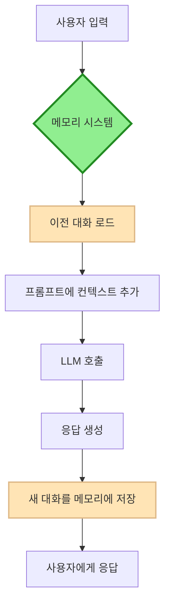

# 📚 ConversationBufferMemory 완벽 가이드: 대화형 AI의 기억장치

## 🎯 학습 목표
완료 후 당신이 할 수 있는 것들:
- ✅ **메모리 개념 이해**: LLM이 왜 메모리를 필요로 하는지 근본 원리 파악
- ✅ **ConversationBufferMemory 마스터**: 초기화부터 고급 활용까지 완전 구현
- ✅ **실무 적용**: 실제 챗봇, 대화형 시스템에 메모리 통합
- ✅ **성능 최적화**: 비용과 성능을 고려한 메모리 관리 전략 수립
- ✅ **문제 해결**: 메모리 관련 일반적인 문제와 해결책 숙지

---

## 🧠 핵심 개념: 왜 AI는 기억을 잃을까?

### 1. OpenAI API의 Stateless 본질
```python
"""
🧠 핵심 이해: API는 매번 '새로운' 만남으로 인식

OpenAI API 호출 흐름:
1. 요청 전송 → 2. 응답 생성 → 3. 연결 종료 🔚
4. 다음 요청 → 5. "처음 만났습니다!" 😅
"""

# ❌ 메모리 없는 대화의 한계
user_input_1 = "제 이름은 김철수입니다"
ai_response_1 = "안녕하세요 김철수님!"

user_input_2 = "제 이름이 뭐라고 했죠?"
ai_response_2 = "죄송합니다, 이름을 말씀해주시지 않으셨는데요?" # 🤦‍♂️ 기억 상실!
```

### 2. 메모리의 역할


**🔑 핵심**: 메모리는 **대화의 연속성**을 만드는 LangChain의 마법입니다!

---

## 📋 ConversationBufferMemory 클래스 레퍼런스

### 클래스 정의
```python
from langchain.memory import ConversationBufferMemory

class ConversationBufferMemory:
    def __init__(
        self,
        return_messages: bool = False,   # 📌 핵심: True=메시지객체, False=문자열
        memory_key: str = "history",     # 📌 프롬프트에서 사용할 변수명
        input_key: str = "input",        # 📌 사용자 입력 키
        output_key: str = "output",      # 📌 AI 응답 키
        human_prefix: str = "Human",     # 📌 사용자 메시지 접두사
        ai_prefix: str = "AI"            # 📌 AI 메시지 접두사
    ):
        """
        📋 기능: 전체 대화를 순서대로 저장하는 메모리 버퍼
        🎯 목적: 짧은 대화에서 완전한 컨텍스트 유지
        ⚡ 특징: 단순하고 직관적, 모든 정보 보존
        💡 최적 사용처: 개인 어시스턴트, 상담 챗봇, 교육용 AI
        """
```

### 🔧 핵심 메서드 상세

#### 1. save_context() - 대화 저장
```python
def save_context(
    self, 
    inputs: Dict[str, Any],    # 📥 예: {"input": "안녕하세요!"}
    outputs: Dict[str, str]    # 📤 예: {"output": "안녕하세요! 도와드릴까요?"}
) -> None:
    """
    🔧 동작: 한 턴의 대화(질문-답변)를 메모리에 영구 저장
    📊 저장 방식: 순서대로 리스트에 추가 (FIFO 구조)
    ⚡ 성능: O(1) 시간 복잡도로 빠름
    💡 실무 팁: 매 대화 후 반드시 호출해야 기억 유지
    """
```

#### 2. load_memory_variables() - 메모리 불러오기
```python
def load_memory_variables(self, inputs: Dict[str, Any]) -> Dict[str, Any]:
    """
    🔧 동작: 저장된 전체 대화를 프롬프트 형식으로 반환
    📊 반환 형식: 
        - return_messages=False → {"history": "Human: 질문\\nAI: 답변\\n..."}
        - return_messages=True → {"history": [HumanMessage(), AIMessage(), ...]}
    ⚡ 성능: 메모리 크기에 비례하여 처리 시간 증가
    💡 실무 팁: 프롬프트 템플릿의 variable_name과 memory_key 일치 필수
    """
```

---

## 💻 단계별 실전 구현

### 🚀 Level 1: 기본 메모리 사용법
```python
"""
🎯 목표: ConversationBufferMemory의 기본 저장/불러오기 이해
📚 학습 포인트: save_context와 load_memory_variables의 작동 원리
"""

from langchain.memory import ConversationBufferMemory

# === 1단계: 메모리 초기화 ===
# 🧠 개념: return_messages=False는 문자열 형태로 대화 저장
memory = ConversationBufferMemory()  
# 📌 기본 설정: memory_key="history", 문자열 형태 반환

# === 2단계: 첫 번째 대화 저장 ===
memory.save_context(
    {"input": "안녕하세요! 제 이름은 김철수입니다."},     # 📥 사용자 입력
    {"output": "안녕하세요 김철수님! 무엇을 도와드릴까요?"} # 📤 AI 응답
)

# === 3단계: 메모리 내용 확인 ===
stored_memory = memory.load_memory_variables({})
print("💾 저장된 메모리:")
print(stored_memory)
# 📊 출력: {'history': 'Human: 안녕하세요! 제 이름은 김철수입니다.\nAI: 안녕하세요 김철수님! 무엇을 도와드릴까요?'}

# === 4단계: 연속 대화 추가 ===
memory.save_context(
    {"input": "제 이름이 기억나시나요?"},
    {"output": "네! 김철수님이시죠. 기억하고 있습니다."}
)

# === 5단계: 누적된 전체 대화 확인 ===
full_conversation = memory.load_memory_variables({})["history"]
print("\n🗣️ 전체 대화 기록:")
print(full_conversation)

# 💡 실무 인사이트: 문자열 형태는 간단하지만 구조화된 처리가 어려움
```

### 🚀 Level 2: 채팅 모델과 통합
```python
"""
🎯 목표: ChatOpenAI와 ConversationBufferMemory 완전 통합
📚 학습 포인트: return_messages=True와 MessagesPlaceholder 활용
⚡ 핵심: 메시지 객체 형태가 채팅 모델의 표준 입력 형식
"""

from langchain.chat_models import ChatOpenAI
from langchain.prompts import ChatPromptTemplate, MessagesPlaceholder
from langchain.memory import ConversationBufferMemory
from langchain.schema.runnable import RunnablePassthrough

# === 1단계: 채팅 특화 메모리 초기화 ===
# 🧠 개념: return_messages=True → HumanMessage/AIMessage 객체로 저장
memory = ConversationBufferMemory(
    return_messages=True,  # 📌 핵심: 채팅 모델용 메시지 객체 형태
    memory_key="chat_history"  # 📌 프롬프트 변수명과 일치시켜야 함
)

# === 2단계: 채팅 모델 및 프롬프트 구성 ===
chat_model = ChatOpenAI(
    temperature=0.7,    # 📌 대화: 적절한 창의성과 일관성의 균형
    model="gpt-3.5-turbo"
)

# 🔧 구현: MessagesPlaceholder로 메모리 내용이 삽입될 위치 지정
prompt = ChatPromptTemplate.from_messages([
    ("system", """당신은 친근하고 도움이 되는 AI 어시스턴트입니다. 
                 이전 대화 내용을 기억하고 있으며, 사용자와의 관계를 지속적으로 발전시킵니다."""),
    MessagesPlaceholder(variable_name="chat_history"),  # 📌 메모리가 여기 삽입됨!
    ("human", "{user_input}")  # 📌 새로운 사용자 입력
])

# === 3단계: 메모리 자동 로드 함수 ===
def load_conversation_memory(_):
    """메모리에서 대화 기록을 자동으로 로드하는 헬퍼 함수"""
    return memory.load_memory_variables({})

# === 4단계: LCEL로 체인 구성 ===
# 🔧 체인 플로우: 메모리 로드 → 프롬프트 생성 → 모델 실행
conversation_chain = (
    RunnablePassthrough.assign(chat_history=load_conversation_memory)  # 📌 메모리 자동 주입
    | prompt 
    | chat_model
)

# === 5단계: 대화 처리 함수 ===
def chat_with_memory(user_message: str) -> str:
    """
    📋 기능: 메모리를 활용한 지속적 대화 처리
    🔧 프로세스: 입력 → 메모리 로드 → 응답 생성 → 메모리 저장
    """
    # 체인 실행으로 응답 생성
    response = conversation_chain.invoke({"user_input": user_message})
    
    # 새로운 대화를 메모리에 저장 (핵심!)
    memory.save_context(
        {"input": user_message},      # 📥 사용자 입력
        {"output": response.content}  # 📤 AI 응답
    )
    
    return response.content

# === 6단계: 실제 대화 테스트 ===
print("🤖 AI 챗봇과의 메모리 기반 대화")
print("=" * 50)

# 첫 번째 대화
response1 = chat_with_memory("안녕하세요! 저는 이영희입니다. 오늘 파이썬을 배우고 싶어요.")
print(f"👤 사용자: 안녕하세요! 저는 이영희입니다. 오늘 파이썬을 배우고 싶어요.")
print(f"🤖 AI: {response1}")
print()

# 두 번째 대화 - 이름 기억 테스트
response2 = chat_with_memory("제 이름이 무엇인지 기억하시나요?")
print(f"👤 사용자: 제 이름이 무엇인지 기억하시나요?")
print(f"🤖 AI: {response2}")
print()

# 세 번째 대화 - 맥락 유지 테스트  
response3 = chat_with_memory("파이썬에서 변수는 어떻게 만드나요?")
print(f"👤 사용자: 파이썬에서 변수는 어떻게 만드나요?")
print(f"🤖 AI: {response3}")

# === 7단계: 메모리 상태 분석 ===
print("\n📊 현재 메모리 상태 분석:")
memory_content = memory.load_memory_variables({})["chat_history"]
print(f"💾 저장된 메시지 수: {len(memory_content)}개")

for i, message in enumerate(memory_content, 1):
    role = "👤 사용자" if message.type == "human" else "🤖 AI"
    print(f"{i}. {role}: {message.content[:50]}...")

# 💡 실무 핵심: MessagesPlaceholder + return_messages=True 조합이 핵심!
```

### 🚀 Level 3: 듀얼 체인 시스템 (영화 이모지 + 메모리 조회)
```python
"""
🎯 목표: 고급 패턴 - 입력에 따른 지능적 라우팅과 전문화된 체인
📚 학습 포인트: Strategy Pattern, FewShot Learning, 메모리 기반 순서 추적
💡 실무 가치: 복잡한 대화 시스템의 아키텍처 패턴
"""

from langchain.chat_models import ChatOpenAI
from langchain.prompts import ChatPromptTemplate, FewShotChatMessagePromptTemplate
from langchain.memory import ConversationBufferMemory

# === 1단계: 전문화된 모델 초기화 ===
chat = ChatOpenAI(
    temperature=0.1,  # 📌 낮은 값: 일관된 이모지 생성을 위한 결정적 응답
    model="gpt-3.5-turbo"
)

# === 2단계: Few-Shot 학습 데이터 ===
# 🧠 개념: 영화 → 3개 이모지 변환 패턴 학습
emoji_examples = [
    {"movie": "탑건", "emojis": "🛩️👨‍✈️🔥"},
    {"movie": "타이타닉", "emojis": "🚢💑🌊"}, 
    {"movie": "매트릭스", "emojis": "🕶️💊🤖"},
    {"movie": "인셉션", "emojis": "💭🕰️🔁"}
]

# === 3단계: 영화 이모지 생성 체인 ===
# 🧠 개념: 창의적 변환 작업에 특화된 전문 체인
movie_example_prompt = ChatPromptTemplate.from_messages([
    ("human", "영화: {movie}"),
    ("assistant", "{emojis}")
])

movie_prompt = ChatPromptTemplate.from_messages([
    ("system", """당신은 영화를 3개 이모지로 변환하는 전문가입니다.
    
🎯 규칙:
- 정확히 3개 이모지만 사용
- 영화의 핵심 특징 표현
- 장르, 소재, 감정을 균형있게 표현
- 설명 없이 이모지만 응답"""),
    
    FewShotChatMessagePromptTemplate(
        example_prompt=movie_example_prompt,
        examples=emoji_examples  # 📌 일관된 패턴 학습
    ),
    
    ("human", "영화: {movie}")
])

# === 4단계: 메모리 조회 체인 ===  
# 🧠 개념: 대화 기록 분석에 특화된 전문 체인
memory_analysis_prompt = ChatPromptTemplate.from_messages([
    ("system", """당신은 대화 기록 분석 전문가입니다.
    
🎯 역할: 대화에서 영화 질문 순서를 정확히 파악
📋 규칙:
- "영화: [제목]" 패턴만 순서에 포함
- 메모리 조회 질문은 제외
- 시간 순서대로 분석
- 명확하고 정확하게 답변"""),
    ("system", "대화 기록:\n{chat_history}"),
    ("human", "{question}")
])

# === 5단계: 메모리 시스템 ===
memory = ConversationBufferMemory(return_messages=True)

# === 6단계: 지능적 라우팅 시스템 ===
movie_chain = movie_prompt | chat
memory_chain = memory_analysis_prompt | chat

def intelligent_chat(user_input: str) -> str:
    """
    🧠 Strategy Pattern: 입력 분석으로 적절한 처리 전략 선택
    📋 기능: 영화 이모지 생성 또는 메모리 기반 질문 답변
    """
    
    # 메모리 조회 패턴 감지 (키워드 기반 분류)
    memory_keywords = ["물어본 영화", "첫 번째", "두 번째", "세 번째", "마지막", "몇 번째"]
    is_memory_query = any(keyword in user_input for keyword in memory_keywords)
    
    if is_memory_query:
        # 🔍 메모리 조회 경로: 대화 기록 분석
        chat_history = "\n".join([
            f"{'사용자' if msg.type == 'human' else 'AI'}: {msg.content}"
            for msg in memory.chat_memory.messages
        ]) if memory.chat_memory.messages else "대화 기록이 없습니다."
        
        result = memory_chain.invoke({
            "chat_history": chat_history,
            "question": user_input
        })
        
        return result.content
        
    else:
        # 🎨 영화 이모지 생성 경로: 창의적 변환 + 메모리 저장
        result = movie_chain.invoke({"movie": user_input})
        
        # 📝 메모리 저장 (중요: 영화 요청만 저장)
        memory.chat_memory.add_user_message(f"영화: {user_input}")
        memory.chat_memory.add_ai_message(result.content)
        
        return result.content

# === 7단계: 시스템 테스트 ===
print("🎬 영화 이모지 + 메모리 시스템 테스트")
print("=" * 60)

# 영화 이모지 생성 테스트
print("📽️ 영화 이모지 생성:")
print(f"토이스토리 → {intelligent_chat('토이스토리')}")
print(f"어벤져스 → {intelligent_chat('어벤져스')}")
print(f"겨울왕국 → {intelligent_chat('겨울왕국')}")

# 메모리 조회 테스트
print("\n🧠 메모리 조회:")
print(f"질문: 첫 번째로 물어본 영화가 무엇인가요?")
print(f"답변: {intelligent_chat('첫 번째로 물어본 영화가 무엇인가요?')}")

print(f"\n질문: 마지막으로 물어본 영화가 무엇인가요?") 
print(f"답변: {intelligent_chat('마지막으로 물어본 영화가 무엇인가요?')}")

# 추가 영화와 순서 테스트
intelligent_chat('기생충')
print(f"\n질문: 두 번째로 물어본 영화가 무엇인가요?")
print(f"답변: {intelligent_chat('두 번째로 물어본 영화가 무엇인가요?')}")

print("\n✅ 듀얼 체인 시스템 테스트 완료!")

# 💡 실무 핵심: 
# - 입력 분석 → 적절한 체인 선택하는 라우팅 패턴
# - 메모리 저장의 선택적 적용 (모든 대화를 저장할 필요는 없음)
# - Few-Shot Learning으로 일관성 있는 출력 보장
```

---

## 🧪 레벨별 실습 과제

### 🔨 초급 과제: 메모리 API 마스터
```python
# 과제 1: 개인 정보 관리 챗봇
"""
요구사항:
- 사용자의 이름, 나이, 취미를 저장
- "내 정보를 알려줘" 요청 시 저장된 정보 출력
- ConversationBufferMemory 활용

힌트:
1. save_context로 정보 저장
2. load_memory_variables로 정보 조회
3. 정보 추출을 위한 간단한 파싱 로직 구현
"""

# TODO: 여기에 구현해보세요!
```

### 🚀 중급 과제: 토큰 사용량 모니터링
```python
# 과제 2: 비용 계산 챗봇
"""
요구사항:
- 대화 진행에 따른 토큰 사용량 실시간 추적
- GPT-3.5-turbo 가격 기준 비용 계산
- 토큰 한계(4,096) 근접 시 경고 메시지

사용할 라이브러리:
import tiktoken
"""

def calculate_tokens_and_cost(conversation_history: str) -> dict:
    """
    📋 기능: 대화 기록의 토큰 수와 예상 비용 계산
    📊 GPT-3.5-turbo 가격: $0.0015 / 1K tokens (input), $0.002 / 1K tokens (output)
    """
    # TODO: tiktoken으로 토큰 수 계산
    # TODO: 비용 계산 로직 구현
    pass

# TODO: 메모리와 통합하여 실시간 모니터링 구현
```

### 💡 고급 과제: 메모리 영속성과 복구
```python
# 과제 3: 세션 관리 시스템
"""
요구사항:
- 대화 내용을 JSON 파일로 저장
- 앱 재시작 후 이전 대화 복구
- 여러 사용자별 개별 메모리 관리

고려사항:
- 파일 I/O 에러 처리
- 메모리 크기 제한
- 데이터 유효성 검증
"""

class PersistentConversationMemory:
    """영속성을 가진 대화 메모리 관리자"""
    
    def __init__(self, user_id: str, max_messages: int = 100):
        self.user_id = user_id
        self.max_messages = max_messages
        self.memory = ConversationBufferMemory(return_messages=True)
        self.load_from_file()
    
    def save_to_file(self):
        """대화 내용을 파일로 저장"""
        # TODO: 메모리 내용을 JSON으로 직렬화하여 저장
        pass
    
    def load_from_file(self):
        """파일에서 대화 내용 복구"""  
        # TODO: JSON에서 메모리 내용을 역직렬화하여 복구
        pass
    
    def add_conversation(self, user_input: str, ai_response: str):
        """대화 추가 및 자동 저장"""
        # TODO: 메모리에 추가 + 크기 관리 + 파일 저장
        pass

# TODO: 위 클래스를 구현하고 테스트해보세요!
```

---

## ⚠️ 실무 주의사항 및 최적화 전략

### 💰 비용 관리 전략
```python
# ❌ 위험: 무제한 메모리 증가
memory = ConversationBufferMemory()
for i in range(1000):  # 1000턴 대화
    memory.save_context({"input": f"질문 {i}"}, {"output": f"답변 {i}"})
# 결과: 토큰 한계 초과, 높은 API 비용

# ✅ 안전: 메모리 크기 모니터링
MAX_MEMORY_SIZE = 20  # 최대 20턴의 대화만 유지

def safe_add_to_memory(memory, user_input, ai_output):
    """안전한 메모리 추가 with 크기 제한"""
    # 현재 메모리 크기 확인
    current_messages = len(memory.chat_memory.messages)
    
    if current_messages >= MAX_MEMORY_SIZE * 2:  # Human + AI = 2배
        print("⚠️ 메모리 크기 한계. 오래된 대화 삭제 중...")
        # 가장 오래된 2개 메시지 삭제 (Human-AI 쌍)
        memory.chat_memory.messages = memory.chat_memory.messages[2:]
    
    # 새 대화 추가
    memory.save_context({"input": user_input}, {"output": ai_output})
    
    print(f"📊 현재 메모리: {len(memory.chat_memory.messages)//2}턴")

# 💡 추가 최적화 아이디어:
# - ConversationSummaryBufferMemory로 업그레이드
# - 중요한 정보만 선별 저장하는 필터링
# - 사용자별 메모리 크기 개인화
```

### 🔧 성능 최적화 패턴
```python
# 성능 최적화를 위한 고급 패턴들

class OptimizedConversationMemory:
    """최적화된 대화 메모리 관리자"""
    
    def __init__(self):
        self.memory = ConversationBufferMemory(return_messages=True)
        self._cache = {}  # 캐싱으로 중복 로드 방지
        
    def get_conversation_summary(self) -> str:
        """대화 요약 생성 (긴 대화 처리용)"""
        if len(self.memory.chat_memory.messages) > 30:
            # 긴 대화는 요약으로 압축
            return self._generate_summary()
        else:
            # 짧은 대화는 전체 내용 반환
            return self._get_full_conversation()
    
    def _generate_summary(self) -> str:
        """GPT를 활용한 대화 요약"""
        # TODO: 요약 생성 로직 (고급 과제)
        pass
    
    def _get_full_conversation(self) -> str:
        """전체 대화 내용 반환"""
        messages = self.memory.chat_memory.messages
        return "\n".join([f"{msg.type}: {msg.content}" for msg in messages])

# 💡 실무 팁: 상황에 맞는 메모리 전략 선택
# - 짧은 세션: ConversationBufferMemory
# - 중간 세션: ConversationBufferWindowMemory  
# - 긴 세션: ConversationSummaryBufferMemory
# - 복잡한 요구사항: 커스텀 메모리 클래스 구현
```

### 🛡️ 에러 처리 및 안정성
```python
class RobustConversationHandler:
    """견고한 대화 처리 시스템"""
    
    def __init__(self):
        self.memory = ConversationBufferMemory(return_messages=True)
        self.max_retries = 3
        
    def safe_chat(self, user_input: str) -> str:
        """에러에 강한 대화 처리"""
        for attempt in range(self.max_retries):
            try:
                # 메모리 로드 시도
                memory_vars = self.memory.load_memory_variables({})
                
                # API 호출 시도  
                response = self._call_llm_with_memory(user_input, memory_vars)
                
                # 성공 시 메모리 저장
                self.memory.save_context(
                    {"input": user_input}, 
                    {"output": response}
                )
                
                return response
                
            except Exception as e:
                print(f"❌ 시도 {attempt + 1} 실패: {e}")
                if attempt == self.max_retries - 1:
                    return "죄송합니다. 일시적인 문제가 발생했습니다. 다시 시도해주세요."
                time.sleep(2 ** attempt)  # 지수 백오프
    
    def _call_llm_with_memory(self, user_input: str, memory_vars: dict) -> str:
        """실제 LLM 호출 로직"""
        # TODO: 실제 체인 호출 구현
        pass

# 💡 실무 핵심: 
# - API 한계 및 네트워크 오류에 대한 견고성
# - 사용자 경험을 해치지 않는 우아한 실패 처리
# - 로깅과 모니터링으로 문제 추적
```

---

## 🎯 언제 ConversationBufferMemory를 사용할까?

### ✅ 적합한 사용 사례
```python
# 🎯 개인 어시스턴트 (1:1 상담)
"""
특징: 짧고 집중된 대화, 전체 컨텍스트 중요
예시: 의료 상담, 법률 자문, 개인 코칭
장점: 완전한 맥락 유지, 세밀한 개인화 가능
"""

# 🎯 교육용 튜터링 시스템
"""
특징: 학습 진도 추적, 이해도 파악 필요
예시: 수학 문제 해결, 언어 학습, 코딩 교육
장점: 학습 과정 완전 기록, 맞춤형 피드백
"""

# 🎯 창작 협업 도구
"""
특징: 아이디어 발전 과정 중요, 창의적 연속성
예시: 소설 작성, 시나리오 개발, 브레인스토밍
장점: 창작 흐름 유지, 아이디어 발전 과정 보존
"""

# 🎯 디버깅 및 문제 해결
"""
특징: 문제 해결 과정의 단계별 추적 필요
예시: 코드 디버깅, 시스템 진단, 기술 지원
장점: 문제 해결 과정 완전 기록, 패턴 분석 가능
"""
```

### ❌ 부적합한 사용 사례
```python
# 🚫 대규모 고객 서비스 (1000+ 동시 사용자)
"""
문제: 메모리 사용량 폭증, 높은 API 비용
대안: ConversationSummaryBufferMemory + 세션 관리
"""

# 🚫 긴 문서 처리 대화 (10+ 페이지)
"""
문제: 토큰 한계 초과, 응답 시간 증가
대안: ConversationBufferWindowMemory + 문서 청킹
"""

# 🚫 실시간 채팅 (초당 10+ 메시지)
"""
문제: 메모리 오버헤드, 처리 지연
대안: 간단한 상태 기반 메모리 + 캐싱
"""

# 🚫 다중 주제 동시 처리
"""
문제: 컨텍스트 혼재, 주제별 분리 어려움  
대안: 주제별 독립 메모리 + 라우팅 시스템
"""
```

---

## 🔗 다음 학습 단계

### 📚 관련 메모리 클래스 학습 경로
1. **ConversationBufferWindowMemory**: 최근 N턴만 기억
2. **ConversationSummaryMemory**: 요약 기반 메모리
3. **ConversationSummaryBufferMemory**: 하이브리드 접근법  
4. **ConversationEntityMemory**: 개체 중심 메모리

### 🚀 실무 프로젝트 아이디어
1. **개인 일정 관리 AI**: 캘린더 통합, 일정 추천
2. **학습 진도 추적 봇**: 진도 관리, 복습 알림
3. **창작 워크플로우 도구**: 아이디어 발전, 작품 관리
4. **기술 문서 Q&A 시스템**: 문서 기반, 컨텍스트 유지

### 💡 고급 주제 탐구
1. **커스텀 메모리 클래스**: 특수 요구사항에 맞춘 구현
2. **메모리 최적화 기법**: 압축, 인덱싱, 캐싱
3. **멀티모달 메모리**: 텍스트 + 이미지 + 음성 통합
4. **분산 메모리 시스템**: Redis, 데이터베이스 통합

---

## 📊 핵심 정리

### 🎯 ConversationBufferMemory의 본질
- **완전성**: 모든 대화 보존으로 완벽한 컨텍스트 유지
- **단순성**: 직관적인 API로 빠른 구현과 디버깅 용이
- **투명성**: 저장 내용 그대로 확인 가능한 명확성

### ⚖️ 장단점 균형
| 장점 | 단점 | 해결책 |
|------|------|--------|
| 완전한 기억력 | 높은 비용 | 크기 모니터링 |
| 구현 단순함 | 성능 저하 | 캐싱 전략 |
| 디버깅 용이 | 토큰 한계 | 다른 메모리 전환 |

### 🏗️ 실무 핵심 패턴
1. **메모리 + 프롬프트**: `MessagesPlaceholder`로 자연스러운 통합
2. **LCEL 체인**: `RunnablePassthrough.assign`으로 자동 메모리 로드
3. **에러 처리**: 견고한 예외 처리와 우아한 실패
4. **성능 관리**: 크기 모니터링과 적절한 정리 전략

---

**💡 최종 통찰**: ConversationBufferMemory는 LangChain 메모리 시스템의 **입문자이자 기본기**입니다. 단순하지만 강력하며, 복잡한 대화형 AI 시스템의 토대가 됩니다. 작은 프로젝트에서는 최적의 선택이고, 큰 시스템에서는 다른 메모리와 함께 사용하는 컴포넌트가 됩니다. 

**🚀 다음 도전**: 이제 ConversationBufferWindowMemory로 더 효율적인 메모리 관리를 학습해보세요!