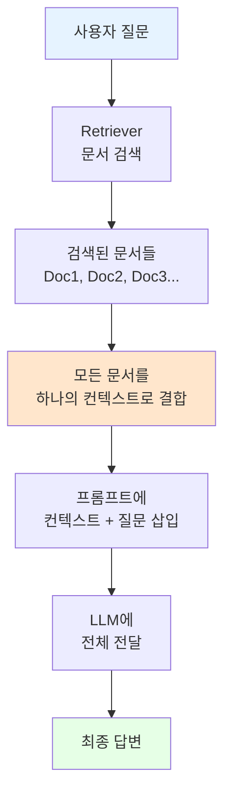

# 📖 Stuff Documents Chain 완벽 가이드

## 🎯 학습 목표
- ✅ Stuff Documents Chain의 개념과 작동 원리 이해
- ✅ LCEL을 사용한 투명한 체인 구현 방법 습득
- ✅ RunnablePassthrough의 역할과 활용법 이해
- ✅ 언제 Stuff Chain을 사용해야 하는지 판단 능력 습득

## 🧠 핵심 개념

### Stuff Documents Chain이란?
**Stuff Documents Chain**은 LangChain에서 문서를 처리하는 가장 **간단하고 직관적인** 방법입니다.
- "Stuff" = 모든 검색된 문서를 하나의 프롬프트에 **"쑤셔 넣는다(stuff)"**는 의미
- 검색된 모든 문서를 **한꺼번에** LLM에게 전달하는 방식

### 개념 관계도


### 언제 사용하는가?
1. **문서가 적을 때** (보통 3-5개)
2. **빠른 프로토타이핑**이 필요할 때
3. **종합적인 이해**가 필요한 질문일 때
4. **단순한 질문-답변** 시스템 구축 시

## 📋 주요 클래스/함수 레퍼런스

### RunnablePassthrough
```python
from langchain.schema.runnable import RunnablePassthrough

class RunnablePassthrough:
    def invoke(self, input_data):
        """
        입력 데이터를 수정 없이 그대로 전달하는 유틸리티 클래스
        
        Args:
            input_data: 전달할 데이터 (보통 질문 텍스트)
        
        Returns:
            동일한 입력 데이터
        """
        return input_data
```

**📌 매개변수 상세**:
- `input_data` (required): 전달할 데이터, 주로 사용자의 질문 텍스트

**📌 주요 용도**:
- 체인에서 동일한 입력을 여러 곳에서 사용할 때
- 질문을 수정 없이 프롬프트에 전달할 때

### LCEL Chain 구성
```python
from langchain.prompts import ChatPromptTemplate
from langchain.chat_models import ChatOpenAI

# LCEL 방식의 체인 구성
chain = (
    {
        "context": retriever,              # 문서 검색
        "question": RunnablePassthrough()  # 질문 전달
    }
    | prompt    # 프롬프트 템플릿 적용
    | llm       # LLM 호출
)
```

## 🔧 동작 과정 상세

### Step 1: 필요한 구성 요소 준비
```python
from langchain.chat_models import ChatOpenAI
from langchain.embeddings import OpenAIEmbeddings
from langchain.vectorstores import FAISS
from langchain.prompts import ChatPromptTemplate
from langchain.schema.runnable import RunnablePassthrough

# LLM 초기화
llm = ChatOpenAI(temperature=0.1)

# Vector Store와 Retriever 생성
embeddings = OpenAIEmbeddings()
vectorstore = FAISS.from_documents(docs, embeddings)
retriever = vectorstore.as_retriever()
```

### Step 2: 프롬프트 템플릿 생성
```python
prompt = ChatPromptTemplate.from_messages([
    (
        "system",
        "You are a helpful assistant. Answer questions using only the following context. "
        "If you don't know the answer just say you don't know, don't make it up:\n\n{context}"
    ),
    ("human", "{question}"),
])
```

### Step 3: LCEL 체인 구성 및 실행
```python
# 체인 구성
chain = (
    {
        "context": retriever,               # 📌 검색기가 관련 문서 찾기
        "question": RunnablePassthrough(),  # 📌 질문은 그대로 전달
    }
    | prompt   # 📌 프롬프트에 context와 question 삽입
    | llm      # 📌 LLM에 전달하여 답변 생성
)

# 실행
response = chain.invoke("Describe Victory Mansions")
```

## 💻 실전 예제

### 완전한 Stuff Documents Chain 구현
```python
from langchain.chat_models import ChatOpenAI
from langchain.document_loaders import UnstructuredFileLoader
from langchain.text_splitter import CharacterTextSplitter
from langchain.embeddings import OpenAIEmbeddings, CacheBackedEmbeddings
from langchain.vectorstores import FAISS
from langchain.storage import LocalFileStore
from langchain.prompts import ChatPromptTemplate
from langchain.schema.runnable import RunnablePassthrough

# 1. LLM 설정
llm = ChatOpenAI(
    temperature=0.1,  # 📌 낮은 temperature로 일관된 답변
)

# 2. 캐시 설정 (임베딩 재사용)
cache_dir = LocalFileStore("./.cache/")

# 3. 문서 분할기 설정
splitter = CharacterTextSplitter.from_tiktoken_encoder(
    separator="\n",
    chunk_size=600,      # 📌 청크 크기
    chunk_overlap=100,   # 📌 청크 간 겹침
)

# 4. 문서 로드 및 분할
loader = UnstructuredFileLoader("./files/chapter_one.txt")
docs = loader.load_and_split(text_splitter=splitter)

# 5. 임베딩 및 벡터 저장소 생성
embeddings = OpenAIEmbeddings()
cached_embeddings = CacheBackedEmbeddings.from_bytes_store(embeddings, cache_dir)
vectorstore = FAISS.from_documents(docs, cached_embeddings)

# 6. Retriever 생성
retriever = vectorstore.as_retriever()

# 7. 프롬프트 템플릿
prompt = ChatPromptTemplate.from_messages(
    [
        (
            "system",
            "You are a helpful assistant. Answer questions using only the following context. "
            "If you don't know the answer just say you don't know, don't make it up:\n\n{context}",
        ),
        ("human", "{question}"),
    ]
)

# 8. LCEL 체인 구성
chain = (
    {
        "context": retriever,
        "question": RunnablePassthrough(),
    }
    | prompt
    | llm
)

# 9. 사용 예시
result = chain.invoke("Describe Victory Mansions")
print(result.content)
```

## 🔍 변수/함수 상세 설명

### 주요 변수 설명
```python
temperature=0.1          # 📌 용도: 창의성 제어, 타입: float, 예시: 0.0-2.0
chunk_size=600          # 📌 용도: 문서 분할 크기, 타입: int, 예시: 500-1000
chunk_overlap=100       # 📌 용도: 청크 간 겹침, 타입: int, 예시: 50-200
```

### 체인 실행 과정 상세
```python
def explain_chain_execution(question: str):
    """
    📋 기능: Stuff Chain의 실행 과정을 단계별로 설명
    📥 입력: 사용자 질문
    📤 출력: 각 단계별 처리 결과
    💡 사용 시나리오: 디버깅 및 이해도 향상
    """
    # Step 1: Retriever가 관련 문서 검색
    relevant_docs = retriever.get_relevant_documents(question)
    print(f"검색된 문서 수: {len(relevant_docs)}")
    
    # Step 2: 문서들을 하나의 컨텍스트로 결합
    context = "\n\n".join([doc.page_content for doc in relevant_docs])
    print(f"전체 컨텍스트 길이: {len(context)} 문자")
    
    # Step 3: 프롬프트 생성
    formatted_prompt = prompt.format(context=context, question=question)
    print(f"최종 프롬프트:\n{formatted_prompt[:200]}...")
    
    return formatted_prompt
```

## 🧪 실습 과제

### 🔨 기본 과제
1. 주어진 코드를 실행하고 다양한 질문 테스트
2. chunk_size와 chunk_overlap 값을 변경하며 결과 비교
3. 다른 문서로 벡터 저장소 생성해보기

### 🚀 심화 과제
1. 검색된 문서 수를 제한하는 기능 추가
```python
# 힌트: retriever 설정 변경
retriever = vectorstore.as_retriever(search_kwargs={"k": 3})
```

2. 프롬프트 템플릿 커스터마이징
```python
# 힌트: 한국어 프롬프트 또는 특정 도메인 전용 프롬프트 작성
```

### 💡 창의 과제
1. 문서의 관련성 점수를 표시하는 기능 구현
2. 답변과 함께 출처 문서를 표시하는 체인 구성

## ⚠️ 주의사항

### 토큰 제한 문제
- OpenAI 모델의 토큰 제한 (gpt-3.5-turbo: 4,096 토큰)
- 문서가 너무 많으면 에러 발생 가능
- 해결책: retriever의 k값 조정 또는 Map Reduce Chain 사용

### 비용 고려사항
```python
# 비용 절감 팁
retriever = vectorstore.as_retriever(
    search_kwargs={"k": 3}  # 검색 문서 수 제한
)
```

### 성능 최적화
- 캐싱 활용으로 반복 임베딩 방지
- 적절한 chunk_size 선택 (너무 크면 토큰 초과, 너무 작으면 컨텍스트 부족)

## 🔗 관련 자료
- **이전 학습**: [6.6 RetrievalQA](./6.6_RetrievalQA.md)
- **다음 학습**: [6.9 Map Reduce LCEL Chain](./6.9_Map_Reduce_LCEL_Chain.md) 
- **실습 파일**: [6.8 Stuff LCEL Chain.ipynb](../00%20lecture/6.8%20Stuff%20LCEL%20Chain.ipynb)
- **공식 문서**: [LangChain LCEL Documentation](https://python.langchain.com/docs/expression_language/)

---

💡 **핵심 정리**: Stuff Documents Chain은 모든 검색된 문서를 하나의 프롬프트에 넣어 처리하는 가장 간단한 방식입니다. LCEL을 사용하면 투명하고 커스터마이징 가능한 체인을 구성할 수 있으며, 소규모 문서 세트에서 종합적인 답변이 필요할 때 매우 효과적입니다.