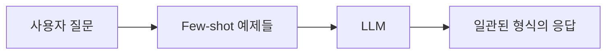

# 📖 Chapter 4.1: FewShotPromptTemplate - 예제 기반 프롬프트 엔지니어링

## 🎯 학습 목표
이 섹션을 완료하면 다음을 할 수 있습니다:
- ✅ Few-shot learning의 개념과 중요성 이해
- ✅ FewShotPromptTemplate를 사용하여 일관된 응답 형식 구현
- ✅ 동적 예제 선택을 통한 프롬프트 최적화
- ✅ 실무에서 Few-shot learning 패턴 적용

## 🧠 핵심 개념 요약

### Few-shot Learning이란?
**Few-shot learning**은 AI 모델에게 소수의 예제를 제공하여 원하는 형식이나 스타일로 응답하도록 유도하는 기법입니다. 



### 왜 Few-shot Learning인가?
- **명시적 지시보다 효과적**: "리스트로 답하세요"보다 리스트 예제를 보여주는 것이 더 효과적
- **일관성 보장**: 모든 응답이 동일한 형식을 따름
- **복잡한 형식 지원**: 구조화된 데이터, 특정 스타일 등

## 📝 상세 내용

### 1️⃣ 기본 개념 이해

#### PromptTemplate 복습
```python
from langchain.prompts import PromptTemplate

# 기본 프롬프트 템플릿
template = PromptTemplate.from_template("What is the capital of {country}?")
result = template.format(country="Korea")
# 출력: "What is the capital of Korea?"
```

📌 **핵심 포인트**: PromptTemplate는 변수를 포함한 텍스트 템플릿을 관리합니다.

### 2️⃣ 주요 구성 요소

#### FewShotPromptTemplate 클래스
```python
from langchain.prompts.few_shot import FewShotPromptTemplate

# 주요 파라미터
FewShotPromptTemplate(
    example_prompt=example_prompt,    # 각 예제를 포맷팅할 템플릿
    examples=examples,                # 예제 리스트
    suffix="Human: {input}",         # 사용자 입력 부분
    input_variables=["input"],       # 입력 변수 검증
    example_separator="\n\n",        # 예제 간 구분자 (선택)
    prefix="",                       # 예제 앞 텍스트 (선택)
)
```

### 3️⃣ 동작 과정 상세

#### Step-by-Step 프로세스

##### Step 1: 예제 데이터 준비
```python
# 🎯 목표: 국가 정보를 일관된 형식으로 응답받기
examples = [
    {
        "question": "What do you know about France?",
        "answer": """
        Here is what I know:
        Capital: Paris
        Language: French
        Food: Wine and Cheese
        Currency: Euro
        """
    },
    # ... 더 많은 예제
]
```

##### Step 2: 예제 포맷터 생성
```python
# 각 예제를 어떻게 포맷팅할지 정의
example_prompt = PromptTemplate.from_template(
    "Human: {question}\nAI:{answer}"
)
```

##### Step 3: FewShotPromptTemplate 구성
```python
prompt = FewShotPromptTemplate(
    example_prompt=example_prompt,
    examples=examples,
    suffix="Human: What do you know about {country}?",
    input_variables=["country"]
)
```

##### Step 4: 실행
```python
# ChatModel과 연결
from langchain.chat_models import ChatOpenAI

chat = ChatOpenAI(temperature=0.1)
chain = prompt | chat

# 실행
response = chain.invoke({"country": "Korea"})
```

### 4️⃣ 실전 예제 코드

#### 완전한 구현 예제
```python
from langchain.chat_models import ChatOpenAI
from langchain.prompts.few_shot import FewShotPromptTemplate
from langchain.prompts import PromptTemplate

# 1. 모델 초기화
chat = ChatOpenAI(temperature=0.1)

# 2. 예제 데이터 정의
examples = [
    {
        "question": "What do you know about France?",
        "answer": """
        Here is what I know:
        Capital: Paris
        Language: French
        Food: Wine and Cheese
        Currency: Euro
        """
    },
    {
        "question": "What do you know about Italy?",
        "answer": """
        I know this:
        Capital: Rome
        Language: Italian
        Food: Pizza and Pasta
        Currency: Euro
        """
    },
    {
        "question": "What do you know about Greece?",
        "answer": """
        I know this:
        Capital: Athens
        Language: Greek
        Food: Souvlaki and Feta Cheese
        Currency: Euro
        """
    }
]

# 3. 예제 포맷터 생성
example_prompt = PromptTemplate.from_template("Human: {question}\nAI:{answer}")

# 4. Few-shot 프롬프트 생성
prompt = FewShotPromptTemplate(
    example_prompt=example_prompt,
    examples=examples,
    suffix="Human: What do you know about {country}?",
    input_variables=["country"]
)

# 5. 체인 생성 및 실행
chain = prompt | chat
result = chain.invoke({"country": "Korea"})
print(result.content)
```

#### 예상 출력
```
I know this:
Capital: Seoul
Language: Korean
Food: Kimchi and Bulgogi
Currency: Won
```

### 5️⃣ 실습 과제

#### 🔨 기본 과제
1. 위 코드를 실행하고 다른 국가들로 테스트해보세요
2. 예제의 형식을 변경하여 다른 스타일의 응답을 만들어보세요

#### 🚀 심화 과제
```python
# 과제: 제품 리뷰 요약기 만들기
# Few-shot learning을 사용하여 일관된 형식의 리뷰 요약 생성

review_examples = [
    {
        "review": "This phone has amazing camera quality and battery life...",
        "summary": """
        📱 Product: Smartphone
        ⭐ Rating: 4.5/5
        ✅ Pros: Great camera, Long battery
        ❌ Cons: Expensive
        💬 Summary: Excellent phone worth the price
        """
    }
    # 더 많은 예제 추가
]

# TODO: FewShotPromptTemplate을 사용하여 구현
```

#### 💡 창의 과제
실무 시나리오: 고객 상담 챗봇을 위한 Few-shot 템플릿 만들기
- 회사의 톤앤매너를 반영한 응답 스타일
- 다양한 상황별 예제 포함

### 6️⃣ 주의사항 & Best Practices

#### ⚠️ 흔한 실수
1. **예제 수 부족**: 최소 3개 이상의 다양한 예제 제공
2. **일관성 없는 형식**: 모든 예제가 동일한 구조를 따라야 함
3. **변수명 불일치**: example과 suffix의 변수명이 일치해야 함

#### ✅ 권장 사용 패턴
```python
# Good: 명확한 구조와 일관된 형식
examples = [
    {"input": "...", "output": "Category: X\nSentiment: Y\nKeywords: Z"},
    {"input": "...", "output": "Category: A\nSentiment: B\nKeywords: C"}
]

# Bad: 형식이 다른 예제들
examples = [
    {"input": "...", "output": "X, Y, Z"},
    {"input": "...", "output": "Category is A and sentiment is B"}
]
```

### 7️⃣ 실무 팁

#### 성능 최적화
```python
# 동적 예제 선택으로 토큰 절약
from langchain.prompts.example_selector import LengthBasedExampleSelector

selector = LengthBasedExampleSelector(
    examples=examples,
    example_prompt=example_prompt,
    max_length=200  # 최대 토큰 수
)

dynamic_prompt = FewShotPromptTemplate(
    example_selector=selector,  # examples 대신 selector 사용
    example_prompt=example_prompt,
    suffix="Human: What do you know about {country}?"
)
```

#### 비용 절감 전략
- 예제 수를 3-5개로 제한 (보통 충분함)
- 예제를 간결하게 유지
- 캐싱을 활용하여 반복 호출 최소화

## 🔗 관련 자료
- **다음 학습**: [4.2 FewShotChatMessagePromptTemplate](./4.2_FewShotChatMessagePromptTemplate.md) - 대화형 Few-shot
- **연관 주제**: [4.3 LengthBasedExampleSelector](./4.3_LengthBasedExampleSelector.md) - 동적 예제 선택
- **공식 문서**: [LangChain Few-shot Examples](https://python.langchain.com/docs/modules/model_io/prompts/few_shot)

## 🧪 이해도 체크
1. Few-shot learning이 명시적 지시보다 효과적인 이유는?
2. FewShotPromptTemplate의 필수 파라미터는?
3. 동적 예제 선택이 필요한 상황은?

---

💡 **핵심 정리**: FewShotPromptTemplate는 예제를 통해 LLM의 출력 형식을 제어하는 강력한 도구입니다. 적절한 예제 선택과 일관된 형식 유지가 성공의 열쇠입니다.