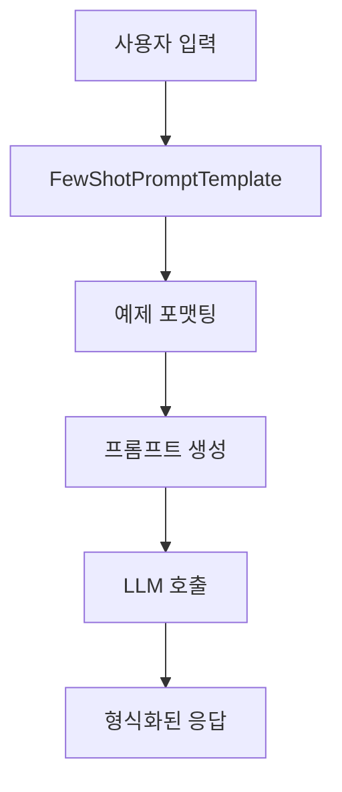

# 📚 강의 내용 통합 문서화 전략 가이드

## 🎯 문서화 목표
- **학습 효율성 극대화**: 개념 이해와 실습을 동시에 진행할 수 있는 구조
- **참조 용이성**: 필요한 정보를 빠르게 찾을 수 있는 체계적 구성
- **실무 적용 가능성**: 학습한 내용을 실제 프로젝트에 바로 적용할 수 있도록 구성

## 📂 제안하는 문서 구조

### 1. 전체 문서 구조 (Master Document Structure)

```markdown
# LangChain 완벽 가이드: 이론과 실습의 통합

## 📑 목차 (Table of Contents)
- 빠른 네비게이션을 위한 상세 목차
- 주제별, 난이도별 분류

## 🎯 학습 로드맵
- 초급자를 위한 학습 경로
- 중급자를 위한 심화 경로
- 프로젝트 기반 학습 경로

## 📚 Chapter 구성
### Chapter 3: LLMs과 Chat Models
### Chapter 4: Prompt Engineering
### Chapter 5: Memory Management
### Chapter 6: Document Processing
...
```

### 2. 파일 구조 전략

#### A. 세분화된 파일 구조
```
langchain_docs/
├── README.md                           # 전체 가이드 및 목차
├── Chapter_3_LCEL/
│   ├── 3.3_OutputParser_LCEL.md       # 개별 섹션 파일
│   ├── 3.4_Chaining_Chains.md
│   └── 3.5_Recap.md
├── Chapter_4_Prompt_Engineering/
│   ├── 4.0_Introduction.md
│   ├── 4.1_FewShotPromptTemplate.md
│   ├── 4.2_FewShotChatMessagePromptTemplate.md
│   ├── 4.3_LengthBasedExampleSelector.md
│   ├── 4.4_Serialization_Composition.md
│   ├── 4.5_Caching.md
│   └── 4.6_Serialization.md
├── API_Reference/
│   ├── Templates_API.md                # 템플릿 클래스 레퍼런스
│   ├── Selectors_API.md               # 선택자 클래스 레퍼런스
│   └── Parsers_API.md                 # 파서 클래스 레퍼런스
└── Examples/
    ├── Basic_Examples.md
    └── Advanced_Projects.md
```

#### B. 장점
- **빠른 검색**: 특정 주제만 찾아보기 용이
- **모듈식 학습**: 필요한 부분만 선택적 학습
- **유지보수**: 개별 섹션 업데이트 용이
- **참조 편의**: 다른 문서에서 특정 섹션 링크 가능

### 3. 각 섹션별 상세 구조

```markdown
# 📖 Section X.Y: [세부 주제명]

## 🎯 학습 목표
- 이 섹션을 완료하면 할 수 있는 것들
- 핵심 개념 체크리스트

## 🧠 핵심 개념
- 주요 용어 정의
- 개념 관계도
- 언제 사용하는가?

## 📋 주요 클래스/함수 레퍼런스

### ClassName
```python
class ClassName(BaseClass):
    def __init__(self, param1: type, param2: type = default):
        """
        클래스 설명
        
        Args:
            param1: 매개변수 설명 및 예시값
            param2: 선택적 매개변수 설명
        """
```

**📌 매개변수 상세**:
- `param1` (required): 역할과 예시값
- `param2` (optional): 기본값과 사용 시나리오

**📌 주요 메서드**:
- `method1()`: 동작과 반환값
- `method2()`: 사용 시점과 예제

## 🔧 동작 과정 상세
```python
# Step 1: 초기화
instance = ClassName(param1=value1)

# Step 2: 설정
instance.configure(options)

# Step 3: 실행
result = instance.execute()
```

## 💻 실전 예제
[완전한 실행 가능한 코드 예제]

## 🔍 변수/함수 상세 설명

### 변수 설명 템플릿
```python
variable_name = value  # 📌 용도: 설명, 타입: type, 예시: example
```

### 함수 설명 템플릿
```python
def function_name(param1, param2=default):
    """
    📋 기능: 함수가 수행하는 작업
    📥 입력: 매개변수 설명
    📤 출력: 반환값 설명
    💡 사용 시나리오: 언제 사용하는지
    """
    # 구현부
    return result
```

## 🧪 실습 과제
- 🔨 기본: 코드 실행
- 🚀 심화: 변형 적용
- 💡 창의: 실무 구현

## ⚠️ 주의사항
- 흔한 실수와 해결법
- 성능 고려사항
- 보안 주의점

## 🔗 관련 자료
- 이전/다음 섹션 링크
- API 문서 링크
- 추가 예제 링크
```

### 3. 특수 섹션 구성

#### A. 코드 설명 박스 템플릿
```markdown
📦 **코드 상세 분석**
```python
# 코드 라인별 상세 설명
prompt = FewShotPromptTemplate(
    example_prompt=example_prompt,  # 📌 각 예제를 포맷팅할 템플릿
    examples=examples,              # 📌 Few-shot 학습용 예제 리스트
    suffix="Human: {country}?",     # 📌 사용자 입력 템플릿
    input_variables=["country"]     # 📌 변수 검증용 리스트
)
```
```

#### B. 개념 비교 표
```markdown
| 특징 | PromptTemplate | FewShotPromptTemplate |
|------|----------------|----------------------|
| 사용 시기 | 단순 템플릿 | 예제 기반 학습 |
| 장점 | 간단함 | 일관된 출력 |
| 적합한 경우 | 간단한 질문 | 특정 형식 필요 |
```

#### C. 플로우차트/다이어그램
```markdown

```

### 4. 학습 강화 요소

#### A. 퀴즈 섹션
```markdown
### 🧪 이해도 체크
1. FewShotPromptTemplate의 주요 목적은?
2. example_prompt의 역할은?
3. suffix 파라미터는 언제 사용되는가?
```

#### B. 실습 프로젝트
```markdown
### 🏗️ 미니 프로젝트
**프로젝트**: 맞춤형 고객 상담 봇 만들기
- 요구사항: Few-shot learning으로 일관된 응답 스타일 구현
- 힌트: 실제 상담 대화 예제 3-5개 사용
- 평가 기준: 응답 일관성, 정보 정확성
```

## 📋 문서 작성 원칙

### 1. 학습자 중심 설계
- **점진적 난이도**: 기초 → 응용 → 심화
- **실습 중심**: 이론 30% + 실습 70%
- **즉시 실행 가능**: 모든 코드는 복사-붙여넣기로 실행 가능

### 2. 시각적 이해 도구
- **아이콘 활용**: 🎯 목표, 💡 팁, ⚠️ 주의, 📌 중요
- **코드 하이라이팅**: 중요 부분 주석으로 강조
- **다이어그램**: 복잡한 개념은 시각화

### 3. 참조 최적화
- **상호 참조**: 관련 섹션 링크
- **인덱스**: 주요 개념/함수명 색인
- **검색 가능**: 일관된 명명 규칙

### 4. 실무 연결성
- **실제 사용 사례**: 각 개념마다 실무 예제
- **성능 고려사항**: 실제 운영 환경 팁
- **비용 최적화**: API 호출 최소화 전략

## 🚀 추천 문서화 프로세스

### Phase 1: 기초 구조 생성 (1-2일)
1. 전체 목차 구성
2. 각 챕터별 학습 목표 정의
3. 핵심 개념 맵핑

### Phase 2: 내용 통합 (3-5일)
1. 스크립트에서 핵심 설명 추출
2. 노트북에서 코드 예제 정리
3. 설명과 코드 유기적 연결

### Phase 3: 학습 강화 요소 추가 (2-3일)
1. 실습 과제 설계
2. 퀴즈/체크리스트 작성
3. 프로젝트 아이디어 추가

### Phase 4: 최종 검토 및 개선 (1-2일)
1. 전체 흐름 검토
2. 코드 실행 테스트
3. 피드백 반영

## 💡 추가 제안사항

### 1. 인터랙티브 요소
- Jupyter Notebook 형태로 제공하여 즉시 실행 가능
- Google Colab 링크 제공
- 온라인 퀴즈/테스트 플랫폼 연동

### 2. 커뮤니티 연계
- 학습자 Q&A 섹션
- 실습 결과 공유 공간
- 심화 학습 그룹 운영

### 3. 지속적 업데이트
- LangChain 버전 업데이트 반영
- 새로운 패턴/best practice 추가
- 학습자 피드백 기반 개선

## 📊 예상 결과물

완성된 문서는 다음과 같은 특징을 가집니다:
- **분량**: 약 200-300페이지 (코드 포함)
- **학습 시간**: 초급자 기준 40-60시간
- **실습 프로젝트**: 10-15개
- **즉시 활용 가능한 코드 스니펫**: 50+개

이 구조를 따라 문서를 작성하면, 학습자가 체계적으로 LangChain을 마스터하고 실무에 바로 적용할 수 있는 종합 가이드가 완성됩니다.